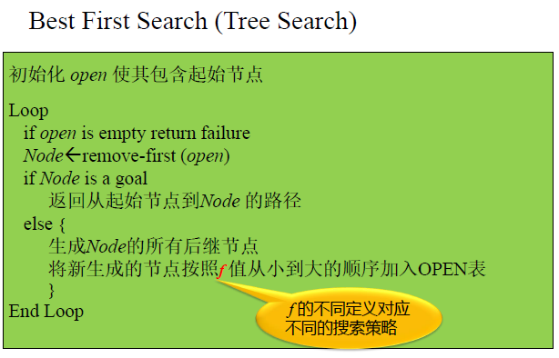
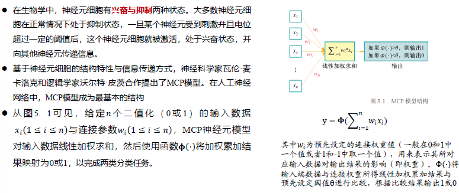

# 人工智能

重点掌握内容：
启发式搜索、
蒙特卡洛树搜索、
无监督学习、
有监督学习-决策树、
反向传播神经网络（BP）、
卷积神经网络CNN

## 绪论

### 人工智能起源与计算载体

图灵机

* 图灵论题：凡是可计算的函数都可以用图灵机计算
* 邱奇论题：任何计算，如果存在一个有效过程，它就能被图灵机实现

原始递归函数和$\lambda$−演算通过形式化方法进行计算，图灵机模型则通过机械化机制进行计算，因此图灵机模型成为了现代计算机理论模型，推动了自动计算时代的到来，为人工智能领域提供了机器载体 

### 智能计算方法

* 以符号主义为核心的逻辑推理

  

* 以问题求解为核心的探寻搜索

  

* 以数据驱动为核心的机器学习

  

* 以行为主义为核心的强化学习

  

* 以博弈对抗为核心的决策智能

  

### 人工智能知识点脉络

## 知识表示与状态空间求解

### 知识表示基本概念

知识表示是问题求解的基础，是早期基于符号操作的经典人工智能研究的主要问题之一

把问题求解中所需要的对象、前提条件、算法等知识构造为计算机可处理的数据结构以及解释这种结构的过程

* 知识表示是问题求解的基础
  * 问题求解是人工智能的核心问题之一
  * 问题求解的目的
    * 机器自动找出某问题的正确解决策略
    * 更进一步，能够举一反三，具有解决同类问题的能力
* 智能系统中
  * 知识是对世界的描述（决定系统的能力）
  * 表示是知识的编码方式（决定系统的性能）

知识表示基本方法

* State Space (状态空间) Representation
* Problem Reduction (问题归约) Representation
* Predicate Logic（谓词逻辑）
* Production Rules（产生式规则）
* Semantic Network （语义网络）Representation
* Frame, Script, Procedure（框架，剧本，过程）

把有关信息关联在一起所形成的信息结构称为知识。事实&规则经过加工、整理后的信息

知识的属性

* 真伪性
* 相对性（相对正确性）
* 不完全性
* 不确定性
* 可表示性
* 可存储性、可传递性和可处理性
* 相容性

#### 知识表示方法

知识表示

* 非形式化的自然语言描述→ 形式化的易于被计算机理解
* 符号学派的核心
  * 符号演算与机器推理
* 搜索技术是一种通用的问题求解技术

通常将待求解问题转化为某种可搜索的问题空间，然后在该空间中寻找解

状态空间法进行符号表示

搜索算法进行推理求解

### 状态空间基本概念

* 问题求解是人工智能的核心问题之一
* 问题求解的目的
  * 机器自动找出某问题的正确解决策略
  * 更进一步，能够举一反三，具有解决同类问题的能力
* 是从人工智能初期的智力难题、棋类游戏、简单数学定理证明等问题的研究中开始形成和发展起来的一大类技术
* 求解的手段多种多样
* 其中搜索技术是问题求解的主要手段之一
  * 问题表示
  * 解的搜索

状态空间图——包含了问题所有可能状态和转换关系的图

* 图中的边是能够导致状态变化的操作（也称算子、算符）
* 从初始状态到目标状态的路径对应的操作序列就是问题的解

#### 状态空间与状态空间图

状态空间: 一个包括问题所有可能状态及它们之间关系的图

* 通常表示为三元组：{S,F,G}
  * S: 起始状态集合
  * F: 操作算子集合
  * G: 目标状态集合

* 状态（state）
  * 在系统中决定系统状态的最小数目的变量的有序集合，对应图中的节点
  * 可以用向量表示
* 算子/动作
  * 引起状态发生变化的操作，对应图中的边
* 状态空间问题求解方法
  * 将实际问题转化成状态空间图来表示
  * 求解过程转化为在状态空间图中搜索一条从初始节点到目标节点的路径问题

### 通用图搜索算法

#### 图结构

#### 图的存储结构

* 一般来说，状态空间图并不是事先创建好保存起来以供搜索使用，而是在搜索过程中边搜索边生成的
* 显示图
  * 完整的状态空间图，用前述的几种数据结构存储
* 隐式图
  * 仅给出初始结点、目标结点以及生成子结点的约束条件，要求按扩展规则来扩展结点，直到包含目标结点为止，不需要存储整个状态空间图
  * 实际搜索问题一般采用这种方法
* 搜索树
  * 在隐式图搜索过程中不断生长的树型结构，代表已经搜索过的状态及其之间的关系
  * 隐式图搜索只需要存储搜索树

#### 图搜索用到的数据结构

* 节点
  * 除了存放状态本身的信息，还需保存指向父节点的指针，或是何种操作可以转换为这个状态
* Open list
  * 记录候选节点
  * 存放所有已经被生成了，但还未被扩展的节点(open nodes)
  * 代表搜索树的前沿，也叫Fringe list
* Closed list
  * 标记已访问过的节点
  * 存放所有已经被扩展的节点(closed nodes)

#### 图的一般搜索框架

* 树搜索
  * 树——无圈连通图
  * 树搜索并非针对树的搜索，而是在搜索过程中将搜索的图看成是树，认为它没有重复状态
* 图搜索
  * 在搜索过程中会检查是否属于重复状态，避免状态循环的搜索
  * 图搜索大多比树搜索高效

搜索流程图

### 盲目搜索策略

#### 宽度优先搜索

* 搜索过程
  * 首先扩展根节点
  * 接着扩展根节点的所有后继节点
  * 然后再扩展后继节点的后继，依此类推
  * 在下一层任何节点扩展之前搜索树上的本层深度的所有节点都已经被扩展
* 宽度优先搜索简单的将新扩展出来的节点顺序加入到OPEN表的后面
* OPEN表是一个FIFO的队列

#### 深度优先搜索

* 深度优先搜索过程：
  * 总是扩展搜索树的当前扩展分支(边缘)中最深的节点
  * 搜索直接伸展到搜索树的最深层，直到那里的节点没有后继节点
  * 那些没有后继节点的节点扩展完毕就从边缘中去掉
  * 然后搜索算法回退下一个还有未扩展后继节点的上层节点继续扩展
* 深度优先搜索将新扩展出来的节点顺序加入到OPEN表的前面
* OPEN表是一个LIFO的栈

#### BFS vs DFS

* 在图的一般搜索策略下，两者的算法流程相同
* 区别仅在OPEN表中节点的排序不同
  * 因此会选择不同的节点进行扩展
* BFS的OPEN表是一个队列，DFS是栈
* BFS的空间复杂度较大，DFS在这方面有优势
* 在假定每次扩展操作的代价都相同的情况下BFS能找到最优解，DFS则不具备最优性，且有时找不到解
  * BFS——如果每次操作代价不同会怎样？
  * DFS——如果目标节点所在的深度大大小于树的最大深度，最坏的情况会怎样？
    * 有界深度优先

#### 等代价搜索

UCS

#### 重复状态

* 在有重复状态的情况下
  * 宽度优先搜索能找到解，但浪费很多空间
  * 深度优先不一定能找到解
* 如何解决？
  * 加入CLOSED表记录重复状态

### 启发式搜索算法

#### 最佳优先搜索

Best First Search

* UCS是最佳优先搜索的特例
  * 使用优先级队列来存储扩展出的节点
* 最佳优先搜索是可以看成有信息搜索的一般框架
* 采用代价函数f(n) 对每一个扩展节点进行评价，该函数被称为估价函数(evaluation function)
* 节点在OPEN 中根据其f 值来排序
  * f(n) 越小的节点n越早被扩展

#### 估价函数

* f 的不同定义与算法
  * f(n)=g(n)——等代价搜索(UCS)
    * g(n) = cost of the path from the start node to the current node n
  * f(n)=h(n)——贪婪优先搜索(Greedy best first)
    * h(n)——heuristic function（启发函数）
    * 使用了启发函数的搜索也称启发式搜索
    * h(n)的值是对当前状态n的一个估计，表示
      * 从n到目标节点的最优路径代价的估计
      * h(n)$\ge$0，h(n)越小表示n越接近目标
      * If nis goal then h(n)=0
      * 与问题相关的启发式信息都被计算为一定的h(n)值引入到搜索过程中
  * f(n)=g(n)+h(n) ——A算法

#### 贪婪优先搜索

* 贪婪搜索每次选择距离目标代价最小的节点优先扩展
* 估价函数定义
  * f(n) = h(n)
  * h(n) 估计n到目标节点的代价

* 通常表现得很好
* 找到解的速度很快
* 不能保证找到解
  * 不合适的起点可能导致找不到解
* 不能保证最优性

#### A算法

* 1964年，尼尔逊提出一种算法以提高最短路径搜索的效率，被称为A1算法
* 1967年，拉斐尔大大改进了A1算法，称为A2算法
* A1,A2算法统称为A算法
  * f(n)=g(n)+h(n)

是否能找到最优与h的定义紧密相关

* 特征：
  * 估价函数
    $f (n) = g (n) + h (n)$
  * 对h (n)无限制，虽提高了算法效率，但不能保证找到最优解
  * 不合适的h (n)定义会导致算法找到不解
* 性能
  * 不完备，不最优

#### A*算法

* 1968年，彼得.哈特对A算法进行了很小的修改，并证明了当估价函数满足一定的限制条件时，算法一定可以找到最优解
* 估价函数满足一定限制条件的算法称为A*算法

A*算法的限制条件

$$
f(x)=g(x)+h(x)
$$

$$
g(x) \ge 0
$$

$$
h(x) \le h^{*}(x),x到目标实际代价的
$$

A*算法要求其启发函数的定义是可纳的

* 可纳性（admissible ）

  * $h(n) \le h^*(x)$ where $h^*(x)$ is the true cost from n
  * Are optimistic

  可容admissible：专门针对启发函数而言，即启发函数不会过高估计从节点n到目标节点之间的实际开销代价，即小于等于实际开销。

* $h_{SLD}(n)$

  比如将两点之间的直线距离作为启发函数，从而保证其可容。
  算法中的距离估算值与实际值越接近，最终搜索速度越快。

* 在图搜索策略中要检查新生成的节点是否已经在Open或Closed表中，若是则忽略它

图搜索中$h(n)$的单调限制

如果启发函数满足以下条件, 则称h满足单调性（一致性，consistent ）
$$
h(n)\leq c(n,a,n')+h(n')
$$
三角形不等式：如果启发式函数h是一致的，那么单个数值h(n)小于从n到n’的动作代价c(n,a,n')加上启发函数的估计值h(n‘) 的和。

* 若h(n)满足单调性限制，则沿着图中任何一条路径，路径上点的f(n)都是非递减的
  * 如果h满足单调条件，则当A*算法第一次扩展节点n时，该节点就已经找到了通往它的最优路径
  * 若启发函数满足单调性，则对应的$A^*$算法称为改进的$A^*$算法。

#### 估价函数对算法的影响

八数码问题的解

### 博弈树的搜索

#### Minimax搜索

* 状态 ：状态$𝑠$包括当前的游戏局面和当前行动的智能体 。 初始状态 𝑠0包括初始游戏局面和初始行动的玩家 。 由于本节讨论的问题假设两个竞争对手轮流行动 因此第 𝑖步行动的玩家是确定的 函数player(𝑠)给出状态 𝑠下行动的智能体 。
* 动作 给定状态 𝑠，动作指的是 player(𝑠)在当前局面下可以采取的操作 𝑎，记动作集合为 actions𝑠。
* 状态转移 ：给定状态 𝑠和动作 𝑎∈actions(𝑠)，状态转移函数 result(𝑠,𝑎)决定了在 𝑠状态采取 𝑎动作后所
  得后继状态。
* 终局状态检测 ：终止状态检测函数 terminal_test(s)用于测试游戏是否在状态 𝑠结束。
* 终局得分 ：终局得分 utility(𝑠,𝑝)表示在终局状态 𝑠时玩家 𝑝的得分。在二人零和博弈中，两名玩家的终局得分之和应该是固定的，因此算法只需记录其中一人的终局得分为 $utility(𝑠)$，则另一人的得分可按照零和原则相应算出。

#### alpha-beta剪枝算法

## 知识表达与推理

## 机器学习

### 机器学习基本概念

* 机器学习通过对数据的优化学习 建立能够刻画数据中所蕴含语义概念或分布结构等信息的模型 。在模型学习过程中 采用合适手段来利用有标签数据或无标签数据 对模型参数不断进行优化 从而提升模型性能 。
* 从数据利用的角度 可将机器学习划分为 监督学习 supervised learning 、 无监督学习unsupervised learning 及半监督学习 semi supervised learning 等 。

#### 有监督学习

* 一旦在 训练集 上完成了模型参数优化后 需要在测试数据集上对模型性能进行测试 。 为了在训练优化过程中挑选更好的模型参数 一般可将训练集中一部分数据作为 验证集 validation set 。 在训练集上训练模型的同时会在验证集上对模型进行评估以便得到最佳参数 最后在 测试集 上进行测试 将测试结果作为模型性能最终结果 。
* 要注意的是 训练集 、 验证集和测试集所包含数据之间没有任何交叉 。 可以说 测试集用于模型训练好比学生的练习册 、 验证集用于评估模型以调整相应参数 好比学生的模拟考卷或小测验 、 测试集用于得到模型的优劣水平 好比真正考试 。

#### 模型评估与参数估计手段：损失函数

泛化能力（ generalization）
在机器学习中 需要保证模型在训练集上所取得性能与在测试集上所取得性能保持一致 即模型具有泛化能力 generalization 。

#### 模型泛化能力与经验风险 和期望风险之间关系

#### 模型度量方法

#### 参数优化

### 监督学习：回归分析与决策树

#### 回归分析

一元线性回归实际上就是寻找一条用$y=ax+b$表达的直线 使得这条直线尽可能靠近或穿过这 8 组 $(x,y)$数据 即能够以最小误差来拟合这 8 组$(x,y)$数据 。

##### 参数求解

##### 多元线性回归

##### logistic回归

#### 决策树

* 建立决策树的过程 就是不断选择属性值对样本集进行划分 直至每个子样本为同一个类别 。 上面的案例数据较少 我们可以通过观察或是穷举的方法来不断选择属性值对样本集进行划分 对于较大的数据集 需要理论和方法来评价不同属性值划分的子样本集的好坏程度 并基于该方法构建决策树 。
* 构建决策树时划分属性的顺序选择是重要的。性能好的决策树随着划分不断进行，决策树分支结点样本集的 纯度 会越来越高，即其所包含样本尽可能属于相同类别。
* 信息熵（ entropy ）就是一种衡量样本集合 纯度 的一种指标，如果我们计算选择不同属性划分后样本集的 纯度 ””，那么就可以比较和选择属性。信息熵越大，说明该集合的不确定性越大 纯度越低。选择属性划分样本集前后信息熵的减少量被称为信息增益（ information gain ），也就是说信息增益被用来衡量样本集合复杂度（不确定性）所减少的程度。

### 无监督学习：K均值聚类

### 监督学习与非监督学习下特征降维

### 演化学习

## 神经网络与深度学习

### 前馈神经网络：神经元

### 前馈神经网络：感知机

### 前馈神经网络

### 执行非线性映射的激活函数

#### sigmoid函数

**求导简单**

容易出现**梯度消失**

#### ReLU函数

<0的时候神经元权重不更新

#### softmax激活函数

### 参数优化

MSE

cross-entropy

#### 梯度下降

#### 反向传播

#### 梯度下降的方法

### 卷积神经网络

#### 卷积过程

#### 卷积效果

#### 填充和步长

#### 池化

