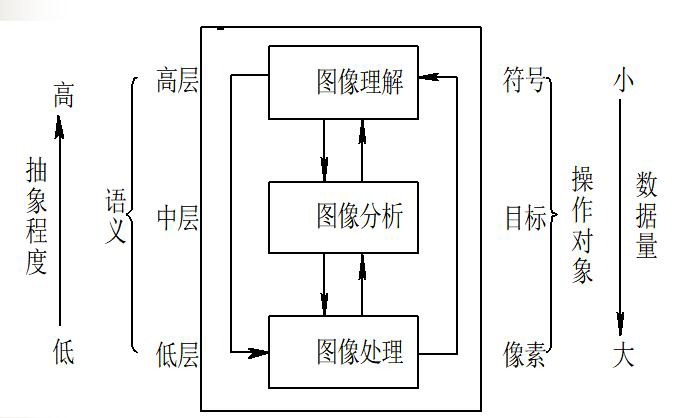
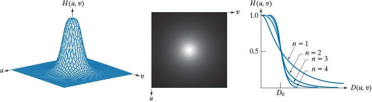
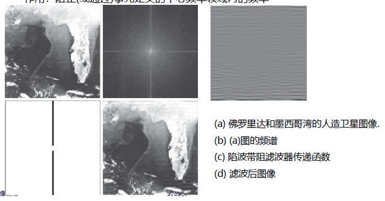
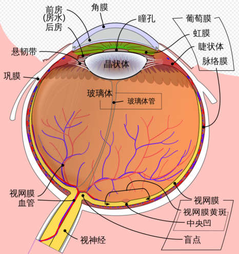

# 数字图像处理

## 概论

##  数字图像处理基础

### 人眼视觉感知

* 人眼 <=> 照相机
  * 眼帘 <=> 镜头盖
  * 瞳孔 <=> 光圈
  * 晶状体 <=> 透镜
  * 视网膜 <=> 底片
  * 视神经细胞 <=> 感光药膜
    * 视杆细胞
    * 视锥细胞

* 人眼辨别亮度差别的能力，与环境亮度和本身亮度有关
* 感知亮度并不是实际灰度的简单函数（马赫带效应）

### 图像的感知与获取

图像获取方式：

* 单传感器
* 条传感器
* 传感器阵列

### 图像采样与量化

* 成像模型

  $0<f(x,y)< \infty$

* 连续感知数据->数字形式

* 采样与量化

  * 采样：空间坐标的离散化，决定图像的空间分辨率
  * 量化：图像函数值（幅值）的数字化，光强，决定图像幅度（灰度级）分辨率

* 动态范围、饱和度、对比度
  * $f(x,y):x,y \in Z,f \in Z$

#### 图像数字化：对M、N和离散灰度级数L

* $L=2^k$
* $f \in [0,L-1]$

#### 图像量化

* 均匀量化
* 非均匀量化
  * 基于视觉特性
  * 基于统计特性

#### 空间与灰度分辨率

* 空间分辨率：每英寸点数表示dpi
* 灰度分辨率：用于量化灰度的比特数

* 图像内插（重采样）：调整图像的大小、旋转、几何校正
  * 下采样/收缩：行列删除
  * 上采样/放大：创建新的像素位置，对新位置上的像素赋值

##### 最近邻插值

原图中最近邻的灰度赋给新像素

块效应和马赛克效应

##### 双线性插值

用四个最近邻位置上的灰度值估计给定位置的灰度值

比最近邻插值效果好，没有明显的块效应

计算量比最近邻插值大，使图像细节退化

### 图像的表示与描述

#### 数学表示

二维离散信号：$I=f(x,y)$

$(x,y)$表示图像像素坐标

$f(x,y)$表示在坐标处像素的灰度值

**二维矩阵**

**坐标索引**

矩阵是按照行列的顺序来定位数据的，但是图像是在平面上定位数据的，所以有一个坐标系定义上的特殊性。

**线性索引**

由一个一维的非负整数串组成，通过计算到坐标(0,0)的偏移量得到

行扫描

列扫描

#### 图像描述

##### 灰度图像

图像中的每个像素的信息由一个量化的灰度级来描述，没有色彩信息

灰度图像像素的灰度级通常为8bits，即0~255。“0”表示纯黑色，“255”表示纯白色

##### 黑白图像/二值图像

黑白图像是对灰度图像二值化

图像中的每个像素只能是黑或者白，没有中间的过渡，故又称二值图像，二值图像的像素值为0、1；

对二值图像进一步处理

### 像素间基本关系

像素是图像的基本组成单元，在图像空间中网格化排列

像素间基本关系：

* 相邻像素
* 邻接、连接、连通
* 集合间关系

#### 像素间的距离

p,q坐标为$(x,y),(s,t)$

* 欧氏距离$D_E$

  范数为2的距离

  $D_E(p,q)= \sqrt{(x-s)^2+(y-t)^2}$

* 曼哈顿距离

  $D_4(p,q)=|x-s|+|y-t|$

* 切比雪夫距离

  $D_8(p,q)=max \{|x-s|,|y-t| \}$

测量像素在空间的接近程度

**距离度量函数**定义

设3个像素$p,q,r$，坐标分别为$(x,y),(s,t),(u,v)$，函数D为一个距离度量
函数，其必须满足下列三个条件

1. $D(p,q) \ge 0,D(p,q)=0$当且仅当p=q **像素距离非负**
2. $D(p,q)=D(q,p)$ **像素距离与起终点选择无关**
3. $D(p,r) \le D(p,q)+D(q,r)$ **像素之间的最短距离是直线距离**

#### 邻域

**4-邻域** $N_4(p)$

**对角邻域** $N_D(p)$

**8-邻域** $N_8(p)$

#### 邻接性

V是用于定义邻接的灰度值集合

**4-邻接**

* q在p的$N_4(p)$中，且都在V中取值
* q在$N_4(p)$中意味着p在$N_4(q)$中

**8-邻接**

* q在p的$N_8(p)$中，且都在V中取值
* q在$N_8(p)$中意味着p在$N_8(q)$中

**m-邻接/混合邻接**

* 都在V中取值，满足下列条件之一：
  1. q在$N_4(p)$中，即p、q是4-邻接
  2. q在$N_D(p)$中，且$N_4(p) \cap N_4(q)=\varnothing$

m-邻接可以认为是8-邻接的一种变形，引进它是为了消除使用8-邻接时，常出现的多路问题。

#### 连通性

像素间的通路：从具有坐标$(x_0,y_0)$的像素$p_0$到具有坐标$(x_n,y_n)$的像素q的一
条通路由一系列具有坐标$(x_0,y_0)$,$(x_1,y_1)$, …, $(x_n,y_n)$的独立像素组成，且满足：

1. $(x_i,y_i)$与$(x_{i-1},y_{i-1})$邻接
2. $1 \le i \le n$，n为通路长度

* 如果$(x_0,y_0)=(x_n,y_n)$，则通路称为闭合通路
* 根据不同的邻接定义，可以得到不同的通路

**像素间的连通**

* $S$表示图像中像素的一个子集
* 如果S中的两个像素p和q之间存在一个完全由S中像素组成的通路（通路上所有像素的灰度值均满足某个特定的相似准则），则像素p和q在S中是连通的
* 连通分量：连通到S中的任何像素p的像素集合
* 连通集： 如果S仅有一个连通分量

#### 区域与边界

令R表示图像中像素的一个子集。若R是一个连通集，称R为图像的一个区域

若$R_i$和$R_j$形成一个连通集时，称$R_i$和$R_j$为邻接区域。

K个不相交的区域$R_k$，$R_u$表示所有K个区域的并集

$R_u$称为图像的前景，$(R_u)^c$为背景

区域的边界也称为区域的轮廓，是该区域的一个子集，但在其邻域中有不属于该区域的元素，它将该区域与其他区域分开

必须**指定所用连接类型**才能确定一个像素是否属于边界

### 数学工具

#### 阵列与矩阵操作

#### 线性操作与非线性操作

设操作H和两个图像$f(x,y),g(x,y)$对于常数$a_1,a_2$
$$
H[a_1f(x,y)+a_2g(x,y)]=a_1H \cdot f(x,y)+a_2H \cdot g(x,y)
$$
成立，那么称H是线性操作，否则，称为非线性操作

线性操作满足两个法则

1. 比例性/同质：$y=f(x),\forall a,a \cdot y=f(a \cdot x)$
2. 叠加性：$y_1=f(x_1),y_2=f(x_2),y_1+y_2=f(x_1+x_2)$

#### 算术运算

加减乘除

#### 集合运算和逻辑运算

#### 空间运算

#### 图像变换

## 空间域图像增强

### 背景知识

#### 图像增强

对图像进行处理，使其更适合于某种特定的应用

#### 空间域图像增强

图像平面本身，直接对像素进行操作
$$
g(x,y)=T[f(x,y)]
$$
f(x,y)是原图像，g(x,y)是处理后的图像，T是作用域f的操作，定义在(x,y)的邻域

若将邻域大小限制为1*1，简化为点运算$s=T(r)$

对比度拉伸函数、阈值处理函数

#### 变换域图像增强

首先通过某种数学变换把图像转换（如傅立叶变换、小波变换等）到变换域后进行处理，最后再进行逆变换到空间域

### 一些基本的灰度变换函数

计灰度级为$[0,L-1]$

灰度变换

* 常用于改变图象的灰度范围及分布
* 也称为对比度增强、对比度拉伸或灰度变换
* 灰度变换可以是线性的，也可以是非线性（平方、对数、其它任意单调函数）

#### 图像反转变换

$$
s=L-1-r
$$

灰度图像：黑白颠倒

彩色图像：补色

适用于增强图像中**暗色区域**的灰色细节部分

#### 对数变换

$$
s=c\log(1+r)
$$

c为常数，r非负

* 把窄范围的低灰度级映射到宽范围的灰度级 (增强低灰度级)
* 把宽范围的高灰度级映射到窄范围的高灰度级 (抑制高灰度级)
* 压缩图像的动态范围, 显示图像的傅里叶频谱图像等

#### 反对数变换

$$
s=c/\log(1+r)
$$

* 把宽范围的低灰度级映射到窄范围的灰度级 (抑制低灰度级)
* 把窄范围的高灰度级映射到宽范围的低灰度级 (增强高灰度级)

#### 幂次（伽马）变换

$$
s=cr^\gamma,c \gt 0,r >0
$$

* $\gamma <1$​：扩展暗像素值, 压缩亮像素值（提升暗区分辨能力）
* $\gamma >1$：压缩暗像素值, 扩展亮像素值（提升亮区分辨能力）

用于各种图像获取、打印和显示等设备的伽马校正

#### 分段线性变换

将灰度级划归不同范围, 每个范围采用不同的线性变换

* 优点: 变换形式可根据需要任意合成

* 缺点: 需用户输入

* 主要形式:

  * 对比度拉伸

    

    提高图像灰度级的动态范围

  * 灰度级分层(灰度切割)

    提高图像中特定灰度范围的亮度

  * 比特平面分层 (位图切割)

    分析图像每个比特的相对重要性

### 直方图处理

#### 定义

灰度级为$[0,L-1]$范围的数字图像的直方图(Histogram)是离散函数$h(r_k)=n_k(k=0,1,\dots,L-1)$;

* $r_k$是第k级灰度
* $n_k$是图像中灰度级为$r_k$的像素的个数

上述为频次直方图

归一化的直方图，为频率直方图

$h(r_k)=n_k/n(k=0,1,\dots,L-1),\sum_kh(r_k)=1$

#### 基于直方图的图像增强技术

##### 直方图均衡

核心：非线性拉伸

均衡化能增强图像的对比度，但不改变图像内容

在均衡过程中，原来的直方图上频数较小的灰度级被归入很少几个或一个灰度级内，造成细节损失

将原图像的直方图通过灰度变换函数$s=T(r)$对灰度进行修正，使变换后的图像中各灰度级出现的几率相当, 变换后**概率密度函数(PDF)**为均匀分布

目的：增加像素灰度值的动态范围，从而达到增强图像整体对比度的效果

1. $r$和$s$为两个随机变量，定义域和值域均为闭区间 $[0,L-1]$, 随机变量$r$服从概率密度函数为$p_r(r)$的分布，随机变量$s$服从均匀分布$p_s(s)$ ，概率密度函数$p_r(r)$和均匀分布$p_s(s)$在区间$[0,L-1]$上连续可微
2. $T(r)$为单调递增函数

$$
p_s(s)\sim U(0,L-1)
$$

$$
p_s(s)=\frac{1}{L-1}
$$

$$
p_s(s)ds=p_r(r)dr
$$

$$
ds=\frac{p_r(r)dr}{p_s(s)}=(L-1)p_r(r)dr
$$

变换的连续形式
$$
s=T(r)=(L-1) \int_0^r p_r(w)dw
$$

$$
p_r(r_k)=\frac{n_k}{MN},k=0,1,\dots,L-1
$$

变换的离散形式
$$
s_k=\frac{L-1}{MN}\sum_{j=0}^{k}n_j,k=0,1,\dots,L-1
$$

##### 直方图匹配（规定化）

修改一幅图像的直方图，使得它与另一幅图像的直方图匹配或者具有一种预先规定的函数形状

突出感兴趣的灰度范围，使图像质量改善

$$
s=T(r)
$$

$$
s=G(z)
$$

$$
z=G^{-1}(s)=G^{-1}(T(r))
$$
$p_r(r)$输入图像的PDF，$p_z(z)$是规定的PDF

1. 根据输入图像，得到$p_r(r)$，根据公式$s_k=T(r_k)=(L-1)\sum_{i=0}^qp_r(r_j)$
2. 对于匹配的直方图$p_z(z)$，求变换函数$G(z_q)=(L-1)\sum_{i=0}^qp_z(z_i)$，四舍五入存储表中
3. 对每一个$s_k$，在表中找到$z_q$对应的值，存储它们之间的映射关系,根据$s_k=G(z_q)$，求反变换函数$z_q=G^{-1}(T(r_k))$得到r到z的映射

### 空间滤波基础

#### 空间滤波机理

* 使用空间域模板进行的图像处理，称为空域滤波。模板本身被称为空域滤波器
* 输出图像中的每一点为输入图像中某个相关区域像素集的映射

在$M \times N$的图像$f$上，使用$m \times n$的滤波器，$w(s,t)$是滤波器系数，$f(x,y)$是图像像素值
$$
g(x,y)=\sum_{s=-a}^a \sum_{t=-b}^b w(s,t)f(x+s,y+t),m=2a+1,n=2b+1
$$

#### 空间滤波

步骤：建立模板，在待处理的图像中逐点移动模板，对每个像素点按照滤波器算法进行计算

#### 空间相关与卷积

图像$f(x,y)$，$m \times n$的滤波器$w(x,y)$，$m=2a+1,n=2b+1$

**相关操作**
$$
w(x,y) \ast f(x,y)=\sum_{s=-a}^a \sum_{t=-b}^b w(s,t)f(x+s,y+t)
$$
**卷积操作**
$$
w(x,y) \star f(x,y)=\sum_{s=-a}^a \sum_{t=-b}^b w(s,t)f(x-s,y-t)
$$
**向量表示**
$$
R=w_1z_1+w_2z_2+\dots+w_{mn}z_{mn}=\sum_{k=1}^{mn}w_kz_k=\mathbf{w}^T\mathbf{z}
$$

### 平滑（低通）空间滤波器

作用：

* 模糊处理:去除图像中一些不重要的细节
* 减小噪声

分类：

* 平滑线性滤波器：均值滤波器
* 统计排序滤波器（非线性滤波器）：最大值滤波器，中值滤波器，最小值滤波器

#### 平滑线性滤波器

##### 盒状滤波

$$
R=\frac{1}{9}\sum_{i=1}^9 z_i
$$

##### 加权均值滤波

$$
g(x,y)=\frac{\sum_{s=-a}^a \sum_{t=-b}^b w(s,t)f(x+s,y+t)}{\sum_{s=-a}^a \sum_{t=-b}^b w(s,t)}
$$

#### 低通高斯滤波器

#### 统计排序滤波器

基于滤波器所在图像区域中像素的排序，由排序结果决定的值代替中心像素的值

分类

* 中值滤波器： 用像素领域内的中间值代替该像素

  主要用途：去除噪声；计算公式：$R=mid \{ z_k|k=1,2,\dots,9 \}$

  * 强迫突出的亮点（暗点）更象它周围的值，以消除孤立的亮点（暗点）
  * 在去除噪音的同时，可以比较好地保留边的锐度和图像的细节（优于均值滤波器）
  * 能够有效去除脉冲噪声：以黑白点叠加在图像上

* 最大值滤波器：用像素领域内的最大值代替该像素

  主要用途：寻找最亮点，计算公式：$R=\max \{ z_k|k=1,2,\dots,9 \}$

* 最小值滤波器：用像素领域内的最小值代替该像素

  主要用途：寻找最暗点， 计算公式：$R=\min \{ z_k|k=1,2,\dots,9 \}$

### 锐化（高通）空间滤波器

#### 用途

* 突出图像中的细节，增强被模糊了的细节
* 超声探测成像，分辨率低，边缘模糊，通过锐化来改善
* 锐化处理恢复过度钝化、暴光不足的图像
* 平滑（低通）->平均运算->积分
* 锐化（高通）->差值运算->微分

#### 一阶微分

* 平坦区域必为零；
* 在灰度阶梯或斜坡的起始点处微分值非零；
* 沿斜坡面微分值非零；

$$
\frac{\partial f}{\partial x}=f(x+1)-f(x)
$$

#### 二阶微分

* 平坦区域必为零；
* 在灰度阶梯或斜坡的起始点处微分值非零；
* 沿斜坡面微分值为零(Must be zero along ramps of constant slope)；

$$
\frac{\partial^2 f}{\partial x^2}=f(x+1)+f(x-1)-2f(x)
$$

* 一阶微分产生较粗的边缘，二阶微分产生双边缘（单像素宽）；
* 二阶微分比一阶微分对细节有更为强烈的响应，易于实现

#### 使用二阶微分锐化图像-拉普拉斯算子

$$
\nabla^2 f=\frac{\partial^2 f}{\partial x^2}+\frac{\partial^2 f}{\partial y^2}
$$

$$
\frac{\partial^2 f}{\partial x^2}=f(x+1,y)+f(x-1,y)-2f(x,y)
$$

$$
\frac{\partial^2 f}{\partial y^2}=f(x,y+1)+f(x,y-1)-2f(x,y)
$$

$$
\nabla^2 f=\frac{\partial^2 f}{\partial x^2}+\frac{\partial^2 f}{\partial y^2}=f(x+1,y)+f(x-1,y)+f(x,y+1)+f(x,y-1)-4f(x,y)
$$

拉普拉斯算子是一个标量而不是向量，具有线性特性和旋转不变，即各向同性的性质

常见拉普拉斯算子模板

使用拉普拉斯算子对图像增强的基本方法
$$
g(x,y)=f(x,y)+c[\nabla^2 f(x,y)]
$$

* 滤波器模板中心像素为负时，c=-1；
* 滤波器模板中心像素为正时，c=1；

#### 非锐化掩膜和高提升滤波

非锐化（钝化）掩模

* 模糊原图像；
* 从原图像中减去模糊后的图像（模板）；
* 将模板与原图相加

$$
g_{mask}(x,y)=f(x,y)-\bar f(x,y)
$$

$$
g(x,y)=f(x,y)+k \cdot g_{mask}(x,y)
$$

* k=1，unsharp masking
* k>1，highboost filtering

#### 使用一阶微分锐化图像-梯度

$$
\begin{aligned}
& \nabla \mathbf{f}=\left[\begin{array}{l}
G_x \\
G_y
\end{array}\right]=\left[\begin{array}{l}
\frac{\partial f}{\partial x} \\
\frac{\partial f}{\partial y}
\end{array}\right]
\end{aligned}
$$

$$
\begin{aligned}
\nabla f & =\operatorname{mag}(\nabla \mathbf{f}) \\
& =\left[G_x^2+G_y^2\right]^{1 / 2} \\
& =\left[\left(\frac{\partial f}{\partial x}\right)^2+\left(\frac{\partial f}{\partial y}\right)^2\right]^{1 / 2}
\end{aligned}
$$

##### Roberts交叉梯度算子

$$
\nabla f \approx |Z_9-Z_5|+|Z_8-Z_6|
$$

##### Prewitt梯度算子

$$
\nabla f \approx |(Z_7+Z_8+Z_9)-(Z_1+Z_2+Z_3)|+|(Z_3+Z_6+Z_9)-(Z_1+Z_4+Z_7)
$$

##### Sobel梯度算子

$$
\nabla f \approx |(Z_7+2Z_8+Z_9)-(Z_1+2Z_2+Z_3)|+|(Z_3+2Z_6+Z_9)-(Z_1+2Z_4+Z_7)
$$

## 频率域图像增强

### 背景知识与基本概念

[时域，空域，频域的基本概念_空域和频域-CSDN博客](https://blog.csdn.net/qq_32211827/article/details/78338902)

时域

频域

空间域（像素域）

#### 问题提出

偏微分方程$u_{tt}-C \cdot u_{xx}=0$
$$
u(x,t)=f(x+ct)+g(x-ct)
$$

$$
u(x,t)=\sum_{n=0}^\infin[a_n \cos nx+b_n \sin nx]
$$

#### 信号正交

定义在$(t_1,t_2)$区间的$\varphi_1(t)$和$\varphi_2(t)$满足
$$
\int_{t_1}^{t_2} \varphi_1(t)\varphi_2(t)dt=0
$$
两函数内积为0

则$\varphi_1(t)$和$\varphi_2(t)$在区间$(t_1,t_2)$内正交

#### 正交函数集

若n个函数$\varphi_1(t)$，$\varphi_2(t)$，...$\varphi_n(t)$构成一个函数集，这些函数在区间$(t_1,t_2)$内满足
$$
\left.\int\limits_{t_1}^{t_2}\phi_i(t)\phi_j(t)\operatorname{d}t=\left\{\begin{matrix}0,&i\neq j\\K_i\neq0,&i=j\end{matrix}\right.\right.
$$
则称此函数集为在区间$(t_1,t_2)$的正交函数集

#### 信号的正交分解

设有n个函数$\varphi_1(t)$，$\varphi_2(t)$，...$\varphi_n(t)$在区间$(t_1,t_2)$构成一个正交函数空间，将任意函数$f(x)$用这n个正交函数的线性组合来近似，可表示为
$$
f(t) \approx C_1 \varphi_1+C_2 \varphi_2+C_3 \varphi_3+\dots +C_n \varphi_n
$$
调整各系数$C_j$使$f(t)$与近似函数之间的误差在区间$(t_1,t_2)$内最小

通常使误差的方差均值（均方误差）最小

均方误差
$$
\overline{\varepsilon^2}=\frac{1}{t_2-t_1}\int_{t_1}^{t_2}\left[f\left(t\right)-\sum_{j=1}^{n}C_j\varphi_j\left(t\right)\right]^2\operatorname{d}t
$$

$$
\frac{\partial\overline{\varepsilon^2}}{\partial C_i}=\frac{\partial}{\partial C_i}\int_{t_1}^{t_2}[f(t)-\sum_{j=1}^nC_j\varphi_j(t)]^2\operatorname{d}t=0
$$

$$
\frac{\partial}{\partial C_i}\int_{t_1}^{t_2}[-2C_if(t)\varphi_i(t)+C_i^2\varphi_i^2(t)]\operatorname{d}t=0
$$

$$
-2\int\limits_{t_1}^{t_2}f(t)\varphi_i(t)\operatorname{d}t+2C_i\int\limits_{t_1}^{t_2}\varphi_i^2(t)\operatorname{d}t=0
$$

$$
C_i=\dfrac{\int_{t_1}^{t_2}f(t)\varphi_i(t)\operatorname dt}{ \int_{t_1}^{t_2}\varphi_i^2(t)\operatorname dt }=\dfrac{1}{K_i}\int_{t_1}^{t_2}f(t)\varphi_i(t)\operatorname dt
$$

$$
K_i=\int_{t_1}^{t_2}\varphi_i^2(t)\operatorname dt
$$

最简单的正交函数集是三角函数

#### 傅里叶级数

**傅里叶级数**
$$
f(t)=\sum_{n=-\infty}^{\infty}c_{n}\mathrm{e}^{j\frac{2\pi n}{T}t}
$$

复数形式

**傅里叶系数**
$$
c_n=\dfrac{1}{T}\int_{-T/2}^{T/2}f(t)\mathrm{e}^{-j\frac{2\pi n}{T}t}\mathrm{d}t,\quad n=0,\pm1,\pm2,\cdots
$$

**欧拉公式**
$$
\mathrm{e}^{j\frac{2\pi n}{T}t}=\cos\frac{2\pi n}{T}t+j\sin\frac{2\pi n}{T}t
$$

#### 傅里叶变换、离散傅里叶变换

##### 连续单变量函数的傅里叶变换

$$
傅里叶逆变换：f(t)=\mathfrak{F}^{-1}\{F(u)\}=\int_{-\infty}^{\infty}F(u)\mathrm{e}^{j2\pi ut}\mathrm{d}u
$$

$$
傅里叶变换：F(u)=\mathfrak{F}\{f(t)\}=\int_{-\infty}^{\infty}f(t)\mathrm{e}^{-j2\pi ut}\mathrm{d}t
$$

傅里叶变换对

* u是一个连续变量

* $\mathfrak{F}\{f(t)\}$是一个关于u的函数

[傅里叶变换（FT）和傅里叶逆变换（IFT）推导_ift傅里叶变换-CSDN博客](https://blog.csdn.net/weixin_44346103/article/details/128406595)

对连续变量函数$f(t)$进行正交分解，将连续变量函数分解为不同频率成分的三角函数之和,称为傅里叶逆变换（反变换）
$$
f(t)=\mathfrak{F}^{-1}\{F(u)\}=\int_{-\infty}^{\infty}F(u)\mathrm{e}^{j2\pi ut}\mathrm{d}u
$$
傅里叶变换
$$
F(u)=\mathfrak{F}\{f(t)\}=\int_{-\infty}^{\infty}f(t)\mathrm{e}^{-j2\pi ut}\mathrm{d}t
$$

周期函数可表示为谐波关系的三角函数的加权和——傅里叶级数，频谱

非周期函数可表示为谐波关系的三角函数甲醛积分——傅里叶变换，频谱密度

### 取样与采样函数的傅里叶变换

#### 冲击及其取样特性

狄拉克函数：幅度无限，持续时间为0，具有单位面积的尖峰信号

**连续变量**
$$
\left.\delta(x)=\left\{\begin{array}{cc}1,&x=0\\0,&x\ne0\end{array}\right.\right.
$$

$$
\mathrm{s.t.}\quad\int_{-\infty}^{\infty}\delta(t)\mathrm{d}t=1
$$

$$
\int_{-\infty}^{\infty}f(t)\delta(t-t_0)dt=f(t_0)
$$

**离散变量**
$$
\left.\delta(x)=\left\{\begin{array}{cc}1,&x=0\\0,&x\ne0\end{array}\right.\right.
$$

$$
\mathrm{s.t.}\sum_{x=-\infty}^{\infty}\delta(x)=1
$$

$$
\sum_{x=-\infty}^{\infty}f(x)\delta(x-x_{0})\mathrm{d}x=f(x_{0})
$$

**冲击串**
$$
s_{\Delta T}(t)=\sum_{n=-\infty}^{\infty}\delta(t-n\Delta T)
$$

冲击函数$\delta(t)$的傅里叶变换
$$
\mathcal{F}\{\delta(t)\}=F(u)=\int_{-\infty}^{\infty}\delta(t)\mathrm{e}^{-\mathrm{j}2\pi u\mathrm{t}}\mathrm{d}t=\int_{-\infty}^{\infty}e^{-j2\pi ut}\delta(t)dt=e^{-j2\pi u0}=1
$$
$t=t_0$处的一个冲击的傅里叶变换
$$
\mathcal{F}\{\delta(t-t_{0})\}=F(u)=\int_{-\infty}^{\infty}\delta(t-t_{0})e^{-j2\pi ut}dt=\int_{-\infty}^{\infty}e^{-j2\pi ut}\delta(t-t_{0})dt=e^{-j2\pi ut_0}
$$
冲击串的傅里叶级数
$$
s_{\Delta T}(t)=\sum\limits_{n=-\infty}^{\infty}c_{n}\mathrm{e}^{j\frac{2\pi i}{\Delta T}t}\ \mathrm{where}\ c_{n}=\frac{1}{\Delta T}\int_{-\Delta T/2}^{\Delta T/2}s_{\Delta T}(t)\mathrm{e}^{-j\frac{2\pi i}{\Delta T}t}\mathrm{d}t=\frac{1}{\Delta T}\mathrm{e}^{0}=\frac{1}{\Delta T}
$$

$$
s_{\Delta T}(t)=\sum_{n=-\infin}^\infin \frac{1}{\Delta T}\mathrm{e}^{j\frac{2\pi i}{\Delta T}t}
$$

#### 对连续函数进行均匀间隔取样

#### 卷积

空域卷积
$$
f(t)\star h(t)=\int_{-\infty}^{\infty}f(\tau)h(t-\tau)\mathrm{d}\tau
$$
傅里叶变换
$$
\begin{aligned}
\mathfrak{F}\{f(t)\star h(t)\}& =\int_{-\infty}^{\infty}\left\lfloor\int_{-\infty}^{\infty}f(\tau)h(t-\tau)\mathrm{d}\tau\right\rfloor\mathrm{e}^{-j2\pi ut}\mathrm{d}t  \\
&=\int_{-\infty}^{\infty}f(\tau)\left[\int_{-\infty}^{\infty}h(t-\tau)\mathrm{e}^{-j2\pi ut}\mathrm{d}t\right]\mathrm{d}\tau  \\
&=\int_{-\infty}^{\infty}f(\tau)\mathrm{e}^{-j2\pi u\tau}\left[\int_{-\infty}^{\infty}h(t-\tau)\mathrm{e}^{-j2\pi u(t-\tau)}\mathrm{d}t\right]\mathrm{d}\tau  \\
&=\int_{-\infty}^{\infty}f(\tau)\mathrm{e}^{-j2\pi u\tau}H(u)\mathrm{d}\tau  \\
&=F(u)H(u)
\end{aligned}
$$

$$
f(t)\star h(t)\Leftrightarrow H(u)F(u)
$$

$$
f(t)h(t)\Leftrightarrow H(u)\star F(u)
$$

#### 取样函数的傅里叶变换

取样后函数
$$
\tilde{f}(t)=f(t)s_{\Delta T}(t)=\sum_{n=-\infty}^\infty f(t)\delta(t-n\Delta T)
$$
傅里叶变换
$$
\tilde{F}(u)=\mathfrak{F}\{\tilde{f}(t)\}=\mathfrak{F}\{f(t)s_{\Delta T}(t)\}=F(u)\star S(u)
$$

$$
S(u)=\mathfrak{F}\left\{\sum_{n=-\infty}^\infty\frac{1}{\Delta T}e^{j\frac{2\pi n}{\Delta T}t}\right\}=\int_{-\infty}^\infty\left\{\sum_{n=-\infty}^\infty\frac{1}{\Delta T}e^{j\frac{2\pi n}{\Delta T}}\right\}e^{-j2\pi ut}\mathrm{d}t=\frac{1}{\Delta T}\sum_{n=-\infty}^\infty\delta(u-\frac{n}{\Delta T})
$$

离散时间傅里叶变换
$$
\tilde{F}(u)=\mathfrak{F}\{\tilde{f}(t)\}=\mathfrak{F}\{f(t)s_{\Delta T}(t)\}=F(u)\star S(u)
$$

$$
\begin{aligned} F(u)&=F(u)\star S(u)=\int_{-\infty}^{\infty}F(\tau)S(u-\tau)\mathrm{d}\tau=\frac{1}{\Delta T}\int_{-\infty}^{\infty}F(\tau)\sum_{n=-\infty}^{\infty}\delta(u-\tau-\frac{n}{\Delta T})\mathrm{d}\tau\\&=\frac{1}{\Delta T}\sum_{n=-\infty}^{\infty}\int_{-\infty}^{\infty}F(\tau)\delta(u-\tau-\frac{n}{\Delta T})\mathrm{d}\tau=\frac{1}{\Delta T}\sum_{n=-\infty}^{\infty}F(u-\frac{n}{\Delta T}).\end{aligned}
$$

对域离散函数的傅里叶变换函数是周期连续函数

#### 小结

**连续变量傅里叶变换**
$$
F(u)=\mathfrak{F}\{f(t)\}
$$
**取样函数**
$$
\tilde{f}(t)=f(t)s_{\Delta T}(t)=\sum_{n=-\infty}^{\infty}f(t)\delta(t-n\Delta T)
$$
取样间隔$\Delta T$ 非周期

**傅里叶变换**
$$
\tilde{F}(u)=\mathfrak{F}\{\tilde{f}(t)\}=\frac{1}{\Delta T}\sum_{n=-\infty}^{\infty}F(u-\frac{n}{\Delta T})
$$
取样间隔$\frac{1}{\Delta T}$ 周期

#### 取样定理

带限函数

对域函数$f(t)$，如果其傅里叶变换后的函数是以原点为中心，具有有限区间（带宽）$[-u_{max},u_{max}]$，有限带宽之外的频率值为0，则称函数$f(t)$为带限函数

带限函数恢复的条件$\frac{1}{\Delta T} \gt 2u_{max}$

以超过函数最高频率的两倍取样率来获得样本，连续带限函数能完成由其样本集恢复

奈奎斯特取样定理$\frac{1}{\Delta T}=2u_{max}$
$$
\tilde{F}(u)=\mathfrak{F}\{\tilde{f}(t)\}=\frac{1}{\Delta T}\sum_{n=-\infty}^{\infty}F(u-\frac{n}{\Delta T})
$$
根据$\tilde{F}(u)$恢复$f(t)$

1. 从$\tilde{F}(u)$中分隔出以原点为中心的周期
   $$
   \left.H(u)=\left\{\begin{array}{ll}\Delta T,&-u_{max}\leq u\leq u_{max}\\0,&\text{otherwise}\end{array}\right.\right.
   $$

   $$
   F(u)={H(u)}\tilde{F}(u)
   $$

2. 用傅里叶变换复原$f(t)$
   $$
   f(t)=\mathfrak{F}^{-1}\{F(u)\}=\int_{-\infty}^{\infty}F(u)\mathrm{e}^{j2\pi ut}\mathrm{d}u
   $$
   用卷积定理复原$f(t)$
   $$
   \begin{aligned}&f(t)=\mathfrak{F}^{-1}\{F(u)\}=\mathfrak{F}^{-1}\{H(u)\tilde{F}(u)\}=h(t)\star\tilde{f}(t)\\&f(t)=\sum_{n=-\infty}^\infty f(n\Delta T)\text{sinc}\left[(t-n\Delta T)/\Delta T\right]\end{aligned}
   $$
   

低于最高频率的两倍取样率对带限函数进行取样，产生混淆

### 单变量的离散傅里叶变换

#### 取样后函数的连续变换得到DFT

取样函数
$$
\tilde{f}(t)=f(t)s_{\Delta T}(t)=\sum_{n=-\infin}^{\infty}f(t)\delta(t-n\Delta T)
$$
傅里叶变换
$$
\begin{aligned}
\tilde{F}(u)& ={\mathfrak{F}}\{\tilde{f}(t)\}=\int_{-\infty}^{\infty}\sum_{n=-\infty}^{\infty}f(t)\delta(t-n\Delta T)\mathrm{e}^{-j2\pi ut}\mathrm{d}t  \\
&=\sum_{n=\infty}^{\infty}\int_{-\infty}^{\infty}f(t)\delta(t-n\Delta T)\mathrm{e}^{-j2\pi ut}\mathrm{d}t=\sum_{n=-\infty}^{\infty}f_{n}\mathrm{e}^{-j2\pi u\Delta T}
\end{aligned}
$$

$$
f_n=\int_{-\infty}^{\infty}f(t)\delta(t-n\Delta T)=f(n\Delta T)
$$

简洁的表示
$$
\tilde{F}(u)=\mathfrak{F}\{\tilde{f}(t)\}=\sum_{n=-\infty}^{\infty}f_n\mathrm{e}^{-j2\pi u\Delta T}
$$
上式是关于频率变量u的连续函数

时域离散函数的傅里叶变换是周期为$\frac{1}{\Delta T}$的无限周期连续函数

周期$u=0 \to 1/\Delta T$得到M个等距样本，即
$$
u=\frac{m}{M\Delta T},m=0,1,2,\dots,M-1
$$
得到离散傅里叶变换
$$
F_{m}=\sum_{n=0}^{M-1}f_{n}\mathrm{e}^{-j2\pi mn/M},\quad m=0,1,2,\cdots,M-1
$$

---

数学公式

离散傅里叶变换：$F_m=\sum_{n=0}^{M-1}f_n\mathrm{e}^{-j2\pi mn/M},\quad m=0,1,2,\cdots,M-1$

离散傅里叶反变换：$f_{n}=\frac{1}{M}\sum_{m=0}^{M-1}F_{m}\mathrm{e}^{j2\pi mn/M}\,\quad n=0,1,2,\cdots,M-1$

---

应用

离散傅里叶变换：${F(u)=\sum\limits_{x=0}^{M-1}f(x)\mathrm{e}^{-j2\pi ux/M},\quad u=0,1,2,\cdots,M-1}$

离散傅里叶反变换：$f(x)=\frac{1}{M}\sum_{u=0}^{M-1}F(u)\mathrm{e}^{j2\pi ux/M}x=0,1,2,\cdots,M-1$

卷积的离散等价表示：$f(x)\star h(x)=\sum_{m=0}^{M-1}f(m)h(x-m)$

取样与频率间隔的关系

$f(x)$由时域连续函数$f(t)$以$\Delta T$为单位间隔取样后的M个样本组成，则包含集合$\{f(x)\},x=0,1,2,\dots,M-1$的记录的持续时间是：
$$
T=M\Delta T
$$
离散频率域中的相应间隔为$\Delta u=\frac{1}{M\Delta T}=\frac{1}{T}$

DFT的M个成分跨越整个频率范围$\Omega=M\Delta u =\frac{1}{\Delta T}$

### 双变量函数的傅里叶变换

#### 两个连续变量的冲激函数

$$
\left.\delta(t,z)=\left\{\begin{array}{ll}\infty,&t=z=0\\0,&x\neq0\end{array}\right.\right.\\\text{s.t.}\quad\int_{-\infty}^\infty\int_{-\infty}^\infty\delta(t,z)\mathrm{d}t\mathrm{d}z=1
$$

#### 取样特性

$$
\begin{aligned}\int_{-\infty}^\infty\int_{-\infty}^\infty f(t,z)\delta(t,z)\mathrm{d}t\mathrm{d}z&=f(0,0)\\\\\int_{-\infty}^\infty\int_{-\infty}^\infty f(t,z)\delta(t-t_0,z-z_0)\mathrm{d}t\mathrm{d}z&=f(t_0,z_0)\end{aligned}
$$

#### 两个连续变量的冲激函数

$$
\left.\delta(x,y)=\left\{\begin{array}{ll}1,&y=x=0\\0,&x\ne0\end{array}\right.\right.
$$

#### 取样特性

$$
\begin{aligned}\sum_{x=-\infty}^\infty\sum_{y=-\infty}^\infty f(x,y)\delta(x,y)&=f(0,0)\\\sum_{x=-\infty}^\infty\sum_{y=-\infty}^\infty f(x,y)\delta(x-x_0,y-y_0)&=f(x_0,y_0)\end{aligned}
$$

#### 二维连续傅里叶变换对

$$
\begin{gathered}
F(u,v)=\int_{-\infty}^{\infty}\int_{-\infty}^{\infty}f(t,z)\mathrm{e}^{-j2\pi(ut+vz)}\mathrm{d}t\mathrm{d}z \\
f(t,z)=\int_{-\infty}^{\infty}\int_{-\infty}^{\infty}F(u,v)\mathrm{e}^{j2\pi(ut+vz)}\mathrm{d}u\mathrm{d}v 
\end{gathered}
$$

#### 二维冲激串

$$
s_{\Delta t\Delta z}(t,z)=\sum_{m=-\infty}^{\infty}\sum_{n=-\infty}^{\infty}\delta(t-m\Delta T,z-n\Delta Z)
$$

#### 二维DFT/IDFT

$$
\begin{aligned}F(u,v)=&\sum_{x=0}^{M-1}\sum_{y=0}^{N-1}f(x,y)\mathrm{e}^{-j2\pi(ux/M+vy/N)}\\\\f(x,y)=&\frac{1}{MN}\sum_{u=0}^{M-1}\sum_{v=0}^{N-1}F(u,v)\mathrm{e}^{j2\pi(ux/M+vy/N)}\end{aligned}
$$

#### 二维取样定理

[带限函数-CSDN博客](https://blog.csdn.net/weisiyi1/article/details/89364961)

#### 图像中的混淆（走样）

#### 图像内插和重取样

#### 混叠和莫尔模式

### 二维离散傅里叶变换的一些性质

#### 空间与频率间隔的关系

$$
\begin{aligned}\Delta u&=\frac{1}{M\Delta T}\\\\\Delta v&=\frac{1}{N\Delta Z}\end{aligned}
$$

频率域样本间隔与空间样本间距及样本数成反比

#### 坐标变换操作

##### 平移

$$
\begin{aligned}&f(x,y)\mathrm{e}^{j2\pi(u_0x/M+v_0y/N)}\Leftrightarrow F(u-u_0,v-v_0)\\\\&f(x-x_0,y-y_0)\Leftrightarrow F(u,v)\mathrm{e}^{-j2\pi(u_0x/M+v_0y/N)}\end{aligned}
$$

上式为频移

下式为时移

##### 旋转

$$
x=r\cos\theta,y=r\sin\theta,u=\omega\cos\phi,v=\omega\sin\phi 
$$

$$
f(r,\theta+\theta_0)\Leftrightarrow F(\omega,\phi+\phi_0)
$$

#### 周期性

DFT、IDFT具有周期性
$$
\begin{aligned}F(u,v)&=F(u+k_1M,v)=F(u,v+k_2N)=F(u+k_1M,v+k_2N)\\\\f(x,y)&=f(x+k_1M,y)=f(x,y+k_2N)=f(x+k_1M,y+k_2N)\end{aligned}
$$

#### 对称性

实函数的傅里叶变换共轭对称
$$
F^{*}(u,v)=F(-u,-v)
$$
虚函数的傅里叶变换共轭对称
$$
F^{*}(-u,-v)=-F(u,v)
$$

#### 傅里叶谱和相角

2D DFT极坐标表示：$F(u,v)=|F(u,v)|e^{j\phi(u,v)}$

幅度/傅里叶谱/频谱：$|F(u,v)|=\begin{bmatrix}Real^2(u,v)+Imag^2(u,v)\end{bmatrix}^{1/2}$关于原点偶对称

相位谱：$\phi(u,v)=\arctan\left[\frac{Imag(u,v)}{Real(u,v)}\right]$

功率谱：$P(u,v)=|F(u,v)|^2=Real^2(u,v)+Imag^2(u,v)$

**中心化**
$$
f(x,y)\mathrm{e}^{j2\pi(u_0x/M+v_0y/N)}\Leftrightarrow F(u-u_0,v-v_0)
$$

$$
F(u-M/2,v-N/2)\Leftrightarrow f(x,y)\mathrm{e}^{j2\pi(M/2*x/M+N/2*y/N)}=f(x,y)(-1)^{x+y}
$$

时域图像									傅里叶谱

中心化后的谱							经过对数变换后的谱

* 平移对频谱无影响，但影响相位谱

* 相角谱携带图像中可辨别物体定位的信息。

#### 二维卷积定理

[离散傅里叶变换、循环卷积与卷积定理 - 知乎 (zhihu.com)](https://zhuanlan.zhihu.com/p/176935055)

##### 二维循环卷积

$$
f(x,y)\star h(x,y)=\sum_{m=0}^{M-1}\sum_{n=0}^{N-1}f(m,n)h(x-m,y-n)
$$

##### 二维卷积定理

$$
\begin{aligned}f(x,y)\star h(x,y)&=F(u,v)H(u,v)\\\\f(x,y)h(x,y)&=F(u,v)\star H(u,v)\end{aligned}
$$

#### 小结

### 频率域滤波基础

[数字图像处理——频率域滤波 - 知乎 (zhihu.com)](https://zhuanlan.zhihu.com/p/387352802)

#### 图像频率域表示

图像频率域表示$F(u,v)=\sum_{x=0}^{M-1}\sum_{y=0}^{N-1}f(x,y)\mathrm{e}^{-j2\pi(ux/M+vy/N）}$

图像的频率: 表征图像中灰度变化剧烈程度

$u=v=0$,变化最慢，直流，能量

低频：图像中变化缓慢的灰度分量，如平坦区域

高频：图像中灰度急剧变化的分量，如物体边缘

频率域滤波：通常修改图像的傅里叶频谱；相角分量的视觉分析通常不是很有用。

#### 频率域滤波基础

$$
g(x,y)=real\{\Im^{-1}[H(u,v)F(u,v)]\}
$$

$H(u,v)$滤波器通常为中心对称，要求对应的$F(u, v)$的原点也在中心
$$
f(x,y)(-1)^{x+y}\Leftrightarrow F(u-M/2,v-N/2)
$$

##### 直流分量：图像的平均灰度

$$
F(0,0)=\sum_{x=0}^{M-1}\sum_{y=0}^{N-1}f(x,y)=MN\bar{f}(x,y)
$$

直流分量置零，图像的平均灰度将减小为零

##### 低通滤波器

低通滤波器: 衰减高频而通过低频的滤波器能模糊一幅图像；

##### 高通滤波器

高通滤波器: 衰减低频而通过高频的滤波器将增强尖锐的细节，但会降低图像的对比度

低通滤波器									高通滤波器

输入图像								无填充高斯低通滤波				填充后的低通滤波

空域填充和直接在频域定义滤波器函数的关系

在频域定义函数->IDFT到时域->填充->DFT 返回频域
$$
g(x,y)=real\{\Im^{-1}[H(u,v)F(u,v)]\}
$$

1. 在频域构建一个和图像尺寸相同的滤波器$H(u, v)$;
2. 计算滤波器的IDFT，得到相应的空间滤波器$h(x, y)$；
3. 在空间域填充空间滤波器$h'(x, y)$ ；DFT返回频率域 $H'(u, v)$

**缺陷**：产生震铃效果

先对图像填充0，直接在频域创建尺寸与填充过图像一样大小的滤波器

实践中：交叠错误可通过图像填充提供的间隔有效地减轻，对振铃也更好。

**缺陷**：未对滤波器进行填充，导致交叠错误

交叠错误可通过**图像填充**提供的间隔有效地减轻，对振铃也更好

#### 空间与频域滤波间的对应

频域滤波：给定滤波器$H(u,v)$与输入图像的傅里叶变换$F(u,v)$的乘积。

$f(x,y)=\delta(x,y),\delta(x,y)的傅里叶变换F(u,v)=1$
$$
\begin{aligned}\delta(x,y)\star h(x,y)&=\mathfrak{F}^{-1}(H(u,v))\\\delta(x,y)\star h(x,y)&=\sum_m\sum_n\delta(m,n)h(x-m,y-n)=h(x,y)\end{aligned}
$$
时域滤波器和空域滤波器形成傅里叶变换对

##### 为什么既有空间域滤波又有频率域滤波

实践中，通常在空域中，用较小的滤波器模板来实现卷积滤波，因为在硬件和（或）固件实现的速度快而且容易。然而，在频率域，滤波的概念更加直观。

##### 一维高斯函数的正反傅里叶变换

高斯函数的优秀性质：

* 实高斯函数的傅里叶变换是实高斯函数
* 实高斯函数的反傅里叶变换是实高斯函数。
* 函数表现互易；分析方便，不涉及复数。

##### sobel模板及其频率域滤波函数

sobel核$h(x,y)$

-1 0 1

-2 0 2

1 0 -1

为避免交叠错误：将 f 和 h 零填充

### 低通平滑

利用频域低通滤波器平滑图像边缘和其它尖锐变化（如噪声）在图像的灰度级中主要处于傅里叶变换的高频部分，因此平滑可通过衰减指定图像傅里叶变换中高频成分来实现

#### 理想低通滤波器

$$
H(u,v)=\begin{cases}1&D(u,v)\le D_0\\0&D(u,v)>D_0\end{cases}
$$

$D_0$为截止频率，是一个正常数

$D(u,v)$频率中心点到频率矩形中心的距离
$$
D(u,v)=\sqrt{(u-P/2)^2+(v-Q/2)^2}
$$
P,Q为填充后的尺寸，如果图像大小和滤波器大小均为M*N则
$$
D(u,v)=\sqrt{(u-M)^2+(v-N)^2}
$$

##### 理想低通过滤器的透视图\图像显示、截面图

理想：半径为截止频率的圆内，所有频率都通过；圆外，所有频率被彻底衰减。
ILPF关于原点径向对称，滤波器完全由截止频率$D_0$定义。

##### 理想低通过滤器的截止频率的设计

* 首先计算总功率

  $$
  P_T=\sum_{u=0}^{M-1}\sum_{v=0}^{N-1}P(u,v)
  $$
  
* 如果将变换做中心平移，则一个以频域中心为原点，r为半径的圆就包含了百分之$\beta$的能量
  $$
  \beta=100{\left[\sum_u\sum_vP(u,v)/P_T\right]}
  $$
  
* 小的边界和其它尖锐细节信息被包含在被滤波器滤除的13%的功率中；

* 被钝化的图像被一种非常严重的振铃效果——理想低通滤波器的一种特性所影响；

* 图像中很少有边缘信息包含在0.8%以上的谱功率中；

$$
\begin{aligned}H(u,v)&=e^{-D^2(u,v)/2D_0^2}\\\\D(u,v)&=\sqrt{(u-M)^2+(v-N)^2}\end{aligned}
$$
$D(u,v)=D_0\to H(u,v)=0.5$

无振铃

#### 巴特沃斯低通滤波器

一个截止频率在与原点距离为$D_0$的n阶Butterworth低通过滤器（BLPF）的变换函数如下:
$$
\begin{aligned}H(u,v)&=\frac{1}{1+\left[D(u,\nu)/D_0\right]^{2n}}\\\\D(u,v)&=\sqrt{(u-M)^2+(v-N)^2}\end{aligned}
$$

* 变换函数中不存在一个不连续点作为一个通过的和被过滤掉的截止频率
  的明显划分
* 通常把$H(u,v)$开始小于其最大值的一定比例的点当作其截止频率点
* 如当$D(u,v)=D_0$时，$H_(u,v)=0.5$

$$
H(u,v)=\frac{1}{1+\left[D(u,v)/D_0\right]^{2n}}
$$

n=1,2,5,20

* 一阶：没有振铃；
* 二阶：振铃现象不明显；
* n越大， 振铃现象越明显。

#### 高斯低通滤波器GLPF

$$
H(u,v)=e^{-D^2(u,v)/2{D_0}^2}
$$

### 高通锐化

基本思想：衰减低频成分而不干扰高频信息

* 边缘和其它尖锐变化（如噪声）$\to$高频部分
* 衰减图像傅里叶变换低频成分来实现高频成分的增强。
* 高通滤波是低通滤波的反操作，即被低通滤波器过滤掉的频率均能通过高通滤波器：

$$
H_{HP}(u,v)=1-H_{LP}(u,v)
$$

$$
h_{HP}(x,y)=\Im^{-1}[H_{HP}(u,v)]=\Im^{-1}[1-H_{LP}(u,v)]=\delta(x,y)-h_{LP}(x,y)
$$

#### 理想高通滤波器

一个二维的理想高通过滤器（IHPF）的转换函数满足（是一个分段函数）
$$
\left.H(u,v)=\left\{\begin{array}{cc}0,&D(u,v)\leq D_0\\1,&D(u,v)>D_0\end{array}\right.\right.
$$
$D_0$为截止频率，是一个正常数

$D(u,v)$频率中心点到频率矩形中心的距离
$$
D(u,v)=\sqrt{(u-P/2)^2+(v-Q/2)^2}
$$
P,Q为填充后的尺寸，如果图像大小和滤波器大小均为M*N则
$$
D(u,v)=\sqrt{(u-M)^2+(v-N)^2}
$$

#### 巴特沃斯高通滤波器

$$
H(u,v)=\frac{1}{1+\left[D_0\right/D(u,\nu)]^{2n}}
$$

#### 高斯高通滤波器

一个截止频率在与原点距离为 的Gaussian高通过滤器（GHPF）的变换函数如下
$$
H(u,v)=1-e^{-D^2(u,v)/2D_0^2}
$$
GHPF对细小物体和细线条的滤波结果也比较清晰，比IHPF和BHPF光滑

截止频率越大，使用BHPF得到的结果越光滑。BHPF比IHPF结果光滑

#### 频率域的拉普拉斯算子

空域$\nabla^{2}f(t,z)=\frac{\partial^{2}f}{\partial t^{2}}+\frac{\partial^{2}f}{\partial z^{2}}$

频域$H(u,v)=-4\pi^{2}(u^{2}+v^{2})$

中心化$H(u,v)=-4\pi^2\left[(u-P/2)^2+(v-Q/2)^2\right]=-4\pi^2D^2(u,v)$

拉普拉斯图像$\nabla^2f(x,y)=\Im^{-1}\{H(u,v)F(u,v)\}$

空域增强$g(x,y)=f(x,y)+c\nabla^{2}f(x,y),c=-1$

频域增强$g(x,y)={\mathfrak{F}}^{-1}\{F(u,v)-H(u,v)F(u,v)\}={\mathfrak{F}}^{-1}\{[1-H(u,v)]F(u,v)]$

钝化模板、高提升滤波和高频强滤波

空域模板$g_{mask}(x,y)=f(x,y)-f_{LP}(x,y)$

$f_{LP}(x,y)=\mathfrak{F}^{-1}\{H_{LP}(u,v)F(u,v)\}$

空域增强$g(x,y)=f(x,y)+kg_{mask}(x,y)$

k=1钝化模板，k>1高提升模板

频域

强调高频滤波

#### 同态滤波

图像$f(x,y)$可通过照度分量与反射分量的乘积表示
$$
f(x,y)=i(x,y)r(x,y)
$$
照度分量特点：平缓的空域变换；相当于频域中低频部分；

反射分量特点：陡峭的空域变换；相当于频域中的高频部分；

目的：通过同时实现压缩亮度范围和增强对比度，来改进图像的表现

1. 进行对数变换：$z(x,y)=\ln f(x,y)=\ln i(x,y)+\ln r(x,y)$
2. 进行傅里叶变换   $\begin{aligned}\mathfrak{F}\{z(x,y)\}&=\mathfrak{F}\{\ln i(x,y)\}+\mathfrak{F}\{\ln r(x,y)\}\\\\Z(u,v)&=F_i(u,v)+F_r(u,v)\end{aligned}$
3. 频率域滤波$S(u,v)=H(u,v)Z(u,v)=H(u,v)F_i(u,v)+H(u,v)F_r(u,v)$
4. 空域$s(x,y)=\mathfrak{F}^{-1}\{H(u,v)F_i(u,v)\}+\mathfrak{F}^{-1}\{H(u,v)F_r(u,v)\}$

定义$i'(x,y)=\mathfrak{F}^{-1}\{H(u,v)F_{i}(u,v)\},r'(x,y)=\mathfrak{F}^{-1}\{H(u,v)F_{r}(u,v)\}$

滤波后的空域图像$g(x,y)=\mathrm{e}^{s(x,y)}=\mathrm{e}^{i'(x,y)}\mathrm{e}^{r'(x,y)}=i_0(x,y)r_0(x,y)$

优点：可以同时更好地控制照射分量和反射分量

同态滤波器$H(u,v)=(\gamma_{H}-\gamma_{L})\left[1-\mathrm{e}^{-c\left[D^{2}(u,v)/D_{0}^{2}\right]}\right]+\gamma_{L}$

如果$\gamma_H>1,\gamma_L<1$ ，低频部分被压缩，高频部分将被扩大。最后的结果将是既压缩了有效范围，又扩大了对比度。

### 选择性滤波

带阻滤波器和带通滤波器

带通滤波器$H_{BP}(u,v)=1-H_{BR}(u,v)$

## 图像复原与重建

### 图像退化/复原背景、过程模型

目的：在某种意义上对图像进行改善，即改善图像的视觉效果，但两者使用的方法和评价标准不同。

* 图像增强技术：利用人的视觉系统特性，取得较好的视觉效果，无需考虑图像退化的真
  实物理过程，增强后的图像也不一定要逼近原始图像；
* 图像复原技术：针对图像退化的原因设法进行补偿，需要对图像的退化过程有一定的先
  验知识，利用图像退化的逆过程去恢复图像，使复原后的图像尽可能地接近原图像。

$$
g(x,y)=(h*f)(x,y)+\eta(x,y)
$$

$$
G(u,v)=H(u,v)F(u,v)+N(x,y)
$$

#### 线性系统

对于某特定系统，有
$$
\begin{aligned}x_1(t)&\xrightarrow{H}y_1(t)\\x_2(t)&\xrightarrow{H}y_2(t)\end{aligned}
$$
该系统是线性的当且仅当对于任意$\alpha,\beta$，下式成立
$$
\alpha y_1(t)+\beta y_2(t)=H[\alpha x_1(t)+\beta x_2(t)]
$$
如果系统$\mathcal{H}$是一个线性、位置不变的过程，那么退化图像可由下式给出：
$$
\begin{aligned}g(x,y)&=h(x,y)\star f(x,y)+\eta(x,y)\\\\G(u,v)&=H(u,v)F(u,v)+N(u,v)\end{aligned}
$$

* 如果不考虑噪声，假定输入-输出关系为$g(x,y)=h[f(x,y)]$，如果$g(x+a,y+b)=h[f(x+a,y+b)]$，则退化函数是位置不变的(即图像中的所有像素点具有相同的退化函数，与像素点的位置无关)。
* 如果能够去除噪声，然后取h退化函数的逆操作，那么就可以根据退化函数$g(x,y)$还原
  原始图像。

#### 图像复原方法的分类

* 估计方法：缺乏图像先验知识，对退化过程建立模型进行描述，进而寻找一种去除或消弱其影响的成果；
* 拟合方法：对原始图像有足够的的先验知识，对原始图像建立一个数学模型，并根据它对退化图像进行拟合，能够获得更好的复原效果。

#### 优缺点

* 第一种方法不需要先验知识，但速度较慢，效果也不如第二种好；
* 第二种方法只要有正确的模型，就可在相对较短的时间内得到较好的效果，缺点是建立准确的模型通常是十分困难的，通常要依靠先验信息。

### 噪声模型和复原

* 用户不感兴趣的，对信息具有干扰特性的；在图像获取或传输过程中出现；

* 加性噪声和乘性噪声；

* 假设图像的像素值为 $f(x,y)$，噪声信号为 $\eta(x,y)$，如果混合叠加信号为
  $$
  g(x,y)=f(x,y)+\eta(x,y)
  $$
  的形式，则这种噪声称为加性噪声。如果混合叠加噪声信号为：
  $$
  g(x,y)=f(x,y)[1+\eta(x,y)]
  $$
  的形式，则这种噪声称为乘性噪声。

* 空间特性

  * 图像传输过程中引入的信道噪声、摄像机扫描噪声等与图像信号无关，是加性噪声。常见的加性噪声按照概率密度函数特征，可分为：高斯噪声、瑞丽噪声、伽马噪声、指数分布噪声、均匀分布噪声、脉冲噪声等；
  * 光照变化引起的噪声、电视扫描光栅中的相干噪声等，与图像信号有关，往往随着图像信号的变化而变化，是乘性噪声；

* 频率特性

  * 傅里叶谱为常量时，白噪声

#### 高斯噪声

$$
p(z)=\frac{1}{\sqrt{2\pi\sigma}}\mathrm{e}^{-(z-\mu)^{2}/2\sigma^{2}}
$$

当z服从上式分布时，其值有70%落在$[(\mu-\sigma),(\mu+\sigma)]$，95%落在$[(\mu-2\sigma),(\mu+2\sigma)]$范围内

高斯噪声的产生源于由电子随机热运动引起的电子电路噪声和由低照明度或高温带来的传感器噪声。

#### 瑞利噪声

$$
\left.p(z)=\left\{\begin{array}{ll}\frac{2}{b}(z-a)\mathrm{e}^{-(z-au)^2/b}&z\geq a\\0&z<a\end{array}\right.\right.
$$

a>0,b为正整数
$$
\begin{aligned}\bar{z}&=a+\sqrt{\pi b/4}\\\sigma^2&=\frac{b(4-\pi)}{4}\end{aligned}
$$

#### 爱尔兰/伽马噪声

$$
\left.p(z)=\left\{\begin{array}{ll}\frac{a^bz^{b-1}}{(b-1)!}\mathrm{e}^{-az}&z\geq a\\0&z<a\end{array}\right.\right.
$$

a>0
$$
\begin{aligned}\bar{z}&=\frac{b}{a}\\[2ex]\sigma^2&=\frac{b}{a^2}\end{aligned}
$$

#### 指数噪声

$$
\left.p(z)=\left\{\begin{array}{ll}a\mathrm{e}^{-az}&z\geq a\\0&z<a\end{array}\right.\right.
$$

$$
\begin{aligned}\bar{z}&=\frac{1}{a}\\\sigma^2&=\frac{1}{a^2}\end{aligned}
$$

#### 均匀噪声

$$
\left.p(z)=\left\{\begin{array}{ll}\frac{1}{b-a}&a\leq z\leq b\\0&\text{otherwise}\end{array}\right.\right.
$$

$$
\begin{aligned}\bar{z}&=\frac{a+b}{2}\\\\\sigma^2&=\frac{(b-a)^2}{12}\end{aligned}
$$

#### 脉冲椒盐噪声

$$
p(z)\\=\begin{cases}\begin{aligned}P_s&z=2^k-1\\P_p&z=0\\1-(P_s+P_s)&otherwise\end{aligned}\end{cases}
$$

$$
p(z)=\begin{cases}\quad P_s&z=a\\\quad P_p&z=b\\1-(P_s+P_s)&otherwise\end{cases}
$$

* 如果b>a，则灰度级b在图像中将显示为一个亮点，灰度级a在图像中将显示为一个暗点
* 如果$P_S$或$P_p$为零，则称为单极脉冲
* 如果均不为零，尤其是它们近似相等时，则脉冲声值将类似于在图像上随机分布的胡椒和盐粉微粒。所以双极脉冲又称椒盐脉冲/散粒脉冲/尖峰噪声

#### 周期噪声

* 在图像获取时电力或机电干扰中产生；
* 周期噪声可以通过频率域滤波显著减少。

### 只存在噪声的复原——空间滤波

$$
\begin{aligned}g(x,y)&=f(x,y)+\eta(x,y)\\[1ex]G(u,v)&=F(u,v)+N(u,v)\end{aligned}
$$

* 考虑加性噪声
* 对于周期噪声 $G(u,v)-N(u,v)$
* 空间滤波方法来滤除噪声 图像复原==图像增强

* 均值滤波器：算术均值滤波器、几何均值滤波器、谐波均值滤波器、逆谐波均值滤波器
* 统计排序滤波器：中值滤波器、最大值和最小值滤波器、中点滤波器、修正的阿尔法均值滤波器
* 自适应滤波器：自适应局部降低噪声滤波器、自适应中值滤波器

#### 均值滤波

逆谐波噪声更适合于处理脉冲噪声，但必须知道噪声时暗噪声还是亮噪声，以便于为Q选择正确的符号！

##### 谐波均值滤波器

$$
\widehat{f}(x,y)=\frac{mn}{\sum_{(r,c)\in S_{xy}}\frac{1}{g(r,c)}}
$$

##### 逆谐波均值滤波器

$$
\widehat{f}(x,y)=\frac{\Sigma_{(r,c)\in S_{xy}}g(r,c)^{Q+1}}{\Sigma_{(r,c)\in S_{xy}}g(r,c)^Q}
$$

#### 统计排序滤波器

##### 中值滤波器

单极/双极脉冲噪声
$$
\widehat{f}(x,y)={}_{(r,c)\in S_{xy}}^{median}\{g(r,c)\}
$$
副作用：会模糊图像

##### 最大值和最小值滤波器

$$
\begin{aligned}\hat{f}(x,y)&=_{(r,c)\in S_{xy}}\max\{g(r,c)\}\\\hat{f}(x,y)&=_{(r,c)\in S_{xy}}\{g(r,c)\}\end{aligned}
$$

##### 中点滤波

$$
\widehat{f}(x,y)=\frac{1}{2}[_{(r,c)\in S_{xy}}^{max}\{g(r,c)\}+_{(r,c)\in S_{xy}}^{min}\{g(r,c)\}]
$$

##### 修正的阿尔法均值滤波器

$$
\widehat{f}(x,y)=\frac1{mn-d}\sum_{(r,c)\in S_{xy}}g_R(r,c)
$$

* $g_R(r,c)$邻域$S_{xy}$内去掉最低灰度值的d/2和最高灰度值的d/2后留下的mn-d个像素。
* d=0退化为算术均值滤波器
* d=mn-1中值滤波器

#### 自适应滤波器

利用由mxn矩形窗口$S_{xy}$定义的区域内图像的统计特征进行处理，优于均值滤波器和统计排序滤波器

* 随机变量最简单的统计度量是均值和方差，这些参数是自适应滤
  波器的基础。
* 均值给出了计算均值的区域中灰度平均值的度量；
* 方差给出了这个区域的平均对比度的度量。

$$
\widehat{f}(x,y)=g(x,y)-\frac{\sigma_{\eta}^2}{\sigma_{Sxy}^2}[g(x,y)-\bar{z}_{Sxy}]
$$

自适应局部降低噪声滤波器

自适应中值滤波器

* 被概率Ps=Pp=0.25的椒盐噪声污染了的图像
* 7×7中值滤波器的滤波效果(消除噪声的同时导致图像细节明显损失)
* Smax=7的自适应中值滤波器的效果 (消除噪声的同时保持图像的细节)

### 用频率域滤波消除周期噪声

针对周期噪声的复原：陷波滤波器 — 阻止事先定义的频率矩形邻域中的频率

* 假设：在傅里叶变换中，周期噪声在对应于周期干扰的频率处显示为集中突发的能量。
* 设计：传递函数可用中心被平移到陷波滤波中心的高通滤波器函数的乘积来产生

传递函数可用中心被平移到陷波滤波中心的高通滤波器函数的乘积来产生
$$
\begin{aligned}H_{NR}(u,v)&=\prod_{k=1}^{Q}H_{k}(u,v)H_{-k}(u,v)\\D_{k}(u,v)&=[\left(u-\frac{M}{2}-u_{k}\right)^2+(u-\frac{M}{2}-v_{k})^2]^{1/2}\end{aligned}
$$
n阶Butterworth陷波带阻滤波器
$$
H_{NR}(u,v)=\prod_{k=1}^3[\frac1{1+[D_{0k}/D_k(u,v)]^n}\frac1{1+[D_{0k}/D_{-k}(u,v)]^n}]
$$
传递函数可用中心被平移到陷波滤波中心的高通滤波器函数的乘积来产生

#### 陷波带通滤波器

$H_{BP}(u,v)=1-H_{BR}(u,v)$

作用：提取噪声模式

作用：阻止(或通过)事先定义的中心频率领域内的频率

#### 最优陷波滤波器

* 污染图像包含多种干扰成分
* 非单频突发，具有携带干扰模式信息的宽边缘

第一步：在每个尖峰位置处放置一个陷波带通滤波器，估计屏蔽干扰模式的主频率成分：
$$
\begin{aligned}&N(u,v)=H_{NP}(u,v)G(u,v)\\\\&\eta(x,y)=\mathfrak{F}^{-1}\{H_{NP}(u,v)G(u,v)\}\end{aligned}
$$
N是噪声傅里叶谱，G是污染图像的傅里叶谱

$\eta$是噪声模式

第二步：从被污染图像中减去干扰模式的可加权部分
$$
\hat{f}(x,y)=g(x,y)-w(x,y)\eta(x,y)
$$
w加权函数/调制函数：其目的是使得恢复图像效果最优

加权函数/调制函数$w(x,y)$的估计——使复原图像在每一个点的指定领域上的方差最小

### 线性空间不变和图像复原问题求解

$g(x,y)=H[f(x,y)]+\eta(x,y)$

* 假设$\eta(x,y)=0$

* 假设H是线性算子

  如果H具有加性性质，即$H[af_1(x,y)+bf_2(x,y)]=aH[f_1(x,y)]+bH[f_2(x,y)]$

  且H具有均匀性即$H[af_1(x,y)]=aH[f_1(x,y)]$

* 假设H算子是位置不变

  对于任意$f(x,y),\alpha,\beta$，如果$H[f(x-\alpha,y-\beta)]=g(x-\alpha,y-\beta)$成立

* 不存在噪声时，即$\eta(x,y)=0$线性、位置不变的退化模型的表达式为：
  $$
  \begin{aligned}g(x,y)&=h(x,y)\star f(x,y)\\G(u,v)&=H(u,v)F(u,v)\end{aligned}
  $$

* 存在噪声时，即$\eta(x,y)\neq0$，线性、位置不变的退化模型的表达式为
  $$
  \begin{aligned}g(x,y)&=h(x,y)\star f(x,y)+\eta(x,y)\\G(u,v)&=H(u,v)F(u,v)+N(u,v)\end{aligned}
  $$

### 估计退化函数

1. 观察法

   收集图像自身的信息来估计退化函数。

2. 试验法

   使用与获取退化图像的设备相似的装置,得到准确的退化估计。

3. 数学建模法

   考虑引起退化的环境因素，建立退化模型

   从基本原理推导数学模型，如匀速直线运动造成的模糊就可以运用数学推导出其退化函数

### 逆滤波

用退化函数除退化图像的傅里叶谱，变换来计算原始图像的傅里叶变化的估计$\hat F(u,v)$
$$
\begin{aligned}\hat F(u,v)&=\frac{G(u,v)}{H(u,v)}=\frac{1}{H(u,v)}G(u,v)\\\\\hat F(u,v)&=F(u,v)+\frac{N(u,v)}{H(u,v)}\end{aligned}
$$
一种解决退化为零或很小值问题的途径是限制滤波器的频率信息使其接近原点

### 逆滤波的改进=>维纳滤波/最小均方差滤波

* 逆滤波：没有清楚说明如何处理噪声

* 维纳滤波：一种综合退化函数和噪声统计特征进行复原的方法。

* 基本思路：
  假设图像和噪声都是随机变量，找为污染图像 的一个估计 ，使它们之间的均方误差最小：
  $$
  e^2=E\{ (f-\hat f)^2 \}
  $$

维纳滤波器
$$
H_W(u,v)=\frac{1}{H(u,v)}\frac{|H(u,v)|^2}{|H(u,v)|^2+S_\eta(u,v)/S_f(u,v)}
$$
要求:
未退化图像和噪声的
功率必须是已知的

1. 噪声为0，退化为逆滤波
2. 噪声为白噪声，噪声功率谱为常数，噪声功率谱与原图像功率谱可用一个常数K估计。

以噪声和未退化图像的功率谱为基础的度量

* 维纳滤波：要求未退化的图像和噪声的功率谱已知，通常用常数估计，但并总是合适。

* 约束最小二乘方滤波：仅要求噪声方差和均值已知

* 基本思想：
  $$
  g=Hf+\eta
  $$
  高维矩阵运算复杂，且退化函数对噪声敏感，使问题进一步复杂化。为此，找到一个带约
  束条件的最小准则函数，定义如下：
  $$
  C=\sum_{x=0}^{M-1}\sum_{y=0}^{N-1}[\nabla^2f(x,y)]^2
  $$
  约束为$||g-H \hat f ||^2=||\eta||^2$

$$
\hat{F}(u,v)=\left[\frac{H^*(u,v)}{||H(u,v)||^2+\gamma||P(u,v)||^2}\right]G(u,v)
$$
选取$\gamma$

* 方式一：交互式调整直至达到可接受的结果

* 方式二：迭代估计

  

  

### 几何均值滤波

$$
\hat{F}(u,v)=\left[\frac{H^*(u,v)}{||H(u,v)||^2}\right]^\alpha\left[\frac{H^*(u,v)}{||H(u,v)||^2+\beta S_\eta(u,v)/S_f(u,v)}\right]^{1-\alpha}G(u,v)
$$

$\alpha,\beta$为正的实常数

$\alpha=1$ 滤波器退化为逆滤波器

$\alpha=2$ 滤波器退化为参数维纳滤波器

### 投影重建图像

## 彩色图像处理

### 彩色基础

#### 研究原因

* 强大的描述子
  * 可以简化目标区分
  * 场景中抽取目标
* 符合人类视觉特性
  * 人类只能辨别几十种灰度层次
  * 却可以辨别几千种颜色色调和亮度

视杆细胞：视网膜表面，负责黑白视觉，对光线的敏感程
度非常敏感，主要用于暗视觉，左右人的夜视能力；对色
彩没有感觉。
视锥细胞：视网膜中央凹中间部分，对颜色高度敏感，具
有三种类型：红色、绿色、蓝色感光细胞。

## zrcの嘱咐

