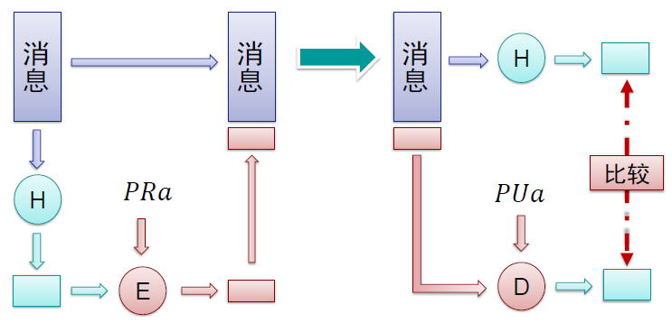
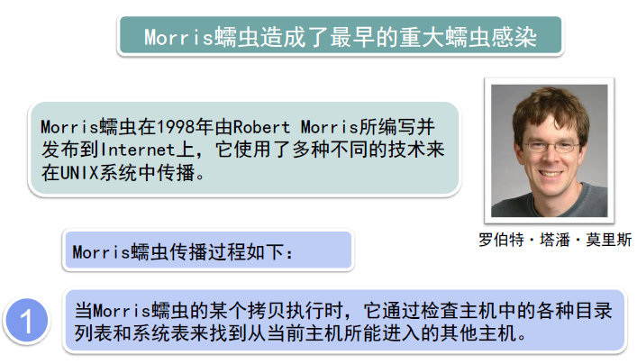
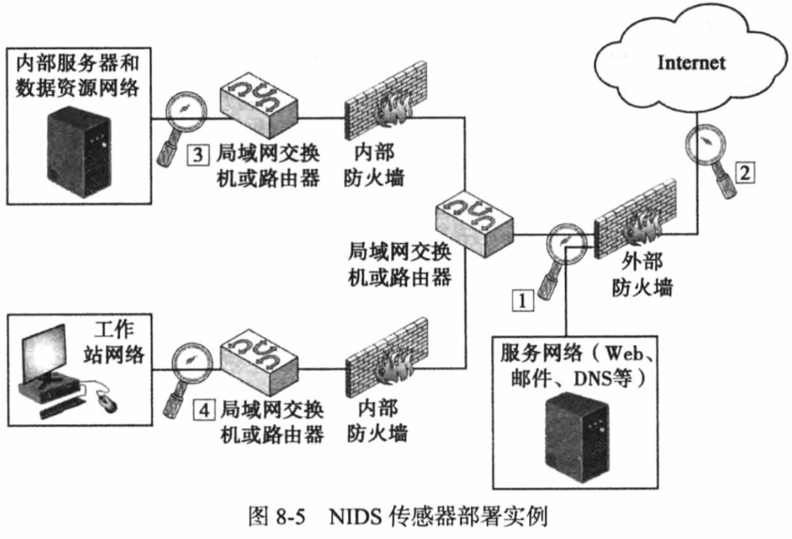

# 信息与网络安全

## 概论

### 网络安全威胁

* 恶意软件
* 安全性破坏
* DoS攻击

### 信息与网络安全目标

三个关键目标：

* 机密性
  * 数据机密性
  * 隐私性
* 完整性
  * 数据完整性
  * 系统完整性
* 可用性

### TCP/IP安全服务模型


### 网络攻击

* 主动攻击
  * 伪装
  * 重放
  * 篡改
  * 拒绝服务
* 被动攻击
  * 窃听攻击
  * 流量分析

### 五类安全服务

* 认证
* 访问控制
* 保密
* 完整性
* 不可否认

### 八类安全机制


## 数据加密技术

### 数据加密技术概述

* 密码学
* 加密系统
* 密码分析
* 加密
* 明文
* 密文
* 密钥

#### 对称密码和公钥密码

* 对称密码
  * 密钥：加密和解密密钥相同或可相互推导
  * 优点：加密速度快
  * 缺点：密钥管理复杂
* 公钥密码
  * 密钥：公钥与私钥不同且难以用私钥推导公钥
  * 优点：密钥管理简单
  * 缺点：加密速度慢

#### 对称密钥

加密和解密使用的是同样的密钥

#### 公开密钥

* 加密和解密的密钥不同
* 密钥分为公钥、私钥

#### 密码学基本原则之一

* Kerckhoffs原则：密码系统是安全的，表明可以公开除了密钥之外的整个密码系统的一切内容
* 密码系统的内部工作原理对于攻击者完全公开，唯一秘密是密钥

维护密钥成本低于维护密码算法

### 经典加密

#### 简单替换密码

改进：非常规字母表替换

破解方法一：穷举式密钥检索

破解方法二：统计字母频率

#### 双换位密码

#### 一次性密码本

$明文 \oplus 密钥=密文$

### 对称密钥加密

#### 对称密钥加密的分类

* 流密码加密—类似于一次性密码本
  * 密钥较短
  * 密钥延展成长二进制码流
  * 类似一次性密码本
* 分组密码加密—类似于电报密码本
  * 密钥决定密码本的选择
  * 电报密码本的电子版本
  * 扰乱和扩散的两个原则

#### 流密码加密


用n位长度的密钥K，并将其延展成长长的密钥流，然后该密钥流与明文P进行异或运算，生成密文C。接收方再用同样的方法解密

* A5/1算法
  * A5 / 1是用于在GSM蜂窝电话标准中提供无线通信隐私的流密码算法。
  * A5 / 1算法使用三个线性反馈移位寄存器：
    * X: 19 bits (x0,x1,x2, …,x18)
    * Y: 22 bits (y0,y1,y2, …,y21)
    * Z: 23 bits (z0,z1,z2, …,z22)
  * A5/1算法的密钥K共64位，用于三个线性反馈移位寄存器的初始填充，充当三个寄存器的初始值
  * 三个寄存器用密钥填充之后，就可以开始滚动生成密钥流了。每个回合可以拆分为三个步骤：
    * 反馈多项式（Feedback Polynomial）
      * 这里使用的是择多原则，三个寄存器中各选择一个钟控信号，19位寄存器中为第8位，22位、23位寄存器中皆为第10位。
      * 根据这三个钟控信号的取值，必定有0或1数量居多，居多的寄存器需要进行位移操作。
    * 位移
      * $m=maj(x_8,y_{10},z_{10})$
      * 需要移位的寄存器向右移位，将t填入空出来的第0位
      * if $x_8=m$，X右移，$t=x_{13} \oplus x_{16} \oplus x_{17} \oplus x_{18}$
      * if $y_{10}=m$，Y右移，$t=y_{20} \oplus y_{21}$
      * if $z_{10}=m$，Z右移，$t=z_7 \oplus z_{20} \oplus z_{21} \oplus z_{22}$
    * 取KEY
      * 取三个寄存器的最后一位，也就是19位、22位、23位，进行异或操作，得到的结果为这一轮密钥流的一位:$Keystream bit=x_{18} \oplus y_{21} \oplus z_{22}$

#### 分组密码加密

* 将明文分割成**固定长度**的分组，并生成固定长度的密文分组；
* 密文都是通过“用函数F对明文进行若干轮的**迭代**计算”得到的；
* 函数F：依赖于前一轮计算的输出和密钥K，称为**轮函数**；
* 一般用**软件**实现

##### Feistel密码

* 明文分组P被分割成左右两部分，$P=(L_0,R_0)$
* 对于每一轮i，i=1,2,3,…,n
  * $L_i=R_{i-1}$
  * $R_i=L_{i-1} \oplus F(R_{i-1},K_i)$
* 密文：$C=(L_n,R_n)$
* 解密
  * $C=(L_n,R_n)$
  * $R_{i-1}=L_i$
  * $L_{i-1}=R_i \oplus F(R_{i-1},K_i)$
  * $P=(L_0,R_0)$


##### DES

* 1970年代

* 基于IBM的Lucifer 密码

* 其争议性

  * NSA密码参与；

  * 设计过程保密；
  * 密钥长度从128位降到56位；
  * 对Lucifer 进行了一些修改。

原理

* 使用一个56 位的密钥以及附加的8 位奇偶校验位，产生最大64 位的分组大小；
* 使用Feistel技术，将加密的文本块分成两半;
* 用子密钥对其中一半应用循环功能，然后将输出与另一半进行“异或”运算；
* 接着交换这两半，这一过程会继续下去，但最后一个循环不交换。
* DES 使用16 个循环，使用异或，置换，代换，移位操作四种基本运算。
* S-box起到重要作用，每一个S-box将6个二进制位映射到4个二进制位。


##### AES

* 替代DES;
* 迭代式分组加密;
* 没有采用Feistel结构;
* 分组大小为128位;
* 三种密钥长度：128，192，256
* 依照密钥长度不同，运算轮次从10轮至14轮不等
* 每轮包含4个函数，分为3个层次
  * ByteSub(非线性层)
  * ShiftRow(线性混合层)
  * MixColumn(非线性层)
  * AddRoundKey(密钥添加层)


* 行移位


* 轮密钥合并


### 公开密钥加密

对称密钥带来的问题：

* 密钥不能公开；
* 如何安全地交换密钥
* 如何确认发送者身份

需要解决：

* 可靠密钥的传输通道问题
* 如何提供与手写签名等效的认证体系

#### 公钥加密算法

* 公钥加密算法使用两把完全不同但又是完全匹配的一对钥匙—公钥和私钥。
* 加密明文时采用公钥加密。
* 解密密文时使用私钥才能完成，只有使用匹配的一对公钥和私钥，才能完成加密和解密过程。

**公开的密钥为公钥**

**不公开的密钥为私钥**


##### 公钥加密

* 两个密钥：
  * 公钥：可为任何人知道，用来加密消息或者验证签名;
  * 私钥：只有接收者本人知道，用来解密消息和签名。
* 不对称性：
  * 用来加密消息的密钥不能用来解密消息


##### 公钥密码系统的加密原理

* 每个通信实体有一对密钥（公钥，私钥）。公钥公开，用于加密和验证签名，私钥保密，用作解密和签名
* A向B 发送消息，用B的公钥加密
* B收到密文后，用自己的私钥解密
* 任何人向B发送信息都可以使用同一个密钥（B的公钥）加密,没有其他人可以得到B的私钥，所以只有B可以解密


#### 通讯方式

##### 第一回合

* 正常情况
  * “客户”->“服务器”：你好；
  * “服务器”->“客户”：你好，我是服务器；
  * “客户”->“服务器”：我的密码是……
* 黑客入侵
  * “客户”->“服务器”：你好；
  * 黑客在“客户”和“服务器”之间的某个路由器上截获“客户”发给服务器的信息，然后自己冒充“服务器”；
  * “黑客”->“客户”：你好，我是服务器；
  * “客户”->“黑客”：我的密码是……

##### 第二回合

* “客户”->“服务器”：你好；
* “黑客”->“客户”：你好，我是服务器；
* “客户”->“黑客”：向我证明你就是服务器；
* “黑客”->“客户”：你好，我是服务器{你好，我是服务器}[？？？|RSA]。
* 黑客无法冒充，因为他不知道服务器的私钥，无法加密某个字符串后发送给客户去验证。
* “客户”：有内鬼，终止交易！

##### 第三回合

* “客户”->“服务器”：你好
* “服务器”->“客户”：你好，我是服务器
* “客户”->“服务器”：向我证明你就是服务器
* “服务器”->“客户”：你好，我是服务器{你好，我是服务器}[私钥|RSA]
* “客户”->“服务器”：{我的帐号是aaa，密码是123，把我的余额的信息发给我看看}[公钥|RSA]
* “服务器”->“客户”：{你的余额是100元}[私钥|RSA]

##### 第四回合

* “客户”->“服务器”：你好
* “服务器”->“客户”：你好，我是服务器
* “客户”->“服务器”：向我证明你就是服务器
* “服务器”->“客户”：你好，我是服务器{你好，我是服务器}[私钥|RSA]
* “客户”->“服务器”：{我们后面的通信过程，用对称加密来进行，这里是对称加密算法和密钥}[公钥|RSA]
* //红色字体的部分是对称加密的算法和密钥的具体内容，客户把它们发送给服务器。
* “服务器”->“客户”：{OK，收到！}[密钥|对称加密算法]
* “客户”->“服务器”：{我的帐号是aaa，密码是123，把我的余额的信息发给我看看}[密钥|对称加密算法]
* “服务器”->“客户”：{你的余额是100元}[密钥|对称加密算法]

#### 补充数学概念

##### 同余式

同余式是数论的基本概念之一，设m是给定的一个正整数，a、b是整数，若满足$m|(a-b)$，则称a与b对模m同余，记为$a \equiv b(\mod m)$，这个式子称为模m的同余式。

$m|(a-b)$表示m能够整除(a-b)，即$a \mod m=b \mod m$

##### 欧拉函数

欧拉函数$\varphi (n)$是小于等于n的正整数中与n互质的数的个数

对于任意互质的a和n，有$a^{\varphi (n)}\equiv 1(\mod n)$，即$a^{\varphi (n)} \mod n =1$

如果n是质数，则$\varphi (n) =n-1$，因为质数与小于它的每一个正整数都互质

如果$n=p*q$，而p和q互质，则：

$\varphi (n)=\varphi(p*q)=\varphi(p)*\varphi(q)=(p-1)(q-1)$

#### RSA

* 生成公钥/私钥对
  1. 取两个大素数p, q ($p \neq q$), 保密;
  2. 计算$n=p*q$，公开n;
  3. 计算欧拉函数$\varphi (n)=(p-1)(q-1)$；
  4. 随机选择整数e($1 \lt e \lt \varphi(n)$)，使得e和$\varphi(n)$互质即两个数的最大公约数为1；
  5. 计算d,使得$ed= 1(\mod \varphi(n))$，也就是$ed=k\varphi(n)+1$；
  6. 公开$(e,n)=(5,119)$；
  7. 将d保密，丢弃p,q
  
  $$
  m^{k(p-1)(q-1)+1} \equiv m(\mod n)
  $$
  
  $$
  m^{ed} \equiv m(\mod n)
  $$
  
* 加密消息$m$

  * 获取接收者的公钥：$K_u=\lbrace e,n \rbrace$
  * 计算：$c=m^e \mod n(0 \le m \le n)$

* 解密密文$c$

  * 使用自己的私钥：$K_R=\lbrace d,n \rbrace$
  * 计算：$m=c^d \mod n$

#### Diffie Hellman密钥交换方案

使两个用户安全地交换一个密钥以便用于以后的报文加密，这个算法本身限于**密钥交换**的用途

在Diffie-Hellman密钥交换算法中单项函数是模指数运算。它的逆过程是离散对数问题，其Diffie-Hellman算法的保密性基于求mod P解离散对数问题的困难

##### 本原元

定义素数g的本原元（primitive root）为其乘方能够产生从1到g-1的所有整数的数。也就是说，如果n是素数g的本原元，那么有下列数字：
$$
n \mod g,n^2 \mod g,n^{g-1} \mod g 
$$
这g−1个数字互不相同，而且包含了从1到g−1的所有整数

##### 离散对数

对于任何小于g的整数a和素数g的本原元n来说，能够找到唯一的指数i满足：
$$
a=b^i \mod g ,0 \le i \le (g-1)
$$
称指数i为a对于基数n和运算mod g 的离散对数

##### 密钥原理

设$g$是一个质数，$n$是$g$的本原元，要求$n$和$g$是公开的，则网络中的某一用户可以任选一个小于$g$的整数$a$作为秘密密钥


#### 椭圆曲线加密ECC

##### 椭圆曲线

已知椭圆曲线群
$$
E_p(a,b):y^2=x^3+ax+b,4a^3+27b^2 \neq 0
$$
**加法**

过曲线上的两点A、B画一条直线，找到直线与椭圆曲线的交点，交点关于x轴对称位置的点，定义为A+B，即为加法。


**取反**

将A关于x轴对称位置的点定义为-A，即椭圆曲线的正负取反运算


**二倍运算**

将过椭圆曲线在A点的切线，与椭圆曲线的交点，交点关于x轴对称位置的点，定义为A + A，即2A，即为二倍运算。


**无穷远点**

如果将A与-A相加，过A与-A的直线平行于y轴，可以认为直线与椭圆曲线相交于无穷远点


**有限域上的椭圆曲线**

已知有限域$GF(p)(p=q^n,q>3)$上的椭圆曲线群：
$$
E_p(a,b):y^2=x^3+ax+b(\mod p)
$$
有限域GF(p)指给定某个质数p，由0、1、2......p-1共p个元素组成的整数集合中定义的加减乘除运算

**有限域$GF(p)$**

Fp中有p（p为质数）个元素0,1,2,…, p-2,p-1

加法：$a+b \equiv c(\mod p)$

乘法：$a \times b \equiv c(\mod p)$

除法：$a/b \equiv c(\mod p)$

Fp单位元是1，零元是0

满足交换律、结合律、分配律

##### 加密原理

在定义了这一系列运算之后，我们可以很容易的计算出给定的G点对应的2G，3G等点。即：当给定G点时，已知x，求xG点并不困难。反之，已知xG点，求x则非常困难。此即为椭圆曲线加密算法背后的数学原理。

##### 计算及求解

计算椭圆曲线$y^2=x^3+ax+b(\mod p)$两点P，Q的和
$$
\left\{\begin{array}{c}
\mathrm{y}^2=\mathrm{x}^3+\mathrm{ax}+\mathrm{b}(\bmod \mathrm{p}) \\
\mathrm{y}-\mathrm{y}_{\mathrm{p}}=k\left(x-x_p\right) \\
k=\frac{y_q-y_p}{x_q-x_p}
\end{array}\right.
$$
计算过椭圆曲线点P的二倍点R
$$
\left\{\begin{array}{c}
x_r=\left(\frac{3 \mathrm{x}_{\mathrm{p}}^2+\mathrm{a}}{2 \mathrm{y}_{\mathrm{p}}}\right)^2-2 x_p \\
y_r=\left(\frac{3 \mathrm{x}_{\mathrm{p}}^2+\mathrm{a}}{2 \mathrm{y}_{\mathrm{p}}}\right)\left(x_p-x_r\right)-y_p
\end{array}\right.
$$

##### 准备工作

* 约定：选取$E_p(a,b)$和生成元$G$，公开
* 密钥的生成：选取私钥d,公钥为$e=dG$

##### 加密过程

* 将明文消息m通过编码嵌入到曲线上的点Pm
* 随机选取数字k，将密文$C_m=\lbrace kG,Pm+ke \rbrace$发送

##### 解密过程

* 收到密文$C_m=\lbrace kG,Pm+ke \rbrace$
* 利用自己的密钥d，计算$(Pm+ke)-dkG=Pm$


## 消息认证及数字签名

消息认证是一种允许通信者验证所收消息是否可信的措施，用于确认：

* 内容是否篡改
* 来源是否可信

### 消息认证方法

#### 散列函数

* 散列函数是一种创建数字“指纹”的方法。它把消息或数据压缩成摘要，使得数据量变小，将数据的格式固定下来
* 与消息认证码（MAC）不同的是散列函数不需要密钥输入

**变长消息->散列函数->定长摘要**

##### 单向散列函数消息认证的三种方式

###### 使用传统加密


###### 使用公钥加密



###### 使用秘密值


* 加密的散列函数，满足以下所有条件

  * 抗弱碰撞性：给定x和h(x)，要想找到任意y，满足$y \neq x$，并且h(y)=h(x)，这是不可能的
  * 抗强碰撞性：要想找到任意的x和y，使得$x \neq y$，并且h(y)=h(x)，这是不可能的

* 散列函数的工作模式

  

* 主流算法：MD5,SHA-1,SHA-2,Tiger Hash

##### MD5算法


MD5算法以一个任意长度的消息（M）作为输入，生成128位（16字节）的消息摘要作为输出，输入消息是按512位的分组处理的


#### 消息认证码

消息验证码是利用私钥产生的一小块数据，将其附到消息上，用来进行消息验证

消息认证码和散列函数区别：散列函数不需要加密，而**消息认证码是需要加密的**

假设两个通信实体（如A和B）共享一个公共密钥Kab

* 当A发消息M给B时，A计算消息认证码$MAC=F(K_{ab},M)$，并将MAC和消息一起传送给B。
* B对接收到的消息使用密钥Kab做相同运算，生成新的MAC。比较收到的MAC和计算得到的MAC


假设只有接收者和发送者知道密钥，若收到的认证码与计算得到的认证码相吻合，则可得出下列结论：

1. 接收者能够确认消息没有被篡改
2. 接收者能够确保消息来自合法的发送者
3. 如果消息中包含序列号，而攻击者不能成功地修改序列号，那么接收者就可以确认消息的正确序列

##### 基于散列函数消息认证码-HMAC

* 不改动就可以使用散列函数
* 嵌入式散列函数要有很好的可移植性
* 保持散列函数原有性能，不发生显著退化
* 使用和处理密钥简单


$$
HMAC(K,M)=H[(K^+ \oplus opad)||H[(K^+ \oplus opad)||M]]
$$
算法：

1. 在K的左端追加0，构成b比特的字符串$K^+$；
2. Ipad与$K^+$进行XOR生成b比特的分组$S_i$；
3. 将M追加在$S_i$；
4. 将H应用于步骤(3)所产生的数据流；
5. opad与$K^+$进行XOR生成b比特的分组$S_o$；
6. 将步骤(4)产生的散列结果追加在$S_o$上；
7. 将H应用于步骤6产生的数据流，输出结果；

##### 基于分组密码的MAC—CMAC

* 当消息长度是分组长度的整数倍时

  

* 当消息长度不是分组长度的整数倍时

  


### 数字签名技术

数字签名是**只有信息的发送者才能产生的别人无法伪造的一段数字串**，这段数字串同时也是对信息的发送者发送信息真实性的一个有效证明。它是一种类似写在纸上的普通的物理签名，但是在使用了公钥加密领域的技术来实现的，用于鉴别数字信息的方法

要求：

* 发方发出签名后的消息，就不能否认所签消息
* 收方能确认或证实发方的签字，但不能伪造
* 收方对已收到的消息不能否认
* 第三者可以确认收发双方之间的消息传送，但不能伪造这一过程

应具有：

* 必须能够验证签名者及其签名的日期时间
* 必须能够认证被签名消息的内容
* 签名必须能够由第三方验证，以解决争议

两类数字签名函数

* 直接数字签名
  * 仅涉及通信双方
  * 有效性依赖发方密钥的安全性
* 仲裁数字签名
  * 使用第三方认证

两种加密方法：

**利用发送方的私钥加密**


**利用发送方的私钥报文散列码加密**


## 密钥管理技术

### 基础概念

**密钥长度**与时间代价

**密钥生成**

方式一：用户自行设置，攻击者可以使用字典攻击

方式二：随机密钥，

**密钥使用**

使用软件加密

使用硬件加密

### 对称密钥的管理

**密钥分发技术**

传递密钥给希望交换数据的双方，不允许其他人看见密钥的方法

任何密码系统的强度取决于**密钥分发技术**

分发技术：

* A能够选定密钥并通过物理方法传递给B

* 第三方C可以选定密钥并通过物理方法传递给A和B

* 如果A和B不久之前使用过一个密钥，一方能够把使用旧密钥加密的新密钥传递给另一方

* A和B各自有一个到达第三方的加密链路，C能够在加密链路上传递密钥给A和B

  需要两种密钥：

  * 会话密钥，一次性会话密钥加密，会话结束销毁
  * 永久密钥，用于分发会话密钥

  需要一个**密钥分发中心KDC**

  * KDC在密钥分配过程中充当可信任的第三方
  * KDC保存有每个用户和KDC之间共享的唯一的密钥，以便进行分配
  * KDC按照需要生成各对端用户之间的会话密钥，并由用户和KDC共享的密钥进行加密，通过安全协议将会话密钥安全地传送给需要进行通信的双方

  KDC对称密钥分配方案

  A与B双方在KDC中已保存了各自的基本密钥KA和KB

  当双方进行通信前，应首先获得双方通信的会话密钥KS

  

### 公开密钥分配中心

#### 公开密钥分配方案

* 所有用户的公开密钥由KDC统一管理
* 用户只需保存自己的秘密密钥和KDC的公开密钥
* 用户可通过KDC获得任何其他用户的公开密钥


### 公钥的密钥管理


#### 网络中公钥的获得

1. 从对方处获得
2. 从可信的中央数据库获得
3. 从自己的私人数据库获得

#### 公钥证书

公钥证书又称CA证书、数字证书。它由可信赖的人或者机构(CA)签发,防止中间人攻击。

CA是负责签发证书、认证证书、管理已颁发证书的机关

**公钥证书签发**


X.509数字证书格式--V3

**公钥基础设施PKI**

PKI是生成,管理,存储,分发和吊销基于公钥密码学的公钥证书所需要的硬件,软件,人员,策略和规程的总和

**PKI基本组件**

PKI基本组件包括:注册机构RA,认证机构CA,证书库,密钥备份及恢复系统,证书撤消处理系统,PKI应用接口系统

**PKI包括的重要实体**

1. 证书权威CA：颁发证书和证书撤销链CRL
2. 注册权威RA：向CA登记或担保一个最终用户的身份
3. 证书库：存放证书和证书撤销链表CRL
4. 策略管理权威PMA
5. 终端用户EE

**PKI运行流程**


**PKI运行实例**


## 用户认证

### 用户认证基本概念

#### 用户认证功能

1. 用户通过一个凭证（例如用户ID）来向系统证明自身
2. 系统核实用户身份，并授予相应权限

#### 用户认证流程

* 识别步骤：向安全系统提供一个身份标识
* 认证步骤：提供或者产生认证信息，以证实实体与标识符之间的绑定关系

#### 用户认证与消息认证区别

* 消息认证：保证消息没有被更改且消息源真实
* 用户认证：用于系统识别用户的真实身份，同时提供给用户一个凭证

### 用户认证方法

* 基于个人所知道的信息：口令认证
* 基于个人所拥有的物品：令牌认证
* 基于个人生理特征：生物特征认证

#### 口令认证

**第一代密码**

系统数据库中存储登陆时的用户名及其对应的一个密码，使用明文存储

缺陷：数据库一旦泄露，所有用户名和密码都会泄露

**第二代密码**

在第一代密码的基础上采用散列函数加密，用户登陆时，将用户输入的密码执行加密算法后再和数据库对比

缺陷：一些简单口令仍可被破解

**第三代密码**

在第二代的基础上加入盐值；每个用户随机产生一个盐值，将密码+盐值使用散列函数加密后储存在数据库中

**盐值**：在密码任意固定位置插入的特定的字符串，让加盐后的密码进行散列运算的结果和原始密码的散列运算结果不一致

使用了盐值的UNIX口令方案


**盐值的优点**

* 即使是两个不同的用户选择了相同的口令。这些口令也会被分配不同的“盐值”；因此，这两个用户所持有的散列口令是不同的
* 它显著地增加了离线口令字典攻击的难度；对于一个b位长度的“盐值”，可能产生的口令数量将会增长2b倍，这大大增加通过字典攻击猜测口令的难度
* 它使得攻击者几乎不可能发现一个用户是否在两个或更多的系统中使用了相同的口令

#### 令牌认证

##### 静态协议

用户首先将自己与令牌绑定，再将令牌与系统用户绑定，即可通过令牌完成身份认证

##### 动态口令生成器

系统与令牌首先进行初始化并保持同步，每过一段时间令牌就会生成一段口令，该口令即可用于进行身份认证

##### 挑战-应答协议

系统产生一个“挑战信号”，智能令牌基于该信号生成一个“应答信号”，从而完成身份验证（类似公钥加密机制）

#### 生物特征认证

对于用户绑定的静态生物信息，如：面部特征，指纹，手型，视网膜模式，虹膜，签名等特征进行识别，从而完成用户认证

### 用户认证过程中的安全问题

#### 口令的脆弱性

##### 离线字典攻击

攻击者通过绕过系统的访问控制机制，从而获得对常见口令的访问权，攻击者通过将一些常用的口令进行散列之后的结果与口令文件中的散列值进行比较，匹配时攻击者便可以登录到系统中

对策：

* 修改一些不安全的口令;
* 防止非授权的对口令文件的访问；
* 使用入侵检测机制对危害系统的行为进行检测

##### 特定账户攻击

攻击者把目标锁定为一个具体的账户，不断对其口令进行猜测

对策：

* 采用账户锁定策略
* 口令尝试错误达到一定次数
* 对账户锁定

##### 常用口令攻击

用常用的口令（如123456，adminadmin）对大量的用户ID进行尝试

对策：

* 禁止用户使用常用的口令；
* 对请求者的IP地址和用户提交的cookie模式进行扫描

#### 常用攻击方式

##### 客户端攻击

在不访问远程主机的情况下，敌手伪装成一个合法用户来完成用户认证的攻击行为；
敌手可能会对口令进行多种猜解，如尝试所有可能的口令；阻止这种攻击的一种方法是选择既长又不可预测的口令（参考“口令的脆弱性”）

##### 重放攻击

攻击者发送一个目的主机已接收过的包，来达到欺骗系统的目的；
重放攻击可以由认证发起者或者拦截并重发该数据的敌方进行；攻击者利用网络监听或者其他方式盗取认证凭据，之后再把它重新发给认证服务器

##### 特洛伊木马攻击

在特洛伊木马攻击中，敌手冒充成认证服务来捕获用户口令、验证码或生物特征信息；之后，敌手可以使用捕获到的信息冒充合法用户

##### 拒绝服务攻击

拒绝服务攻击是试图通过大规模的认证请求使认证服务失效


### 基本认证方法

#### 单向认证

最简单的方式是A向B出示口令

**使用公钥的单向认证**


**使用对称加密方法的单向认证**

* A和B双方共享密钥，B向A发送一个明文R，A返回该明文对应的密文，从而确认A掌握密钥
  * 随机数据R每次不同，因此不能回放
  * A和B双方安全性相关，一方被攻破，另一方也不安全

**口令认证-Lamport散列函数**

* A存放
  * 散列函数$h(\cdot)$，用于登录B的password
* B存放
  * 散列函数$h(\cdot)$，A的用户名，整数n，将password散列n次的结果$hash^n$


* 当A需要向B作身份认证时，B返回n的当前值
* A计算$hasn^{n-1}$（password）并送给B
* B将A返回的结果$hash^{n-1}$（password）再散列一次，与当前存储的散列值（$hash^{n-1}$（password））比较
* 若鉴别成功，则将$hash^{n-1}$（password）更新为当前的散列值，且n的值减1
  * 若n递减为1，则重新设置口令


**One-Time Password方法的问题**

小数攻击

若攻击者已知散列函数$h(\cdot)$且能拦截B的信息，则他可向A返回一个很小的m值，这样就能计算出从$hash^m$（password）到$hash^n$（password）的值，从而在n减少到m前可冒充A


#### 双向鉴别

* 对称密钥
  * AB提出challenge
  * 存在桥接攻击
* 非对称密钥
  * 相互使用对方的公钥
  * 公钥的真实性问题
* 时标
  * 数据的时效性问题

##### Key Distribution Center

* 承担一个Site的密钥集中管理工作
* 减轻端系统的密钥保管负担
* 有利于用户的移动
* 容易构成安全的瓶颈
* Single Sign-On的概念

##### Needham-Schroeder方法


##### Keberos认证

整个方案就是一个可信任的第三方认证服务

要求用户调用每个服务时需要证明他的身份，并且可随意要求服务器向客户端证明它们的身份

**概述**

1. $C \to AS:ID_C||P_C||ID_V$
2. $AS \to C:Ticket$
3. $C \to V:ID_C||Ticket$

$Ticket=E(K_v,[ID_C||AD_C||ID_V])$

* C=客户端
* AS=认证服务器
* V=服务器
* $ID_C$=客户端上用户的身份标识
* $ID_V$=服务器的身份标识
* $P_C$=客户端上用户的口令
* $AD_C$=客户端的网络地址
* $K_v$=认证服务器和服务器间共享的加密密钥

**一个更加安全的认证会话**

每次用户登录会话就执行一次：

1. $C \to AS:ID_C||ID_{tgs}$
2. $AS \to C:E(K_C,Ticket_{tgs})$

每种类型的服务各执行一次：

3. $C \to TGS:ID_C||ID_V||Ticket_{tgs}$
4. $TGS \to C:Ticket_v$

每个服务会话执行一次：

5. $C \to V:ID_C||Ticket_v$

* $Ticket_{tgs}=E(K_{tgs},[ID_C||AD_C||ID_{tgs}||TS_1||Lifetime_1])$
* $Ticket_{v}=E(K_v,[ID_C||AD_C||ID_{v}||TS_2||Lifetime_2])$

**Kerberos协议**

包括客户端、应用服务器和一个Kerberos服务器

* 被设计用来对抗针对客户端/服务器对话安全的多种威胁
* 很明显的安全性风险是伪装（impersonation）
* 服务器必须能确认请求服务的客户端的身份

使用一个认证服务器(AS)

* 用户登录AS进行身份验证
* AS 验证用户的身份，然后把这个信息传送到一个应用服务器，这个应用服务器就将接受客户端的服务请求

在一种安全的方式下完成上述工作

* 如果客户端在网络上把用户口令发送到AS，敌手可以在网络上观测到用户的口令
* 敌手可以装扮成AS并发送一个假的确认消息


注意:口令是集中存在Kerberos 服务器上的,不需在网络上传输


Kerberos域

一个Kerberos环境包括:

* 一台Kerberos 服务器
* 若干客户端，都在Kerberos 服务器上注册
* 若干应用服务器，与服务器共享密钥

这种环境被称为Kerberos域

* 在不同管理组织下的客户端和服务器的网络通常组成不同的域

如果有多个域：

* 它们的Kerberos服务器必须共享一个密钥，并信任另一个域中的Kerberos服务器对其用户进行认证
* 在第二个域中参与的服务器也必须信任另一个域中Kerberos服务器


## 访问控制

### 访问控制原理

访问控制是按用户身份及其归属的某项定义组来限制用户对某些信息项的访问，或限制对某些控制功能的使用的一种技术。

**广义的访问控制**


**狭义的访问控制**

访问控制实现的安全策略：指定对于每个具体的系统资源，谁或什么(如一个进程)可以访问

每个实例允许的访问类型

### 访问控制策略

#### 访问控制三要素


#### 访问控制策略

##### 自主访问控制DAC

基于请求者的身份和访问规则（授权），规定请求者可以（或不可以）做什么。

一个实体可以被授权按其自己的意志使另一个实体能够访问某些资源。换句话说，拥有客体权限的用户，可以将该客体的权限分配给其他用户

例如：没有文件File1访问权限的用户可以从有访问权限的B 用户那里得到访问权限

DAC实现的通常方式是提供**访问矩阵**

矩阵中的每项表示一个特定主体对一个特定客体的访问权。


**稀疏-权限控制列表ACL** 不直观


**授权表**

授权表不像访问矩阵那么稀疏，但比ACL或能力表更为方便。


**一个DAC通用模型**


##### 强制访问控制MAC

通过比较具有安全许可的安全标记来控制访问。

强制访问控制模型(Mandatory Access Control),在计算机安全领域指一种由操作系统约束的访问控制

目标：限制主体或发起者访问或对对象或目标执行某种操作的能力。

主体对于对象的任何操作都将根据一组授权规则（也称策略）进行测试，由操作系统决定操作是否允许

1. 主体(Subject)被赋予一定的安全级别
2. 客体(Object)被赋予一定的安全级别
3. Subject 能否访问Object 由双方的关系安全级别决定，这个判断通常由系统硬性限制


**优点**

* 系统独立于用户行为强制执行访问控制，用户不能改变他们的安全级别或对象的安全属性。
* MAC安全性比DAC有了提高
* 非常适合机密机构或者其他等级观念强烈的行业

**缺点**

过重强调保密性，管理不够灵活

##### 基于角色的访问控制RBAC

基于用户在系统中所具有的角色和说明各种角色用户享有哪些访问权的规则来控制访问

传统的DAC系统定义了单独的用户和用户组的访问权。与之相反，RBAC基于用户在系统中设定的角色而不是用户的身份


用户与角色的关系是多对多的，在某些环境下，用户集改变频繁，给一个用户分配一个或多个角色的方案可能也是动态的。

RBAC的访问矩阵


RBAC抽象模型


会话用来定义用户与该用户被分配的一个或多个角色之间的一对多的临时关系。用户仅与完成特定任务所必需的角色建立会话。这是最小特权概念的一个实例

RBAC模型作用域


RBAC的角色层次


RBAC的约束

约束是在角色之间定义的关系或与角色相关的条件，它提供了一种令RBAC适应组织中的管理和安全策略的细节的手段。

##### 基于属性的访问控制ABAC

基于用户、被访问资源及当前环境条件来控制访问


**属性**


**策略**


**架构**


**优势**

* 正如我们之前提到的，ABAC方法的优势在于它的灵活性以及表达能力
* ABAC系统能够实现DAC、RBAC和MAC的思想。
* ABAC允许无限数量的属性组合起来以满足任何访问控制规则，能够实现细粒度的访问控制，能满足来自基本访问控制列表的各种各样的要求

**障碍**

* 需要考虑每次访问资源和对用户属性的评价所造成的性能影响。
* 然而，对于某些应用诸如Web服务和云计算的综合运用来说，每次访问所增加的代价相对于原本就相当高的性能代价是微不足道的。
* 因而，Web服务是实现ABAC模型的开创性技术，尤其是引入了可扩展的访问控制标记语言，并且也有人对将ABAC模型应用到云服务表现出相当大的兴趣。

## 数据库安全

### SQL注入攻击

SQLi

利用Web应用的页面特征，发送恶意的SQL命令到数据库服务器

可用于

* 修改或删除数据
* 执行任意的操作系统命令
* 发起拒绝服务(DoS)攻击


从上向下：

* 攻击者找到Web应用的脆弱点，向Web服务器发送命令
* Web服务器将收到恶意代码发送给Web应用服务器
* Web应用服务器将收到恶意代码发送给数据库服务器

从下向上：

* Web服务器向攻击者发送信用卡详细信息。
* Web应用服务器生成一个包含数据库信用卡表详细信息的页面。
* 数据库服务器在数据库上执行恶意代码，从信用卡表中返回数据。

#### 注入技术

SQLi攻击的方法通常是在SQL语句中提前终止文本串，随后附加新的命令代码。


同时，攻击者利用注释符“--”来终止被注入的代码段，使得后面的代码在执行时被忽略。


**实例**

```sql
select * from users
where username='{0}'
and password='{1}'
limit 0,1
```

```java
String username="test' OR 1=1 --""
String password="abcdefg"
```

单引号将用户名字符串提前结束

所有记录都匹配到了该选择条件

用户将被允许登录到系统，尽管它没有输入正确的用户名密码，甚至连数据库中有哪些有效的用户名都不需要知道

**原因**

* 对用户输入数据的过分信任，导致用户有机会输入恶意的代码
* 数据和操作逻辑没有隔离，本应该是数据的内容最终变成了可执行的语句，并改变了原有的执行逻辑

### SQLi攻击方式

#### SQLi攻击途径


#### SQLi攻击方式

##### 带内攻击

带内攻击使用同样的通信通道来完成注入SQL码和结果返回


1. 行尾注释

   在注入代码到特定字段之后，字段之后的合法代码会被注释标记为空字段。

2. 捎带查询

   攻击者在原本的查询语句之外还插入附加的查询。

3. 重言式

   将代码注入一个或多个永真的条件表达式中

##### 推理攻击

推理攻击没有实际的数据传输，但攻击者能够通过发送特定的请求和观察网站和数据库服务器的响应规律来重新构造信息

1. 攻击者不断试错，通过反馈的错误信息将关于Web应用程序和数据库后端的类型和结构等重要信息收集起来，从而为以后攻击的做准备。

   

2. 攻击者发送大量请求，当注入表达式为真时，网站正常运行

   当注入表达式为假时，虽然没有描述性的错误语句，错误页面和正常页面还是有明显区别的。

   攻击者可以根据表达式的真假推测数据库系统中的数据

   


**使用检测防范推理攻击**

1. 数据库设计时的推理检测

   通过修改数据库结构或改变访问控制机制等手段消除推理通道，从而防止推理

   将一个表分成多个表以除去数据依赖

   缺点：这类技术常常导致不必要的更严格的访问控制，从而降低了可用性。

2. 查询时的推理检测

   这种方法寻求在一个查询或一系列查询执行期间消除推理通道违例。

   如果发现了推理通道，那个查询就被拒绝或修改。

##### 带外攻击

在带外攻击中，返回数据使用不同的通信频道


比如一个带有查询结果的Email生成和返回是在不同的信道进的

这一方式可以用于信息检索有限制但数据库服务器带外连接不严格的情况

#### SQLi的防范

##### 防御性编码

* 手动防御性编码实践

  例如：进行输入类型的检查

* 参数化查询插入

  分离传递值参数

* SQL DOM
  SQL DOM是一组保证自动数据有效和转义的类

##### 检测

* 基于特征

  匹配特定的攻击模式

* 基于异常

  定义正常行为模式，检测超出行为模式范围的情况

* 代码分析

  一个测试套件，它成能够生成许多攻击，并评估系统的响应

##### 运行时阻断

若查询与期望的不一致，则阻断。

##### 数据库加密


加密是数据库安全的最后一道防线，它可以在记录级（加密选定的记录），属性级（加密选定的列）或单个字段级运用到整个数据库。

**缺点**

1. 密钥管理：授权用户必须能够访问其被允许访问的数据的解密密钥
2. 不灵活：当数据库的部分或全部被加密时，执行记录搜索变得更为困难


## 恶意软件

### 恶意软件的概念

一种被（往往是秘密地）植入系统中，以损害受害者数据、应用程序或操作系统的可信性、完整性或可用性，抑或对用户实施骚扰或妨碍的程序


### 恶意软件的类型

#### 恶意软件的分类方法


有效的分类方法


#### 恶意软件的传播机制

1. 对现有可执行程序的感染或由病毒翻译并随后传播至其他系统。
2. 利用软件漏洞（无论是从本地发起或借助蠕虫、夹带式下载等方式从网络发起）来允许恶意软件自我复制
3. 借助社会工程学方法说服用户绕过安全机制来安装木马或响应网络钓鱼

#### 恶意软件的有效负荷

1. 污染系统或数据文件
2. 窃取服务使系统成为僵尸网络中的一个僵尸代理
3. 窃取系统信息，以及登录口令和通过键盘记录器或间谍软件获取的隐私信息
4. 隐蔽恶意软件的存在

### 恶意软件的来源

#### 攻击工具包

#### 攻击源

#### 高级持续性威胁


### 恶意软件的传染机制

#### 移动代码

移动代码能够从远程系统传送到本地系统，无需用户明确许可便开始运行，进而利用漏洞实现某些功能，例如非授权的数据访问或特权攻击。

#### 病毒

在被感染的主程序运行时，病毒可以秘密执行主程序被允许执行的任何操作。


#### 蠕虫

蠕虫是一种主动寻找并感染其他机器的程序，而每台被感染机器又转而成为自动攻击其他机器的跳板。


##### 蠕虫复制

为了复制自身，蠕虫利用如下方法来访问远程系统

* 电子邮件或即时通讯工具

  蠕虫通过邮件发送自己的拷贝，或将自身当作即时通信服务的附件发送。当打开电子邮件或附件时，蠕虫的代码就会被执行。

* 文件共享

  蠕虫可以在如USB设备等可插拔媒介上创建自己的拷贝，或像病毒那样感染此类媒介上适合的文件。


##### 蠕虫的扫描策略

网络蠕虫在传播阶段的首要功能是寻找其他系统进行感染，这个过程叫作扫描(scanning)或指纹采集（fingerprinting)。

* 随机式探索

  每一台被感染的主机使用不同的种子探测IP地址空间的随机地址，会产生大量的网络流量，可能导致在实际攻击开展前，操作便会被中断

* 拓扑式探索

  利用被感染机器中所包含的信息来寻找和扫描更多的主机。

* 黑名单

  攻击者首先为潜在的易感染机器列出一个大名单，这是一个非常慢的过程，可以避免被检测到攻击正在进行

  一旦名单编辑完成，每个被感染的机器会被分配名单中的一部分进行扫描，这种分工明确的扫描时间非常短，因此检测感染的发生是非常困难的

* 本地子网

  如果防火墙后的一台主机被感染，则该主机会在其所在的本地网络中寻找到其他本应受到防火墙保护的主机


##### Morris蠕虫




##### 最近的蠕虫攻击

##### 手机蠕虫


#### 夹带式下载


#### 点击劫持


#### 社会工程学


### 恶意软件的载荷

#### 系统损坏


#### 攻击代理


#### 信息窃取


#### 网络钓鱼


#### 隐蔽后门


#### 隐蔽rootkit


### 恶意软件的对抗措施

预防为主

* 规则

* 警惕性
* 弥补弱点
* 缓解威胁


反病毒软件的发展

1. 简单的扫描器

   * 基于病毒特征码来识别病毒
   * 通过检査文件长度变化来检测病毒

   缺点：仅局限于检测已知病毒

2. 启发式扫描器

   * 通过启发式规则来检测可能存在的病毒感染；

     例如：通过搜索经常与病毒关联的代码段来检测病毒

   * 完整性检测：每个程序都被附加一个校验和，如果病毒感染了程序但没有修改程序后面附加的校验和，完整性检测就能发现病毒对文件的修改。

3. 活动陷阱

   一种内存驻留程序，它通过病毒行为来识别病毒而不是通过被感染文件的内部结构特征。

   优点：不用为大量的病毒生成特征码和启发式规则。它只需要去识别一小部分预示病毒想要感染的行为，然后阻止这些行为。

4. 全面保护

   综合运用各种反病毒技术的软件包，包括扫描和活动陷阱组件。同时还加入了访问控制功能，从而限制了病毒对系统渗透的能力，也就限制了病毒修改文件以继续传播的能力。

## 拒绝服务攻击

### 拒绝服务攻击

拒绝服务(DoS)是一种通过耗尽系统资源，来削弱或阻止对网络、系统或应用程序的正常使用的行为

目标资源

* 网络带宽
* 系统资源
* 应用资源

#### 经典的拒绝服务攻击

##### 泛洪攻击

洪泛攻击的目的就是占据所有到目标组织的网络连接的容量


##### 源地址欺骗

产生大量目的地址指向被攻击系统的数据包，但这些数据包的源地址是随机的

洪泛攻击发送数据包的源地址很容易被识别，从而定位到攻击者真实的IP地址

使用原始套接字接口伪造源地址，使得攻击者难以被定位


##### SYN欺骗

* 利用TCP三次握手协议进行攻击
* 通过发送大量伪造源地址的SYN连接请求数据包，使服务器上用于管理TCP连接的连接表溢出，从而使正常用户无法建立连接


### 泛洪攻击

* 根据攻击所使用的网络协议不同进行分类
* 其目的大都是使到服务器的链路超负荷
* 几乎任何类型的网络数据包都可以用来进行洪泛攻击

#### ICMP泛洪

* 利用ICMP回送请求数据包的ping洪泛攻击
* ping是一种很有用的网络分析工具，网络管理员一般允许ICMP回送请求数据包进入他们的网络

#### UDP泛洪

* 使用指向目标系统上某个端口号的UDP数据包洪泛
* 几乎任何UDP端口号都可以作为目标

#### TCP SYN泛洪

* 发送TCP数据包给目标系统
* 攻击的对象是数据包的总量而不是目标系统上的网络处理程序

### 分布式拒绝服务攻击

攻击者首先通过操作系统上或者某些常用应用程序的一些熟知的漏洞来获得访问这些系统的权限（僵尸机）


### 基于HTTP协议的攻击

#### HTTP泛洪攻击

* 利用来自很多僵尸机的HTTP请求攻击web服务器，每个请求都消耗大量资源
* 递归HTTP洪泛（爬虫）：从给定的web服务器出发，遍历其所有链接并发送请求


#### Slowloris

通过不完整的HTTP请求占用服务器资源

* 利用服务器收到完整请求响应的特性
* 服务器接收到不完整请求会将该连接保持，期待收到更多信息以完成这个请求，这一过程会占用服务器的计算资源
* 通过发送多个不完整请求，并周期性的发送新包将其保持，消耗服务器的计算资源

### 反射攻击与放大攻击

#### 反射攻击

中间媒介一般为高性能网络服务器（如DNS服务器），这意味着可以通过中间媒介形成很高的网络通信流量

攻击者将其想攻击的目标系统地址作为数据包的源地址，并将这些数据包发送给中间媒介

当中间媒介响应时，大量的响应数据包会被发送给源地址所指向的目标系统


#### DNS放大攻击

* 使用了直接指向合法DNS服务器的数据包进行攻击
* 将DNS服务器作为中间媒介
* 利用DNS协议将较小的请求数据包转化为较大的响应数据包而达到攻击效果
* 目标系统被这些响应流量所洪泛

### 防范拒绝服务攻击

#### 网络输入过滤

* 在尽可能靠近源地址的地安装方过滤器，以此限制主机系统发送带有虚假源地址数据包
* 使用过滤器来确认源地址所指向的返回路径是当前数据包发送过来所使用的路径

#### 改进网络协议

使用改进版本的TCP连接处理程序来抵御SYN欺骗攻击

#### 主动判断

* 主动判断数据包是否来自合法的、人工发起的交互，还是自动的DOS攻击
* 屏蔽可疑服务以及定向IP广播

### 对拒绝服务攻击的响应

#### 判断出攻击类型

* 数据包的捕获和分析
* 配置过滤器来过滤掉上游的攻击数据包
* 识别并纠正系统/应用程序错误

#### 通过服务供应商追踪攻击数据包流确定攻击源

* 可能很困难，而且非常耗时
* 如果希望将攻击报告给相关的执法部门，这是必要的

#### 攻击分析和更新应急计划

**实施应急计划**

切换到备份服务器，用新的服务器建立具有新地址的新站点

**更新事故应变计划**

攻击分析和响应，并从经验中吸取教训以改进今后的处理措施


## 入侵检测

### 入侵者

#### 分类

* 网络罪犯
* 活动家
* 国家资助的组织
* 其他入侵者
* 学徒
* 训练有素者
* 高手

#### 入侵者行为

入侵者的技术和行为模式总是在不断变化，目的是利用新发现的系统弱点并躲避检测和相应的应对策略，通常使用以下步骤发起攻击

##### 锁定目标和收集信息

攻击者利用公开的可用信息，通过技术和非技术手段，发现待攻击的目标系统，归纳其特征，并且利用网络探测工具确定目标资源的位置

##### 获取访问权限

通常是利用远程网络漏洞，以及在远程服务中使用的弱认证证书，或者是利用在目标系统上安装恶意软件

##### 权限提升

通常是利用远程网络漏洞，以及在远程服务中使用的弱认证证书，或者是利用在目标系统上安装恶意软件

##### 信息收集或者系统漏洞利用

访问或者修改目标系统中的信息或者资源，或者从目标系统导航到另一个目标系统。

##### 维持访问权限

攻击者安装后门或者其他恶意软件，或者改变认证证书，或者改变系统的其他配置，从而使攻击者在首次获得访问权限后，可以保证其拥有后续的长期访问权限。

#### 入侵实例

* 远程获得电子邮件服务器超级用户(root)权限。
* 破坏Web服务器。
* 猜测和破解密码。
* 复制一个存有信用卡账号的数据库。
* 在未授权的情况下浏览敏感数据，包括工资记录和医疗信息等。
* 在工作站上运行数据包嗅探器来捕获用户名和密码。
* 利用匿名FTP服务器的权限错误( permIssionerror)发送盗版的软件和音乐文件。
* 拨号到一个不安全的调制解调器，以获得内网的访问权限。
* 伪装成管理人员，呼叫帮助平台，重置该管理人员的电子邮件口令并学习新的口令。
* 在未授权的情况下使用一个无人值守的已登录的工作站。


### 入侵检测系统IDS

#### 相关概念

##### 安全入侵

一个安全事件或多个安全事件的组合构成一个安全事故( security incident)，在安全事故中入侵者在未经授权的情况下获取或尝试获取一个系统(或系统资源)的访问权。

##### 入侵检测

一种监控并分析系统事件的安全服务，目标是发现未经授权而访问系统资源的尝试活动，并提供实时或近似实时的报警

#### 入侵检测系统（IDS）

进行入侵检测的软件与硬件的组合便是入侵检测系统

intrusion detection sys

##### 需要IDS原因

* 防火墙的不足
  * 是网络边界的设备
  * 自身可以被攻破
  * 对某些攻击保护很弱
  * 不是所有的威胁来自防火墙外部
* 入侵容易
  * 入侵教程随处可见
  * 各种工具唾手可得

|         | 优点                                                 | 局限性                         |
| ------- | ---------------------------------------------------- | ------------------------------ |
| 防火墙  | 可简化网络管理，产品成熟                             | 无法处理网络内部的攻击         |
| IDS     | 实时监控网络安全状态                                 | 误报警，缓慢攻击，新的攻击模式 |
| Scanner | 简单可操作，帮助系统管理员和安全服务人员解决实际问题 | 并不能真正扫描漏洞             |
| VPN     | 保护公网上的内部通信                                 | 可视为防火墙上的一个漏洞       |
| 防病毒  | 针对文件与邮件，产品成熟                             | 功能单一                       |

##### 入侵检测系统性能关键参数

**误报**(false positive)：系统错误地将异常活动定义为入侵。

**漏报**(false negative)：系统未能检测出真正的入侵行为。

##### 要求

* 不间断运行
* 具有容错功能
* 抵御破坏
* 对系统增加最小的开销
* 根据系统安全策略配置
* 适应系统和用户行为变化
* 监测更多主机
* 提供很好的服务降级
* 允许动态重新配置

##### 基本结构

三个基本组件

* 传感器

  信息收集

* 分析器

  分析收集的信息，确定是否发生了入侵

* 用户接口

  查看系统输出或控制系统行为

##### 传感器-信息收集

入侵检测的第一步是信息收集，收集内容包括系统、网络、数据及用户活动的状态和行为

从一个源来的信息有可能看不出疑点，因此要尽可能扩大检测范围，信息收集的来源如下

* 系统调用踪迹
* 审计(日志文件)记录
* 文件完整性校验和
* 注册表访问

入侵检测很大程度上依赖于收集信息的可靠性和正确性，因此入侵检测系统软件本身应具有相当强的完整性和坚固性，防止被篡改而收集到错误的信息。

##### 分析器-信息分析

分析传感器收集到的信息，确定是否发生了入侵。主要分为以下两种方法。

* 异常检测
  * 采集有关合法用户在某段时间内的行为数据；
  * 统计检验被监测的行为，以较高的置信度确定该行为是否不是合法用户的行为
* 特征或启发性检测
  * 使用一组已知恶意数据模式(特征或者攻击规则(启发式)组成的集合来与当前的行为进行比较；
  * 也被称为误用检测；
  * 仅仅可以被用来识别有模式或者有规则的已知攻击。

###### 信息分析-异常检测

异常检测方法首先有一个训练过程，其通过在被监控的系统上收集和处理正常行为的相关信息来建立一个合法用户的行为模型。检测时，会把当前被观测到的行为与模型进行比较，从而确定是否为入侵行为。

* 统计法
* 基于知识法
* 机器学习法


###### 信息分析-特征或启发性探测

* 特征方法
  * 用一个大的已知恶意数据模式的集合去匹配系统中或发送到网络中的数据。
  * 特征集合需要足够大，这样可以在尽可能减小误报率的同时检测到最多的恶意数据。
  * 该方法被广泛应用于反病毒产品、网络流量扫描代理以及NIDS中。
* 基于规则的启发式识别
  * 采用规则来识别已知的渗透或者利用已知漏洞进行的渗透。
  * 规则还可用来识别可疑行为，即使该行为并未超出已建立的可用模式范围。
  * 通常，系统中使用的规则与特定的机器和操作系统有关。
  * Snort系统是一个基于规则的NIDS实例。

#### 入侵检测的分类-按数据来源

* 基于主机的IDS-HIDS

  监测一台主机的特征和该主机发生的与可疑活动相关的事件

* 基于网络的IDS-NIDS

  监测特定的网段或设备的流量并分析网络、传输和应用协议，用以识别可疑的活动

* 分布式或混合式IDS
  通常是将主机的传感器和网络的传感器收集到的信息结合，并汇总到一个中央分析器中，这样能够更好地识别入侵活动并做出响应。

##### 基于主机的入侵检测HIDS

HIDS向易受攻击或敏感的系统中添加专用的安全软件层，包括数据库服务器和管理系统等。HIDS以多种方式监测系统上的活动，检测可疑行为。

###### 主要目的

HIDS可以在任何损害发生之前阻止攻击，但它的主要目的还是检测入侵、记录可疑事件，并发送警报

###### 优点

HIDS可以使用异常、特征、启发式方法来检测未授权的行为，实现检测外部和内部入侵，这一点是基于网络的IDS或者防火墙所不及的

###### 检测内容

系统调用、端口调用、系统日志、安全审记、应用日志

##### 基于网络的入侵检测NIDS

NIDS监控一个网络或多个互联网络上选定的位置的网络流量。NIDS检测网络层、传输层或应用层协议的活动，实时或接近于实时地分析网络数据包，以试图发现入侵模式。

###### 与HIDS区别

NIDS检测网络上流向潜在的易受攻击的计算机系统的数据包流量，而HIDS检测的是主机上的用户和软件活动

###### 典型的NIDS设备

* 大量传感器用来监控数据包流量；
* 一个或多个服务器负责NIDS管理功能；
* 一个或多个管理控制台提供人机交互的接口

分析流量模式从而检测入侵的工作可以在传感器、管理服务器或在二者上组合完成

###### 检测内容

包头信息+有效数据部分




###### 适合使用特征检测进行识别的攻击

* 应用层侦察和攻击
* 传输层侦察和攻击
* 网络层侦察和攻击
* 意外应用程序服务
* 策略违背

###### 适合使用异常检测进行识别的攻击

* 拒绝服务(DoS)攻击
* 扫描
* 蠕虫

###### 异常检测技术-状态协议分析

SPA的检测是通过比较观测的网络流量与预定的、供应商提供的正常的流量特征实现的。这与基于组织特定的流量特征的异常检测技术不同。

**优点**

SPA通过推断和追踪网络、传输和应用协议的状态，保证网络活动按预期发展。主要优势在于其对所要求资源的高利用率。

**警报日志记录**

##### 分布式入侵检测系统


### 入侵检测技术-蜜罐

Honeypot也叫蜜罐，指一种安全资源。蜜罐是掩人耳日的系统，是为引诱潜在的攻击者远离关键系统面设计的，它的价值就是被探测，被攻击或攻陷

#### 功能

* 转移攻击者对重要系统的访问；
* 收集有关攻击者活动的信息；
* 引诱攻击者在系统中逗留足够长的时间，以便于管理员对此攻击做出响应

蜜罐填满了看起来有价值但系统的合法用户不会访问的伪造信息。因此，任何对蜜罐的访问都是可疑的。蜜罐系统装备了敏感的监控器和事件记录器，用于检测这些访问和关攻击者的活动信息。

蜜罐是一种没有产出的资源。网络以外的任何人与蜜罐进行交互都没有合法的理由。因此，任何与蜜罐系统通信的尝试很可能是一个探测、扫描或者攻击。相反，如果一个蜜罐发起对外通信，则系统可能已被破坏。

#### 蜜罐分类

##### 低交互蜜罐

* 由能够模拟特定IT服务或系统的软件包构成，它足以提供一种真实的初级交互，但是却无法提供所模拟服务或系统的全部功能；
* 提供了一个低真实度的目标；
* 通常来说，这类蜜罐作为一个提供报警功能的分布式IDS的组件已经足够了

##### 高交互蜜罐

* 是一个带有完整操作系统、服务以及应用程序的真实系统，被部署在攻击者能够访问的地方；
* 是一个更为真实的目标，很有可能消耗掉攻击者更长的时间；
* 但是它需要极大的资源；
* 一旦被攻破，就可能被用来发起对其他系统的攻击

#### 蜜罐拓扑结构


#### 蜜罐部署


### Snort

Snort是开源、高度可配置且可移植的基于主机或基于网络的IDS。Snort被称为是轻量级IDS，它具有以下特征：

* 可以在大多数网络节点(主机、服务器和路由器)轻松地部署；
* 使用少量的内存和处理器时间进行高效操作；
* 系统管理员可以容易地进行配置，以便在较短时间内实现特定的安全解决方案。


#### Snort规则

Snort使用一种简单、灵活的规则定义语言来生成检测引擎可用的规则。尽管规则非常简单，可以直接编写，但它们的功能足以检测各种恶意或可疑的网络流量。


#### 规则动作


## 防火墙

### 防火墙的必要性

防火墙是一种用于保护本地系统或网络免受基于网络的安全威胁，同时支持通过广域网或Internet访问外部世界的工具。

保护局域网的有效手段

作为一种安全周界

* 加强安全和审计的遏制点
* 将内部系统与外界网络隔开

### 防火墙的特征与访问策略

#### 特征

* 所有所有入站和出站的网络流量都必须通过防火墙
* 只有经过授权的网络流量，例如符合本地安全策略定义的流量，防火墙才允许其通过
* 防火墙本身不能被渗透

#### 局限性

* 不能阻止绕开防火墙的攻击
* 不能完全防止内部威胁
* 在广域网被感染的电子设备可能被连接到内部网络使用，此时防火墙无法阻止

#### 访问策略

指定合适的访问策略是防火墙的规划和实施过程的关键部分

* 策略中会列出可以通过防火墙的合法流量类型
* 包括地址范围、协议、应用程序、内容类型等

该策略应由企业的信息安全风险评估和策略部门进行制定

访问策略先是根据一个较为广义的规范，即公司需要支持哪些类型的流量而进行制定

#### 过滤特性

##### IP地址和协议值

用来限制对特定服务的访问

* 通常被包过滤和状态检测防火墙使用

##### 应用层协议

主要用于转发和监控特定应用层协议的信息交换

* 通常被应用层网关所使用

##### 用户身份

通常用于那些需要确认自己正在使用某种形式的安全认证技术的内部用户

##### 网络活动

这是基于时间或请求等注意事项的访问控制。例如限定时间段、请求频率、检测扫描请求或其他行为模式

### 防火墙的类型


#### 包过滤防火墙

包中包含信息：源IP，目的IP，源和目的端传输层地址，IP协议域，接口

包过滤防火墙根据一组规则来检查每个接收和发送的IP包

* 通常，包过滤器设置成基于与IP和TCP头（header）域匹配的规则列表
* 根据匹配的规则来判断该包是转发还是丢弃

两种默认策略

* 丢弃：没有明确准许的将被阻止
  * 更加保守，更受控制，对用户可见
* 转发：没有明确阻止的将被准许
  * 更易管理和使用，但安全性也降低了

| 规则 | 方向 | 源地址 | 目的地址 | 协议 | 目的端口 | 动作 |
| ---- | ---- | ------ | -------- | ---- | -------- | ---- |
| 1    | 进入 | 外部   | 内部     | TCP  | 25       | 允许 |
| 2    | 离开 | 内部   | 外部     | TCP  | >1023    | 允许 |
| 3    | 离开 | 内部   | 外部     | TCP  | 25       | 允许 |
| 4    | 进入 | 外部   | 内部     | TCP  | >1023    | 允许 |
| 5    | 任意 | 任意   | 任意     | 任意 | 任意     | 禁止 |

1. 允许从外部源入站的电子邮件流量（SMTP的端口是25）。
2. 该规则试图允许对入站的SMTP连接进行响应。
3. 允许向外部源出站的电子邮件流量。
4. 该规则试图允许对出站的SMTP连接进行响应。
5. 这是默认规则的明确说明。所有规则集的最后都必然会存在这样一条规则。

**优点**

* 简单：仅需根据包的信息确定访问策略
* 对用户透明，处理速度快

**缺点**

* 不能阻止利用了特定应用的漏洞或功能所进行的攻击
* 有限的日志记录功能
* 不支持高级的用户认证机制
* 对利用TCP/IP规范和协议栈存在的问题进行的攻击没有很好的应对措施
* 不恰当的设置会引起包过滤防火墙的安全性受到威胁

#### 状态检测防火墙

状态检测防火墙通过建立一个出站TCP连接目录来强制执行TCP流量的规则

* 每个当前建立的连接都有一个条目
* 只有数据包符合这个目录中的某项时，包过滤器才允许那些到达高端口号的入站流量通过

| 源地址        | 源端口 | 目的地址      | 目的端口 | 连接状态 |
| ------------- | ------ | ------------- | -------- | -------- |
| 192.168.1.100 | 1030   | 210.9.88.29   | 80       | 已建立   |
| 192.168.1.102 | 1031   | 216.32.42.123 | 80       | 已建立   |
| 192.168.1.101 | 1033   | 173.66.32.122 | 25       | 已建立   |
| 192.168.1.106 | 1035   | 177.231.32.12 | 79       | 已建立   |
| 223.43.21.231 | 1990   | 192.168.1.6   | 80       | 已建立   |
| 219.22.123.32 | 2112   | 192.168.1.6   | 80       | 已建立   |
| 210.99.212.18 | 3321   | 192.168.1.6   | 80       | 已建立   |
| 24.102.32.23  | 1025   | 192.168.1.6   | 80       | 已建立   |
| 223.21.22.12  | 1046   | 192.168.1.6   | 80       | 已建立   |

#### 应用级网关

起到应用流量中继器的作用

* 用户使用TCP/IP应用程序连接到网关，同时网关要求用户提供需访问的主机名称
* 用户提供一个有效ID和认证信息，网关联系远程主机并在两个端点之间中继TCP分段
* 如果网管没有为特定应用程序实现代理代码，则该服务不受支持，无法通过网关

#### 电路级网关

建立两条TCP连接：

* 自身和内部主机TCP用户间的连接
* 自身和外部主机TCP用户间的连接

网关在这两条连接中中继TCP分段，不检查其内容其安全功能为判断哪些连接是允许的

一种典型的应用是系统管理员信任系统内部用户的情况，此时网关可被设置为两种连接

* 应用级服务或代理服务入站连接
* 电路及功能的出站连接

### 防火墙的布置

#### 堡垒主机

堡垒主机被防火墙管理员称为网络安全中极强的端系统。通常，堡垒主机可以作为应用级或电路级网关平台。

**特征**

* 运行操作系统的安全版本。
* 在用户被允许访问代理服务之前，堡垒主机可能需要对其进行附加认证。
* 文件系统中那些包含可执行代码的部分被设置成只读。
* 每个代理被配置为只允许对指定系统进行访问。
* 每个代理通过记录所有网络流量. 每条连接以及每条连接的持续时间来维护详细的审计信息。
* 每个代理模块是专门为网络安全设计的非常小的软件包。易于检查其缺陷。
* 每一个代理都独立于其他的代理。
* 每个代理被配置为只支持标准应用命令集的子集。

#### 基于主机的防火墙

* 用于保障个人主机安全
* 许多操作系统中是自带的，或者以附件的形式提供
* 过滤和限制数据包流
* 通常位于服务器上

**优点**

* 过滤规则可以根据主机环境定制，既能够执行服务器共有的安全策略，也能够针对不同的应用使用不同的过滤规则。
* 保护功能独立于网络的拓扑结构。因此，不管是内部的攻击还是外部的攻击都必须通过防火墙。
* 应用于单机防火墙之间的联合处，基于主机的防火墙提供了一个额外的保护层。当在网络中添加新服务器时，只需配置服务器自带的防火墙，而不需修改整个网络的防火墙设置。

#### 个人防火墙

* 控制个人电脑或者工作站与Internet或企业网络之间的网络流量
* 可以用于家庭环境或公司的内网中
* 通常，个人防火墙是个人电脑上的一个软件模块.

### 防火墙的部署与配置

#### DMZ网络


#### VPN

一组依靠相对不安全的网络互相连接的计算机，通过加密技术和特殊的协议提供安全性

IPSec安全协议


### 拓扑结构

#### 屏蔽路由器

外部网络与内部网络之间具有无状态或者全部包过滤功能的单个路由器

#### 独立内嵌堡垒主机

一种在外部和内部路由器之间的单独防火墙设备

#### 主机驻留防火墙

包括个人防火墙软件和服务器上的防火墙软件

#### 分布式防火墙配置

被大型商业机构和政府部门使用

#### 双T型堡垒主机

非军事区连接在堡垒防火墙的一个独立的网络接口上

#### 独立T型堡垒主机

在堡垒主机上有一个单独的接口通往一个非军事区DMZ，外部可见的服务器设置在此非军事区内

#### 双内嵌堡垒主机

非军事区被夹在两个堡垒防火墙中间

## 缓冲区溢出

### 基本知识

#### 高级语言

存在一个庞大的可继承的代码体使用这些不安全的函数，因此容易导致缓冲区溢出

#### 缓冲区溢出

缓冲区溢出是指接口的一种状况，此时大量的输入被放置到缓冲区或者数据存储区，超过了其所分配的存储能力，覆盖了其他信息。

缓冲区可能被设置在进程的栈区、堆区，或者数据区。当一个进程试图存储超出缓冲区存储容量（固定长度）的数据，从而导致相邻的内存区域被覆盖时，就会发生缓冲区溢出。

这些内存区域可能保存着其他程序的变量或者参数，也可能保存着程序控制流数据，例如返回地址和指向前一个栈帧的指针。


#### 后果

* 程序使用的数据受到破坏；
* 在程序中发生意外的控制权转移；
* 可能的内存非法访问；
* 很可能最终导致程序终止。

当缓冲区溢出被用于蓄意攻击系统时，系统的控制权可能会被转移到攻击者选择的代码，因此导致被攻击进程的特权被用于执行攻击者任意想要执行的代码。


### 缓冲区溢出攻击


缓冲区溢出是一种常见的攻击机制，攻击者利用程序漏洞，将自己的攻击代码植入有缓冲区溢出漏洞的程序执行体中，改变该程序的执行过程，来获取目标系统的控制权

#### 攻击准备

要想利用任何一种类型的缓冲区溢出，例如已经举例说明的那些程序，攻击者需要：

* 理解缓冲区是如何存储在进程的内存中的，以及因此破坏相邻的内存区域和改变程序的执行流的可能性。
* 识别程序中的缓冲区溢出漏洞，这些漏洞在攻击者的控制下使外部的数据资源能够被触发。

识别有漏洞的程序可以通过检查源代码、在程序处理过长的输入时跟踪程序的执行、或者使用一些工具，例如fuzzing技术。

#### 栈缓冲区溢出

当目标缓冲区被设置在栈区时，所发生的缓冲区溢出就是栈缓冲区溢出（stack buffer overflow），又被称为栈溢出攻击（stack smashing）

1. 当一个函数调用另一个函数时，它需要在某个地方保存返回地址，这样当调用完成以后，被调用的函数能够将控制权返还给调用函数。
2. 除此之外，还需要一些存储单元保存传递给被调用函数的参数，以及当被调用的函数返回时，也可能保存它希望继续使用的寄存器变量的值。

所有这些数据一般都保存在栈的一个被称为栈帧（stack frame）的结构中。


函数p调用函数Q的一般过程可以总结如下：
调用函数P：

1. 为被调用的函数压入参数进栈；
2. 执行call指令调用目标函数，压入返回地址进栈。

被调用的函数Q：

1. 压入当前的帧指针，指向其调用函数的栈帧。
2. 向下移动栈指针，为被调用函数的局部变量分配空间。
3. ……


程序装载到进程内存


#### shellcode

shellcode是一段用于利用缓冲区溢出漏洞而执行的代码，通常为16进制的机器码，保存在发生溢出的缓冲区中。

##### shellcode的功能

将控制权转移给一个用户的命令行解释器或者shell，使攻击者可以利用被攻击程序的特权访问系统上任何可用的程序

##### shellcode分类

本地shellcode：
用于利用软件漏洞提升权限。比如在Linux下由普通权限提升至root权限。

远程shellcode：
利用软件漏洞获得特定的shellcode，再经由C或Python编写远程攻击程序，进而取得对方电脑的root权限。


shellcode仅仅是指机器代码，是与机器指令和数据值相对应的一串二进制值，而这些指令和数据值能够使攻击者实现期望的功能。这意味着：

* 编写shellcode需要熟悉汇编语言和目标系统的操作；
* shellcode依赖于特定的处理器结构和操作系统；
* 缓冲区溢出攻击总是针对特定操作系统上运行的特定软件。


##### 若干情况

目标程序可能是：

* 受信任的系统工具
* 网络守护进程
* 常用的库代码

shellcode 的功能

* 被连接的时候建立一个侦听服务启动一个远程shell
* 建立一个相反的shell,反向连接到黑客系统
* 使用本地攻击，创建一个shell
* 废除当前阻止其他攻击的防火墙规则
* 摆脱chrooted(限制执行）的环境，对系统进行完全访问


