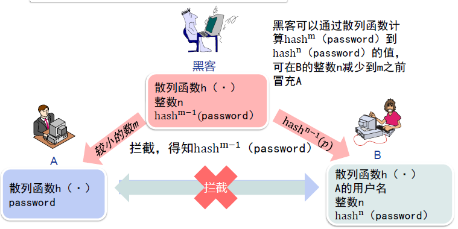
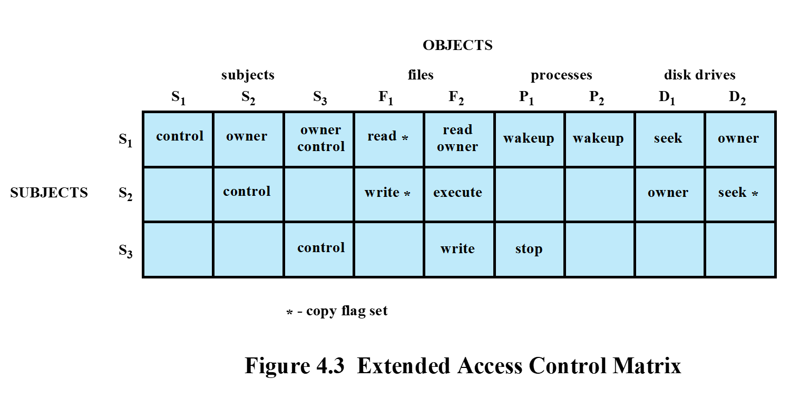

# 信息与网络安全

## 概论

### 网络安全威胁

* 恶意软件
* 安全性破坏
* DoS攻击

### 信息与网络安全目标

三个关键目标：

* 机密性
  * 数据机密性
  * 隐私性
* 完整性
  * 数据完整性
  * 系统完整性
* 可用性

### TCP/IP安全服务模型

### 网络攻击

* 主动攻击
  * 伪装
  * 重放
  * 篡改
  * 拒绝服务
* 被动攻击
  * 窃听攻击
  * 流量分析

### 五类安全服务

* 认证
* 访问控制
* 保密
* 完整性
* 不可否认

### 八类安全机制

## 数据加密技术

### 数据加密技术概述

* 密码学
* 加密系统
* 密码分析
* 加密
* 明文
* 密文
* 密钥

#### 对称密码和公钥密码

* 对称密码
  * 密钥：加密和解密密钥相同或可相互推导
  * 优点：加密速度快
  * 缺点：密钥管理复杂
* 公钥密码
  * 密钥：公钥与私钥不同且难以用私钥推导公钥
  * 优点：密钥管理简单
  * 缺点：加密速度慢

#### 对称密钥

加密和解密使用的是同样的密钥

#### 公开密钥

* 加密和解密的密钥不同
* 密钥分为公钥、私钥

#### 密码学基本原则之一

* Kerckhoffs原则：密码系统是安全的，表明可以公开除了密钥之外的整个密码系统的一切内容
* 密码系统的内部工作原理对于攻击者完全公开，唯一秘密是密钥

维护密钥成本低于维护密码算法

### 经典加密

#### 简单替换密码

改进：非常规字母表替换

破解方法一：穷举式密钥检索

破解方法二：统计字母频率

#### 双换位密码

#### 一次性密码本

$明文 \oplus 密钥=密文$

### 对称密钥加密

#### 对称密钥加密的分类

* 流密码加密—类似于一次性密码本
  * 密钥较短
  * 密钥延展成长二进制码流
  * 类似一次性密码本
* 分组密码加密—类似于电报密码本
  * 密钥决定密码本的选择
  * 电报密码本的电子版本
  * 扰乱和扩散的两个原则

#### 流密码加密

用n位长度的密钥K，并将其延展成长长的密钥流，然后该密钥流与明文P进行异或运算，生成密文C。接收方再用同样的方法解密

* A5/1算法
  * A5 / 1是用于在GSM蜂窝电话标准中提供无线通信隐私的流密码算法。
  * A5 / 1算法使用三个线性反馈移位寄存器：
    * X: 19 bits (x0,x1,x2, …,x18)
    * Y: 22 bits (y0,y1,y2, …,y21)
    * Z: 23 bits (z0,z1,z2, …,z22)
  * A5/1算法的密钥K共64位，用于三个线性反馈移位寄存器的初始填充，充当三个寄存器的初始值
  * 三个寄存器用密钥填充之后，就可以开始滚动生成密钥流了。每个回合可以拆分为三个步骤：
    * 反馈多项式（Feedback Polynomial）
      * 这里使用的是择多原则，三个寄存器中各选择一个钟控信号，19位寄存器中为第8位，22位、23位寄存器中皆为第10位。
      * 根据这三个钟控信号的取值，必定有0或1数量居多，居多的寄存器需要进行位移操作。
    * 位移
      * $m=maj(x_8,y_{10},z_{10})$
      * 需要移位的寄存器向右移位，将t填入空出来的第0位
      * if $x_8=m$，X右移，$t=x_{13} \oplus x_{16} \oplus x_{17} \oplus x_{18}$
      * if $y_{10}=m$，Y右移，$t=y_{20} \oplus y_{21}$
      * if $z_{10}=m$，Z右移，$t=z_7 \oplus z_{20} \oplus z_{21} \oplus z_{22}$
    * 取KEY
      * 取三个寄存器的最后一位，也就是19位、22位、23位，进行异或操作，得到的结果为这一轮密钥流的一位:$Keystream bit=x_{18} \oplus y_{21} \oplus z_{22}$

#### 分组密码加密

* 将明文分割成**固定长度**的分组，并生成固定长度的密文分组；
* 密文都是通过“用函数F对明文进行若干轮的**迭代**计算”得到的；
* 函数F：依赖于前一轮计算的输出和密钥K，称为**轮函数**；
* 一般用**软件**实现

##### Feistel密码

* 明文分组P被分割成左右两部分，$P=(L_0,R_0)$
* 对于每一轮i，i=1,2,3,…,n
  * $L_i=R_{i-1}$
  * $R_i=L_{i-1} \oplus F(R_{i-1},K_i)$
* 密文：$C=(L_n,R_n)$
* 解密
  * $C=(L_n,R_n)$
  * $R_{i-1}=L_i$
  * $L_{i-1}=R_i \oplus F(R_{i-1},K_i)$
  * $P=(L_0,R_0)$

##### DES

* 1970年代

* 基于IBM的Lucifer 密码

* 其争议性

  * NSA密码参与；

  * 设计过程保密；
  * 密钥长度从128位降到56位；
  * 对Lucifer 进行了一些修改。

原理

* 使用一个56 位的密钥以及附加的8 位奇偶校验位，产生最大64 位的分组大小；
* 使用Feistel技术，将加密的文本块分成两半;
* 用子密钥对其中一半应用循环功能，然后将输出与另一半进行“异或”运算；
* 接着交换这两半，这一过程会继续下去，但最后一个循环不交换。
* DES 使用16 个循环，使用异或，置换，代换，移位操作四种基本运算。
* S-box起到重要作用，每一个S-box将6个二进制位映射到4个二进制位。

##### AES

* 替代DES;
* 迭代式分组加密;
* 没有采用Feistel结构;
* 分组大小为128位;
* 三种密钥长度：128，192，256
* 依照密钥长度不同，运算轮次从10轮至14轮不等
* 每轮包含4个函数，分为3个层次
  * ByteSub(非线性层)
  * ShiftRow(线性混合层)
  * MixColumn(非线性层)
  * AddRoundKey(密钥添加层)

* 行移位

* 轮密钥合并

### 公开密钥加密

对称密钥带来的问题：

* 密钥不能公开；
* 如何安全地交换密钥
* 如何确认发送者身份

需要解决：

* 可靠密钥的传输通道问题
* 如何提供与手写签名等效的认证体系

#### 公钥加密算法

* 公钥加密算法使用两把完全不同但又是完全匹配的一对钥匙—公钥和私钥。
* 加密明文时采用公钥加密。
* 解密密文时使用私钥才能完成，只有使用匹配的一对公钥和私钥，才能完成加密和解密过程。

**公开的密钥为公钥**

**不公开的密钥为私钥**

##### 公钥加密

* 两个密钥：
  * 公钥：可为任何人知道，用来加密消息或者验证签名;
  * 私钥：只有接收者本人知道，用来解密消息和签名。
* 不对称性：
  * 用来加密消息的密钥不能用来解密消息

##### 公钥密码系统的加密原理

* 每个通信实体有一对密钥（公钥，私钥）。公钥公开，用于加密和验证签名，私钥保密，用作解密和签名
* A向B 发送消息，用B的公钥加密
* B收到密文后，用自己的私钥解密
* 任何人向B发送信息都可以使用同一个密钥（B的公钥）加密,没有其他人可以得到B的私钥，所以只有B可以解密

#### 通讯方式

##### 第一回合

* 正常情况
  * “客户”->“服务器”：你好；
  * “服务器”->“客户”：你好，我是服务器；
  * “客户”->“服务器”：我的密码是……
* 黑客入侵
  * “客户”->“服务器”：你好；
  * 黑客在“客户”和“服务器”之间的某个路由器上截获“客户”发给服务器的信息，然后自己冒充“服务器”；
  * “黑客”->“客户”：你好，我是服务器；
  * “客户”->“黑客”：我的密码是……

##### 第二回合

* “客户”->“服务器”：你好；
* “黑客”->“客户”：你好，我是服务器；
* “客户”->“黑客”：向我证明你就是服务器；
* “黑客”->“客户”：你好，我是服务器{你好，我是服务器}[？？？|RSA]。
* 黑客无法冒充，因为他不知道服务器的私钥，无法加密某个字符串后发送给客户去验证。
* “客户”：有内鬼，终止交易！

##### 第三回合

* “客户”->“服务器”：你好
* “服务器”->“客户”：你好，我是服务器
* “客户”->“服务器”：向我证明你就是服务器
* “服务器”->“客户”：你好，我是服务器{你好，我是服务器}[私钥|RSA]
* “客户”->“服务器”：{我的帐号是aaa，密码是123，把我的余额的信息发给我看看}[公钥|RSA]
* “服务器”->“客户”：{你的余额是100元}[私钥|RSA]

##### 第四回合

* “客户”->“服务器”：你好
* “服务器”->“客户”：你好，我是服务器
* “客户”->“服务器”：向我证明你就是服务器
* “服务器”->“客户”：你好，我是服务器{你好，我是服务器}[私钥|RSA]
* “客户”->“服务器”：{我们后面的通信过程，用对称加密来进行，这里是对称加密算法和密钥}[公钥|RSA]
* //红色字体的部分是对称加密的算法和密钥的具体内容，客户把它们发送给服务器。
* “服务器”->“客户”：{OK，收到！}[密钥|对称加密算法]
* “客户”->“服务器”：{我的帐号是aaa，密码是123，把我的余额的信息发给我看看}[密钥|对称加密算法]
* “服务器”->“客户”：{你的余额是100元}[密钥|对称加密算法]

#### 补充数学概念

##### 同余式

同余式是数论的基本概念之一，设m是给定的一个正整数，a、b是整数，若满足$m|(a-b)$，则称a与b对模m同余，记为$a \equiv b(\mod m)$，这个式子称为模m的同余式。

$m|(a-b)$表示m能够整除(a-b)，即$a \mod m=b \mod m$

##### 欧拉函数

欧拉函数$\varphi (n)$是小于等于n的正整数中与n互质的数的个数

对于任意互质的a和n，有$a^{\varphi (n)}\equiv 1(\mod n)$，即$a^{\varphi (n)} \mod n =1$

如果n是质数，则$\varphi (n) =n-1$，因为质数与小于它的每一个正整数都互质

如果$n=p*q$，而p和q互质，则：

$\varphi (n)=\varphi(p*q)=\varphi(p)*\varphi(q)=(p-1)(q-1)$

#### RSA

* 生成公钥/私钥对
  1. 取两个大素数p, q ($p \neq q$), 保密;
  2. 计算$n=p*q$，公开n;
  3. 计算欧拉函数$\varphi (n)=(p-1)(q-1)$；
  4. 随机选择整数e($1 \lt e \lt \varphi(n)$)，使得e和$\varphi(n)$互质即两个数的最大公约数为1；
  5. 计算d,使得$ed= 1(\mod \varphi(n))$，也就是$ed=k\varphi(n)+1$；
  6. 公开$(e,n)=(5,119)$；
  7. 将d保密，丢弃p,q
  
  $$
  m^{k(p-1)(q-1)+1} \equiv m(\mod n)
  $$
  
  $$
  m^{ed} \equiv m(\mod n)
  $$
  
* 加密消息$m$

  * 获取接收者的公钥：$K_u=\lbrace e,n \rbrace$
  * 计算：$c=m^e \mod n(0 \le m \le n)$

* 解密密文$c$

  * 使用自己的私钥：$K_R=\lbrace d,n \rbrace$
  * 计算：$m=c^d \mod n$

#### Diffie Hellman密钥交换方案

使两个用户安全地交换一个密钥以便用于以后的报文加密，这个算法本身限于**密钥交换**的用途

在Diffie-Hellman密钥交换算法中单项函数是模指数运算。它的逆过程是离散对数问题，其Diffie-Hellman算法的保密性基于求mod P解离散对数问题的困难

##### 本原元

定义素数g的本原元（primitive root）为其乘方能够产生从1到g-1的所有整数的数。也就是说，如果n是素数g的本原元，那么有下列数字：
$$
n \mod g,n^2 \mod g,n^{g-1} \mod g 
$$
这g−1个数字互不相同，而且包含了从1到g−1的所有整数

##### 离散对数

对于任何小于g的整数a和素数g的本原元n来说，能够找到唯一的指数i满足：
$$
a=b^i \mod g ,0 \le i \le (g-1)
$$
称指数i为a对于基数n和运算mod g 的离散对数

##### 密钥原理

设$g$是一个质数，$n$是$g$的本原元，要求$n$和$g$是公开的，则网络中的某一用户可以任选一个小于$g$的整数$a$作为秘密密钥

#### 椭圆曲线加密ECC

##### 椭圆曲线

已知椭圆曲线群
$$
E_p(a,b):y^2=x^3+ax+b,4a^3+27b^2 \neq 0
$$
**加法**

过曲线上的两点A、B画一条直线，找到直线与椭圆曲线的交点，交点关于x轴对称位置的点，定义为A+B，即为加法。

**取反**

将A关于x轴对称位置的点定义为-A，即椭圆曲线的正负取反运算

**二倍运算**

将过椭圆曲线在A点的切线，与椭圆曲线的交点，交点关于x轴对称位置的点，定义为A + A，即2A，即为二倍运算。

**无穷远点**

如果将A与-A相加，过A与-A的直线平行于y轴，可以认为直线与椭圆曲线相交于无穷远点

**有限域上的椭圆曲线**

已知有限域$GF(p)(p=q^n,q>3)$上的椭圆曲线群：
$$
E_p(a,b):y^2=x^3+ax+b(\mod p)
$$
有限域GF(p)指给定某个质数p，由0、1、2......p-1共p个元素组成的整数集合中定义的加减乘除运算

**有限域$GF(p)$**

Fp中有p（p为质数）个元素0,1,2,…, p-2,p-1

加法：$a+b \equiv c(\mod p)$

乘法：$a \times b \equiv c(\mod p)$

除法：$a/b \equiv c(\mod p)$

Fp单位元是1，零元是0

满足交换律、结合律、分配律

##### 加密原理

在定义了这一系列运算之后，我们可以很容易的计算出给定的G点对应的2G，3G等点。即：当给定G点时，已知x，求xG点并不困难。反之，已知xG点，求x则非常困难。此即为椭圆曲线加密算法背后的数学原理。

##### 计算及求解

计算椭圆曲线$y^2=x^3+ax+b(\mod p)$两点P，Q的和
$$
\left\{\begin{array}{c}
\mathrm{y}^2=\mathrm{x}^3+\mathrm{ax}+\mathrm{b}(\bmod \mathrm{p}) \\
\mathrm{y}-\mathrm{y}_{\mathrm{p}}=k\left(x-x_p\right) \\
k=\frac{y_q-y_p}{x_q-x_p}
\end{array}\right.
$$
计算过椭圆曲线点P的二倍点R
$$
\left\{\begin{array}{c}
x_r=\left(\frac{3 \mathrm{x}_{\mathrm{p}}^2+\mathrm{a}}{2 \mathrm{y}_{\mathrm{p}}}\right)^2-2 x_p \\
y_r=\left(\frac{3 \mathrm{x}_{\mathrm{p}}^2+\mathrm{a}}{2 \mathrm{y}_{\mathrm{p}}}\right)\left(x_p-x_r\right)-y_p
\end{array}\right.
$$

##### 准备工作

* 约定：选取$E_p(a,b)$和生成元$G$，公开
* 密钥的生成：选取私钥d,公钥为$e=dG$

##### 加密过程

* 将明文消息m通过编码嵌入到曲线上的点Pm
* 随机选取数字k，将密文$C_m=\lbrace kG,Pm+ke \rbrace$发送

##### 解密过程

* 收到密文$C_m=\lbrace kG,Pm+ke \rbrace$
* 利用自己的密钥d，计算$(Pm+ke)-dkG=Pm$

## 消息认证及数字签名

消息认证是一种允许通信者验证所收消息是否可信的措施，用于确认：

* 内容是否篡改
* 来源是否可信

### 消息认证方法

#### 散列函数

* 散列函数是一种创建数字“指纹”的方法。它把消息或数据压缩成摘要，使得数据量变小，将数据的格式固定下来
* 与消息认证码（MAC）不同的是散列函数不需要密钥输入

**变长消息->散列函数->定长摘要**

##### 单向散列函数消息认证的三种方式

###### 使用传统加密

###### 使用公钥加密

###### 使用秘密值

* 加密的散列函数，满足以下所有条件

  * 抗弱碰撞性：给定x和h(x)，要想找到任意y，满足$y \neq x$，并且h(y)=h(x)，这是不可能的
  * 抗强碰撞性：要想找到任意的x和y，使得$x \neq y$，并且h(y)=h(x)，这是不可能的

* 散列函数的工作模式

  

* 主流算法：MD5,SHA-1,SHA-2,Tiger Hash

##### MD5算法

MD5算法以一个任意长度的消息（M）作为输入，生成128位（16字节）的消息摘要作为输出，输入消息是按512位的分组处理的

#### 消息认证码

消息验证码是利用私钥产生的一小块数据，将其附到消息上，用来进行消息验证

消息认证码和散列函数区别：散列函数不需要加密，而**消息认证码是需要加密的**

假设两个通信实体（如A和B）共享一个公共密钥Kab

* 当A发消息M给B时，A计算消息认证码$MAC=F(K_{ab},M)$，并将MAC和消息一起传送给B。
* B对接收到的消息使用密钥Kab做相同运算，生成新的MAC。比较收到的MAC和计算得到的MAC

假设只有接收者和发送者知道密钥，若收到的认证码与计算得到的认证码相吻合，则可得出下列结论：

1. 接收者能够确认消息没有被篡改
2. 接收者能够确保消息来自合法的发送者
3. 如果消息中包含序列号，而攻击者不能成功地修改序列号，那么接收者就可以确认消息的正确序列

##### 基于散列函数消息认证码-HMAC

* 不改动就可以使用散列函数
* 嵌入式散列函数要有很好的可移植性
* 保持散列函数原有性能，不发生显著退化
* 使用和处理密钥简单

$$
HMAC(K,M)=H[(K^+ \oplus opad)||H[(K^+ \oplus opad)||M]]
$$
算法：

1. 在K的左端追加0，构成b比特的字符串$K^+$；
2. Ipad与$K^+$进行XOR生成b比特的分组$S_i$；
3. 将M追加在$S_i$；
4. 将H应用于步骤(3)所产生的数据流；
5. opad与$K^+$进行XOR生成b比特的分组$S_o$；
6. 将步骤(4)产生的散列结果追加在$S_o$上；
7. 将H应用于步骤6产生的数据流，输出结果；

##### 基于分组密码的MAC—CMAC

* 当消息长度是分组长度的整数倍时

  

* 当消息长度不是分组长度的整数倍时

  

### 数字签名技术

数字签名是**只有信息的发送者才能产生的别人无法伪造的一段数字串**，这段数字串同时也是对信息的发送者发送信息真实性的一个有效证明。它是一种类似写在纸上的普通的物理签名，但是在使用了公钥加密领域的技术来实现的，用于鉴别数字信息的方法

要求：

* 发方发出签名后的消息，就不能否认所签消息
* 收方能确认或证实发方的签字，但不能伪造
* 收方对已收到的消息不能否认
* 第三者可以确认收发双方之间的消息传送，但不能伪造这一过程

应具有：

* 必须能够验证签名者及其签名的日期时间
* 必须能够认证被签名消息的内容
* 签名必须能够由第三方验证，以解决争议

两类数字签名函数

* 直接数字签名
  * 仅涉及通信双方
  * 有效性依赖发方密钥的安全性
* 仲裁数字签名
  * 使用第三方认证

两种加密方法：

**利用发送方的私钥加密**

**利用发送方的私钥报文散列码加密**

## 密钥管理技术

### 基础概念

**密钥长度**与时间代价

**密钥生成**

方式一：用户自行设置，攻击者可以使用字典攻击

方式二：随机密钥，

**密钥使用**

使用软件加密

使用硬件加密

### 对称密钥的管理

**密钥分发技术**

传递密钥给希望交换数据的双方，不允许其他人看见密钥的方法

任何密码系统的强度取决于**密钥分发技术**

分发技术：

* A能够选定密钥并通过物理方法传递给B

* 第三方C可以选定密钥并通过物理方法传递给A和B

* 如果A和B不久之前使用过一个密钥，一方能够把使用旧密钥加密的新密钥传递给另一方

* A和B各自有一个到达第三方的加密链路，C能够在加密链路上传递密钥给A和B

  需要两种密钥：

  * 会话密钥，一次性会话密钥加密，会话结束销毁
  * 永久密钥，用于分发会话密钥

  需要一个**密钥分发中心KDC**

  * KDC在密钥分配过程中充当可信任的第三方
  * KDC保存有每个用户和KDC之间共享的唯一的密钥，以便进行分配
  * KDC按照需要生成各对端用户之间的会话密钥，并由用户和KDC共享的密钥进行加密，通过安全协议将会话密钥安全地传送给需要进行通信的双方

  KDC对称密钥分配方案

  A与B双方在KDC中已保存了各自的基本密钥KA和KB

  当双方进行通信前，应首先获得双方通信的会话密钥KS

  

### 公开密钥分配中心

#### 公开密钥分配方案

* 所有用户的公开密钥由KDC统一管理
* 用户只需保存自己的秘密密钥和KDC的公开密钥
* 用户可通过KDC获得任何其他用户的公开密钥

### 公钥的密钥管理

#### 网络中公钥的获得

1. 从对方处获得
2. 从可信的中央数据库获得
3. 从自己的私人数据库获得

#### 公钥证书

公钥证书又称CA证书、数字证书。它由可信赖的人或者机构(CA)签发,防止中间人攻击。

CA是负责签发证书、认证证书、管理已颁发证书的机关

**公钥证书签发**

X.509数字证书格式--V3

**公钥基础设施PKI**

PKI是生成,管理,存储,分发和吊销基于公钥密码学的公钥证书所需要的硬件,软件,人员,策略和规程的总和

**PKI基本组件**

PKI基本组件包括:注册机构RA,认证机构CA,证书库,密钥备份及恢复系统,证书撤消处理系统,PKI应用接口系统

**PKI包括的重要实体**

1. 证书权威CA：颁发证书和证书撤销链CRL
2. 注册权威RA：向CA登记或担保一个最终用户的身份
3. 证书库：存放证书和证书撤销链表CRL
4. 策略管理权威PMA
5. 终端用户EE

**PKI运行流程**

**PKI运行实例**

## 用户认证

### 用户认证基本概念

#### 用户认证功能

1. 用户通过一个凭证（例如用户ID）来向系统证明自身
2. 系统核实用户身份，并授予相应权限

#### 用户认证流程

* 识别步骤：向安全系统提供一个身份标识
* 认证步骤：提供或者产生认证信息，以证实实体与标识符之间的绑定关系

#### 用户认证与消息认证区别

* 消息认证：保证消息没有被更改且消息源真实
* 用户认证：用于系统识别用户的真实身份，同时提供给用户一个凭证

### 用户认证方法

* 基于个人所知道的信息：口令认证
* 基于个人所拥有的物品：令牌认证
* 基于个人生理特征：生物特征认证

#### 口令认证

**第一代密码**

系统数据库中存储登陆时的用户名及其对应的一个密码，使用明文存储

缺陷：数据库一旦泄露，所有用户名和密码都会泄露

**第二代密码**

在第一代密码的基础上采用散列函数加密，用户登陆时，将用户输入的密码执行加密算法后再和数据库对比

缺陷：一些简单口令仍可被破解

**第三代密码**

在第二代的基础上加入盐值；每个用户随机产生一个盐值，将密码+盐值使用散列函数加密后储存在数据库中

**盐值**：在密码任意固定位置插入的特定的字符串，让加盐后的密码进行散列运算的结果和原始密码的散列运算结果不一致

使用了盐值的UNIX口令方案

**盐值的优点**

* 即使是两个不同的用户选择了相同的口令。这些口令也会被分配不同的“盐值”；因此，这两个用户所持有的散列口令是不同的
* 它显著地增加了离线口令字典攻击的难度；对于一个b位长度的“盐值”，可能产生的口令数量将会增长2b倍，这大大增加通过字典攻击猜测口令的难度
* 它使得攻击者几乎不可能发现一个用户是否在两个或更多的系统中使用了相同的口令

#### 令牌认证

##### 静态协议

用户首先将自己与令牌绑定，再将令牌与系统用户绑定，即可通过令牌完成身份认证

##### 动态口令生成器

系统与令牌首先进行初始化并保持同步，每过一段时间令牌就会生成一段口令，该口令即可用于进行身份认证

##### 挑战-应答协议

系统产生一个“挑战信号”，智能令牌基于该信号生成一个“应答信号”，从而完成身份验证（类似公钥加密机制）

#### 生物特征认证

对于用户绑定的静态生物信息，如：面部特征，指纹，手型，视网膜模式，虹膜，签名等特征进行识别，从而完成用户认证

### 用户认证过程中的安全问题

#### 口令的脆弱性

##### 离线字典攻击

攻击者通过绕过系统的访问控制机制，从而获得对常见口令的访问权，攻击者通过将一些常用的口令进行散列之后的结果与口令文件中的散列值进行比较，匹配时攻击者便可以登录到系统中

对策：

* 修改一些不安全的口令;
* 防止非授权的对口令文件的访问；
* 使用入侵检测机制对危害系统的行为进行检测

##### 特定账户攻击

攻击者把目标锁定为一个具体的账户，不断对其口令进行猜测

对策：

* 采用账户锁定策略
* 口令尝试错误达到一定次数
* 对账户锁定

##### 常用口令攻击

用常用的口令（如123456，adminadmin）对大量的用户ID进行尝试

对策：

* 禁止用户使用常用的口令；
* 对请求者的IP地址和用户提交的cookie模式进行扫描

#### 常用攻击方式

##### 客户端攻击

在不访问远程主机的情况下，敌手伪装成一个合法用户来完成用户认证的攻击行为；
敌手可能会对口令进行多种猜解，如尝试所有可能的口令；阻止这种攻击的一种方法是选择既长又不可预测的口令（参考“口令的脆弱性”）

##### 重放攻击

攻击者发送一个目的主机已接收过的包，来达到欺骗系统的目的；
重放攻击可以由认证发起者或者拦截并重发该数据的敌方进行；攻击者利用网络监听或者其他方式盗取认证凭据，之后再把它重新发给认证服务器

##### 特洛伊木马攻击

在特洛伊木马攻击中，敌手冒充成认证服务来捕获用户口令、验证码或生物特征信息；之后，敌手可以使用捕获到的信息冒充合法用户

##### 拒绝服务攻击

拒绝服务攻击是试图通过大规模的认证请求使认证服务失效

### 基本认证方法

#### 单向认证

最简单的方式是A向B出示口令

**使用公钥的单向认证**

**使用对称加密方法的单向认证**

* A和B双方共享密钥，B向A发送一个明文R，A返回该明文对应的密文，从而确认A掌握密钥
  * 随机数据R每次不同，因此不能回放
  * A和B双方安全性相关，一方被攻破，另一方也不安全

**口令认证-Lamport散列函数**

* A存放
  * 散列函数$h(\cdot)$，用于登录B的password
* B存放
  * 散列函数$h(\cdot)$，A的用户名，整数n，将password散列n次的结果$hash^n$

* 当A需要向B作身份认证时，B返回n的当前值
* A计算$hasn^{n-1}$（password）并送给B
* B将A返回的结果$hash^{n-1}$（password）再散列一次，与当前存储的散列值（$hash^{n-1}$（password））比较
* 若鉴别成功，则将$hash^{n-1}$（password）更新为当前的散列值，且n的值减1
  * 若n递减为1，则重新设置口令

**One-Time Password方法的问题**

小数攻击

若攻击者已知散列函数$h(\cdot)$且能拦截B的信息，则他可向A返回一个很小的m值，这样就能计算出从$hash^m$（password）到$hash^n$（password）的值，从而在n减少到m前可冒充A

#### 双向鉴别

* 对称密钥
  * AB提出challenge
  * 存在桥接攻击
* 非对称密钥
  * 相互使用对方的公钥
  * 公钥的真实性问题
* 时标
  * 数据的时效性问题

##### Key Distribution Center

* 承担一个Site的密钥集中管理工作
* 减轻端系统的密钥保管负担
* 有利于用户的移动
* 容易构成安全的瓶颈
* Single Sign-On的概念

##### Needham-Schroeder方法

##### Keberos认证

整个方案就是一个可信任的第三方认证服务

要求用户调用每个服务时需要证明他的身份，并且可随意要求服务器向客户端证明它们的身份

**概述**

1. $C \to AS:ID_C||P_C||ID_V$
2. $AS \to C:Ticket$
3. $C \to V:ID_C||Ticket$

$Ticket=E(K_v,[ID_C||AD_C||ID_V])$

* C=客户端
* AS=认证服务器
* V=服务器
* $ID_C$=客户端上用户的身份标识
* $ID_V$=服务器的身份标识
* $P_C$=客户端上用户的口令
* $AD_C$=客户端的网络地址
* $K_v$=认证服务器和服务器间共享的加密密钥

**一个更加安全的认证会话**

每次用户登录会话就执行一次：

1. $C \to AS:ID_C||ID_{tgs}$
2. $AS \to C:E(K_C,Ticket_{tgs})$

每种类型的服务各执行一次：

3. $C \to TGS:ID_C||ID_V||Ticket_{tgs}$
4. $TGS \to C:Ticket_v$

每个服务会话执行一次：

5. $C \to V:ID_C||Ticket_v$

* $Ticket_{tgs}=E(K_{tgs},[ID_C||AD_C||ID_{tgs}||TS_1||Lifetime_1])$
* $Ticket_{v}=E(K_v,[ID_C||AD_C||ID_{v}||TS_2||Lifetime_2])$

**Kerberos协议**

包括客户端、应用服务器和一个Kerberos服务器

* 被设计用来对抗针对客户端/服务器对话安全的多种威胁
* 很明显的安全性风险是伪装（impersonation）
* 服务器必须能确认请求服务的客户端的身份

使用一个认证服务器(AS)

* 用户登录AS进行身份验证
* AS 验证用户的身份，然后把这个信息传送到一个应用服务器，这个应用服务器就将接受客户端的服务请求

在一种安全的方式下完成上述工作

* 如果客户端在网络上把用户口令发送到AS，敌手可以在网络上观测到用户的口令
* 敌手可以装扮成AS并发送一个假的确认消息

注意:口令是集中存在Kerberos 服务器上的,不需在网络上传输

Kerberos域

一个Kerberos环境包括:

* 一台Kerberos 服务器
* 若干客户端，都在Kerberos 服务器上注册
* 若干应用服务器，与服务器共享密钥

这种环境被称为Kerberos域

* 在不同管理组织下的客户端和服务器的网络通常组成不同的域

如果有多个域：

* 它们的Kerberos服务器必须共享一个密钥，并信任另一个域中的Kerberos服务器对其用户进行认证
* 在第二个域中参与的服务器也必须信任另一个域中Kerberos服务器

## 访问控制

### 访问控制原理

访问控制是按用户身份及其归属的某项定义组来限制用户对某些信息项的访问，或限制对某些控制功能的使用的一种技术。

**广义的访问控制**

**狭义的访问控制**

访问控制实现的安全策略：指定对于每个具体的系统资源，谁或什么(如一个进程)可以访问

每个实例允许的访问类型

### 访问控制策略

#### 访问控制三要素

#### 访问控制策略

##### 自主访问控制DAC

基于请求者的身份和访问规则（授权），规定请求者可以（或不可以）做什么。

一个实体可以被授权按其自己的意志使另一个实体能够访问某些资源。换句话说，拥有客体权限的用户，可以将该客体的权限分配给其他用户

例如：没有文件File1访问权限的用户可以从有访问权限的B 用户那里得到访问权限

DAC实现的通常方式是提供**访问矩阵**

矩阵中的每项表示一个特定主体对一个特定客体的访问权。

**稀疏-权限控制列表ACL** 不直观

**授权表**

授权表不像访问矩阵那么稀疏，但比ACL或能力表更为方便。

**一个DAC通用模型**

##### 强制访问控制MAC

通过比较具有安全许可的安全标记来控制访问。

强制访问控制模型(Mandatory Access Control),在计算机安全领域指一种由操作系统约束的访问控制

目标：限制主体或发起者访问或对对象或目标执行某种操作的能力。

主体对于对象的任何操作都将根据一组授权规则（也称策略）进行测试，由操作系统决定操作是否允许

1. 主体(Subject)被赋予一定的安全级别
2. 客体(Object)被赋予一定的安全级别
3. Subject 能否访问Object 由双方的关系安全级别决定，这个判断通常由系统硬性限制

**优点**

* 系统独立于用户行为强制执行访问控制，用户不能改变他们的安全级别或对象的安全属性。
* MAC安全性比DAC有了提高
* 非常适合机密机构或者其他等级观念强烈的行业

**缺点**

过重强调保密性，管理不够灵活

##### 基于角色的访问控制RBAC

基于用户在系统中所具有的角色和说明各种角色用户享有哪些访问权的规则来控制访问

传统的DAC系统定义了单独的用户和用户组的访问权。与之相反，RBAC基于用户在系统中设定的角色而不是用户的身份

用户与角色的关系是多对多的，在某些环境下，用户集改变频繁，给一个用户分配一个或多个角色的方案可能也是动态的。

RBAC的访问矩阵

RBAC抽象模型

会话用来定义用户与该用户被分配的一个或多个角色之间的一对多的临时关系。用户仅与完成特定任务所必需的角色建立会话。这是最小特权概念的一个实例

RBAC模型作用域

RBAC的角色层次

RBAC的约束

约束是在角色之间定义的关系或与角色相关的条件，它提供了一种令RBAC适应组织中的管理和安全策略的细节的手段。

##### 基于属性的访问控制ABAC

基于用户、被访问资源及当前环境条件来控制访问

