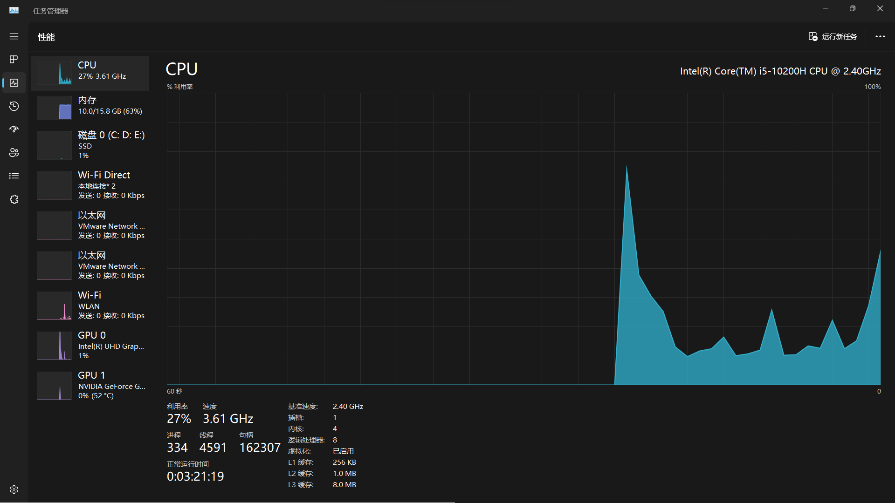

# 0905课外思考题

## 题目

调研学习Memory wall、Reliability wall、Programmability wall 以及相应的处理策略

## Memory Wall

> 在过去的20多年中，处理器的性能以每年大约55%速度快速提升，而内存性能的提升速度则只有每年10%左右。

从上面的引用中，可以看出在计算机体系结构中存在着**性能日益优越的处理器同落后内存性能之间的矛盾**。长期积累下来，不均衡的发展速度造成了当前内存的存取速度严重滞后于处理器的计算速度，内存瓶颈导致高性能处理器难以发挥出应有的功效。

由此引出定义：将严重阻碍处理器性能发挥的内存瓶颈命名为“Memory Wall”（内存墙）

### 本质问题

Memory wall的本质问题在于，**CPU的计算速度远远快于内存的读写速度**。CPU可以在一个时钟周期内执行多个指令，而内存操作通常需要数倍或数十倍的时钟周期才能完成。这就导致了CPU在**等待从内存中读取数据或将数据写入内存时**浪费了大量的时间。

### 造成后果

1. **性能下降**：当CPU需要访问内存中的数据时，它必须等待数据从内存传输到CPU寄存器或高速缓存中。这种等待会导致CPU停滞，无法执行其他计算任务，从而降低了计算机系统的整体性能。内存墙通常被认为是计算机系统中的瓶颈之一。
2. **多核加剧问题**：随着多核处理器的广泛应用，内存墙问题变得更加显著。多个CPU核心可能需要同时访问内存，导致竞争内存带宽，进一步加剧了Memory wall的效应。
3. **应用范围**：Memory wall问题对于需要大量内存访问的应用程序尤为重要，如大规模数据处理、科学计算、图像和视频处理等。这些应用需要频繁地读写大量的数据，因此更容易受到内存墙的限制。

### 解决方法

克服Memory Wall的方法可以在硬件层面和软件层面展开

* 硬件层面

  * **高速缓存层次结构**：使用高速缓存是一种有效的方法，可减少对主内存的访问次数。现代计算机通常包含多层次的高速缓存（如L1、L2和L3缓存），这些缓存存储着最常用的数据。CPU首先查找高速缓存以获取所需的数据，只有当数据不在缓存中时才会访问主内存

    

    如上图所示，笔者的笔记本电脑设置了三级缓存分别是L1 256KB、L2 1.0MB、L3 8.0MB

  * **分布式内存系统**：在集群或分布式计算环境中，使用分布式内存系统来将数据分布在多台计算机上，以提高整体内存带宽和容量。

  * **内存带宽增加**：采用更高带宽的内存技术，如DDR4、DDR5等，以提高内存访问速度。

  * **内存层次结构优化**：设计更高效的内存层次结构，包括更大的高速缓存和更高带宽的内存通道，以满足多核处理器的需求。

* 软件层面

  * **局部性优化**：设计算法和数据结构以利用局部性原则，包括时间局部性和空间局部性。时间局部性是指在不久的将来可能再次访问相同的数据，而空间局部性是指在接近的内存位置上访问数据。通过利用这些局部性，可以减少内存访问的频率。
  * **算法优化**：优化算法以减少不必要的内存访问。这包括减少数据移动、使用更紧凑的数据表示和选择更适合内存访问模式的数据结构。
  * **大页表**：使用大页表（大页面）来减少内存管理开销，从而提高内存访问效率。

## Reliability Wall

**可靠性墙**指的是在追求更高可靠性的过程中，遇到的性能、成本或其他方面的限制

也就是说，在计算机体系结构中，**存在着日益增长的可靠性需求同性能、成本之间的矛盾**

### 本质问题

可靠性墙（Reliability Wall）的本质问题在于**追求更高的系统可靠性会引入一系列挑战和限制，这些挑战和限制可能会对性能、成本、复杂性和其他因素产生影响**。

### 造成后果

* **拖累性能**

  提高系统的可靠性通常需要引入冗余组件、监控和恢复机制，以确保系统在故障情况下继续运行。然而，这些额外的措施可能会对系统性能产生负面影响

* **拉高成本**

  提高可靠性通常伴随着更高的成本。例如，**引入冗余硬件、备用电源、数据备份和定期维护**都需要额外的~~money~~

* **复杂性拉满**

  增强系统的可靠性通常需要**增加系统的复杂性**，包括引入额外的监控、故障检测和自动恢复机制；复杂性的增加可能会增加系统的管理和维护难度，也可能引入新的故障点。

* **可扩展性降低**

  随着系统规模的增加，可靠性的维护和管理变得更加复杂，相应的，可扩展性也就降低了

### 解决方法

克服Reliability Wall的根本在于**拿捏不同的应用场景中平衡点**，既满足可靠性需求，又兼顾性能、成本、复杂性，做到可靠性强、最小化性能损失、降低成本和管理复杂性。

其实首先需要考虑的是**目前所设计的系统的可靠性要求**。

不同领域对于可靠性的需求不同。例如，在医疗设备和航空航天领域，可靠性至关重要，因为故障可能导致严重的风险；然而在其他领域，如消费电子产品，可靠性需求可能较低。

针对上述可靠性的不同，在医疗设备、航空航天领域，就需要不计成本的提高可靠性；而对于消费级电子产品，从经济学的角度来说，可靠性甚至只需要达到及格水平（~~旧的不坏新的不来~~）

在提高可靠性方面有下面一些解决方法：

* **冗余设计**
  - **硬件冗余**：引入冗余组件，如冗余电源、硬盘、网络连接等，以在主要组件故障时提供备用。例如，采用热插拔硬件和热备份设备可以确保系统持续可用。
  - **软件冗余**：使用冗余软件模块或备份系统，以在软件故障时提供备用。这包括主备份服务器、容错算法等。
* **监控和自动恢复**
  - 部署监控系统来实时监测硬件和软件的状态，以及系统的性能。
  - 自动化故障检测和恢复机制，使系统能够在发生故障时自动切换到备用组件或执行恢复操作。
* **数据备份和复原**
  - 建立定期备份数据的策略，确保关键数据的完整性和可用性。
  - 测试和验证数据恢复过程，以确保在数据丢失或损坏时能够迅速进行恢复。
* **容错技术**
  - 使用容错技术，如纠错码（ECC）和磁盘阵列（RAID），以检测和纠正硬件错误或数据损坏。
  - 使用容错集群或系统，使系统在某些组件发生故障时能够继续运行。
* **定期维护**
  - 定期维护硬件和软件组件，以预防潜在问题和故障。这包括更新操作系统、补丁管理、硬件维护等。
* **故障模拟和测试**
  - 定期进行故障模拟和测试，以评估系统在不同故障情况下的表现，并发现潜在的可靠性问题。
  - 使用负载测试来模拟系统在高负载情况下的性能和可靠性。
* **可扩展性**
  - 在系统设计中考虑可扩展性，以便能够轻松地添加更多的冗余和监控组件，以满足未来的需求。
* **故障分析和持续改进**
  - 进行故障分析，以了解导致故障的根本原因，并采取措施以防止未来发生类似问题。
  - 持续改进可靠性策略和流程，以适应不断变化的威胁和需求。

当然，上面这些方法肯定各有利弊，而且成本不同、造成的性能损失不同，在上述方法中选择合适的进行组合，得到一个最优方案，是克服可靠性墙的一个可行解。

## Programmability Wall

在计算机系统中，尤其是在高性能计算领域，软件开发的复杂性会导致性能提升受到限制。随着计算机硬件不断演进和复杂化，编写能够充分利用硬件性能的软件变得更加困难，这成为了性能瓶颈。

在计算机体系结构中，存在着**日益提升的硬件性能同落后的软件开发**之间的矛盾。

### 本质问题

可编程性墙（Programmability Wall）的本质问题在于**软件开发的复杂性与硬件性能的不断提升之间存在不平衡**，这导致了性能的瓶颈。

### 产生原因

1. **硬件性能迅速提升**

   计算机硬件性能（包括CPU速度、内存容量、核心数量等）在不断提高，但软件开发的速度和复杂性也在不断增加。硬件性能的快速提升意味着计算机系统具有更多的计算能力，但软件开发没有同样的速度提高。

2. **并行性和多核挑战**

   多核处理器和分布式系统的广泛采用意味着开发人员必须编写并行化的软件来充分利用这些硬件资源。然而，并行编程比传统的串行编程更复杂，需要考虑任务划分、同步、通信等问题。

3. **性能优化困难**

   为了实现最佳性能，开发人员需要深入了解硬件架构，并进行复杂的性能优化。这包括任务调度、数据布局、负载平衡等方面的优化，这些优化往往需要大量的时间和经验。

4. **编程语言和工具限制**

   目前可用的编程语言和开发工具可能不足以充分支持高度并行化的计算。这迫使开发人员使用底层编程模型，或者编写复杂的自定义代码，增加了错误和开发成本。

5. **人才需求**

   高效的并行编程需要特定的技能和经验，这意味着寻找合格的并行编程开发人员变得更加困难，而且培训新人员需要时间。

6. **可移植性问题**

   编写并行软件时，通常会依赖于特定的硬件架构或编程模型。这可能会导致软件不易移植到其他硬件平台，限制了其可扩展性和灵活性。

7. **调试和维护复杂性**

   并行软件的调试和维护比串行软件更加复杂，因为问题可能涉及多个并发执行的线程或进程。这增加了故障排除的难度。

### 解决方法

要克服Programmability Wall（可编程性墙）问题，需要采取一系列策略和方法，以提高软件开发的效率和性能，并确保软件能够充分利用现代计算机硬件的性能潜力。

1. **高级编程语言和框架**
   - 开发更高级的编程语言和框架，使开发人员能够更容易地表达并行性和分布式计算。
   - 提供抽象层次，以隐藏底层硬件细节，使开发人员可以专注于算法和业务逻辑。
2. **自动化工具**
   - 研究和开发自动化工具，可以帮助开发人员自动并行化和优化程序，减轻手动性能优化的负担。
   - 自动化工具可以执行任务调度、数据分布和负载均衡等优化，提高了开发效率。
3. **性能分析工具**
   - 提供性能分析工具，帮助开发人员识别程序性能瓶颈和瓶颈的根本原因。
   - 这些工具可以帮助开发人员重点优化对性能影响最大的部分。
4. **并行编程模型**
   - 推广使用适合特定应用的并行编程模型，如MPI、OpenMP、CUDA、OpenCL等。
   - 提供培训和教育资源，以帮助开发人员掌握并行编程技能。
5. **培训和教育**
   - 提供广泛的教育和培训资源，以培养具备并行编程技能的开发人员。
   - 通过学术课程和行业认证来提高开发人员的并行编程能力。

