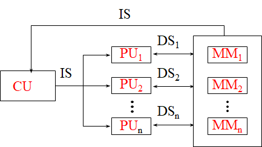
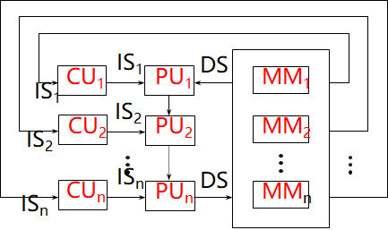
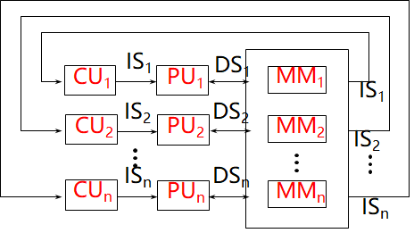

# Computer Architecture

## key

* IO原理
* 存储层次
* 流水线并行计算的原理

## 计算机系统结构概念

### 计算机系统结构

$系统效率=min(器件速度)*min(系统结构效率)$

计算机体系结构是软件设计者与硬件设备设计者（VLSI）之间的中间层，是软件与硬件的接口（Interface）

程序员可见的计算系统的属性。包括：概念性的结构和功能行为（外特性）。不包括：数据流和控制流的组织、逻辑设计以及物理实现

### 结构特性

#### 层次结构

分层带来的透明性

### 系统结构内容

指令系统、数据表示、寻址方式、寄存器组织、存储系统、终端机构、IO结构、及其工作状态定义切换、信息保护

### 计算机体系结构的分类

1. 按处理机性能分类

   * 按大小划分

     巨型、大型、中型、小型、微型机
   * 按用途划分

     **科学计算、事务处理、实时控制、工作站、服务器、家用计算机**
   * 按数据类型划分

     定点计算机、浮点计算机、向量计算机、堆栈计算机
   * 按处理机个数和种类划分

     单处理机

     并行处理机、多处理机、分布处理机

     关联处理机

     超标量处理机, 超流水线处理机, VLIW处理机

     SMP(对称多处理机)、MPP(大规模并行处理机)、机群(Cluster)系统
   * 使用器件划分

     第一代：电子管(Valve)计算机

     第二代：晶体管(Transistor)计算机

     第三代：集成电路(LSI)计算机

     第四代：大规模集成电路(VLSI)计算机

     第五代：智能计算机

2. 按“流”分类：Flynn分类法

   * 概念

     指令流（Instruction Stream）：机器执行的**指令序列**；

     数据流（Data stream）：由指令处理的**数据序列**；

     多倍性（Multiplicity）：在系统最窄的部件上，处于**同一执行阶段**的指令和数据的最大可能个数。
   * 基本模块

     MM（Memory Module）：内存模块

     PU（Process Unit）：处理单元

     CU（Control Unit）：控制单元
   * 指令流和数据流的个数

     * 单指令流单数据流SISD

       
     * 单指令流多数据流SIMD

       
     * 多指令流单数据流MISD

       

       * 没有MISD计算机的原因之一：通常PU用于处理简单数据，一般没有多个简单数据需要一组相同处理的需求，**没有存在的需求基础**
       * 没有MISD计算机的原因之二：如果把PU用于处理复杂数据（向量、矩阵等），一方面**MISD已经变成了MIMD**，另一方面，相对于**SIMD性能价格比较低**
       * 没有MISD计算机的原因之三：适合MISD实现的应用都可以使用其它结构实现，没有存在的必然性，**因为任何复杂数据都可以分解为简单数据**。
     * 多指令流多数据流MIMD

       
   * 主要缺点

     * 分类太粗
     * 把两个不同等级的功能并列对待
     * 没有非冯计算机的分类

3. 库克分类法

   按控制流和执行流分类

   * 单指令流单执行流SISE
   * 单指令流多执行流SIME

     多功能部件处理机、相联处理机、向量处理机、流水线处理机、超流水线处理机、超标量处理机、SIMD并行处理机
   * 多指令流单执行流MISE
   * 多指令流多执行流MIME

   缺点：

   有些系统如分布处理机等，没有总控制器

   分类级别太低，没有处理机级和机器级

   分类太粗，如SIME中包含了多种处理机

4. 最大并行度分类：冯氏分类法

   最大并行度$P_m$是指一个系统在单位时间内能够处理的最多的二进制位数，显然这是一个完全由计算机硬件结构决定的参数

   **最大并行度的数值越大越好**

   

   * 字串位串WSBS：n=1，m=1 全串行
   * 字并位串WPBS：n>1，m=1 并行单处理机
   * 字串位并WSBP：n=1，m>1 每处理机只一位，但有多个字处理机并行运用
   * 字并位并WPBP：n>1，m>1

   如果在一个时钟周期$\Delta t_i$内实际处理的二进制位数为$P_i$，那么在$T$个时钟周期内的平均并行度$P_a$ 就为：
   $$
   P_a=(\sum_{i=1}^T P_i)/T
   $$
   把平均并行度与最大并行度之比称为平均利用率，用$\mu$表示为：
   $$
   \mu=P_a/P_m= \frac{\sum_{i=1}^TP_i}{T \cdot P_m}
   $$

5. 按“并行集”和“流水线”分类：$Handler$表示法

   根据可并行和流水处理的程度，将硬件分成三个层次：

   * 程序控制部件（PCU）的个数$k$
   * 算术逻辑部件（ALU）或处理部件（PE）的个数$k$
   * 每个算逻部件包含基本逻辑线路（ECL）的套数$w$

   每一个计算机系统都可以用上述三个参数表示其结构特征，即：
   $$
   t(系统型号)=(k,d,w)
   $$
   更细致的表达：
   $$
   t(系统型号)=(k \times k',d \times d',w \times w')
   $$
   $k'$表示宏流水线中程序控制部件的个数；

   $d'$表示指令流水线中算术逻辑部件的个数；

   $w'$表示操作流水线中基本逻辑线路的套数

6. 按控制方式分类

   控制流方式：顺序执行（冯·诺伊曼型）

   数据流方式：操作数到位即可运算，无序执行

   规约方式：驱动方式与数据流相反

   匹配方式：非数值型应用，主要对象为符号

7. 按系统结构风格分类

   面向堆栈型、面向寄存器型、面向对象型

### 系统结构设计

#### 设计思路

1. 由上向下方法

   适合于专用机的设计，从应用到实现级，周期几年。

   缺点：当应用对象或范围变化时，效率急剧下降。

   原因：软、硬件脱节，不能利用最新的软件技术。

2. 由下向上方法

   前提：硬件不能改变。

   缺点：易形成软、硬脱节，软件不能获得最新硬件的支持，结果软件繁杂、效率低。

3. 从中间开始

   从软、硬件交界面开始设计。

   要求首先进行软、硬件功能分配，同时考虑硬件能为软件提供什么支持。

   优点：避免软、硬件脱节，设计周期短，有利于优化设计。

    缺点：对设计人员要求较高，要求具有有效的软件设计环境和开发工具，便于分析、评价和设计。

#### 设计步骤

1. 需求分析

