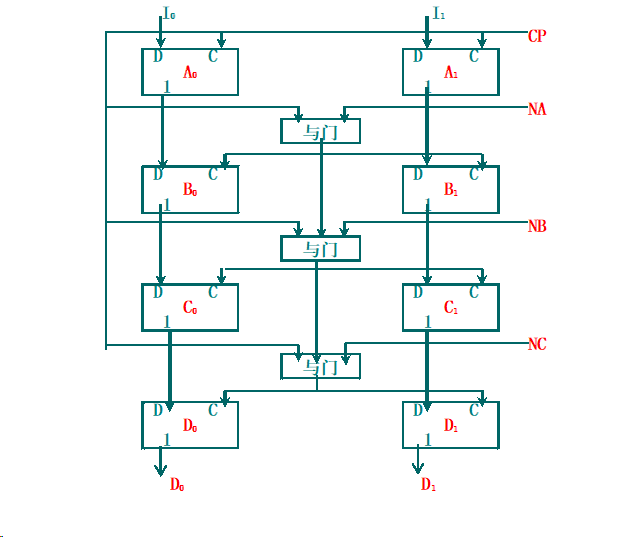

# Computer Architecture

**key**

* IO原理
* 存储层次
* 流水线并行计算的原理

## 计算机系统结构概念

### 计算机系统结构

$系统效率=min(器件速度)*min(系统结构效率)$

计算机体系结构是软件设计者与硬件设备设计者（VLSI）之间的中间层，是软件与硬件的接口（Interface）

程序员可见的计算系统的属性。包括：概念性的结构和功能行为（外特性）。不包括：数据流和控制流的组织、逻辑设计以及物理实现

#### 结构特性

##### 层次结构


分层带来的透明性

#### 系统结构内容

指令系统、数据表示、寻址方式、寄存器组织、存储系统、终端机构、IO结构、及其工作状态定义切换、信息保护

#### 计算机体系结构的分类

1. 按处理机性能分类

   * 按大小划分

     巨型、大型、中型、小型、微型机
   * 按用途划分

     **科学计算、事务处理、实时控制、工作站、服务器、家用计算机**
   * 按数据类型划分

     定点计算机、浮点计算机、向量计算机、堆栈计算机
   * 按处理机个数和种类划分

     单处理机

     并行处理机、多处理机、分布处理机

     关联处理机

     超标量处理机, 超流水线处理机, VLIW处理机

     SMP(对称多处理机)、MPP(大规模并行处理机)、机群(Cluster)系统
   * 使用器件划分

     第一代：电子管(Valve)计算机

     第二代：晶体管(Transistor)计算机

     第三代：集成电路(LSI)计算机

     第四代：大规模集成电路(VLSI)计算机

     第五代：智能计算机

2. 按“流”分类：Flynn分类法

   * 概念

     指令流（Instruction Stream）：机器执行的**指令序列**；

     数据流（Data stream）：由指令处理的**数据序列**；

     多倍性（Multiplicity）：在系统最窄的部件上，处于**同一执行阶段**的指令和数据的最大可能个数。
   * 基本模块

     MM（Memory Module）：内存模块

     PU（Process Unit）：处理单元

     CU（Control Unit）：控制单元
   * 指令流和数据流的个数

     * 单指令流单数据流SISD

       
     * 单指令流多数据流SIMD

       
     * 多指令流单数据流MISD

       

       * 没有MISD计算机的原因之一：通常PU用于处理简单数据，一般没有多个简单数据需要一组相同处理的需求，**没有存在的需求基础**
       * 没有MISD计算机的原因之二：如果把PU用于处理复杂数据（向量、矩阵等），一方面**MISD已经变成了MIMD**，另一方面，相对于**SIMD性能价格比较低**
       * 没有MISD计算机的原因之三：适合MISD实现的应用都可以使用其它结构实现，没有存在的必然性，**因为任何复杂数据都可以分解为简单数据**。
     * 多指令流多数据流MIMD

       
   * 主要缺点

     * 分类太粗
     * 把两个不同等级的功能并列对待
     * 没有非冯计算机的分类

3. 库克分类法

   按控制流和执行流分类

   * 单指令流单执行流SISE
   * 单指令流多执行流SIME

     多功能部件处理机、相联处理机、向量处理机、流水线处理机、超流水线处理机、超标量处理机、SIMD并行处理机
   * 多指令流单执行流MISE
   * 多指令流多执行流MIME

   缺点：

   有些系统如分布处理机等，没有总控制器

   分类级别太低，没有处理机级和机器级

   分类太粗，如SIME中包含了多种处理机

4. 最大并行度分类：冯氏分类法

   最大并行度$P_m$是指一个系统在单位时间内能够处理的最多的二进制位数，显然这是一个完全由计算机硬件结构决定的参数

   **最大并行度的数值越大越好**

   

   * 字串位串WSBS：n=1，m=1 全串行
   * 字并位串WPBS：n>1，m=1 并行单处理机
   * 字串位并WSBP：n=1，m>1 每处理机只一位，但有多个字处理机并行运用
   * 字并位并WPBP：n>1，m>1

   如果在一个时钟周期$\Delta t_i$内实际处理的二进制位数为$P_i$，那么在$T$个时钟周期内的平均并行度$P_a$ 就为：
   $$
   P_a=(\sum_{i=1}^T P_i)/T
   $$
   把平均并行度与最大并行度之比称为平均利用率，用$\mu$表示为：
   $$
   \mu=P_a/P_m= \frac{\sum_{i=1}^TP_i}{T \cdot P_m}
   $$

5. 按“并行集”和“流水线”分类：$Handler$表示法

   根据可并行和流水处理的程度，将硬件分成三个层次：

   * 程序控制部件（PCU）的个数$k$
   * 算术逻辑部件（ALU）或处理部件（PE）的个数$k$
   * 每个算逻部件包含基本逻辑线路（ECL）的套数$w$

   每一个计算机系统都可以用上述三个参数表示其结构特征，即：
   $$
   t(系统型号)=(k,d,w)
   $$
   更细致的表达：
   $$
   t(系统型号)=(k \times k',d \times d',w \times w')
   $$
   $k'$表示宏流水线中程序控制部件的个数；

   $d'$表示指令流水线中算术逻辑部件的个数；

   $w'$表示操作流水线中基本逻辑线路的套数

6. 按控制方式分类

   控制流方式：顺序执行（冯·诺伊曼型）

   数据流方式：操作数到位即可运算，无序执行

   规约方式：驱动方式与数据流相反

   匹配方式：非数值型应用，主要对象为符号

7. 按系统结构风格分类

   面向堆栈型、面向寄存器型、面向对象型

### 系统结构设计

#### 设计思路

1. 由上向下方法

   适合于专用机的设计，从应用到实现级，周期几年。

   缺点：当应用对象或范围变化时，效率急剧下降。

   原因：软、硬件脱节，不能利用最新的软件技术。

2. 由下向上方法

   前提：硬件不能改变。

   缺点：易形成软、硬脱节，软件不能获得最新硬件的支持，结果软件繁杂、效率低。

3. 从中间开始

   从软、硬件交界面开始设计。

   要求首先进行软、硬件功能分配，同时考虑硬件能为软件提供什么支持。

   优点：避免软、硬件脱节，设计周期短，有利于优化设计。

    缺点：对设计人员要求较高，要求具有有效的软件设计环境和开发工具，便于分析、评价和设计。

#### 设计步骤

1. 需求分析
2. 需求说明
3. 概念性设计
4. 具体设计
5. 反复进行优化设计及评价

#### 量化规则

* 抽象以简化设计

* 冗余redundancy以增强独立性

* 并行

  * pipelining

  * powerful instructions

    * MD-technique

      multiple data operands per operation

    * MO-technique

      multiple operations per instruction

  * Multiple instruction issue

    * single instruction-program stream
    * multiple streams

* 关注common case

  * Favor the frequent case over the infrequent case

  * Frequent case is often simpler and can be done faster than the infrequent case

  * Amdahl's Law

    $Speedup(E)=\frac{Execution\_Time\_Without\_enhancement}{Execution\_Time\_With\_enhancement}$

    $Speedup_{overall}=\frac{ExTime_{old}}{ExTime_{new}}=\frac{1}{(1-Fraction_{enhanced})+\frac{Fraction_{enhanced}}{Speedup_{enhanced}}}$

    * 减小CPI×
    * 将CPU的流水线条数增加为n条×
    * 设计专门的多媒体指令及处理硬件

  * Gustafson's law

    $Speedup=P-f_{seq}(P-1)$

* 局部性原理

  * temporal locality
  * spatial locality

* [Performance Equation](https://cseweb.ucsd.edu/classes/sp14/cse141-a/Slides/02_performance_annotated-0417.pdf)

  * $CPU\ Time=\frac{CPU\ clock\ cycles\ for\ a\ program}{Clock\ rate}$
  * $CPI=\frac{CPU\ clock\ cycles\ for\ a\ program}{IC}$
  * $Instruction\ Count:IC$
  * $CPU=\frac{IC \times CPI}{Clockrate}$

存储层级结构


#### 软硬件取舍原则

1. 现有软、硬件条件下，选择能够提高系统性能/价格的方法；
2. 考虑到准备采用和可能采用的组成技术，所选方法能否尽量不限制组成和实现技术
3. 不能仅从“硬”的角度去考虑如何便于应用组成技术的成果和发挥器件技术的进展，还应考虑所选方法能否从“软”的角度为编译和操作系统的实现，以至高级语言程序的设计提供更多更好的硬件支持

### 计算机性能标准

计算机性能：正确性、可靠性和工作能力

评价性能：仅指工作能力

工作能力指标：

* 处理能力—单位时间内能处理的信息量(吞吐率)
* 响应能力—响应时间、周转时间、排队时间
* 利用率—T时间内，某部分被使用时间t与T的比值

#### CPU能力

##### 硬件连接能力

速度指标

CPU通过在引脚上设置数据、地址和控制总线实现与外部电路的连接，这种能力的强弱常用数据总线带宽，即单位时间内传输的数据量来表示。这是一个速度指标

地址总线的宽度可以衡量CPU支持的容量指标。
控制总线的数量、性质可以衡量CPU的功能、可靠性、可扩展性等指标，但表达可能比较复杂。

1. 数据带宽
   * CPU引脚中数据总线的宽度乘以总线传输速率得到数据带宽。（注意，由CPU、系统总线共同决定）
   * 例如，数据总线的传输速率为266 MHz，总线的宽度为32位（4字节），那么该数据总线的带宽就达到2.1GB/s（266MHz×4B）。显然，数据总线带宽越宽，表明该处理机对其他部件的读写速度越快。    
   * 体系结构改善：提高总线传输速率、增加总线宽度，相应的增加成本。
2. CPU与Cache连接方式
   * 随着处理机工作速率的提高，采用Cache（高速缓冲存储器）是提高CPU工作效率的必备措施，而与Cache的连接方式也成为考察处理机连接能力的又一个重要方面
   * CPU在片内连接Cache比在片外连接Cache具有更高的速度指标
   * CPU与Cache之间的数据通道越多，则速度越快。
   * 一级CACHE集成在CPU同一芯片内
   * 二级一般也在CPU同一芯片内(全速CACHE),有的在芯片外,但与CPU 在同一专用板上且有专门通道与CPU相连。
   * 有的CPU还提供专门通道连结第三级CACHE
   * 体系结构改善：为CACHE设计足够宽的通道、尽量把Cache设计在CPU芯片内，但是这会相应增加制造难度和成本

##### 管理能力

可靠性、速度、容量、可扩展性、性能价格比

* 可靠性：多道作业管理
* 速度：Cache寻址，中断管理
* 容量：虚拟存储器寻址
* 可扩展性：中断管理
* 性能价格比：操作系统中某些软件功能放在硬件中实现，提高系统整体的性能价格比。

**CPU PE**

假定通过许多程序的统计，得知第$i$类指令的使用概率为$P_i$，而执行该类指令所需的时钟周期数为$CPI_i$，而全部指令的类别数为$n$，该处理机的统计平均$CPI$就为
$$
CPI=\sum_{i=1}^n(CPI_i \times P_i)
$$
减小平均CPI,减小频繁使用指令的CPI,大概率事件优先原则的应用

系统响应能力能反映计算机系统的软、硬件性能

不能仅用计算机主频衡量系统性能

#### 系统运行速度/处理能力

##### MIPS\MFLOPS

以计算机系统整体作为一个被评估的模块，CPI显然是不合适的

用MIPS和MFLOPS反映系统（CPU）吞吐率。
$$
MIPS=\frac{IC}{Time*10^6}=\frac{Frequency}{CPI*10^6}
$$

$$
MFLOPS=\frac{FP\ Operations}{Time*10^6}
$$

$$
1MFLOPS \approx3MIPS
$$

##### 基准测试

基准测试程序通常用高级语言编写，由各系统自带的编译程序编译成适合在本机中运行的机器码，记下各程序运行所花费的时间，然后按一定的规则计算其执行时间。

1. spec
   $$
   SPEC=\sqrt[n]{\prod_{i=1}^n SPEC_i}
   $$

2. icomp

#### 利用率

虽不直接表示系统性能指标，但与前两种指标有密切关系。对系统性能或结构改进与优化起着至关重要的作用

利用阿姆达尔定律和程序局部性原理改进来提高部件利用率

#### 性能评价技术

1. 分析技术

   近似求解算法：聚合法、均值分析法、扩散法

2. 模拟技术

   设计模拟实验，依照评价目标，选择与目标有关因素，得出实验值，再进行统计、分析

3. 测量技术

#### 多机系统性能评价

除采用单机的评价方法外，还需测试系统的性能加速比和性能可伸缩性值

1. 性能加速比

   $S(p,n)=\frac{T(p,1)}{T(p,n)+h(p,n)}$

2. 性能可伸缩性

#### 计算机成本与价格

### 计算机系统结构发展

#### 冯诺依曼机系统结构演变

运算器、控制器、存储器、IO设备


#### 软件、应用和器件对系统结构的影响

##### 软件对系统结构发展的影响

主要体现在软件可移植性问题

1. 统一高级语言方法
2. 系列机思想


软件兼容种类：向上/下、向前/后兼容

系列机要求：保证向后兼容，力争向上兼容

3. 模拟与仿真
4. 目标代码的并行编译技术

软件是促使计算机系统结构发展最重要的因素。

##### 应用对系统结构发展的影响

* 应用要求：高速度、大容量、大吞吐率
* 应用场合：大、中、小、巨、微型机

##### 器件对系统结构发展的影响

器件的性能、使用方法改变、影响系统结构及组成方法

## 指令系统

An Instruction Set provides a functional description of a processor

* a detailed list of the **instructions** that the processor is capable of processing
* a description of the types/locations/access methods for **operands**

### Data Representation

#### 数据类型

定义：具有一组值的集合，且定义了作用于该集合的操作集。

目的：防止不同类型数据间的误操作。

分类：基本类型、结构类型。

#### 基本数据类型

内容：二进制位、二进制位串、整数、十进制数、浮点数、字符、布尔数等

所有系统结构都支持基本数据类型

#### 结构数据类型

定义：由一组相互有关的数据元素复合而成的数据类型。

分类：系统数据类型、用户自定义数据类型。

内容：数组、字符串、向量、堆栈、队列、记录等


#### 引入数据表示的规则

1. whether the systematic effectiveness is improved
2. whether that data representation commonality and utilization ratio is enough 

#### Self-defining data representation 

The **feasible quality analysis**:

* whether the dedicated space improves 

  通常面积B>面积A

  

* whether realization time to decrease 

* commonality and the utilization ratio 


1. Data representation including tag

   

   与数据相连，共存于同一存储单元中，是数据的一部分

   **advantages**

   * Simplify the instruction set
   * chieve consistency check and the data form transformation through hardware
   * Simplify programming，Semantic disparity lessening between human and the machinery
   * Simplify compiler，The semantic disparity between high-quality language together with the machine language cuts down enormously
   * Support data base system，software can be applicable to much kinds of data type with no modification
   * Convenient software debugging，every data includes a trap bit

   **defects**

   * The length of data and instruction is probably not the same 
   * The execution speed of instruction decreases 。The design time 、Compilation time and debugging time of program be shortened.
   * Increasing The hardware complexity 

2. Data descriptor representation

   与数据分开，增加一级寻址，是程序的一部分

   

   

### Instruction set

* The complete collection of instructions that are understood by a CPU
* Machine Code
* Binary
* Usually represented by assembly codes

#### Elements of an Instruction

* Operation code (Op code)
  * Do this
* Source Operand reference
  * To this
* Result Operand reference
  * Put the answer here
* Next Instruction Reference
  * When you have done that, do this...

#### Instruction Cycle State Diagram


#### Instruction Representation

##### Instruction Types

* Data processing
* Data storage (main memory)
* Data movement (I/O)
* Program flow control 

##### Number of Addresses

* 3 addresses
  * op1,op2,result
  * c=a+b
* 2 addresses
  * op1,op2
  * a=a+b
* 1 address
  * Implicit second address
* 0 address
  * use a stack
  * push a
  * push b
  * add
  * pop c

##### Design Decisions

* Operation decisions
  * number of ops
  * op's functions
  * complexity
* Data types
* Instruction formats
  * Length of op code field
  * Number of addresses
* Registers
* Addressing modes
* RISC vs CISC

##### Simple Instruction Format


##### Operands类型、表示和大小

**常用操作数类型**

* ASCII character = 1 byte (64-bit register can store 8 characters
* Unicode character or Short integer = 2 bytes = 16 bits （half word) 
* Integer = 4 bytes = 32 bits (word size on many RISC Processors)
* Single-precision float = 4 bytes = 32 bits (word size)
* Long integer = 8 bytes = 64 bits (double word)
* Double-precision float = 8 bytes = 64 bits (double word)
* Extended-precision float = 10 bytes = 80 bits (Intel architecture)
* Quad-precision float = 16 bytes = 128 bits

##### 寻址方式


重要的寻址方式：

* 偏移寻址
* 立即数寻址方式
* 寄存器间址方式

偏移字段的大小应该在12-16bits，满足75%-99%需求

立即数字段的大小应该在8-16bits，满足50%-80%需求

##### Types of Operation

* Data Transfer
* Arithmetic
* Logical
* Conversion
* I/O
* System Control
* Transfer of Control

##### 指令集结构分类

###### 分类准则

1. 根据CPU中操作数的存储方法分类；（主要分类准则）
2. 根据指令中显式操作数个数分类；
3. 根据操作数能否放在存储器中分类

指令集划分成堆栈、累加器、寄存器型三类。目前，指令系统则为三种中某些类型的混合型

### Addressing mode

重点是寻址方式的选择方法

80年以来几乎所有机器的存储器都是**按字节编址**

不同体系结构对字的定义是不同的

#### 尾端问题

* little endian
* big endian


#### 对齐问题

* 对s字节的对象访问地址为A，如果A mod s =0 称为边界对齐。
* 边界对齐的原因是存储器本身读写的要求，存储器本身读写通常就是边界对齐的，对于不是边界对齐的对象的访问可能要导致存储器的两次访问，然后再拼接出所需要的数。（或发生异常）

#### 编址方式

##### 编址单位

常见编址单位有：word、byte、bit、block

一般：字节编址，字访问

部分机器：位编址，字访问

辅助存储器：块编址

##### 零地址空间

* 三个零地址空间：通用寄存器、主存储器和输入输出设备均独立编址
* 两个零地址空间：主存储器与输入输出设备统一编址
* 一个零地址空间：所有存储设备统一编址，最低端是通用寄存器，最高端是输入输出设备，中间为主存储器
* 隐含编址方式，实际上没有零地址空间：堆栈、Cache

##### 对于IO设备

* 一地址一设备：必须通过指令中的操作码来识别该输入输出设备上的有关寄存器
* 两地址一设备：一个地址是数据寄存器，一个地址是状态/控制寄存器
* 多地址一设备：对编程增加困难，常用于主存和输入输出设备统一编址的计算机系统

##### 对于并行存储

* 高位交叉编址：扩大存储器容量
* 低位交叉编址：提高存储器速度

[高位交叉和低位交叉](https://zhuanlan.zhihu.com/p/48014084#:~:text=高位交叉编址 当程序按体内地址顺序存放，即一个体存满之后，再存入下一个体时，这种方式称为 顺序存储 ，高位地址表示题号，低位表示体内地址（注意0 1 2 3....的顺序是从上往下的）： 因此，CPU给出一次存储访问总是对一块连续的存储单元进行的，在多CPU系统中，不同的CPU访问不同的存储块，达到并行工作。,低位交叉编址 对应于高位交叉编址，低位交叉编址指的是将程序连续存放在相邻体中，又称 交叉存储 。 （注意，0 1 2 3的顺序是从左往右的）)

#### 寻址方式

##### 立即数寻址方式

用于数据比较短、源操作数

##### 面向寄存器的寻址方式

##### 面向主存储器的寻址方式

#### 指令格式

Many computers support more than a single format for instructions

##### 指令长度

影响因素

* 存储器规模
* 存储器架构
* 总线结构
* CPU复杂度
* CPU速度

##### 位分配

* Number of addressing modes
* Number of operands
* Register versus memory
* Number of register sets
* Address range
* Address granularity

##### 指令格式设计

[计算机组成原理——指令格式设计_指令中的地址码字段有多少位_花生酱拌面的博客-CSDN博客](https://blog.csdn.net/m0_56561130/article/details/118516188)

##### Locating modes

* Locating directly
* locating statically
* locating dynamically

### 优化指令格式

three approaches

**fixed length**，**Huffman coding**，**extending coding**

[系统结构-2-3指令操作码的优化:哈夫曼编码_哈夫曼扩展编码规则_哑巴湖小水怪的博客-CSDN博客](https://blog.csdn.net/changhuzichangchang/article/details/119187648)

#### Huffman编码法

和数据结构中所学的huffman树没有区别

例

7种指令使用频率分别为0.4、0.26、0.15、0.06、0.05、0.04、0.04，要求对每种指令进行操作码编码


#### huffman的扩展方法

##### 等长扩展

##### 不等长扩展

### 编译器优化

[编译器常用的8种优化方法 - 知乎 (zhihu.com)](https://zhuanlan.zhihu.com/p/381490718)

[编译器 - 什么是优化编译器 - 知乎 (zhihu.com)](https://zhuanlan.zhihu.com/p/521319009)

[编译器技术_ronnie88597的博客-CSDN博客](https://blog.csdn.net/weixin_46222091/category_9729419.html)


#### 高层次

done at or near source code level方法内联

* If procedure is called only once, put it in-line and save CALL
* more general case: if call-count < some threshold, put them in-line

#### 局部

done within straight-line code

* common sub-expressions produce same value – either allocate a register or replace with single copy公共子表达式消除
* constant propagation – replace constant valued variable with the constant常量传播
* stack height reduction – re-arrange expression tree to minimize temporary storage needs

#### 全局

across a branch

* copy propagation – replace all instances of a variable *A* that has been assigned *X* (i.e., *A=X*) with *X*. 复写传播

* code motion – remove code from a loop that computes same value each iteration of the loop and put it before the loop代码移动

  [编译器优化--6--代码移动_编译原理 代码移动-CSDN博客](https://blog.csdn.net/weixin_46222091/article/details/104743294)

* simplify or eliminate array addressing calculations in loops

#### Machine-dependent optimizations

based on machine knowledge

* strength reduction – replace multiply by a constant with shifts and adds
  * would make sense if there was no hardware support for MUL
  * a trickier version: $17 \times$= arithmetic left shift 4 and add
* pipelining scheduling – reorder instructions to improve pipeline performance
  * dependency analysis
* branch offset optimization - reorder code to minimize branch offsets

### Compiler techniques for exposing ILP

#### The impact of compiler technology

Three separate areas for data allocation

* Stack
  * Used to allocate **local variables**
  * Grown and shrunk on calls and returns
  * Addressing is relative to the **stack pointer**

* Global data area 
  * Used to allocate **statically declared objects**, such as **global variables and constants**
  * A large percentage of these objects are aggregate data structures such as arrays

* Heap
  * Used to allocate **dynamic objects**
  * Access are usually by pointers 
  * Data is typically not scalars (single variables)

#### Register Allocation Problem

* Reasonably simple for stack-allocated objects
  * Done with the graph coloring theory: variable – vertex; dependency between variables – edge; # register will be equal to # colors
* Essentially impossible for heap-allocated objects because they are accessed with pointers
* Hard for global variables and some static variables due to *aliasing* opportunity
  * There are multiple ways to refer to the address of a variable *b*

#### solution

* Regularity
  * Addressing modes, operations, and data types should be independent of each other

* Provide primitives, not solution
  * What works in one language may be detrimental to others, so don’t optimize for one particular language

* Simplify trade-offs among alternatives
  * Anything that makes code sequence performance obvious is a definite win!

* Provide instructions that bind the quantities known at compile time as constants

### Instruction Level Parallelism

Exploit ILP across multiple basic blocks

[ILP——指令级并行 - 知乎 (zhihu.com)](https://zhuanlan.zhihu.com/p/55663009)

Instruction independency is the key requirement for the transformations

1. Eliminating Name Dependences

   

2. Eliminating Control Dependences

   

3. Eliminating Data Dependences

   

4. Alleviating Data Dependencies

   

#### Loop-level Parallelism

#### software pipelining

#### Trace Selection

### 指令系统的功能设计

**指令系统的完整性、规整性、高效率和兼容性**

* 完整性 是指应该具备的基本指令种类，通用计算机必须有５类基本指令

* 规整性 包括对称性和均匀性
* 对称性：所有寄存器同等对待，操作码的设置等都要对称，如：A－B与B－A
* 均匀性：不同的数据类型、字长、存储设备、操作种类要设置相同的指令
* 高效率：指令的执行速度要快；指令的使用频度要高；各类指令之间要有一定的比例
* 兼容性：在同一系列机内指令系统不变（可以适当增加）

#### CISC

(Complex Instruction Set Computer)	

增强指令功能，设置功能复杂的指令	

面向目标代码、高级语言和操作系统	

用一条指令代替一串指令

#### RISC

(Reduced Instruction Set Computer)	

只保留功能简单的指令	

功能较复杂的指令用子程序来实现

* 延时转移技术
* 指令取消技术
* 重叠寄存器窗口技术
* 指令流调整技术
* 以硬件为主固件为辅

## 存储系统

### 存储系统原理


#### 存储系统的定义

* 两个或两个以上速度、容量和价格各不相同的存储器用硬件、软件、或软件与硬件相结合的方法连接起来成为一个存储系统。
* 这个存储系统对应用程序员是透明的，并且，从应用程序员看，它是一个存储器，这个存储器的速度接近速度最快的那个存储器，存储容量与容量最大的那个存储器相等，单位容量的价格接近最便宜的那个存储器。
* 虚拟存储器系统：对应用程序员透明
* Cache存储系统：对系统程序员以上均透明


**虚拟存储系统**

由主存储器和硬盘构成

主要目的：扩大存储器容量


**存储系统的容量**

* 要求：

  * 提供尽可能大的地址空间

  * 能够随机访问

* 方法有两种：

  * 只对系统中存储容量最大的那个存储器进行编址，其他存储器只在内部编址或不编址。

  * Cache存储系统。

* 另外设计一个容量很大的逻辑地址空间，把相关存储器都映射这个地址空间中。

  * 虚拟存储系统。

**存储系统的价格**


$$
C=\frac{C_1 \cdot S_1+C_2 \cdot S_2}{S_1+S_2}
$$
**存储系统的速度**


提高存储系统速度的两条途径：

* 提高命中率H。
  * 采用预取技术提高命中率
    * 方法：不命中时，把M2存储器中相邻多个单元组成的一个数据块取出来送入M1存储器中。
    * 计算公式$H^{\prime}=\frac{H+n-1}n$
    * 其中：H’是采用预取技术之后的命中率
    * H是原来的命中率
    * n为数据块大小与数据重复使用次数的乘积
* 两个存储器的速度不要相差太大。
* 其中：第二条有时做不到(如虚拟存储器)，这时，只能依靠提高命中率。

**存储系统的访问效率**
$$
e=\frac{T_1}{T}=\frac{T_1}{H\cdot T_1+(1-H)\cdot T_2}=\frac{1}{H+(1-H)\cdot\frac{T_2}{T_1}}=f(H,\frac{T_2}{T_1})
$$
访问效率主要与命中率和两级存储器的速度之比有关

**内存**

* RAM

  * DRAM

    

  * Cache-SRAM (static RAM) made up of flip-flops (like Registers)

* ROM
  * PROM
  * EPROM
  * EEPROM

**外存**

* Magnetic Disk

  * RAID

  * Removable

* Solid State Drive (nowadays)

* Optical

  * CD-ROM
  * CD-Recordable (CD-R)

  * CD-R/W

  * DVD

* Magnetic Tape

**主要性能**

存储器的主要性能：速度、容量、价格。

* 速度用存储器的访问周期、读出时间、频带宽度等表示。
* 容量用字节B、千字节KB、兆字节MB和千兆字节GB等单位表示。
* 价格用单位容量的价格表示，例如：$C/bit。
* 组成存储系统的关键：把速度、容量和价格不同的多个物理存储器组织成一个存储器，这个存储器的速度最快，存储容量最大，单位容量的价格最便宜。

#### 存储系统的层次结构


存储层次工作原理：**Locality**

* 应用程序局部性原理: 给用户

  * 一个采用低成本技术达到的存储容量. （容量大，价格低）

  * 一个采用高速存储技术达到的访问速度.（速度快）

* Temporal Locality (时间局部性):

  * =>保持最近访问的数据项最接近微处理器

* Spatial Locality (空间局部性):

  * 以由地址连续的若干个字构成的块为单位，从低层复制到上一层


#### 存储系统的频带平衡

解决存储器频带平衡方法

* 多个存储器并行工作
* 设置各种缓冲存储器
* 采用存储系统

#### 并行访问存储器


#### 交叉访问存储器

[多体并行：高位/低位交叉编址-CSDN博客](https://blog.csdn.net/nuo_Shar/article/details/79048019)

##### 高位交叉访问存储器

* 主要目的：扩大存储器容量
* 实现方法：用地址码的高位部分区分存储体号
* 参数计算方法:
  * m: 每个存储体的容量， 
  * n: 总共的存储体个数， 
  * j: 存储体的体内地址，$\mathrm{j= 0, 1, 2, ..., m- 1}$
  * k: 存储体的体号，k=0, 1, 2, .., n-1
  * 存储器A的地址： $\mathbf{A}=\mathbf{m}\times\mathbf{k}+\mathbf{j}$
  * 存储器的体内地址： $\mathbf{A_i}=\mathbf{A}$ mod m
  * 存储器的体号$\quad\mathbf{A_k}=\left\lfloor\frac Am\right\rfloor$

##### 低位交叉访问存储器

* 主要目的：提高存储器访问速度
* 实现方法：用地址码的低位部分区分存储体号
* 参数计算:
  * m: 每个存储体的容量， 
  * n: 总共的存储体个数， 
  * j: 存储体的体内地址，$\mathrm{j= 0, 1, 2, ..., m- 1}$
  * k: 存储体的体号，k=0, 1, 2, .., n-1
  * 存储器A的地址： $\mathbf{A}=\mathbf{n}\times\mathbf{j}+\mathbf{k}$
  * 存储器的体内地址:$\quad\mathbf{A_j}=\left\lfloor\frac An\right\rfloor$
  * 存储器的体号:$A_k=A \mod n$

* n个存储体分时启动
  * 一种采用流水线方式工作的并行存储器
  * 每个存储体的启动间隔为$t=\left\lfloor\frac{Tm}n\right\rfloor$
  * 其中： 
  * Tm为每个存储体的访问周期
  * n为存储体个数


#### 无冲突访问存储器

### 虚拟存储器

#### 虚拟存储器工作原理

把主存储器、磁盘存储器和虚拟存储器都划分成固定大小的页

* 主存储器的页称为实页
* 虚拟存储器中的页称为虚页


[深入理解虚拟存储器（1:虚拟存储器概念与工作原理）-CSDN博客](https://blog.csdn.net/github_33873969/article/details/78460522)

#### 地址的映像和变换方法

三种地址空间

* 虚拟地址空间
* 主存储器地址空间
* 辅助地址空间

地址映像

把虚拟地址空间映象到主存地址空间

地址变换

在程序运行时，把虚地址变换成主存实地址

三种虚拟存储器

* 段式虚拟存储器

  **地址映象方法**：每个程序段都从0地址开始编址，长度可长可短，可以在程序执行过程中动态改变程序段的长度

  

  **地址变换方法**：由用户号找到基址寄存器，读出段表起始地址，与虚地址中段号相加得到段表地址，把段表中的起始地址与段内偏移D相加就能得到主存实地址

  

  段表中的段长和访问方式用来保护程序段

  * 可以根据程序段的**起始地址**和**段长**计算出本次访问主存储器的地址是否越界。

  * 访问方式可以指出本程序段是否需要保护和保护的级别。

  * 装入位如果表明该程序段不在主存中，段表的起始地址和访问方式字段可以用来存放该程序段在磁盘存储器中的起始地址，便于从磁盘把信息读到主存。

  外部碎片的消除

  * compaction

    Moving segments closer to zero to eliminate wasted space

    

  * fit segments in existing holes

    [动态分区分配算法(First Fit，Next Fit，Best Fit，Worst Fit)-CSDN博客](https://blog.csdn.net/weixin_43886592/article/details/107581653)

    * Maintain a list of Addresses & Hole Size
    * algorithms
      * best fit: choose smallest hole
      * FIRST FIT: scan circularly & choose which fits first.

  主要优点

  * 程序的模块化性能好
  * 便于程序和数据的共享
  * 程序的动态链接和调度比较容易
  * 便于实现信息保护

  主要缺点

  * 地址变换所花费的时间长，两次加法。
  * 主存储器的利用率往往比较低。
  * 对辅存（磁盘存储器）的管理比较困难

* 页式虚拟存储器

  * 把虚拟地址空间划分为固定大小的块，每一块称为1页

  * 主存的地址空间也划分为同样大小的页

  * 为和磁盘存储器物理块大小配合，虚拟存储器大小指定为0.5kb的整数倍

  * 用户程序只需要将虚页号变换为实页号即可实现到主存实地址空间的映像

  

  内部地址变换：多用户虚拟地址$A_v$变换成主存实地址A

  * 多用户虚拟地址中的页内偏移D直接作为主存实地址中的页内偏移d
  * 主存实页号p与它的页内偏移d直接拼接起来就得到主存实地址A

  

  地址映像方法

  

  地址变换方法

  

  优点

  * 主存储器的利用率比较高。每个用户程序只有不到1页的浪费。
  * 页表相对比较简单。需保存的字段数比较少。
  * 地址变换的速度比较快。只需建立虚页和实页之间的联系即可。
  * 对磁盘的管理比较容易。一页的大小是磁盘快大小的整数倍

  缺点

  * 程序的模块化性能不好。一页可能多个程序或者部分程序。
  * 页表很长，需要占用很大的存储空间

* 段页式虚拟存储器

  用户按段写程序, 每段分成几个固定大小的页

  地址映像方法

  * 每个程序段在段表中占一行，
  * 在段表中给出页表长度和页表的起始地址，
  * 页表中给出每一页在主存储器中的实页号。

  

  地址变换方法

  * 先查段表，得到页表起始地址和页表长度，
  * 再查页表找到要访问的主存实页号，
  * 把实页号p与页内偏移d拼接得到主存实地址

  

* 外部地址变换

  保存和恢复故障点的现场，待故障处理完后返回断点继续执行程序

  * 采用硬件的缓冲寄存器，把执行该指令时的故障现场全部保存在缓冲寄存器中，等页面失效处理完，可以完整的恢复故障点还没有执行完的程序。
  * 只保护部分现场，如程序计数器、处理机状态字等，等页面失效结束，从头开始执行没有完成的指令。
  * 采用指令预判技术，对那些可能发生跨页执行的指令，如字符串指令等，在指令执行之前，就做页面失效处理，等该指令所需页面全部调入主存才开始执行该指令。

  每个程序有一张外页表，每一页或每个程序段，在外页表中都有对应的一个存储字

  

#### 加快内部地址变换的方法

造成虚拟存储器速度降低的主要原因

* 要访问主存储器必须先查段表或页表，
* 可能需要多级页表

页表级数的计算公式
$$
g=\left\lceil\frac{\log2N\nu-\log2Np}{\log2Np-\log2Nd}\right\rceil
$$

* Nv为虚拟存储空间大小，
* Np为页面的大小，
* Nd为一个页表存储字的大小。

##### 目录表

基本思想：压缩页表存储容量，用一个小容量高速存储器存放页表，加快页表的查表速度

页表只为装入到主存的那些页面建立虚页号与实页号之间的对应关系


地址变换过程

把多用户虚地址中U与P拼接，相联访问目录表。读出主存实页号p，把p与多用户虚地址中的D拼接得到主存实地址。如果相联访问失败，发出页面失效请求。

优点

* 与页表放在主存中相比，查表速度快

缺点

* 可扩展性比较差。
* 主存储器容量大时，目录表造价高，速度低

##### 快慢表


快表TLB(Translation Lookaside Buffer)

* 小容量(几～几十个字)。
* 高速硬件实现。
* 采用相联方式访问

慢表

* 当快表中查不到时，从主存的慢表中查找。快表是慢表的部分副本。访问速度接近快表，存储容量是慢表的容量。
* 慢表按地址访问；用软件实现。

快表与慢表也构成一个两级存储系统。

主要存在问题：相联访问实现困难，速度低。

##### 散列函数

目的：把相联访问变成按地址访问

按地址查找信息，散列(Hashing)函数最快，对于快表就是要把多用户虚页号变成快表的地址：Ah＝H(Pv)


* 把一个大得多的多用户虚页号Pv散列变成一个小的快表地址，必然有很多个多用户虚页号都变到相同的快表地址中，这种现象称为散列冲突。
* 为避免散列冲突，必须把多用户虚页号也加入到快表中，并且与主存实页号存放到同一个快表存储字中。
* 需要一个比较器，把快表中读出来的多用户虚页号与多用户虚地址中的虚页号进行比较。
  * 比较结果相等，继续正常进行主存的访问。
  * 比较结果不等，发生了散列冲突，需要查询主存中的慢表。

采用散列变换实现快表按地址访问

* 避免散列冲突：采用相等比较器
* 地址变换：相等比较与访问存储器同时进行


##### inverted page tables反置页表

[反置页表(Inverted Page Table) - 知乎 (zhihu.com)](https://zhuanlan.zhihu.com/p/195657513)

使用反置页表的话，所有进程共同使用一张页表，这张页表中的条目的数量和内存中物理的页框的数量是一样的。反置页表中的每个条目拥有以下字段：

* 页号
* 进程ID
* 控制位——包括valid位，dirty位，reference位，protection位和locking位。
* 链接指针——如果出现进程共享内存的情况，就会用到链接指针


#### 页面替换算法及其实现

##### 页面替换发生时间

当发生页面失效时，要从磁盘中调入一页到主存。如果主存储器的所有页面都已经被占用，必须从主存储器中淘汰掉一个不常使用的页面，以便腾出主存空间来存放新调入的页面。

##### 评价页面替换算法好坏的标准

* 命中率要高，
* 算法要容易实现。

##### 页面替换算法的使用场合

* 虚拟存储器中，主存页面的替换，一般用软件实现。
* Cache中的块替换，一般用硬件实现。
* 虚拟存储器的快慢表中，快表存储字的替换，用硬件实现。
* 虚拟存储器中，用户基地址寄存器的替换，用硬件实现。
* 在有些虚拟存储器中，目录表的替换。

##### 主要页面替换算法

* 随机算法（RAND random algorithm）
  * 算法简单，容易实现。
  * 没有利用历史信息，没有反映程序的局部性。
  * 命中率低。
* 先进先出算法
  (FIFO first-in first-out algorithm)
  * 容易实现，利用了历史信息。
  * 没有反映程序的局部性。
  * 最先调入的页面，很可能也是要使用的页面。
* 近期最少使用算法(LFU least frequently used algorithm)：
  * 既充分利用了历史信息，又反映了程序的局部性实现起来非常困难。
* 最久没有使用算法(LRU least recently used algorithm)：
  * 把LFU算法中的“多”与“少”简化成“有”与“无”，实现比较容易
* 最优替换算法（OPT optimal replacement algorithm）：
  * 是一种理想算法，仅用作评价其它页面替换算法好坏的标准。
* 实际可能只有FIFO和LRU

一个程序共有5个页面组成，分别为P1-P5。在程序执行过程中，页面地址流如下

P1，P2，P1，P5，P4，P1，P3，P4，P2，P4

假设分配给这个程序的主存只有3个页面


##### 堆栈型替换算法


堆栈型替换算法的命中率随分配给该程序的主存页面上升而单调上升

#### 提高主存命中率的方法

##### 影响因素

* 程序在执行过程中的页地址流分布情况。
* 所采用的页面替换算法。
* 页面大小。
* 主存储器的容量。
* 所采用的页面调度算法。

##### 页面大小与命中率的关系

* 假设At和At+1是相邻两次访问主存的逻辑地址$d=|A_t-A_{t-1}|$
* 如果d<Sp，随着Sp增大，At和At+1在同一页面的可能性增大，即命中率Ｈ随着页面大小Sp的增大而提高
* 如果d>Sp，At和At+1一定不在同一页面，Sp增大，主存页面数减少，页面替换频繁，命中率Ｈ随着页面大小Sp的增大而降低


* 当Sp比较小的时候，前一种情况是主要的，Ｈ随着Sp的增大而提高。当Sp达到某一个最大值之后，后一种情况成为主要的，Ｈ随着Sp的增大而降低。
* 当页面增大时，造成的浪费也要增加。
* 当页面减小时，页表和页面表在主存储器中所占的比例将增加。

##### 主存容量与命中率的关系

主存命中率H随着分配给该程序的主存容量S的增加而单调上升

在S比较小的时候，H提高得非常快。随着S的逐渐增加，H提高的速度逐渐降低。当S增加到某一个值之后，H几乎不再提高


##### 页面调度方式与命中率的关系

* 请求页式：当使用到的时候，再调入主存
* 预取式（分页式）：在程序重新开始运行之前，把上次停止运行前一段时间内用到的页面先调入到主存储器，然后才开始运行程序。
* 预取式的主要优点：
  可以避免在程序开始运行时，频繁发生页面失效的情况。
* 预取式的主要缺点：
  如果调入的页面用不上，浪费了调入的时间，占用了主存的资源。

### 高速缓冲存储器cache


#### 基本工作原理

CPU将主存地址放入主存地址寄存器，通过主存——Cache地址变换部件将主存中的块号B变换成Cache的块号b，结果放到Cache地址寄存器，主存地址中的块内地址W直接作为Cache的块内地址。


#### 地址映象与变换方法

**地址映象**

把主存中的程序按照某种规则装入到Cache中，并建立主存地址与Cache地址之间的对应关系

**选取地址映象方法的主要考量**

* 地址变换的硬件实现容易、速度要快。
* 主存空间利用率要高。
* 发生块冲突的概率要小。

**地址变换**

当程序已经装入到Cache之后，在程序运行过程中，把主存地址变换成Cache地址

##### 全相联映象及其变换

* 映象规则：主存的任意一块可以映象到Cache中的任意一块。
* 映象关系有Cb×Mb种。
* 采用目录表存放这种关系，目录表的容量为Cb，字长为Cache地址中的块号长度加主存地址中的块号长度，再加1位有效位。


优点：

* 块的冲突率最小。
* Cache利用率最高。

缺点：

* 需要一个相联访问速度很快，容量为Cb的相联存储器（目录表），代价高。
* 相联比较所花费的时间会影响到Cache的访问速度

地址变换规则 硬件实现复杂


没有命中：

* 利用主存地址去访问主存，将主存一个字内容送到CPU。

* 包括被访问字的一块内容替换到Cache中。

* 修改目录表中的主存块号字段，把当前的主存块号B写到目录表的存储字中。

* 有效位表示目录表中各个存储字是否有效。
  * 如果为1，表示目录表中主存块号B与Cache块号b建立的映像有效，b是B的正确副本。
  * 如果为0，表示B和b之间映像无效，或没有关系。

##### 直接映象及其变换

* 映象规则：主存储器中一块只能映象到Cache的一个特定的块中。

* Cache地址的计算公式：
  $$
  b=B\ mod\ C_b
  $$

  * b为Cache块号，
  * B是主存块号，
  * Cb是Cache块数。

* Cache地址与主存储器地址的低位部分完全相同


* 主存块号B和Cache块号b完全相同。
* 体内地址完全相同。

**优点**

* 硬件实现很简单，不需要相联访问存储器
* 访问速度也比较快，实际上不需要进行地址变换

**缺点**

* 块的冲突率比较高。主存中多块都映像到Cache同一块中，又是常用块，Cache的命中率很低

地址变换过程

* 用主存地址中的块号B去访问区号存储器，把读出来的区号与主存地址中的区号E进行比较：
  * 比较结果相等，有效位为1，则Cache命中，否则该块已经作废。
  * 比较结果不相等，有效位为1，Cache中的该块是有用的，否则该块是空的。


* 如果区号比较结果相等，有效位为0，表示Cache中这一块已经作废，把从主存读出来的新块按照Cache地址装入到Cache中，有效位置1。
* 如果区号比较结果不相等，有效位为0，表示该块是空的。主存读出块写入到Cache中，有效位置1，主存区号写入到区表存储器相应单元。
* 如果区号比较结果不相等，有效位为1，表示Cache中原来那块是有用的，必须将该块写回主存，才能将新块存入，把主存区号写到区号存储器的相应单元。

**提高cache速度的一种方法**

把区号存储器与Cache合并成一个存储器


##### 组相联映象及其变换

* 映象规则：
  * 主存和Cache按同样大小划分成块和组。
  * 主存和Cache的组之间采用直接映象方式。
  * 在两个对应的组内部采用全相联映象方式。
* 组相联映象方式的优点：
  * 块的冲突概率比较低，
  * 块的利用率大幅度提高，
  * 块失效率明显降低。
* 组相联映象方式的缺点：
  * 实现难度和造价要比直接映象方式高。


* 实现地址变换需要一个高速是小容量的存储器做成块表存储器。
* 采用地址访问和相联访问两种工作方式。块内相联，块间地址。
* 容量与Cache 的块数相等。字长为主存的区号、组内块号B、Cache块号b长度之和，加有效位和控制字段。

变换过程

1. 用主存地址中的组号G按地址访问块表存储器。
2. 把读出来的一组区号和块号与主存地址中的区号和块号进行相联比较。
   * 如果有相等的，表示Cache命中；
   * 如果全部不相等，表示Cache没有命中。


提高Cache访问速度的一种方法：
用多个相等比较器来代替相联访问


* 块内字数不多时，可以把块表和Cache合并成一个存储器。

* 组相联映像方式和直接映像方式相比，最明显的优点是块的冲突率大大降低，如组内有4块相联的组相联，主存的一块可以映射到4块中，直接映像只能映射到一块。
  * 块利用率大幅度提高，失效率明显下降。
  * 但组内需要比较，实现难度和造价较高。
* 组相联映像方式和全相联映像方式相比，实现起来还是要容易，而命中率相近。
  * 当每组的块容量Gb为1时，就是直接映像方式。
  * 当每组块容量Gb与Cache的块容量Cb相等时，就是全相联方式。
* 在Cache的容量和每块的大小确定后，选择每组的块容量Gb，和Cache的组容量Cg，即分配Cache地址中组号g和组内块号b的长度，可以优化Cache性能。
  * 块冲突率。
  * 块失效率。
  * 查表速度。
  * 实现的复杂性和成本。
  * 组内块容量越大，冲突率、失效率低，但查表慢、成本高。

##### 位选择组相联映象及其变换

* 地址映象规则：
  * 主存和Cache都按同样大小分块。
  * Cache在分块的基础上再分组。
  * 主存按照Cache的组容量分区，区块容量等于Cache内组容量。
  * 主存的块与Cache的组之间采用直接映象方式。
  * 主存中的块与Cache中组内部的各个块之间采用全相联映象方式。
* 与组相联映象方式比较：
  * 映象关系明显简单，实现起来容易。
  * 在块表中存放和参与相联比较的只有区号E。


主存块只能到Cache中特定的组，在组内的位置随便


##### 段相联映象及其变换

* 映象规则：
  * 主存和Cache都按同样大小分块和段。
  * 段之间采用全相联映象方式。
  * 段内部的块之间采用直接映象方式。
* 地址变换过程：
  1. 用主存地址中的段号与段表中的主存段号进行相联比较
  2. 如果有相等的，用主存地址的段内块号按地址访问Cache的段号部分。
  3. 把读出的段号s与主存地址的段内块号b及块内地址w拼接起来得到Cache地址。


主存内块可以到Cache内任何一个段，但在到段之后只能在段内特定的位置。

**段相联映象方式的优缺点**

* 主要优点：
  * 段表比较简单，实现的成本低。
  * 例如：一个容量为256KB的Cache，分成8个段，每段2048块，每块16B。
  * 在段表存储器中只需要存8个主存地址的段号,
  * 而在块表中要存储8×2048＝16384个区号，
  * 两者相差2000多倍。
* 主要缺点：
  * 当发生段失效时，要把本段内已经建立起来的所有映象关系全部撤消。

#### Cache替换算法及其实现

* 使用的场合：
  * 直接映象方式实际上不需要替换算法。
  * 全相联映象方式的替换算法最复杂。
  * 主要用于组相联、段相联等映象方式中。
* 要解决的问题：
  * 记录每次访问Cache的块号。
  * 在访问过程中，对记录的块号进行管理。
  * 根据记录和管理结果，找出替换的块号。
* 主要特点：全部用硬件实现。

##### 轮换法及其实现

用于组相联映象方式中，有两种实现方法

###### 每块一个计数器

* 在块表内增加一个替换计数器字段。
* 计数器的长度与Cache地址中的组内块号字段的长度相同。

替换方法及计数器的管理规则：

* 新装入或替换的块，它的计数器清0，同组其它块的计数器都加“1”。
* 在同组中选择计数器的值最大的块作为被替换的块。

###### 每组一个计数器

替换规则和计数器的管理：

* 本组有替换时，计数器加“1”，
* 计数器的值就是要被替换出去的块号。

轮换法的优点：

实现比较简单，能够利用历史上的块地址流情况。

轮换法的缺点：

没有利用程序的局部性特点。

##### LRU算法及其实现

* 为每一块设置一个计数器
  * 计数器的长度与块号字段的长度相同

* 计数器的使用及管理规则：
  * 新装入或替换的块，计数器清0，同组中其它块的计数器加1。
  * 命中块的计数器清0，同组的其它计数器中，凡计数器的值小于命中块计数器原来值的加1，其余计数器不变。
  * 需要替换时，在同组的所有计数器中选择计数值最大的计数器，它所对应的块被替换。

**LRU算法的优缺点**

* 主要优点：
  * 命中率比较高，
  * 能够比较正确地利用程序的局部性特点，
  * 充分地利用历史上块地址流的分布情况，
  * 是一种堆栈型算法，随着组内块数增加，命中率单调上升。
* 主要缺点：
  * 控制逻辑复杂，因为增加了判断和处理是否命中的情况。  

##### 比较对法

* 一个两态的触发器可以记录两个块之间的先后顺序，多个块之间的先后顺序可以用多个两态触发器组合来实现。
* 以三个块为例，分别称为块A、块B、块C，共有3种组合。AB，BC，AC。
* 用TAB表示B块比A块更久没有被访问。3个块有6种排列。TAB，TBC，TAC，TAB，TBC，TAC

**表示方法**

表示块C最久没有被访问过，有两种可能 ：A，B，C或者B，A，C


表示块A最久没有被访问过，有两种可能 ： B，C，A或者C，B，A


表示块B最久没有被访问过，有两种可能 ： A，C，B或者C，A，B。


每组3个块的比较对法


每次访问之后要改变触发器的状态

* 在访问块A之后：TAB＝1，TAC＝1，触发器TBC没有关联。
* 在访问块B之后：TAB＝0，TBC＝1，触发器TAC没有关联。
* 在访问块C之后：TAC＝0，TBC＝0，触发器TAB没有关联。

**比较对法硬件需求量计算**

需要的触发器个数为：$C_{G_b}^2=\frac{G_b\cdot(G_b-1)}2$

与门个数为Gb

每个门的输入端个数为Gb-1

每组的块数比较多时, 采用分级办法实现。

* 所分级数越多，节省器件越多，器件延迟越长。
* 实质上是用降低速度来换取节省器件。

##### 堆栈法

堆栈法的管理规则：

* 把本次访问的块号与堆栈中保存的所有块号进行相联比较。
* 如果有相等的，则Cache命中。把本次访问块号从栈顶压入，堆栈内各单元中的块号依次往下移，直至与本次访问的块号相等的那个单元为止，再往下的单元直止栈底都不变。
* 如果没有相等的，则Cache块失效。本次访问的块号从栈顶压入，堆栈内各单元的块号依次往下移，直至栈底，栈底单元中的块号被移出堆栈，它就是要被替换的块号。


每组4块的堆栈法逻辑图



* 堆栈法的主要优点：
  * 块失效率比较低，因为它采用了LRU算法。
  * 硬件实现相对比较简单。
* 堆栈法的主要缺点：
  * 速度比较低，因为它需要进行相联比较。
* 堆栈法与比较对法所用触发器的比例

$$
\frac{G_b\cdot(G_b-1)}2:G_b\cdot\log_2G_b
$$

其中，Gb是Cache每一组的块数。

当Gb大于8时，堆栈法所用的器件明显少于比较对法。


Cache替换算法主要解决：

* 记录每次访问的块号，可以用寄存器，计数器。
* 管理好所记录的块号，便于找出被替换的块号。
* 根据记录和管理的结果，采用时序逻辑判断哪个块号即将被替换。
  * 轮换法找出最早访问的块号。其他三种是找出最久没有访问过的块号。

#### cache存储系统的加速比

##### 加速比与命中率的关系

Cache存储系统的加速比SP:
$$
S_p=\frac{T_m}{T}=\frac{T_m}{H\cdot T_c+(1-H)\cdot T_m}=\frac{1}{(1-H)+H\cdot\frac{T_c}{T_m}})=f(H,\frac{T_m}{T_c})
$$
其中：

* Tm为主存储器的访问周期，
* Tc为Cache的访问周期，
* T为Cache存储系统的等效访问周期，
* H为命中率。

提高加速比的最好途径是提高命中率


加速比 SP 能够接近于期望值是$S_{pmax}=\frac{T_m}{T_c}$


##### Cache命中率与容量的关系

Cache的命中率随它的容量的增加而提高。

关系曲线近似表示为$H=1-\frac{1}{\sqrt S}$


##### Cache命中率与块大小的关系

* 在组相联方式中, 块大小对命中率非常敏感。
* 块很小时，命中率很低。
* 随着块大小增加命中率也增加, 有一个极大值。
* 当块非常大时, 进入Cache中的数据可能无用。
* 当块大小等于Cache容量时, 命中率将趋近零。


##### Cache命中率与组数的关系

* 在组相联方式中, 组数对命中率的影响很明显。
* 随着组数的增加，Cache的命中率要降低。
* 当组数不太大时(小于512), 命中率的降低很少。
* 当组数超过一定数量时, 命中率的下降非常快。

#### cache的一致性问题

正常情况下， Cache内容该是主存内容的部分副本，但有时会造成主存和Cache的内容不一致。造成Cache与主存的不一致的原因：

1. 由于CPU写Cache，没有立即写主存
2. 由于IO处理机或IO设备写主存


##### Cache的更新算法

1. 写直达法，写通过法，WT(Write-through)
   * CPU的数据写入Cache时，同时也写入主存。
2. 写回法，抵触修改法，WB(Write-Back)
   * CPU的数据只写入Cache，不写入主存，仅当替换时，才把修改过的Cache块写回主存。

写回法与写直达法的优缺点比较

* 可靠性，写直达法优于写回法。
  * 写直达法能够始终保证Cache是主存的副本。
  * 如果Cache发生错误，可以从主存得到纠正。
* 与主存的通信量，写回法少于写直达法。
  * 对于写回法：
    * 大多数操作只需要写Cache，不需要写主存。
    * 当发生块失效时，可能要写一个块到主存。
    * 即使是读操作，也可能要写一个块到主存。
  * 对于写直达法：
    * 每次写操作，必须写、且只写一个字到主存。
    * 实际上：
      * 写直达法的写次数很多、每次只写一个字；
      * 写回法是的写次数很少、每次要写一个块。
* 控制的复杂性, 写直达法比写回法简单。
  * 对于写回法：
    * 要为每块设置一个修改位，而且要对修改位进行管理；
    * 为了保证Cache的正确性，通常要采用比较复杂的校验方式或校正方式。
  * 对于写直达法：
    * 不需要设置修改位；
    * 只需要采用简单的奇偶校验即可。由于Cache始终是主存的副本，Cache一旦有错误可以从主存得到纠正。
* 硬件实现的代价, 写回法要比写直达法好。
  * 对于写直达法：
    * 为了缩短写Cache流水段的时间，通常要设置一个小容量的高速寄存器堆（后行写数缓冲站），每个存储单元要有数据、地址和控制状态等3部分组成。
    * 每次写主存时，首先把写主存的数据和地址写到高速寄存器堆中。
    * 每次读主存时，要首先判断所读数据是否在这个高速寄存器堆中。
  * 写回法不需要设置高速缓冲寄存器堆。

##### 写cache的两种方法

* 不按写分配法：
  * 在写Cache不命中时，只把所要写的字写入主存。
  * 写直达法中采用不按写分配法
* 按写分配法：
  * 在写Cache不命中时，还把一个块从主存读入Cache。
  * 写回法中采用按写分配法

##### 解决cache与主存不一致的不要办法

1. 共享Cache法。能根本解决Cache不一致，共享Cache可能成为访问的瓶颈，硬件复杂。
2. 作废法。当某一处理机写局部Cache时，同时作废其他处理机的局部Cache。
3. 播写法。把写Cache的内容和地址放到公共总线上，各局部Cache随时监听公共总线。
4. 目录表法。在目录表中存放Cache一致性的全部信息。
5. 禁止共享信息放在局部Cache中。

#### cache的预取算法

1. 按需取。当出现Cache不命中时，才把需要的一个块取到Cache中。
2. 恒预取。无论Cache是否命中，都把下一块取到Cache中。
3. 不命中预取。当出现Cache不命中，把本块和下一块都取到Cache中。

主要考虑因素：

* 命中率是否提高，Cache与主存间通信量。
* 恒预取能使Cache不命中率降低75～85％。
* 不命中预取能使Cache不命中率降低30～40％。  

#### cache性能优化

##### 指标

* Hit rate: fraction found in that level
  * So high that usually talk about Miss rate
  * Miss rate fallacy: as MIPS to CPU performance, 
* Average memory-access time 	= Hit time + Miss rate x Miss penalty (ns)
* Miss penalty: time to replace a block from lower level, including time to replace in CPU
  * access time to lower level = f(latency to lower level)
  * transfer time: time to transfer block =f(bandwidth)
* Average memory-access time (AMAT)	= Hit time + Miss rate x Miss penalty
* Cache optimizations
  * **Reducing the miss rate**
  * **Reducing the miss penalty**
  * **Reducing the hit time**

降低未命中率

降低未命中惩罚

降低命中时间

##### 降低miss penalty

###### Multi-level Caches

###### Critical Word First and Early Restart

###### Priority to Read Misses over Writes

###### Merging Write Buffers

###### Victim Caches

###### Sub-block placement

##### 降低miss rates

###### Larger block size

###### Larger Caches

###### Higher associativity

###### Pseudo-associative caches

###### Compiler optimizations

##### Reducing Cache Miss Penalty or Miss Rate via Parallelism

###### Nonblocking Caches

###### Hardware Prefetching

###### Compiler controlled Prefetching

##### 降低hit time

###### Small and Simple Caches

###### Avoiding address Translation during Indexing of the Cache

### 三级存储系统

* 虚拟存储系统和Cache存储系统可同时存在
* 存储系统可以有多种构成方法
* 不同的构成只是实现技术不同


存储系统组织方式

* 两个存储系统的组织方式：

  

  * 又称为：物理地址Cache存储系统。
  * 目前的大部分处理机采用这种两级存储系统。

* 一个存储系统组织方式：

  

  * 又称为：虚拟地址Cache存储系统。
  * 如Intel公司的i860等处理机采用这种组织方式。

* 全Cache系统：

  * 没有主存储器。
  * 由Cache和磁盘组成存储系统。

#### 虚拟地址cache

既有虚拟存储器又有Cache的系统：

* 虚拟存储器采用位选择组相联方式
* 虚拟存储器中的一页等于主存储器的一个区
* 用虚拟地址中的虚页号访问快表
  * 如果快表命中，把块表中的主存区号E与快表中的主存实页号P进行比较。
    * 若比较结果相等，则Cache命中。读出Cache的块号b，并与B、b、W拼接得到Cache地址。
    * 若Cache不命中，则用主存实页号P、及B和W拼接，得到主存实地址。

#### 全cache存储系统

* 建立存储系统的目的：获得一个速度接近Cache，容量等于虚拟地址空间的存储器。
  * 这个存储器如何构成，具体分成几级来实现，只是具体的实现技术而已。
  * 随着计算机硬件和软件技术的发展，存储系统的实现技术也在不断改变。
  * 最直接最简单的方法：用一个速度很高，存储容量很大的存储器来实现。

* 全Cache(all-Cache)是一种理想的存储系统。


**重点**

1. 存储系统的定义及主要性能计算。

2. 并行存储器的工作原理。
3. 虚拟存储系统的工作原理。
4. 虚拟存储器中加快地址变换的方法。
5. 虚拟存储系统的页面替换算法。
6. Cache存储系统的地址映象及变换方法。
7. Cache存储系统的替换算法。
8. Cache存储系统的加速比。

## 输入输出系统

### 输入输出原理

通常把处理机与主存储器之外的部分统称为输入输出系统，包括**输入输出设备**、**输入输出接口**和输入输出软件等。
实际上，运算器、控制器、主存储器和总线等也要通过输入输出系统来管理。

#### 输入输出系统的特点

* 输入输出系统是处理机与外界进行数据交换的通道。
* 输入输出系统是计算机系统中最具多样性和复杂性的部分。
* 输入输出系统涉及到机、光、电、磁、声、自动控制等多种学科。
* 输入输出系统最典型地反映着硬件与软件的相互结合。
* 输入输出系统的复杂性隐藏在系统软件中，用户无需了解输入输出设备的具体细节。


##### 异步性

采用**自治控制**的方法

* 输入输出设备通常不使用统一的中央时钟，各个设备按照自己的时钟工作，但又要在某些时刻接受处理机的控制。
* 处理机与外围设备之间，外围设备与外围设备之间能并行工作

##### 实时性

采用**层次结构**的方法

* 对于一般输入输出设备,如果处理机提供的服务不及时，可能丢失数据，或造成外围设备工作的错误。
* 对于实时控制计算机系统，如果处理机提供的服务不及时，可能造成巨大的损失，甚至造成人身伤害。
* 对于处理机本身的硬件或软件错误：如电源故障、数据校验错、页面失效、非法指令、地址越界等，处理机必须及时处理。
* 对不同类型的设备，必须具有与设备相配合的多种工作方式。

##### 设备无关性

采用**分类处理**的方法

* 独立于具体设备的标准接口。例如，串行接口、并行接口、SCSI（Small Computer System Interface）接口等。
* 计算机系统的使用者，在需要更换外围设备时，各种不同型号，不同生产厂家的设备都可以直接通过标准接口与计算机系统连接。
* 处理机采用统一的硬件和软件对品种繁多的设备进行管理。
* 某些计算机系统已经实现了即插即用技术。

#### 输入输出系统的组织方式

##### 自治控制

输入输出系统是独立于CPU之外的自治系统处理机与外围设备之间要有恰当的分工

##### 层次组织


* 最内层是输入输出处理机、输入输出通道等。
* 中间层是标准接口。
* 标准接口通过设备控制器与输入输出设备连接。

##### 分类组织

* 面向字符的设备，如字符终端、打字机等
* 面向数据块的设备，如磁盘、磁带、光盘等

#### 基本输入输出

##### 程序控制输入输出方式

状态驱动输入输出方式、应答输入输出方式、查询输入输出方式、条件驱动输入输出方式

程序控制输入输出方式有**4个特点**

1. 何时对何设备进行输入输出操作受CPU控制。
2. CPU要通过指令对设备进行测试才能知道设备的工作状态。
   如：闲、准备就绪、忙碌等
3. 数据的输入和输出都要经过CPU。
4. 用于连接低速外围设备，如终端、打印机等。

##### 中断输入输出方式

当出现来自系统外部，机器内部，甚至处理机本身的任何例外的，或者虽然是事先安排的，但出现在现行程序的什么地方是事先不知道的事件时，CPU暂停执行现行程序，转去处理这些事件，等处理完成后再返回来继续执行原先的程序

特点

1. CPU与外围设备能够并行工作。
2. 能够处理例外事件。
3. 数据的输入和输出都要经过CPU。
4. 用于连接低速外围设备。

##### 直接存储器访问方式DMA

直接存储器访问方式(DMA：Direct Memory Access)，主要用来连接高速外围设备。如磁盘存储器，磁带存储器、光盘辅助存储器，行式打印机等。


特点

1. 外围设备的访问请求直接发往主存储器，数据的传送过程不需要CPU的干预。
2. 全部用硬件实现，不需要做保存现场和恢复现场等工作。
3. DMA控制器复杂，需要设置数据寄存器、设备状态控制寄存器、主存地址寄存器、设备地址寄存器和数据交换个数计数器及控制逻辑等。
4. 在DMA方式开始和结束时，需要处理机进行管理。

工作流程：

1. 从设备读一个字节到DMA控制器中的数据缓冲寄存器中。
2. 若一个字没有装配满，则返回到上面；若校验出错，则发中断申请；若一个字已装配满，则将数据送主存数据寄存器。
3. 把主存地址送主存地址寄存器，并将主存地址增值。
4. 把DMA控制器内的数据交换个数计数器减１。
5. 若交换个数为0，则DMA数据传送过程结束，否则回到上面。

目前使用的DMA方式实际上有如下三种

1. 周期窃取方式
   * 在每一条指令执行结束时，CPU测试有没有DMA服务申请。
   * 借用CPU完成DMA工作流程。包括数据和主存地址的传送，交换个数计数器减1，主存地址的增值及一些测试判断等。
   * 周期窃取方式的优点是硬件结构简单，比较容易实现。
   * 缺点是在数据输入或输出过程种实际上占用了CPU的时间。
2. 直接存取方式
   * 整个工作流程全部用硬件完成。
   * 优点与缺点正好与周期窃取方式相反。
3. 数据块传送方式
   * 在设备控制器中设置一个比较大的数据缓冲存储器。设备控制器与主存储器之间的数据交换以数据块为单位，并采用程序中断方式进行。
   * 采用数据块传送方式的外围设备有软盘驱动器、行式打印机、激光打印机、卡片阅读机、绘图仪等。

### 中断系统

#### 中断源的组织

* 中断系统需要硬件和软件共同来实现。
* 引起中断的各种事件称为中断源。
* 中断系统的复杂性实际上主要是由中断源的多样性引起的。
* 中断源可以来自系统外部，也可以来自机器内部，甚至处理机本身。
* 中断可以是硬件引起的，也可以是软件引起的。
* 把各种各样的中断源分类、分级组织好，是中断系统的关键之一。

##### 中断源的种类

1. 由外围设备引起的中断。
   * 低速外围设备每传送一个字节申请一次中断；高速外围设备的前、后处理。
2. 由处理机本身产生的中断。
   * 如算术溢出，除数为零，数据校验错等。
3. 由存储器产生的中断。
   * 如地址越界、页面失效、访问存储器超时等。
4. 由控制器产生的中断。
   * 如非法指令、堆栈溢出、时间片到、切换到特权态。
5. 由总线产生的中断。
   * 输入输出总线出错,存储总线出错等。
6. 实时过程控制产生的中断。
7. 实时钟的定时中断。
8. 多处理机系统中，从其它处理机发送来的中断。
9. 程序调试过程中，由断点产生的中断。
10. 硬件故障中断
11. 电源故障中断。

##### 中断源的分类组织

* 中断源分类组织的目的：在响应中断后能尽快找到中断入口。
* 根据中断事件的紧迫程度，中断源工作速度、性质等进行分类
* 为每一类中断源分配一个硬件的中断入口，在进入这个入口之后，再通过软件找到具体的中断源。
* 可屏蔽中断与不可屏蔽中断，或称一般中断和异常中断。

>以IBM为例，中断源分为6类：
>
>1. 机器检验出错中断。由硬件或软件故障时产生。
>2. 程序性错误引起的中断。
>3. 访问管理程序中断。当用户程序执行访管指令引起的中断。
>4. 外部事件中断。
>5. 输入输出中断。
>6. 重新启动中断。处理机不能禁止这类中断

##### 中断优先级

* 安排中断优先顺序主要由下列因素来决定：
  * 中断源的急迫性。
  * 设备的工作速度。
  * 数据恢复的难易程度。
  * 要求处理机提供的服务量。
* 中断优先级与中断服务顺序
  * 要求：响应速度快，灵活性好。
  * 做法：由硬件排队器决定中断优先级，
* 通过软件设置中断屏蔽码改变中断服务顺序。

> 在IBM 370系列机中，把7类中断分为5个中断优先级，从高到低分别是:
>
> 1. 紧急的机器检验错误引起的中断。
> 2. 调用管理程序，程序性错误，可以抑制的机器检验错误引起的中断。
> 3. 外部事件引起的中断。
> 4. 外围设备的中断。
> 5. 重新启动引起的中断。

> DEC公司的机器，其优先级从高到低分别是
>
> 1. 总线错误引起的中断
> 2. 主存刷新中断
> 3. 指令错误引起的中断
> 4. 程序跟踪中断
> 5. 电源掉电中断
> 6. 在线停机中断
> 7. 在线事件中断(如实时钟等)
> 8. 外围设备中断
> 9. 用户程序中断

#### 中断系统的软硬件分配

有些功能必须用硬件实现，有的功能必须用软件实现，而大部分功能既可以用硬件实现，也可以用软件实现。

恰当分配中断系统的软硬件功能，是中断系统最关键问题。

主要考虑的两个因素：

* 中断响应时间：中断响应时间是一个非常重要的指标。
* 灵活性：硬件实现速度快，灵活性差；软件实现正好相反。

##### 中断处理过程

* 现行指令结束，且没有更紧急的服务请求。
* 关CPU中断。
* **保存断点**，主要保存PC中的内容。（**硬件**）
* 撤消中断源的中断请求。
* 保存硬件现场，主要是PSW及SP等。
* 识别中断源。
* 改变设备的屏蔽状态。
* **进入中断服务程序入口**。（**硬件**）
* 保存软件现场，在中断服务程序中使用的通用寄存器等。
* 开CPU中断，可以响应更高级别的中断请求。
* **中断服务**，执行中断服务程序。（**软件**）
* 关CPU中断。
* 恢复软件现场。
* 恢复屏蔽状态。
* 恢复硬件现场。
* 开CPU中断。
* **返回到中断点**。（**软件**）

**保存中断点**和**进入中断服务程序入口**，这两个功能相当于执行一条转子程序指令，因为中断发生在现行程序的什么地方是不确定的，不能由程序员来安排。

返回到中断点，通过执行一条中断返回指令来实现。

中断服务必须用软件实现，因为是“程序中断方式”

##### 中断响应时间

从中断源向处理机发出中断服务请求开始，到处理机开始执行这个中断源的中断服务程序时为止，这一段时间称为中断响应时间

**影响中断响应时间的因素**

1. 最长指令执行时间
   * 有些指令的执行时间很长，甚至无法预测。
2. 处理其它更紧急的任务所用时间
   * 如处理DMA请求等。
3. 从第一次关CPU中断到第一次开CPU中断所经历的时间
   * 中断系统的软件与硬件功能分配，主要就是要考虑这一段内要所的事情用软件来实现，还是用硬件来实现。
4. 通过软件找到中断服务程序入口所用时间
   * 主要是第1和第3两部分。其中，第1部分是指令系统设计时考虑的问题，在中断系统的设计中，主要考虑第3部分。

#### 中断源的识别方法

##### 识别中断源的查询法

* 所有中断源共用一条中断请求线
* 处理机响应中断后都进入同一个程序入口
* 用软件找出申请中断的中断源
* 主要优点：灵活性好。
* 主要缺点：速度慢。


```assembly
INTR:	SKIP DZ, PRN  ；如果打印机DONE＝0，跳过下一条指令
JMP  PRINT    ；转入打印机的中断服务程序入口PRINT
SKIP DZ, KEY  ；测试键盘的DONE＝0？
JMP  KEYBORD  ；转入键盘的中断服务程序入口KEYBORD
SKIP DN, MNT  ；测试显示器的DONE＝1？
JMP  ERROR    ；所有中断源均没有请求中断服务
JMP  MONITOR  ；转显示器的中断服务程序入口MONITOR
PRINT: ……           ；打印机中断服务程序
RNTI          ；返回到中断点
KEYBORD: ……         ；键盘输入的中断服务程序
RNTI          ；返回到中断点
MONITOR: ……         ；显示器输出的中断服务程序
RNTI          ；返回到中断点
ERROR: ……           ；出错处理程序
RNTI          ；返回到中断点  
```


##### 软件排队链法

* 设置一个中断请求寄存器，每个中断源在其中占据一位，并且按照中断的优先级从高位到低的顺序排列。
* 所有中断源使用同一条公共的中断请求线，进入公共中断源服务程序入口，其过程与查询法相同。
* 在公共中断服务程序入口，用一条特殊指令读出中断请求寄存器中的内容，并根据读出的内容直接进入中断服务程序。
* 节省了用软件逐个寻找中断源的时间

```assembly
inta R1;中断请求寄存器中的内容读入R1
sbt R1,R2;找到发出请求的最高级中断源,存入R2
jmp @tab(R2);转向中断服务程序入口
tab:dev1;最高级中断服务程序入口地址
dev2

devn;最低级中断服务程序入口地址
```

##### 硬件排队链法

* 用硬件排队器和编码器，在所有请求中断服务的中断源中，找出具有最高优先级的中断源。
* 设置一个中断请求寄存器，每个中断源在其中中占据一位。
* 所有中断源使用同一条公共的中断请求线，进入公共中断源服务程序入口。
* 转入公共的中断服务程序后，用一条特殊指令直接读到所有请求中断服务的中断源中具有最高优先级的中断源编号。
* 特点：识别中断源的速度更快


```assembly
INTA R1      ;发出请求的最高级中断源送R1
JMP @VTAB(R1);转向中断源的中断服务程序入口
TAB:	DEV1         ;最高级中断服务程序入口地址
DEV2         ;第二级中断服务程序入口地址
     　……
DENn         ;最低级中断服务程序入口地址
```

硬件排队器和编码器


##### 中断向量法

* 在主存储器的固定区域中开辟出一个专用的中断向量区。
* 用硬件排队器和编码器在所有请求中断服务的中断源中，产生具有最高优先级的中断源编号。
* 隐含执行上面方法中的两条识别中断源的指令，直接通过硬件转向这个中断源的中断服务程序入口。
* 不需要进入公共中断服务程序，能够实现到中断程序的最快转移。


上面的2、3、4三种识别中断源的方法都属于串行排队链法

串行排队链法的优点：

* 识别中断源的速度比较快，特别是中断向量法。
* 实现比较简单，中断源与处理机的连线很少。

串行排队链法的缺点：

* 灵活性比较差，中断优先级是由硬件固定。不能由程序员通过软件修改。
* 可靠性比较差，排队链串行分布在各个中断源中。一个出错，都出错。

##### 独立请求法

* 各个中断源使用自己独立的中断请求线。每一根中断请求线在处理机中有固定的或可编程的中断优先级。
* 如果同时有多个中断源请求中断服务，通过仲裁线路立即选择具有最高优先级的中断源，并向它发出中断响应信号INIT，处理机就可以立即转入这个中断源的中断服务程序。
* 独立请求法实际上是把分布在各个中断源内的串行排队器都集中到处理机中，从而克服了串行排队链法可靠性差的缺点，但灵活性差的缺点仍然存在。


识别中断源的分组独立请求法（应用于中断源很多时）

* 把独立请求法与串行排队链法结合起来。
* 中断源分组：组内采用串行排队链法，组间采用独立请求法。


#### 中断现场的保存和回复

中断现场的保护和恢复分别是中断处理机过程开始和结束时必须执行的步骤，可以分为三类：

1. 程序计数器PC，必须由硬件来完成保存，可以保存在存储器固定单元或者堆栈。利用中断返回指令来恢复。
2. 当前程序状态的有关信息，包括：处理机状态字、堆栈指针、基址寄存器、中断屏蔽码等
   * 保存与恢复方法有：主存固定区域，压入系统堆栈、交换处理机状态字。也可以采用软件在中断服务程序中保存和恢复。
3. 软件现场：指在中断服务程序中被破坏的通用寄存器。一般采用软件来保存和恢复现场，指令系统给予适当支持。也有些处理机采用硬件来保存软件现场，如Sparc处理机。

#### 中断屏蔽

##### 设置中断屏蔽用处

1. 在中断优先级由硬件确定了的情况下，改变中断源的中断服务顺序。
2. 决定设备是否采用中断方式工作。
3. 在多处理机系统中，把外围设备的服务工作分配到不同的处理机中。

##### 中断屏蔽的实现方法

1. 每级中断源设置一个中断屏蔽位。
   * 中断屏蔽位可以分部在各个中断源中，也可以集中到处理机，如放到处理机的状态字中。
2. 改变处理机优先级
   * 中断优先级不仅在处理机相应中断源的中断服务请求时使用，而且为每个中断的中断服务程序也赋予同样的中断优先级。

##### 中断屏蔽位的方法和处理机优先级法两种方法的差别

1. 两者使用的概念不同。
   * 前者使用中断屏蔽，
   * 后者使用中断优先级。
2. 需要屏蔽码的位数不同。
   * 前者所需要的屏蔽位数比较多，
   * n：log2n
3. 可屏蔽的中断源数量和种类不同。
   * 前者可以任意屏蔽掉一个或几个中断源，
   * 后者只能屏蔽掉比某一个优先级低的中断源。

### 通道处理机

通道处理机的作用主要是在外围设备种类、数量很多的情况下把外围设备的管理工作从CPU中分离出来

处理机与外部设备的连接方式

* 直接连接
* 通道处理机
* 输入输出处理机

#### 通道的作用和功能

##### 作用

* 通道处理机能够负担外围设备的大部分输入输出工作，包括管理所有按字节传输方式工作的低速和中速外围设备，按数据块传输方式工作的高速设备。对DMA接口初始化，设备故障的检测和处理。
* 可以看作一台能够执行有限输入输出指令，并且能够被多台外围设备共享的小型DMA专用处理机。
* 在一台大型计算机系统中可以有多个通道，一个通道可以连接多个设备控制器，一个设备控制器又可以管理一台或者多台外围设备。形成典型的I/O系统四层结构。

##### 主要功能

1. 接受CPU发来的指令，选择一台指定的外围设备与通道相连接。
2. 执行CPU为通道组织的通道程序。
3. 管理外围设备的有关地址。
4. 管理主存缓冲区的地址。
5. 控制外围设备与主存缓冲区之间数据交换的个数。
6. 指定传送工作结束时要进行的操作。
7. 检查外围设备的工作状态，是正常或故障。
8. 在数据传输过程中完成必要的格式变换。

#### 通道的工作过程

1. 在用户程序中使用访管指令进入管理程序，由CPU通过管理程序组织一个通道程序，并启动通道。
2. 通道处理机执行通道程序，完成指定的数据输入输出工作。
3. 通道程序结束后再次调用管理程序进行处理。

每完成一次输入输出工作，CPU只需要两次调用管理程序


#### 通道的种类


##### 字节多路通道


* 为多台低中速的外围设备服务。
* 有多个子通道，每个子通道连接一个控制器。


* 字节交叉方式：可以有不同的工作方式，连接在通道上的各个设备轮流占有一个时间片传输字节，或者，不同设备在它所分得的时间片内与通道在逻辑上建立不同的传输连接。
* 成组方式：允许一个设备占用通道较长时间传输一组数据，或者设备与通道的连接可以根据需要维持到一组数据传输完成。
* 两种方式自动转换。通过超时机制控制。

##### 选择通道


* 为高速外围设备服务
* 只有一个以成组方式工作的子通道
* 高速外围设备必须设置专门通道在一段时间单独为一台外围设备服务，不同时间可以选择不同设备。一旦选中，通道进入忙状态。直至数据传输结束。
* 只有一套完整硬件，逐个为物理连接的几台高速设备服务。

##### 数组多路通道

* 字节多路通道和选择通道的结合。
* 每次为一台高速设备传送一个数据块，并轮流为多台外围设备服务。
* 从磁盘存储器读出文件的的过程分为三步：
  1. 定位
  2. 找扇区
  3. 读出数据
* 数组多路通道的实际工作方式：
  * 在为一台高速设备传送数据的同时，有多台高速设备可以在定位或者在找扇区。
* 与选择通道相比，数组多路通道的数据传输率和通道的硬件利用都很高，控制硬件的复杂度也高。

#### 通道中的数据传送过程

##### 字节多路通道的数据传送过程


##### 选择通道的数据传送过程


##### 数组多路通道的数据传送过程


#### 通道流量分析

通道流量：

单位时间内能够传送的最大数据量。又称通道吞吐率，通道数据传输率等。
通道最大流量：通道在满负荷工作状态下的流量。

##### 通道流量与连接在通道上的设备的数据传输率的关系

$$
f_{BYTE}=\sum_{i=1}^pf_i\\f_{SELETE}=\operatorname*{Max}_{i=1}^pf_i\\f_{BLOCK}=\operatorname*{Max}_{i=1}^pf_i
$$

##### 三种通道的最大流量计算公式

$$
\begin{aligned}
&f_{MAX.BYTE}=\frac{p\cdot n}{(T_S+T_D)\cdot p\cdot n}=\frac{1}{T_S+T_D}\text{字节/秒} \\
&\begin{aligned}f_{MAX.SELETE}&=\frac{p\cdot n}{(T_S/n+T_D)\cdot p\cdot n}=\frac{1}{T_S/n+T_D}\text{字节/秒}\end{aligned} \\
&f_{\textit{MAX BLOCK}} = \frac { p \cdot n }{ ( T _ S / k + T _ D ) \cdot p \cdot n }=\frac1{T_S/k+T_D}\text{字节/秒}
\end{aligned}
$$

为保证通道不丢失数据，通道的实际流量应不大于通道最大流量
$$
f_{\mathrm{BYTE}}\le f_{\mathrm{MAX}:\mathrm{BYTE}}\\ f_{\mathrm{SELETE}}\le f_{\mathrm{MAX}:\mathrm{SELETE}}\\f_\text{BLOCK}\le f_{\mathrm{MAX}:\mathrm{BLOCK}}
$$

### 输入输出处理机


#### 输入输出处理机的作用

输入输出处理机除了能够完成通道处理机的全部功能之外，还具有如下功能：

1. 码制转换。
2. 数据校验和校正。
3. 故障处理。
4. 文件管理。
5. 诊断和显示系统状态。
6. 处理人机对话。
7. 连接网络或远程终端。

* 输入输出处理机还可以根据需要完成分配给它的其它任务，如数据库管理等。
* 除了具有数据的输入输出功能之外，还具有运算功能和程序控制等功能。
* 不仅能够执行输入输出指令，还能够执行算术逻辑指令和程序控制指令等，就象一般的处理机那样。

##### 通道处理机存在的问题

1. 每完成一次输入输出操作要两次中断CPU的现行程序。
2. 通道处理机不能处理自身及输入输出设备的故障。
3. 数据格式转换、码制转换、数据块检验等工作要CPU完成。
4. 文件管理、设备管理等工作，通道处理机本身无能为力。

##### 输入输出处理机的多种组织方式

1. 多个输入输出处理机从功能上分工。
2. 以输入输出处理机作为主处理机。
3. 采用与主处理机相同型号的处理机作为输入输出处理机。
4. 采用廉价的微处理机来专门承担输入输出任务。

#### 输入输出处理机的种类

##### 根据是否共享主存储器

1. 共享主存储器的输入输出处理机。
   CDC公司的CYBER，Texas公司的ASC，
2. 不共享主存储器的输入输出处理机。
   STAT-100巨型机

##### 根据运算部件和指令控制部件是否共享

1. 合用同一个运算部件和指令控制部件。
   造价低，控制复杂。如CDC-CYBER和ASC
2. 独立运算部件和指令控制部件。
   独立运算部件和指令控制部件已经成为主流。
   如B-6700大型机和STAT-100巨型机等。

#### 输入输出处理机实例


**重点**

1. 了解三种基本输入输出方式的原理及特点。
2. 中断系统中的软硬件功能分配。
3. 中断优先级和中断屏蔽的原理及方法。
4. 通道中的数据传送过程与流量分析。
5. 输入输出处理机的作用及种类。

## scalar processor

只有标量数据表示和标量指令系统的处理机称为标量处理机
提高指令执行速度的主要途径

1. 提高处理机的工作主频
2. 采用更好的算法和设计更好的功能部件
3. 采用指令级并行技术

三种指令级并行处理机：

1. 流水线处理机和超流水线(Super-pipelining)处理机
2. 超标量(Superscalar)处理机
3. 超长指令字(VLIW:  Very Long Instruction Word)处理机

### 流水线原理

计算机的各个部分几乎都可以采用:

1. 指令的执行过程可以采用流水线，称为指令流水线。
2. 运算器中的操作部件，如浮点加法器、浮点乘法器等可以采用流水线，称为操作部件流水线。
3. 访问主存的部件可以采用访存部件流水线。多个计算机之间，通过存储器连接，也可以采用流水线，称为宏流水线。

#### 指令的重叠执行方式

##### 顺序执行方式


一条指令的执行过程：取指令->分析->执行

执行n条指令所用的时间为
$$
T=\sum_{i=1}^n(t_{\text{ 取指令 }i}+t_{\text{分析 }i}+t_{\text{执行 }i})
$$

* 如每段时间都为t，则执行n条指令所用的时间为：T=3nt
* 主要优点：控制简单，节省设备。
* 主要缺点：执行指令的速度慢，功能部件的利用率很低。

重叠（Overlap）：在两条相近指令的解释过程中，某些不同解释阶段在时间上存在重叠部分。包括一次重叠、先行控制技术和多操作部件并行。 

一次重叠：把取指令操作隐含在分析、执行指令过程中，则在任何时候只允许上条指令“执行”与下条指令“分析”相重叠。T=（n+1）×t 

若各段时间不等时，有实际执行时间：
$$
T=t_{\text{分}1}+\sum_{i=2}^{n}[\max\{t_{\text{分}i},t_{\text{执}i-1}\}]+t_{\text{执}n}
$$

##### 一次重叠执行方式(一种最简单的流水线方式)


如果两个过程的时间相等，则执行n条指令的时间为：$T=(1+2n)t$

主要优点：   

* 指令的执行时间缩短   
* 功能部件的利用率明显提高

主要缺点：    

* 需要增加一些硬件    
* 控制过程稍复杂

##### 二次重叠执行方式

把取第k+1条指令提前到分析第k条指令同时执行

如果三个过程的时间相等，执行n条指令的时间为$T=(2+n)t$

理想情况下同时有三条指令在执行

处理机的结构要作比较大的改变，必须采用先行控制方式


采用二次重叠执行方式，必须解决两个问题：

1. 有独立的取指令部件、指令分析部件和指令执行部件

   独立的控制器：存储控制器、指令控制器、运算控制器

2. 要解决访问主存储器的冲突问题

   取指令、分析指令、执行指令都可能要访问存储器


先行控制执行时间:
$$
T_{\text{先行}} = t _ {\text{分}1}+\sum_{i=1}^nt_{\text{执}i}
$$
多操作部件并行：采用有多个功能部件的处理机，把ALU的多种功能分散到几个具有专门功能的部件中，这些功能部件可以并行工作，使指令流出速度大大提高。 

### 流水线技术


