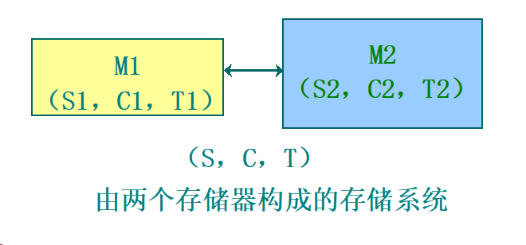

# Computer Architecture

**key**

* IO原理
* 存储层次
* 流水线并行计算的原理

## 计算机系统结构概念

### 计算机系统结构

$系统效率=min(器件速度)*min(系统结构效率)$

计算机体系结构是软件设计者与硬件设备设计者（VLSI）之间的中间层，是软件与硬件的接口（Interface）

程序员可见的计算系统的属性。包括：概念性的结构和功能行为（外特性）。不包括：数据流和控制流的组织、逻辑设计以及物理实现

#### 结构特性

##### 层次结构

分层带来的透明性

#### 系统结构内容

指令系统、数据表示、寻址方式、寄存器组织、存储系统、终端机构、IO结构、及其工作状态定义切换、信息保护

#### 计算机体系结构的分类

1. 按处理机性能分类

   * 按大小划分

     巨型、大型、中型、小型、微型机
   * 按用途划分

     **科学计算、事务处理、实时控制、工作站、服务器、家用计算机**
   * 按数据类型划分

     定点计算机、浮点计算机、向量计算机、堆栈计算机
   * 按处理机个数和种类划分

     单处理机

     并行处理机、多处理机、分布处理机

     关联处理机

     超标量处理机, 超流水线处理机, VLIW处理机

     SMP(对称多处理机)、MPP(大规模并行处理机)、机群(Cluster)系统
   * 使用器件划分

     第一代：电子管(Valve)计算机

     第二代：晶体管(Transistor)计算机

     第三代：集成电路(LSI)计算机

     第四代：大规模集成电路(VLSI)计算机

     第五代：智能计算机

2. 按“流”分类：Flynn分类法

   * 概念

     指令流（Instruction Stream）：机器执行的**指令序列**；

     数据流（Data stream）：由指令处理的**数据序列**；

     多倍性（Multiplicity）：在系统最窄的部件上，处于**同一执行阶段**的指令和数据的最大可能个数。
   * 基本模块

     MM（Memory Module）：内存模块

     PU（Process Unit）：处理单元

     CU（Control Unit）：控制单元
   * 指令流和数据流的个数

     * 单指令流单数据流SISD

       
     * 单指令流多数据流SIMD

       
     * 多指令流单数据流MISD

       

       * 没有MISD计算机的原因之一：通常PU用于处理简单数据，一般没有多个简单数据需要一组相同处理的需求，**没有存在的需求基础**
       * 没有MISD计算机的原因之二：如果把PU用于处理复杂数据（向量、矩阵等），一方面**MISD已经变成了MIMD**，另一方面，相对于**SIMD性能价格比较低**
       * 没有MISD计算机的原因之三：适合MISD实现的应用都可以使用其它结构实现，没有存在的必然性，**因为任何复杂数据都可以分解为简单数据**。
     * 多指令流多数据流MIMD

       
   * 主要缺点

     * 分类太粗
     * 把两个不同等级的功能并列对待
     * 没有非冯计算机的分类

3. 库克分类法

   按控制流和执行流分类

   * 单指令流单执行流SISE
   * 单指令流多执行流SIME

     多功能部件处理机、相联处理机、向量处理机、流水线处理机、超流水线处理机、超标量处理机、SIMD并行处理机
   * 多指令流单执行流MISE
   * 多指令流多执行流MIME

   缺点：

   有些系统如分布处理机等，没有总控制器

   分类级别太低，没有处理机级和机器级

   分类太粗，如SIME中包含了多种处理机

4. 最大并行度分类：冯氏分类法

   最大并行度$P_m$是指一个系统在单位时间内能够处理的最多的二进制位数，显然这是一个完全由计算机硬件结构决定的参数

   **最大并行度的数值越大越好**

   

   * 字串位串WSBS：n=1，m=1 全串行
   * 字并位串WPBS：n>1，m=1 并行单处理机
   * 字串位并WSBP：n=1，m>1 每处理机只一位，但有多个字处理机并行运用
   * 字并位并WPBP：n>1，m>1

   如果在一个时钟周期$\Delta t_i$内实际处理的二进制位数为$P_i$，那么在$T$个时钟周期内的平均并行度$P_a$ 就为：
   $$
   P_a=(\sum_{i=1}^T P_i)/T
   $$
   把平均并行度与最大并行度之比称为平均利用率，用$\mu$表示为：
   $$
   \mu=P_a/P_m= \frac{\sum_{i=1}^TP_i}{T \cdot P_m}
   $$

5. 按“并行集”和“流水线”分类：$Handler$表示法

   根据可并行和流水处理的程度，将硬件分成三个层次：

   * 程序控制部件（PCU）的个数$k$
   * 算术逻辑部件（ALU）或处理部件（PE）的个数$k$
   * 每个算逻部件包含基本逻辑线路（ECL）的套数$w$

   每一个计算机系统都可以用上述三个参数表示其结构特征，即：
   $$
   t(系统型号)=(k,d,w)
   $$
   更细致的表达：
   $$
   t(系统型号)=(k \times k',d \times d',w \times w')
   $$
   $k'$表示宏流水线中程序控制部件的个数；

   $d'$表示指令流水线中算术逻辑部件的个数；

   $w'$表示操作流水线中基本逻辑线路的套数

6. 按控制方式分类

   控制流方式：顺序执行（冯·诺伊曼型）

   数据流方式：操作数到位即可运算，无序执行

   规约方式：驱动方式与数据流相反

   匹配方式：非数值型应用，主要对象为符号

7. 按系统结构风格分类

   面向堆栈型、面向寄存器型、面向对象型

### 系统结构设计

#### 设计思路

1. 由上向下方法

   适合于专用机的设计，从应用到实现级，周期几年。

   缺点：当应用对象或范围变化时，效率急剧下降。

   原因：软、硬件脱节，不能利用最新的软件技术。

2. 由下向上方法

   前提：硬件不能改变。

   缺点：易形成软、硬脱节，软件不能获得最新硬件的支持，结果软件繁杂、效率低。

3. 从中间开始

   从软、硬件交界面开始设计。

   要求首先进行软、硬件功能分配，同时考虑硬件能为软件提供什么支持。

   优点：避免软、硬件脱节，设计周期短，有利于优化设计。

    缺点：对设计人员要求较高，要求具有有效的软件设计环境和开发工具，便于分析、评价和设计。

#### 设计步骤

1. 需求分析
2. 需求说明
3. 概念性设计
4. 具体设计
5. 反复进行优化设计及评价

#### 量化规则

* 抽象以简化设计

* 冗余redundancy以增强独立性

* 并行

  * pipelining

  * powerful instructions

    * MD-technique

      multiple data operands per operation

    * MO-technique

      multiple operations per instruction

  * Multiple instruction issue

    * single instruction-program stream
    * multiple streams

* 关注common case

  * Favor the frequent case over the infrequent case

  * Frequent case is often simpler and can be done faster than the infrequent case

  * Amdahl's Law

    $Speedup(E)=\frac{Execution\_Time\_Without\_enhancement}{Execution\_Time\_With\_enhancement}$

    $Speedup_{overall}=\frac{ExTime_{old}}{ExTime_{new}}=\frac{1}{(1-Fraction_{enhanced})+\frac{Fraction_{enhanced}}{Speedup_{enhanced}}}$

    * 减小CPI×
    * 将CPU的流水线条数增加为n条×
    * 设计专门的多媒体指令及处理硬件

  * Gustafson's law

    $Speedup=P-f_{seq}(P-1)$

* 局部性原理

  * temporal locality
  * spatial locality

* [Performance Equation](https://cseweb.ucsd.edu/classes/sp14/cse141-a/Slides/02_performance_annotated-0417.pdf)

  * $CPU\ Time=\frac{CPU\ clock\ cycles\ for\ a\ program}{Clock\ rate}$
  * $CPI=\frac{CPU\ clock\ cycles\ for\ a\ program}{IC}$
  * $Instruction\ Count:IC$
  * $CPU=\frac{IC \times CPI}{Clockrate}$

存储层级结构

#### 软硬件取舍原则

1. 现有软、硬件条件下，选择能够提高系统性能/价格的方法；
2. 考虑到准备采用和可能采用的组成技术，所选方法能否尽量不限制组成和实现技术
3. 不能仅从“硬”的角度去考虑如何便于应用组成技术的成果和发挥器件技术的进展，还应考虑所选方法能否从“软”的角度为编译和操作系统的实现，以至高级语言程序的设计提供更多更好的硬件支持

### 计算机性能标准

计算机性能：正确性、可靠性和工作能力

评价性能：仅指工作能力

工作能力指标：

* 处理能力—单位时间内能处理的信息量(吞吐率)
* 响应能力—响应时间、周转时间、排队时间
* 利用率—T时间内，某部分被使用时间t与T的比值

#### CPU能力

##### 硬件连接能力

速度指标

CPU通过在引脚上设置数据、地址和控制总线实现与外部电路的连接，这种能力的强弱常用数据总线带宽，即单位时间内传输的数据量来表示。这是一个速度指标

地址总线的宽度可以衡量CPU支持的容量指标。
控制总线的数量、性质可以衡量CPU的功能、可靠性、可扩展性等指标，但表达可能比较复杂。

1. 数据带宽
   * CPU引脚中数据总线的宽度乘以总线传输速率得到数据带宽。（注意，由CPU、系统总线共同决定）
   * 例如，数据总线的传输速率为266 MHz，总线的宽度为32位（4字节），那么该数据总线的带宽就达到2.1GB/s（266MHz×4B）。显然，数据总线带宽越宽，表明该处理机对其他部件的读写速度越快。    
   * 体系结构改善：提高总线传输速率、增加总线宽度，相应的增加成本。
2. CPU与Cache连接方式
   * 随着处理机工作速率的提高，采用Cache（高速缓冲存储器）是提高CPU工作效率的必备措施，而与Cache的连接方式也成为考察处理机连接能力的又一个重要方面
   * CPU在片内连接Cache比在片外连接Cache具有更高的速度指标
   * CPU与Cache之间的数据通道越多，则速度越快。
   * 一级CACHE集成在CPU同一芯片内
   * 二级一般也在CPU同一芯片内(全速CACHE),有的在芯片外,但与CPU 在同一专用板上且有专门通道与CPU相连。
   * 有的CPU还提供专门通道连结第三级CACHE
   * 体系结构改善：为CACHE设计足够宽的通道、尽量把Cache设计在CPU芯片内，但是这会相应增加制造难度和成本

##### 管理能力

可靠性、速度、容量、可扩展性、性能价格比

* 可靠性：多道作业管理
* 速度：Cache寻址，中断管理
* 容量：虚拟存储器寻址
* 可扩展性：中断管理
* 性能价格比：操作系统中某些软件功能放在硬件中实现，提高系统整体的性能价格比。

**CPU PE**

假定通过许多程序的统计，得知第$i$类指令的使用概率为$P_i$，而执行该类指令所需的时钟周期数为$CPI_i$，而全部指令的类别数为$n$，该处理机的统计平均$CPI$就为
$$
CPI=\sum_{i=1}^n(CPI_i \times P_i)
$$
减小平均CPI,减小频繁使用指令的CPI,大概率事件优先原则的应用

系统响应能力能反映计算机系统的软、硬件性能

不能仅用计算机主频衡量系统性能

#### 系统运行速度/处理能力

##### MIPS\MFLOPS

以计算机系统整体作为一个被评估的模块，CPI显然是不合适的

用MIPS和MFLOPS反映系统（CPU）吞吐率。
$$
MIPS=\frac{IC}{Time*10^6}=\frac{Frequency}{CPI*10^6}
$$

$$
MFLOPS=\frac{FP\ Operations}{Time*10^6}
$$

$$
1MFLOPS \approx3MIPS
$$

##### 基准测试

基准测试程序通常用高级语言编写，由各系统自带的编译程序编译成适合在本机中运行的机器码，记下各程序运行所花费的时间，然后按一定的规则计算其执行时间。

1. spec
   $$
   SPEC=\sqrt[n]{\prod_{i=1}^n SPEC_i}
   $$

2. icomp

#### 利用率

虽不直接表示系统性能指标，但与前两种指标有密切关系。对系统性能或结构改进与优化起着至关重要的作用

利用阿姆达尔定律和程序局部性原理改进来提高部件利用率

#### 性能评价技术

1. 分析技术

   近似求解算法：聚合法、均值分析法、扩散法

2. 模拟技术

   设计模拟实验，依照评价目标，选择与目标有关因素，得出实验值，再进行统计、分析

3. 测量技术

#### 多机系统性能评价

除采用单机的评价方法外，还需测试系统的性能加速比和性能可伸缩性值

1. 性能加速比

   $S(p,n)=\frac{T(p,1)}{T(p,n)+h(p,n)}$

2. 性能可伸缩性

#### 计算机成本与价格

### 计算机系统结构发展

#### 冯诺依曼机系统结构演变

运算器、控制器、存储器、IO设备

#### 软件、应用和器件对系统结构的影响

##### 软件对系统结构发展的影响

主要体现在软件可移植性问题

1. 统一高级语言方法
2. 系列机思想

软件兼容种类：向上/下、向前/后兼容

系列机要求：保证向后兼容，力争向上兼容

3. 模拟与仿真
4. 目标代码的并行编译技术

软件是促使计算机系统结构发展最重要的因素。

##### 应用对系统结构发展的影响

* 应用要求：高速度、大容量、大吞吐率
* 应用场合：大、中、小、巨、微型机

##### 器件对系统结构发展的影响

器件的性能、使用方法改变、影响系统结构及组成方法

## 指令系统

An Instruction Set provides a functional description of a processor

* a detailed list of the **instructions** that the processor is capable of processing
* a description of the types/locations/access methods for **operands**

### Data Representation

#### 数据类型

定义：具有一组值的集合，且定义了作用于该集合的操作集。

目的：防止不同类型数据间的误操作。

分类：基本类型、结构类型。

#### 基本数据类型

内容：二进制位、二进制位串、整数、十进制数、浮点数、字符、布尔数等

所有系统结构都支持基本数据类型

#### 结构数据类型

定义：由一组相互有关的数据元素复合而成的数据类型。

分类：系统数据类型、用户自定义数据类型。

内容：数组、字符串、向量、堆栈、队列、记录等

#### 引入数据表示的规则

1. whether the systematic effectiveness is improved
2. whether that data representation commonality and utilization ratio is enough 

#### Self-defining data representation 

The **feasible quality analysis**:

* whether the dedicated space improves 

  通常面积B>面积A

  

* whether realization time to decrease 

* commonality and the utilization ratio 

1. Data representation including tag

   

   与数据相连，共存于同一存储单元中，是数据的一部分

   **advantages**

   * Simplify the instruction set
   * chieve consistency check and the data form transformation through hardware
   * Simplify programming，Semantic disparity lessening between human and the machinery
   * Simplify compiler，The semantic disparity between high-quality language together with the machine language cuts down enormously
   * Support data base system，software can be applicable to much kinds of data type with no modification
   * Convenient software debugging，every data includes a trap bit

   **defects**

   * The length of data and instruction is probably not the same 
   * The execution speed of instruction decreases 。The design time 、Compilation time and debugging time of program be shortened.
   * Increasing The hardware complexity 

2. Data descriptor representation

   与数据分开，增加一级寻址，是程序的一部分

   

   

### Instruction set

* The complete collection of instructions that are understood by a CPU
* Machine Code
* Binary
* Usually represented by assembly codes

#### Elements of an Instruction

* Operation code (Op code)
  * Do this
* Source Operand reference
  * To this
* Result Operand reference
  * Put the answer here
* Next Instruction Reference
  * When you have done that, do this...

#### Instruction Cycle State Diagram

#### Instruction Representation

##### Instruction Types

* Data processing
* Data storage (main memory)
* Data movement (I/O)
* Program flow control 

##### Number of Addresses

* 3 addresses
  * op1,op2,result
  * c=a+b
* 2 addresses
  * op1,op2
  * a=a+b
* 1 address
  * Implicit second address
* 0 address
  * use a stack
  * push a
  * push b
  * add
  * pop c

##### Design Decisions

* Operation decisions
  * number of ops
  * op's functions
  * complexity
* Data types
* Instruction formats
  * Length of op code field
  * Number of addresses
* Registers
* Addressing modes
* RISC vs CISC

##### Simple Instruction Format

##### Operands类型、表示和大小

**常用操作数类型**

* ASCII character = 1 byte (64-bit register can store 8 characters
* Unicode character or Short integer = 2 bytes = 16 bits （half word) 
* Integer = 4 bytes = 32 bits (word size on many RISC Processors)
* Single-precision float = 4 bytes = 32 bits (word size)
* Long integer = 8 bytes = 64 bits (double word)
* Double-precision float = 8 bytes = 64 bits (double word)
* Extended-precision float = 10 bytes = 80 bits (Intel architecture)
* Quad-precision float = 16 bytes = 128 bits

##### 寻址方式

重要的寻址方式：

* 偏移寻址
* 立即数寻址方式
* 寄存器间址方式

偏移字段的大小应该在12-16bits，满足75%-99%需求

立即数字段的大小应该在8-16bits，满足50%-80%需求

##### Types of Operation

* Data Transfer
* Arithmetic
* Logical
* Conversion
* I/O
* System Control
* Transfer of Control

##### 指令集结构分类

###### 分类准则

1. 根据CPU中操作数的存储方法分类；（主要分类准则）
2. 根据指令中显式操作数个数分类；
3. 根据操作数能否放在存储器中分类

指令集划分成堆栈、累加器、寄存器型三类。目前，指令系统则为三种中某些类型的混合型

### Addressing mode

重点是寻址方式的选择方法

80年以来几乎所有机器的存储器都是**按字节编址**

不同体系结构对字的定义是不同的

#### 尾端问题

* little endian
* big endian

#### 对齐问题

* 对s字节的对象访问地址为A，如果A mod s =0 称为边界对齐。
* 边界对齐的原因是存储器本身读写的要求，存储器本身读写通常就是边界对齐的，对于不是边界对齐的对象的访问可能要导致存储器的两次访问，然后再拼接出所需要的数。（或发生异常）

#### 编址方式

##### 编址单位

常见编址单位有：word、byte、bit、block

一般：字节编址，字访问

部分机器：位编址，字访问

辅助存储器：块编址

##### 零地址空间

* 三个零地址空间：通用寄存器、主存储器和输入输出设备均独立编址
* 两个零地址空间：主存储器与输入输出设备统一编址
* 一个零地址空间：所有存储设备统一编址，最低端是通用寄存器，最高端是输入输出设备，中间为主存储器
* 隐含编址方式，实际上没有零地址空间：堆栈、Cache

##### 对于IO设备

* 一地址一设备：必须通过指令中的操作码来识别该输入输出设备上的有关寄存器
* 两地址一设备：一个地址是数据寄存器，一个地址是状态/控制寄存器
* 多地址一设备：对编程增加困难，常用于主存和输入输出设备统一编址的计算机系统

##### 对于并行存储

* 高位交叉编址：扩大存储器容量
* 低位交叉编址：提高存储器速度

[高位交叉和低位交叉](https://zhuanlan.zhihu.com/p/48014084#:~:text=高位交叉编址 当程序按体内地址顺序存放，即一个体存满之后，再存入下一个体时，这种方式称为 顺序存储 ，高位地址表示题号，低位表示体内地址（注意0 1 2 3....的顺序是从上往下的）： 因此，CPU给出一次存储访问总是对一块连续的存储单元进行的，在多CPU系统中，不同的CPU访问不同的存储块，达到并行工作。,低位交叉编址 对应于高位交叉编址，低位交叉编址指的是将程序连续存放在相邻体中，又称 交叉存储 。 （注意，0 1 2 3的顺序是从左往右的）)

#### 寻址方式

##### 立即数寻址方式

用于数据比较短、源操作数

##### 面向寄存器的寻址方式

##### 面向主存储器的寻址方式

#### 指令格式

Many computers support more than a single format for instructions

##### 指令长度

影响因素

* 存储器规模
* 存储器架构
* 总线结构
* CPU复杂度
* CPU速度

##### 位分配

* Number of addressing modes
* Number of operands
* Register versus memory
* Number of register sets
* Address range
* Address granularity

##### 指令格式设计

[计算机组成原理——指令格式设计_指令中的地址码字段有多少位_花生酱拌面的博客-CSDN博客](https://blog.csdn.net/m0_56561130/article/details/118516188)

##### Locating modes

* Locating directly
* locating statically
* locating dynamically

### 优化指令格式

three approaches

**fixed length**，**Huffman coding**，**extending coding**

[系统结构-2-3指令操作码的优化:哈夫曼编码_哈夫曼扩展编码规则_哑巴湖小水怪的博客-CSDN博客](https://blog.csdn.net/changhuzichangchang/article/details/119187648)

#### Huffman编码法

和数据结构中所学的huffman树没有区别

例

7种指令使用频率分别为0.4、0.26、0.15、0.06、0.05、0.04、0.04，要求对每种指令进行操作码编码

#### huffman的扩展方法

##### 等长扩展

##### 不等长扩展

### 编译器优化

[编译器常用的8种优化方法 - 知乎 (zhihu.com)](https://zhuanlan.zhihu.com/p/381490718)

[编译器 - 什么是优化编译器 - 知乎 (zhihu.com)](https://zhuanlan.zhihu.com/p/521319009)

[编译器技术_ronnie88597的博客-CSDN博客](https://blog.csdn.net/weixin_46222091/category_9729419.html)

#### 高层次

done at or near source code level方法内联

* If procedure is called only once, put it in-line and save CALL
* more general case: if call-count < some threshold, put them in-line

#### 局部

done within straight-line code

* common sub-expressions produce same value – either allocate a register or replace with single copy公共子表达式消除
* constant propagation – replace constant valued variable with the constant常量传播
* stack height reduction – re-arrange expression tree to minimize temporary storage needs

#### 全局

across a branch

* copy propagation – replace all instances of a variable *A* that has been assigned *X* (i.e., *A=X*) with *X*. 复写传播

* code motion – remove code from a loop that computes same value each iteration of the loop and put it before the loop代码移动

  [编译器优化--6--代码移动_编译原理 代码移动-CSDN博客](https://blog.csdn.net/weixin_46222091/article/details/104743294)

* simplify or eliminate array addressing calculations in loops

#### Machine-dependent optimizations

based on machine knowledge

* strength reduction – replace multiply by a constant with shifts and adds
  * would make sense if there was no hardware support for MUL
  * a trickier version: $17 \times$= arithmetic left shift 4 and add
* pipelining scheduling – reorder instructions to improve pipeline performance
  * dependency analysis
* branch offset optimization - reorder code to minimize branch offsets

### Compiler techniques for exposing ILP

#### The impact of compiler technology

Three separate areas for data allocation

* Stack
  * Used to allocate **local variables**
  * Grown and shrunk on calls and returns
  * Addressing is relative to the **stack pointer**

* Global data area 
  * Used to allocate **statically declared objects**, such as **global variables and constants**
  * A large percentage of these objects are aggregate data structures such as arrays

* Heap
  * Used to allocate **dynamic objects**
  * Access are usually by pointers 
  * Data is typically not scalars (single variables)

#### Register Allocation Problem

* Reasonably simple for stack-allocated objects
  * Done with the graph coloring theory: variable – vertex; dependency between variables – edge; # register will be equal to # colors
* Essentially impossible for heap-allocated objects because they are accessed with pointers
* Hard for global variables and some static variables due to *aliasing* opportunity
  * There are multiple ways to refer to the address of a variable *b*

#### solution

* Regularity
  * Addressing modes, operations, and data types should be independent of each other

* Provide primitives, not solution
  * What works in one language may be detrimental to others, so don’t optimize for one particular language

* Simplify trade-offs among alternatives
  * Anything that makes code sequence performance obvious is a definite win!

* Provide instructions that bind the quantities known at compile time as constants

### Instruction Level Parallelism

Exploit ILP across multiple basic blocks

[ILP——指令级并行 - 知乎 (zhihu.com)](https://zhuanlan.zhihu.com/p/55663009)

Instruction independency is the key requirement for the transformations

1. Eliminating Name Dependences

   

2. Eliminating Control Dependences

   

3. Eliminating Data Dependences

   

4. Alleviating Data Dependencies

   

#### Loop-level Parallelism

#### software pipelining

#### Trace Selection

### 指令系统的功能设计

**指令系统的完整性、规整性、高效率和兼容性**

* 完整性 是指应该具备的基本指令种类，通用计算机必须有５类基本指令

* 规整性 包括对称性和均匀性
* 对称性：所有寄存器同等对待，操作码的设置等都要对称，如：A－B与B－A
* 均匀性：不同的数据类型、字长、存储设备、操作种类要设置相同的指令
* 高效率：指令的执行速度要快；指令的使用频度要高；各类指令之间要有一定的比例
* 兼容性：在同一系列机内指令系统不变（可以适当增加）

#### CISC

(Complex Instruction Set Computer)	

增强指令功能，设置功能复杂的指令	

面向目标代码、高级语言和操作系统	

用一条指令代替一串指令

#### RISC

(Reduced Instruction Set Computer)	

只保留功能简单的指令	

功能较复杂的指令用子程序来实现

* 延时转移技术
* 指令取消技术
* 重叠寄存器窗口技术
* 指令流调整技术
* 以硬件为主固件为辅

## 存储系统

### 存储系统原理

#### 存储系统的定义

* 两个或两个以上速度、容量和价格各不相同的存储器用硬件、软件、或软件与硬件相结合的方法连接起来成为一个存储系统。
* 这个存储系统对应用程序员是透明的，并且，从应用程序员看，它是一个存储器，这个存储器的速度接近速度最快的那个存储器，存储容量与容量最大的那个存储器相等，单位容量的价格接近最便宜的那个存储器。
* 虚拟存储器系统：对应用程序员透明
* Cache存储系统：对系统程序员以上均透明

**虚拟存储系统**

由主存储器和硬盘构成

主要目的：扩大存储器容量

**存储系统的容量**

* 要求：

  * 提供尽可能大的地址空间

  * 能够随机访问

* 方法有两种：

  * 只对系统中存储容量最大的那个存储器进行编址，其他存储器只在内部编址或不编址。

  * Cache存储系统。

* 另外设计一个容量很大的逻辑地址空间，把相关存储器都映射这个地址空间中。

  * 虚拟存储系统。

**存储系统的价格**

$$
C=\frac{C_1 \cdot S_1+C_2 \cdot S_2}{S_1+S_2}
$$
**存储系统的速度**

提高存储系统速度的两条途径：

* 提高命中率H。
  * 采用预取技术提高命中率
    * 方法：不命中时，把M2存储器中相邻多个单元组成的一个数据块取出来送入M1存储器中。
    * 计算公式$H^{\prime}=\frac{H+n-1}n$
    * 其中：H’是采用预取技术之后的命中率
    * H是原来的命中率
    * n为数据块大小与数据重复使用次数的乘积
* 两个存储器的速度不要相差太大。
* 其中：第二条有时做不到(如虚拟存储器)，这时，只能依靠提高命中率。

**存储系统的访问效率**
$$
e=\frac{T_1}{T}=\frac{T_1}{H\cdot T_1+(1-H)\cdot T_2}=\frac{1}{H+(1-H)\cdot\frac{T_2}{T_1}}=f(H,\frac{T_2}{T_1})
$$
访问效率主要与命中率和两级存储器的速度之比有关

**内存**

* RAM

  * DRAM

    

  * Cache-SRAM (static RAM) made up of flip-flops (like Registers)

* ROM
  * PROM
  * EPROM
  * EEPROM

**外存**

* Magnetic Disk

  * RAID

  * Removable

* Solid State Drive (nowadays)

* Optical

  * CD-ROM
  * CD-Recordable (CD-R)

  * CD-R/W

  * DVD

* Magnetic Tape

**主要性能**

存储器的主要性能：速度、容量、价格。

* 速度用存储器的访问周期、读出时间、频带宽度等表示。
* 容量用字节B、千字节KB、兆字节MB和千兆字节GB等单位表示。
* 价格用单位容量的价格表示，例如：$C/bit。
* 组成存储系统的关键：把速度、容量和价格不同的多个物理存储器组织成一个存储器，这个存储器的速度最快，存储容量最大，单位容量的价格最便宜。

#### 存储系统的层次结构

存储层次工作原理：**Locality**

* 应用程序局部性原理: 给用户

  * 一个采用低成本技术达到的存储容量. （容量大，价格低）

  * 一个采用高速存储技术达到的访问速度.（速度快）

* Temporal Locality (时间局部性):

  * =>保持最近访问的数据项最接近微处理器

* Spatial Locality (空间局部性):

  * 以由地址连续的若干个字构成的块为单位，从低层复制到上一层

#### 存储系统的频带平衡

解决存储器频带平衡方法

* 多个存储器并行工作
* 设置各种缓冲存储器
* 采用存储系统

#### 并行访问存储器

#### 交叉访问存储器

[多体并行：高位/低位交叉编址-CSDN博客](https://blog.csdn.net/nuo_Shar/article/details/79048019)

##### 高位交叉访问存储器

* 主要目的：扩大存储器容量
* 实现方法：用地址码的高位部分区分存储体号
* 参数计算方法:
  * m: 每个存储体的容量， 
  * n: 总共的存储体个数， 
  * j: 存储体的体内地址，$\mathrm{j= 0, 1, 2, ..., m- 1}$
  * k: 存储体的体号，k=0, 1, 2, .., n-1
  * 存储器A的地址： $\mathbf{A}=\mathbf{m}\times\mathbf{k}+\mathbf{j}$
  * 存储器的体内地址： $\mathbf{A_i}=\mathbf{A}$ mod m
  * 存储器的体号$\quad\mathbf{A_k}=\left\lfloor\frac Am\right\rfloor$

##### 低位交叉访问存储器

* 主要目的：提高存储器访问速度
* 实现方法：用地址码的低位部分区分存储体号
* 参数计算:
  * m: 每个存储体的容量， 
  * n: 总共的存储体个数， 
  * j: 存储体的体内地址，$\mathrm{j= 0, 1, 2, ..., m- 1}$
  * k: 存储体的体号，k=0, 1, 2, .., n-1
  * 存储器A的地址： $\mathbf{A}=\mathbf{n}\times\mathbf{j}+\mathbf{k}$
  * 存储器的体内地址:$\quad\mathbf{A_j}=\left\lfloor\frac An\right\rfloor$
  * 存储器的体号:$A_k=A \mod n$

* n个存储体分时启动
  * 一种采用流水线方式工作的并行存储器
  * 每个存储体的启动间隔为$t=\left\lfloor\frac{Tm}n\right\rfloor$
  * 其中： 
  * Tm为每个存储体的访问周期
  * n为存储体个数

#### 无冲突访问存储器

### 虚拟存储器

#### 虚拟存储器工作原理

把主存储器、磁盘存储器和虚拟存储器都划分成固定大小的页

* 主存储器的页称为实页
* 虚拟存储器中的页称为虚页

[深入理解虚拟存储器（1:虚拟存储器概念与工作原理）-CSDN博客](https://blog.csdn.net/github_33873969/article/details/78460522)

#### 地址的映像和变换方法

三种地址空间

* 虚拟地址空间
* 主存储器地址空间
* 辅助地址空间

地址映像

把虚拟地址空间映象到主存地址空间

地址变换

在程序运行时，把虚地址变换成主存实地址

三种虚拟存储器

* 段式虚拟存储器

  **地址映象方法**：每个程序段都从0地址开始编址，长度可长可短，可以在程序执行过程中动态改变程序段的长度

  

  **地址变换方法**：由用户号找到基址寄存器，读出段表起始地址，与虚地址中段号相加得到段表地址，把段表中的起始地址与段内偏移D相加就能得到主存实地址

  

  段表中的段长和访问方式用来保护程序段

  * 可以根据程序段的**起始地址**和**段长**计算出本次访问主存储器的地址是否越界。

  * 访问方式可以指出本程序段是否需要保护和保护的级别。

  * 装入位如果表明该程序段不在主存中，段表的起始地址和访问方式字段可以用来存放该程序段在磁盘存储器中的起始地址，便于从磁盘把信息读到主存。

  外部碎片的消除

  * compaction

    Moving segments closer to zero to eliminate wasted space

    

  * fit segments in existing holes

    [动态分区分配算法(First Fit，Next Fit，Best Fit，Worst Fit)-CSDN博客](https://blog.csdn.net/weixin_43886592/article/details/107581653)

    * Maintain a list of Addresses & Hole Size
    * algorithms
      * best fit: choose smallest hole
      * FIRST FIT: scan circularly & choose which fits first.

  主要优点

  * 程序的模块化性能好
  * 便于程序和数据的共享
  * 程序的动态链接和调度比较容易
  * 便于实现信息保护

  主要缺点

  * 地址变换所花费的时间长，两次加法。
  * 主存储器的利用率往往比较低。
  * 对辅存（磁盘存储器）的管理比较困难

* 页式虚拟存储器

  * 把虚拟地址空间划分为固定大小的块，每一块称为1页

  * 主存的地址空间也划分为同样大小的页

  * 为和磁盘存储器物理块大小配合，虚拟存储器大小指定为0.5kb的整数倍

  * 用户程序只需要将虚页号变换为实页号即可实现到主存实地址空间的映像

  

  内部地址变换：多用户虚拟地址$A_v$变换成主存实地址A

  * 多用户虚拟地址中的页内偏移D直接作为主存实地址中的页内偏移d
  * 主存实页号p与它的页内偏移d直接拼接起来就得到主存实地址A

  

  地址映像方法

  

  地址变换方法

  

  优点

  * 主存储器的利用率比较高。每个用户程序只有不到1页的浪费。
  * 页表相对比较简单。需保存的字段数比较少。
  * 地址变换的速度比较快。只需建立虚页和实页之间的联系即可。
  * 对磁盘的管理比较容易。一页的大小是磁盘快大小的整数倍

  缺点

  * 程序的模块化性能不好。一页可能多个程序或者部分程序。
  * 页表很长，需要占用很大的存储空间

* 段页式虚拟存储器

  用户按段写程序, 每段分成几个固定大小的页

  地址映像方法

  * 每个程序段在段表中占一行，
  * 在段表中给出页表长度和页表的起始地址，
  * 页表中给出每一页在主存储器中的实页号。

  

  地址变换方法

  * 先查段表，得到页表起始地址和页表长度，
  * 再查页表找到要访问的主存实页号，
  * 把实页号p与页内偏移d拼接得到主存实地址

  

* 外部地址变换

  保存和恢复故障点的现场，待故障处理完后返回断点继续执行程序

  * 采用硬件的缓冲寄存器，把执行该指令时的故障现场全部保存在缓冲寄存器中，等页面失效处理完，可以完整的恢复故障点还没有执行完的程序。
  * 只保护部分现场，如程序计数器、处理机状态字等，等页面失效结束，从头开始执行没有完成的指令。
  * 采用指令预判技术，对那些可能发生跨页执行的指令，如字符串指令等，在指令执行之前，就做页面失效处理，等该指令所需页面全部调入主存才开始执行该指令。

  每个程序有一张外页表，每一页或每个程序段，在外页表中都有对应的一个存储字

  

#### 加快内部地址变换的方法

造成虚拟存储器速度降低的主要原因

* 要访问主存储器必须先查段表或页表，
* 可能需要多级页表

页表级数的计算公式
$$
g=\left\lceil\frac{\log2N\nu-\log2Np}{\log2Np-\log2Nd}\right\rceil
$$

* Nv为虚拟存储空间大小，
* Np为页面的大小，
* Nd为一个页表存储字的大小。

##### 目录表

基本思想：压缩页表存储容量，用一个小容量高速存储器存放页表，加快页表的查表速度

页表只为装入到主存的那些页面建立虚页号与实页号之间的对应关系

地址变换过程

把多用户虚地址中U与P拼接，相联访问目录表。读出主存实页号p，把p与多用户虚地址中的D拼接得到主存实地址。如果相联访问失败，发出页面失效请求。

优点

* 与页表放在主存中相比，查表速度快

缺点

* 可扩展性比较差。
* 主存储器容量大时，目录表造价高，速度低

##### 快慢表

快表TLB(Translation Lookaside Buffer)

* 小容量(几～几十个字)。
* 高速硬件实现。
* 采用相联方式访问

慢表

* 当快表中查不到时，从主存的慢表中查找。快表是慢表的部分副本。访问速度接近快表，存储容量是慢表的容量。
* 慢表按地址访问；用软件实现。

快表与慢表也构成一个两级存储系统。

主要存在问题：相联访问实现困难，速度低。

##### 散列函数

目的：把相联访问变成按地址访问

按地址查找信息，散列(Hashing)函数最快，对于快表就是要把多用户虚页号变成快表的地址：Ah＝H(Pv)

* 把一个大得多的多用户虚页号Pv散列变成一个小的快表地址，必然有很多个多用户虚页号都变到相同的快表地址中，这种现象称为散列冲突。
* 为避免散列冲突，必须把多用户虚页号也加入到快表中，并且与主存实页号存放到同一个快表存储字中。
* 需要一个比较器，把快表中读出来的多用户虚页号与多用户虚地址中的虚页号进行比较。
  * 比较结果相等，继续正常进行主存的访问。
  * 比较结果不等，发生了散列冲突，需要查询主存中的慢表。

采用散列变换实现快表按地址访问

* 避免散列冲突：采用相等比较器
* 地址变换：相等比较与访问存储器同时进行

##### inverted page tables反置页表

[反置页表(Inverted Page Table) - 知乎 (zhihu.com)](https://zhuanlan.zhihu.com/p/195657513)

使用反置页表的话，所有进程共同使用一张页表，这张页表中的条目的数量和内存中物理的页框的数量是一样的。反置页表中的每个条目拥有以下字段：

* 页号
* 进程ID
* 控制位——包括valid位，dirty位，reference位，protection位和locking位。
* 链接指针——如果出现进程共享内存的情况，就会用到链接指针

#### 页面替换算法及其实现

##### 页面替换发生时间

当发生页面失效时，要从磁盘中调入一页到主存。如果主存储器的所有页面都已经被占用，必须从主存储器中淘汰掉一个不常使用的页面，以便腾出主存空间来存放新调入的页面。

##### 评价页面替换算法好坏的标准

* 命中率要高，
* 算法要容易实现。

##### 页面替换算法的使用场合

* 虚拟存储器中，主存页面的替换，一般用软件实现。
* Cache中的块替换，一般用硬件实现。
* 虚拟存储器的快慢表中，快表存储字的替换，用硬件实现。
* 虚拟存储器中，用户基地址寄存器的替换，用硬件实现。
* 在有些虚拟存储器中，目录表的替换。

##### 主要页面替换算法

* 随机算法（RAND random algorithm）
  * 算法简单，容易实现。
  * 没有利用历史信息，没有反映程序的局部性。
  * 命中率低。
* 先进先出算法
  (FIFO first-in first-out algorithm)
  * 容易实现，利用了历史信息。
  * 没有反映程序的局部性。
  * 最先调入的页面，很可能也是要使用的页面。
* 近期最少使用算法(LFU least frequently used algorithm)：
  * 既充分利用了历史信息，又反映了程序的局部性实现起来非常困难。
* 最久没有使用算法(LRU least recently used algorithm)：
  * 把LFU算法中的“多”与“少”简化成“有”与“无”，实现比较容易
* 最优替换算法（OPT optimal replacement algorithm）：
  * 是一种理想算法，仅用作评价其它页面替换算法好坏的标准。

##### 堆栈型替换算法

#### 提高主存命中率的方法

### 高速缓冲存储器

### 三级存储系统

