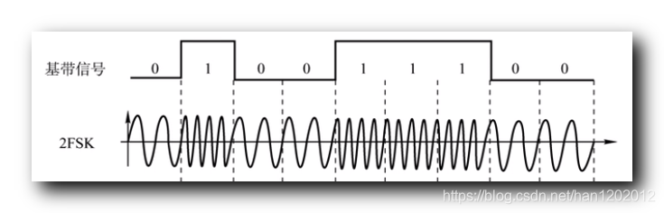

# 408计算机网络

## 计算机网络体系结构

### 计算机网络概述

#### 计算机网络的概念

#### 计算机网络的组成

1. 组成成分
   * 硬件
     * 主机
     * 通信链路
     * 交换设备
     * 通信处理机
   * 软件
     * 应用层工具软件
   * 协议
2. 工作方式
   * 边缘
   * 核心
3. 功能组成
   * 通信子网
   * 资源子网

#### 计算机网络的功能

1. 数据通信
2. 资源共享
3. 分布式处理
4. 提高可靠性
5. 负载均衡

#### 计算机网络的分类

1. 按分布范围分类
   * 广域网WAN
   * 城域网MAN
   * 局域网LAN
   * 个人区域网PAN
2. 按传输技术分类
   * 广播式网络
   * 点对点网络
3. 按拓扑结构
   * 总线型网络
   * 星形网络
   * 环形网络
   * 网状网络
4. 按使用者分类
   * 公用网
   * 专用网
5. 按交换技术分类
   * 电路交换网咯
   * 报文交换网络/存储-转发网络
   * 分组交换网络 包交换网络
6. 按传输介质分类
   * 有线
   * 无线

#### 计算机网络的性能指标

##### 带宽

bit/s

##### 时延

* 发送时延 = 分组长度/信道宽度
* 传播时延 = 信道长度/电磁波速度
* 处理时延
* 排队时延

总时延为上述求和

##### 时延带宽积

时延带宽积 = 传播时延 $\times$ 信道带宽

##### 往返时延 RTT

##### 吞吐量

##### 速率

计网中

kb/s,Mb/s,Gb/s

k=10^3

M=10^6

G=10^9

### 计算机网络体系结构与参考模型

#### 计算机网络分层结构

分多层次

同一层实体称为对等实体

每层的保温包含数据部分SDU，控制信息部分PCI，共同组成PDU

PDU

物理层PDU 比特

数据链路层PDU 帧

网络层PDU 分组

传输层PDU 报文段

1. 第n层实体使用n-1层服务实现自身功能，向n+1层提供服务，是n层及以下各层提供的服务总和
2. 最低层只提供服务，中间层是下面层的服务使用者、上面层的服务提供者，最高层向用户提供服务
3. 只有相邻两层才能提供、使用服务，不能跨层调用；下一层提供服务的实现细节对上层透明
4. 对等层逻辑上有一条直接信道，表现为不仅过下层就把消息传送到对方

#### 计算机网络协议、接口、服务的概念

##### 协议

对等实体之间的通信规则是网络协议

由语法、语义、同步撒部分王城

##### 接口

SAP服务提供点

##### 服务

有应答服务包括四种服务

* 请求 无应答服务
* 指示 无应答服务
* 响应
* 证实

1. 面向连接服务和无连接服务
2. 可靠服务和不可靠服务
3. 有应答服务和无应答服务

#### ISO/OSI参考模型和TCP/IP模型

##### OSI参考模型

自下而上

* 通信子网
  1. 物理层
  2. 数据链路层
  3. 网络层
* 传输层
* 资源子网
  5. 会话层
  6. 表示层
  7. 应用层

###### 物理层

传输单位：比特

在物理媒体上为数据段设备透明地传输原始比特流

###### 数据链路层

传输单位：帧

将网络层传来地IP数据报组装成帧

成帧、差错控制、流量控制、传输管理

特殊子层——介质访问子层

###### 网络层

传输单位：分组

将分组从源端传到目的端，为分组交换网上地不同主机提供通信服务

路由选择、流量控制、拥塞控制、差错控制、网际互连

协议：IP、IPX、ICMP、IGMP、ARP、RARP、OSPF

###### 传输层

传输单位：报文段（TCP） 用户数据报（UDP）

提供端到端通信

端到端的流量控制、差错控制、服务质量、数据传输管理

TCP、UDP

###### 会话层

允许不同主机上的各个进程之间进行会话，建立同步

管理主机间的会话进程，建立、管理及终止进程间的会话

###### 应用层

最高层

协议最多

文件传输协议 FTP

电子邮件 SMTP

上网 HTTP

##### TCP/IP模型

四层

* 应用层
* 传输层
* 网络层
* 网络接口层

##### 两种模型比较

## 物理层

### 通信基础

#### 基本概念

##### 数据、信号与码元

信号是数据的电气、电磁表现

数据是传输过程的存在形式

码元是用一个信号表示一个k进制数，1码元可以携带多比特的信息量

##### 信源、信道与信宿

1. 单向通信
2. 半双工通信
3. 全双工通信

##### 速率、波特与带宽

* 码元传输速率称波特率

  表示单位时间传输的码元个数

* 信息传输速率称比特率

#### 奈奎斯特定理与香农定理

##### 奈奎斯特定理

为了避免码间串扰，极限码元传输速率为2W波特，W是理想低通信道的带宽

用V表示每个码元离散电平的数目，极限数据传输速率
$$
理想低通信道下的极限数据传输速率=2W \log_2 V
$$

1. 任何信道中，码元传输速率是有上限的，超过该值会产生码间串扰
2. 频带越宽，速率越高

##### 香农定理

$$
信道的极限数据传输速率=W\log_2(1+S/N)
$$

$$
信噪比=10\log_{10} S/N
$$

1. 信噪比越大，信息的极限传输速率越高
2. 一定带宽和一定信噪比确定信息传输速率的上限

#### 编码与调制

##### 数字数据编码为数字信号

1. 归零编码 RZ

   每个时钟周期的中间均跳变到低电平

2. 非归零编码 NRZ

   低电平表示0，高电平表示1

3. 反向非归零编码 NRZI

   信号翻转代表0，信号保持不变代表1

   USB 2.0

4. 曼彻斯特编码

   1：高低

   0：低高

   以太网使用ME

5. 差分曼彻斯特编码

   1：前半个码元的电平与上一码元的后半个码元的电平相同

   0：前半个码元的电平与上一码元的后半个码元的电平不同

   码元内部需要一次电平跳转

##### 数字数据调制为模拟信号

1. 幅移键控ASK

   改变振幅

2. 频移键控FSK

   改变频率

3. 相移键控PSK

   改变相位

4. 正交振幅调制

   ASK+PSK

   波特率为B，m个相位，n种振幅
   $$
   R=B\log_2mn
   $$

##### 模拟数据编码为数字信号

遵守奈奎斯特定理
$$
f_{采样}\ge 2 f_{最大频率}
$$
三步

1. 采样

   对模拟信号进行周期性扫描

2. 量化

   把采样取得的电平幅值按照分级标度转化为对应的数字值

3. 编码

   量化结果转化为二进制编码

##### 模拟数据调制为模拟信号

频分复用

#### 电路交换、报文交换和分组交换

##### 电路交换

两结点间先建立一条专用的物理通信路径

独占

三个阶段

1. 连接建立
2. 数据建立
3. 连接释放

电路交换优点：

1. 通信时延小
2. 有序传输
3. 没有冲突
4. 适用范围广
5. 实时性强
6. 控制简单

缺点：

1. 建立连接时间长
2. 线路独占
3. 灵活性差
4. 难以规格化

##### 报文交换

报文交换以报文为单位，在交换结点采用存储转发的传输方式

优点：

1. 无需建立连接
2. 动态分配线路
3. 提高线路可靠性
4. 提高线路利用率
5. 提供多目标服务

缺点：

1. 需要存储转发，费时
2. 对报文大小没有要求，缓存要求高

##### 分组交换

将大数据块划分成小数据块，加上控制信息，组成分组

然后转发

优点：

1. 无建立时延
2. 线路利用率高
3. 简化存储管理
4. 加速 传输
5. 减少出错、重发数据量

缺点：

1. 存储转发时延
2. 传输额外信息
3. 出现失序、丢失、重复

#### 数据包与虚电路

##### 数据报

1. 发送前不需要建立连接
2. 网络尽最大努力交付，不保证可靠性
3. 分组中包括发送端和接收端的完整地址
4. 存储接点排队等候处理
5. 冗余路径
6. 延时小
7. 不独占线路

##### 虚电路

虚电路建立、数据传输与虚电路释放

1. 通信链路的建立和拆除需要时间开销
2. 路由选择体现在建立阶段
3. 提供可靠通信，分组正确有序到达
4. 某结点破坏时所有经过该结点的虚电路遭到破坏
5. 分组首部不包含目标地址，而是虚电路标识符

### 传输介质

#### 双绞线、同轴电缆、光纤和无线传输介质

##### 双绞线

屏蔽双绞线和非屏蔽双绞线

##### 同轴电缆

50$\Omega$ 基带同轴电缆

75$\Omega$ 宽带同轴电缆

##### 光纤

1. 传输损耗小
2. 抗雷电电磁干扰好
3. 无串音干扰，保密性好
4. 体积小，重量轻

##### 无线传输戒指

* 无线电波
* 微波、红外线、激光

#### 物理层接口的特性

1. 机械特性
2. 电气特性
3. 功能特性
4. 过程特性

