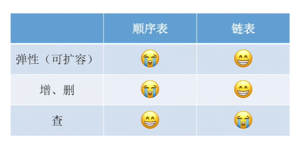
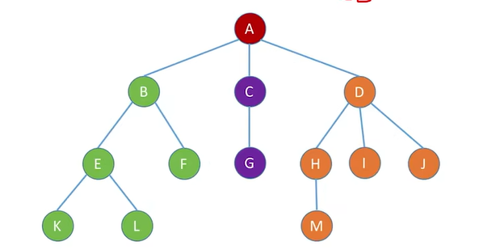

# 408数据结构

## 绪论

### 基本概念

#### 概念术语

* 数据是信息的载体
* 数据元素是数据的基本单位
* 数据项构成数据元素的不可分割的最小单位
* 数据对象是数据元素集合
* 数据类型
  * 原子类型
  * 结构类型
  * 抽象数据类型
* 数据结构包括三方面
  * 逻辑结构
  * 存储结构
  * 数据的运算

#### 数据结构三要素

1. 逻辑结构

   数据元素之间的逻辑关系

   * 集合
   * 线性结构
   * 树形结构
   * 网状结构/图状结构

2. 存储结构

   计算机中的表示 映像

   * 顺序存储
   * 链式存储
   * 索引存储
   * 散列存储/哈希存储

3. 数据的运算

   定义针对逻辑结构

   操作针对存储结构

### 算法和算法评价

#### 算法的基本概念

算法的重要特性：

1. 有穷性
2. 确定性
3. 并行性
4. 输入
5. 输出

#### 算法效率的度量

1. 时间复杂度
   $$
   T(n)=O(f(n))
   $$
   存在$C,n_0$使得当$n \ge n_0$，满足$0 \le T(n) \le Cf(n)$

   大O表示法$\lim_{n \to \infin} \frac{T(n)}{f(n)}=k$

   * 加法规则：

     $T(n)=T_1(n)+T_2(n)=O(f(n))+O(g(n))=O(\max (f(n),g(n)))$

   * 乘法规则：

     $T(n)=T_1(n) \times T_2(n)=O(f(n)) \times O(g(n)))=O(f(n) \times g(n))$

   * 渐进时间复杂度
     $$
     \mathrm{O(1)<O(\log n)<O(n)<O(n\log_2n)<O(n^2)<O(n^3)<O(2^n)<O(n!)<O(n^n)}
     $$

   最坏时间复杂度 大O表示法

   平均时间复杂度 

   最好时间复杂度 $\Omega$表示法

2. 空间复杂度
   $$
   S(n)=O(g(n))
   $$

## 线性表

### 线性表的定义和基本操作

#### 线性表的定义

线性表是具有**相同数据类型**的n个数据元素的有限序列
$$
L=(a_1,a_2,\dots,a_n)
$$
a1为表头元素，an为表尾元素

除了第一个元素外，每个元素有且仅有一个直接前驱

除最后一个元素外，每个元素有且仅有一个直接后继

特点

* 表中元素个数有限
* 具有逻辑上的顺序性
* 每个元素都是单个数据元素
* 数据类型相同
* 抽象性

线性表是一种逻辑结构

顺序表/链表是一种存储结构

#### 线性表的基本操作

* `InitList(&L)`初始化表
* `Length(L)`表长
* `LocateElem(L,e)`按值查找
* `GetElem(L,i)`按位查找
* `ListInsert(&L,i,e)`插入操作
* `ListDelete(&L,i,&e)`删除并返回值操作
* `PrintList(L)`打印表操作
* `Empty(L)`判空操作
* `DestroyList(&L)`销毁操作

### 线性表的顺序表示

#### 顺序表的定义

线性表的顺序存储又称顺序表

用一组地址连续的存储单元

设表的起始位置为$LOC(A)$，则ai的存储位置为$LOC(A)+(i-1)\times sizeof(ElemType)$

静态分配

```c++
#define MaxSize 50
typedef struct{
    Elemtype data[MaxSize];
    int length;
}SqList;
```

存储空间是静态的

动态分配

```c++
#define InitSize 100
typedef struct{
    ElemType *data;
    int MaxSize,length;
}SeqList;
```

```c++
//初始化
L.data=(ElemType*)malloc(sizeof(ElemType)*InitSize)//c
L.data=new ElemType[InitSize];//c++
```

顺序表最主要的特点就是随机访问，可在$O(1)$中找到指定的元素

#### 顺序表上基本操作的实现

1. 插入操作

   ```c++
   bool ListInsert(SqList& L,int i,ElemType e){
       if(i<1||i>L.length+1){
           return false;
       }
       if(L.length>=MaxSize){
           return false;
       }
       for(int j=L.length;j>=i;j--){
           L.data[j]=L.data[j-1];
       }
       L.data[i-1]=e;
       L.length++;
       return true;
   }
   ```

   时间复杂度是$O(n)$

2. 删除操作

   将该位元素提取然后覆盖即可

   ```c++
   bool ListDelete(SqList& L,int i,EmelType& e){
       if(i<1||i>L.length+1){
           return false;
       }
       e=L.data[i-1];
       for(int j=i;j<L.length;j++){
           L.data[j]=L.data[j+1];
       }
       L.length--;
       return true'
   }
   ```

   时间复杂度是$O(n)$

3. 按值查找

   ```c++
   int LocateElem(SqList L,Elemtype e){
       int i;
       for(i=0;i<L.length;i++){
           if(L.data[i]==e)
               return i+1;
       }
       return -1;
   }
   ```

   时间复杂度是$O(n)$

4. 按位查找

   ```c++
   ElemType GetElem(SqList L,int i){
       if(i<1||i>L.length+1){
           return false;
       }
       return L.data[i-1];
   }
   ```

   时间复杂度是$O(1)$

### 线性表的链式表示

#### 单链表的定义

线性表的链式存储称为单链表

用一组任意的存储单元来存储线性表中的数据元素

为了建立数据元素之间的线性关系，对于每个链表结点，除了存放自身信息，还需要一个指向后继的节点

```c++
typedef struct LNode{
    ElemType data;
    struct LNode *next;
}LNode,*LinkList;
```

设置两个别名，LNode作为链表结点，LinkList作为链表

不管带不带头结点，头指针始终指向链表的第一个结点

头结点是链表中的第一个结点

#### 单链表上基本操作的实现

带头结点

1. 头插法建立链表

   ```c++
   typedef struct LNode{
       ElemType data;
       struct LNode *next;
   }LNode,*LinkList;
   
   LinkList List_HeadInsert(LinkList &L){
       LNode* s,ElemType x;
       //初始化链表
       L=(LinkList)malloc(sizeof(LNode));
       L->next=NULL;
       
       scanf("%d",&x);
       while(x!=end){
           s=(LNode*)malloc(sizeof(LNode));
           s->data=x;
           s->next=L->next;
           L->next=s;
           scan("$d",&x);
       }
       return L;
   }
   ```

   头插的要点

   ```c++
   s->data=x;
   s->next=L->next;
   L->next=s;
   ```

   * 如果不带头结点，每一次都要将新结点的地址赋给头结点

2. 尾插法建立链表

   ```c++
   LinkList List_TailInsert(LinkList &L){
       ElemType x;
       L=(LinkList)malloc(sizeof(LNode));
       //r作尾结点
       LNode *s,*r=L;
       
       scan("%d",&x);
       while(x!=end){
           s=(LNode*)malloc(sizeof(LNode));
           s->data=x;
           
           //插入表的尾部
           r->next=s;
           //将新结点的地址赋给尾结点
           r=s;
           scan("%d",&x);
       }
       r->next=NULL;
       return L;
   }
   ```

3. 按序号查找结点

   ```c++
   LNode* GetElem(LinkList L,int i){
       if(i<1)
           return NULL;
       int j-1;
       LNode* p=L->next;
       while(p&&j<i){
           p=p->next;
           j++;
       }
       return p;
   }
   ```

   时间复杂度是$O(n)$

4. 按值查找结点

   ```c++
   LNode* LocateELem(LinkList L,ElemType e){
       LNode *p=L->next;
       while(p&&p->data!=e)
           p=p->next;
       return p;
   }
   ```

   时间复杂度是$O(n)$

5. 按位序插入结点

   找到前一个结点，然后再进行插入，后插操作实现

   ```c++
   LNode* GetElem(LinkList L,int i){
       if(i<1)
           return NULL;
       int j-1;
       LNode* p=L->next;
       while(p&&j<i){
           p=p->next;
           j++;
       }
       return p;
   }
   
   bool ListInsert(LinkList &L,ElemType e,int i){
       LNode *p=GetElem(L,i-1);
       if(!p)
           return false;
       LNode *s=(LNode*)malloc(sizeof(LNode));
       s->data=e;
       
       //关键操作
       s->next=p->next;
       p->next=s;
       
       return true;
   }
   ```

6. 前插操作

   将目标结点复制到新结点，将新结点的地址赋给原目标节点的next，然后将欲插入结点的值赋给原目标结点

   ```c++
   bool InsertPriorNode(LNode *p,ElemType){
       if(!p)
           return false;
       //将目标结点复制到新结点
       LNode *s=(LNode*)malloc(sizeof(LNode));
       s->next=p->next;
       p->next=s;
       //执行完地址操作再执行数据操作
       s->data=p->data;
       p->data=e;
       return true;
   }
   ```

7. 按位序删除

   找到前一个结点，然后再进行删除

   ```c++
   bool ListDelete(LinkList &L,ine i,ElemType &e){
       LNode *p=GetElem(L,i-1);
       if(!p)
           return false;
       LNode *q=p->next;
       e=q->data;
       p->next=q->next;
       free(q);
       return true;
   }
   ```

8. 按元素删除

   给出结点然后删除该结点，类似于直接覆盖

   ```c++
   bool LNodeDelete(LNode *p){
       LNode *q=p->next;
       
       //先数据后地址
       p->data=q->data;
       p->next=q->next;
       
       free(q);
       
       return true;
   }
   ```

#### 双链表

双链表有两个指针，分别指向前驱、后继

```c++
typedef struct DNode{
    ElemType data;
    struct DNode *prior,*next;
}DNode,*DLinkList;
```

 ```c++
 bool InitDLinkList(DLinkList &L){
     L=(DNode*)malloc(sizeof(DNode));
     if(!L){
         return false;
     }
     L->prior=NULL;
     L->next=NULL;
     return true;
 }
 ```

1. 双链表的插入

   ```c++
   bool InsertNextDNode(DNode *p,DNode *s){
       //p的后面插入s
       s->next=p->next;
       p->next->prior=s;
       //下面两句顺序可以有先后
       p->next=s;
       s->prior=p;
   }
   ```

2. 双链表的删除

   ```c++
   bool DeleteNextDNode(DNode *p){
       if(!p) return false;
       DNode *q=p->next;
       if(!q) return false;
       p->next=q->next;
       if(q->next!=NULL){
           q->next->prior=p;
       }
       free(q);
       return true;
   }
   ```

遍历的时间复杂度是$O(n)$

#### 循环链表

循环单链表，循环双链表

在定义数据结构的时候是一样的

```c++
bool InitLinkList(LinkList &L){
    L=(LNode*)malloc(sizeof(LNode));
    if(L==NULL){
        return false;
    }
    L->next=L;
    return true;
}

bool isEmpty(LinkList L){
    if(L->next=L){
        return true;
    }
    else{
        return false;
    }
}
```

```c++
bool InitDLinkList(DLinkList &L{
    L=(DNode*)malloc(sizeof(DNode));
    if(L==NULL){
        return false;
    }
    L->prior=L;
    L->next=L;
    return true;
})
```

#### 静态链表

用数组代替指针

```c++
#define MaxSize 50
typedef struct{
    ElemType data;
    int next;
}SLinkList[MaxSize];
```

等价于

```c++
#define MaxSize 50
struct Node{
    ElemType data;
    int next;
};
typedef struct Node SLinkList[MaxSize]
```

适用于不支持指针的高级语言

`next==-1`是链表尾

增删查改只需要修改next的数组下标

#### 顺序表和链表的比较

##### 逻辑结构

都属于线性表，线性结构

##### 存储结构

顺序表采用顺序存储，物理地址连续

链表逻辑上相邻但是物理地址不一定相邻

##### 增删查改

**初始化**

顺序存储需要一次性预分配大片连续空间

链式表只需要分配一个头结点

**销毁**

**增删**

顺序表链表都是$O(n)$，链表效率更高

**查找**

按位顺序表$O(1)$，链表也是$O(n)$

按值顺序表在有序情况下可干到$O(\log _2 n)$



表长难以估计，经常要增删元素 使用链表

表长可预估，查询操作较多 使用顺序表

## 栈、队列和数组

### 栈

#### 栈的基本概念

##### 栈的定义

栈是只允许**在一端进行插入或删除操作**的线性表

栈顶 线性表允许进行插入删除的一端

栈底 固定的，不允许进行插入和删除的另一端

空栈 不含任何元素的空表

栈的操作特性是LIFO 后进先出

栈的数学性质

n个不同元素进栈，出栈元素不同排列的个数位$\frac{1}{n+1} C_{2n}^n$

##### 栈的基本操作

* `InitStack(&S)`初始化
* `StackEmpty(S)`判空
* `Push(&S,x)`进栈
* `Pop(&S,&x)`出栈
* `GetTop(S,&x)`读栈顶元素
* `DestroyStack(&S)`销毁栈

#### 栈的顺序存储结构

##### 顺序栈的实现

```C++
#define MaxSize 50
typedef struct{
    ElemType data[MaxSize];
    int top;
}SqStack;
```

**初始化**

设置`S.top=-1`

栈顶元素`S.data[S.top]`

进栈：`S.data[++S.top]=x`

##### 顺序栈的基本运算

1. 初始化

   ```C++
   void InitStack(SqStack &S){
       S.top=-1;
   }
   ```

2. 判空

   ```c++
   bool EmptyStack(SqStack S){
       if(S.top==-1)
           return true;
       else
           return false;
   }
   ```

3. 进栈

   ```c++
   bool Push(SqStack &S,ElemType x){
       if(S.top==MaxSize-1)
           return false;
       else
           S.data[++S.top]=x;
       return true;
   }
   ```

4. 出栈

   ```c++
   bool Pop(SqStack &S,ElemType &x){
       if(EmptyStack(S))
           return false;
       x=S.data[S.top--];
       return true;
   }
   ```

5. 读栈顶元素

   ```c++
   bool GetTop(SqStack S,ElemType &x){
       if(EmptyStack(S))
           return false;
       x=S.data[S.top];
       return true;
   }
   ```

##### 共享栈

利用栈底位置相对不变的特性，让两个顺序栈共享一个一维数组，将两栈底设置在数组两端

top0=-1 栈0空

top1=MaxSize 栈1空

top1-top0=1 栈满

#### 栈的链式存储

链栈 不会溢出 所有操作都在表头

```c++
typedef struct Linknode{
    ElemType data;
    struct Linknode *next;
}*LiStack;
```

### 队列

#### 队列的基本概念

##### 队列的定义

队列是只允许在表的一端进行插入，另一端删除的特殊线性表

操作特性 FIFO 先进先出

队头 允许删除的一端

队尾 允许插入的一端

##### 队列常见的基本操作

* `InitQueue(&S)`初始化
* `QueueEmpty(S)`判空
* `EnQueue(&S,x)`入队
* `DeQueue(&S,&x)`出队
* `GetHead(S,&x)`读队头元素

*栈和队列的中间元素都不可以随便读取*

#### 队列的顺序存储结构

##### 顺序存储

```c++
#define MaxSize 50
typedef struct{
    ElemType data[MaxSize];
    int front,rear;
}SqQueue;
```

顺序队列可能会存在假溢出

##### 循环队列

初始化`Q.front=Q.rear=0`

队首指针进1`Q.front=(Q.front+1)%MaxSize`

队尾指针进1`Q.rear=(Q.rear+1)%MaxSize`

出队：队尾指针顺时针进1

入队：队首指针顺时针进1


区分队空和队满的情况

1. 牺牲一个单元区分队空、队满，入队时少用一个队列单元

   规定：队头指针在队尾指针的下一位置作为队满的标志

   `(Q.rear+1)%MaxSize==Q.front`队满

   `Q.front==Q.rear`队空

   `(Q.rear-Q.front+MaxSize)%MaxSize`队列元素个数

2. 增设元素个数的数据成员`Q.size`

3. 增设`tag`区分队空队满

##### 循环队列的操作

1. 初始化

   ```c++
   void InitQueue(SqQueue &Q){
       Q.rear=Q.front=0;
   }
   ```

2. 判空

   ```c++
   bool isEmpty(SqQueue Q){
       if(Q.front==Q.rear) return true;
       else return false;
   }
   ```

3. 入队

   ```c++
   bool EnQueue(SqQueue &Q,ElemType x){
       if((Q.rear+1)%MaxSize==Q.front) return false;
       Q.data[Q.rear]=x;
       Q.rear=(Q.rear+1)%MaxSize;
       return true;
   }
   ```

4. 出队

   ```c++
   bool DeQueue(SqQueue &Q,ElemType &x){
       if(Q.rear==Q.front) return false;
       x=Q.data[Q.front];
       Q.front=(Q.front+1)%MaxSize;
       return true;
   }
   ```

#### 队列的链式存储结构

##### 链队列

需要两个指针，一个头指针一个尾指针

```c++
typedef struct LinkNode{
    ElemType data;
    struct LinkNode *next;
}LinkNode;
typedef struct{
    LinkNode *front,*rear;
}*LinkQueue;
```

`Q.front==Q.front==NULL`的时候队列为空

##### 链式队列的基本操作

1. 初始化

   ```c++
   void InitQueue(LinkQueue &Q){
       Q.front=Q.rear=(LinkNode*)malloc(sizeof(LinkNode));
       Q->front->next=NULL;
   }
   ```

2. 判空

   ```C++
   bool isEmpty(LinkQueue Q){
       if(Q.front==Q.rear) return true;
       else return false;
   }
   ```

3. 入队

   ```c++
   void EnQueue(LinkQueue &Q,ElemType x){
       LinkNode *s=(LinkNode*)malloc(sizeof(LinkNode));
       s->data=x;
       s->next=NULL;
       Q.rear->next=s;
       Q.rear=s;
   }
   ```

4. 出队

   ```c++
   bool DeQueue(LinkQueue &Q,ElemType &x){
       if(Q.front==Q.rear) return false;
       LinkNode *p=Q.front->next;
       x=p->data;
       Q.front->next=p->next;
       if(Q.rear==p)
           Q.rear=Q.front;
       free(p);
       return true
   }
   ```

#### 双端队列

顾名思义就是两头都可进出

受限制的是两头都可进，但是一头可出

* 考点就是给出一个序列，看能不能由某种特殊双端序列实现

### 栈和队列的应用

#### 栈在括号匹配中的应用

#### 栈在表达式求值中的应用

#### 栈在递归中的应用

#### 队列在层次遍历中的应用

#### 队列在计算机系统中的应用

### 数组和特殊矩阵

#### 数组的定义

一维数组是一个线性表

二维数组是一个元素为线性表的线性表

#### 数组的存储结构

一维数组
$$
LOC(a_i)=LOC(a_0)+i \times L
$$
二维数组

行优先
$$
LOC(a_{i,j})=LOC(a_{0,0})+[i \times(h_2+1)+j] \times L
$$
列优先
$$
LOC(a_{i,j})=LOC(a_{0,0})+[j \times(h_1+1)+i] \times L
$$

#### 特殊矩阵的压缩存储

##### 对称矩阵

存一半
$$
k=\frac{i(i-1)}{2}+j-1,i \ge j
$$

$$
k=\frac{j(j-1)}{2}+i-1,i \lt j
$$

##### 三角矩阵

下三角矩阵
$$
k=\frac{i(i-1)}{2}+j-1,i \ge j
$$

$$
k=\frac{n(n+1)}{2} ,i \lt j
$$

上三角矩阵
$$
k=\frac{(i-1)(2n-i+2)}{2}+(j-i)
$$

$$
k=\frac{n(n+1)}{2} ,i \lt j
$$

##### 三对角矩阵

$$
k=2i+j-3
$$

#### 稀疏矩阵

三元组或者十字链表法

## 串

### 串的定义和实现

#### 串的定义

串是由0个或多个字符组成的有限序列

#### 串的存储结构

##### 定长顺序存储表示

```c++
#define MAXLEN 255
typedef struct{
    char ch[MAXLEN];
    int length;
}SString;
```

超过长度需要截断

##### 堆分配存储表示

```c++
typedef struct{
    char *ch;
    int length;
}SString;
```

存储空间动态分配

##### 块链存储表示

采用链表方式存储串值

每个结点可存放一个/多个字符

每个结点称为块，整个链表称为块链结构

### 串的模式匹配

#### 简单的模式匹配算法

求子串在主串中的位置

暴力匹配算法

```c++
int Index(SString S,SString T){
    int i=1,j=1;
    while(i<=S.length&&j<=T.length){
        if(S.ch[i]==T.ch[j]){
            ++i;
            ++j;
        }
        else{
            i=i-j+2;j=1;
        }
    }
    if(j>T.length) return i-T.length;
    else return -1;
}
```

时间复杂度是$O(mn)$

#### 串的模式匹配算法-KMP算法

暴力匹配中，每趟匹配失败都是模式后移一位再从头开始比较

直接在前缀序列中

##### 字符串的前缀、后缀和部分匹配值

前缀指除最后一个字符以外，字符串的所有头部子串；

后缀指除第一个字符外，字符串的所有尾部子串

部分匹配值为字符串的前缀和后缀的最长相等前后缀长度

KMP的关键：出现不匹配后的移动位数
$$
移动位数=已匹配的字符数-对应的部分匹配值
$$
主串始终没有回退，时间复杂度$O(m+n)$

##### KMP算法的原理

用子串前缀后面的元素与主串匹配失败的元素开始比较即可

对算法的改进：

原始
$$
Move=(j-1)-PM(j-1)
$$
将PM表右移一位，得到next数组

1. 第一位元素空缺用-1填充
2. 最后一个元素溢出，本身用不到，舍去

上式改写成
$$
Move=(j-1)-next[j]
$$
此时j回退到$j=next[j]+1$

将next整体+1

得到$j=next[j]$

```c++
void get_next(SString T,int next[]){
    int i=1,j=0;
    next[1]=0;
    while(i<T.length){
        if(j==0||T.ch[i]==T.ch[j]){
            ++i,++j;
            next[i]=j;
        }
        else
            j=next[j];
    }
}
```

手工计算的时候人采用原始方法

完整的kmp算法

```c++
int Index_KMP(SString S,SString T,int next[]){
    int i=1,j=1;
    while(i<=S.length&&j<=T.length){
        if(j==0||S.ch[i]==T.ch[j]){
            ++i,++j;
        }
        else
            j=next[j];
    }
    if(j>T.length){
        return i-T.length;
    }
    else return -1;
}
```

## 树与二叉树

### 树的基本概念

#### 树的定义

树是n个结点的有限集

1. 有且仅有一个根结点
2. 其余结点可分为m个互不相交的有限集

树的根结点没有前驱，除根结点以外的所有结点有且仅有一个前驱

树中所有结点可以有零个或多个后继

n个结点的树有n-1条边

#### 基本术语



1. K为结点E的孩子，E为K的双亲

2. 一个结点的孩子个数为结点的度，树中结点最大度数为树的度

3. 度大于0的结点为分支结点，度=0的结点为叶结点

4. 结点层次从树根开始定义，根结点第1层，子结点第2层

   结点深度从根结点开始自顶向下逐层累加

   结点高度从叶结点开始自底向上逐层累加

5. 有序树和无序树

6. 路径和路径长度

#### 树的性质

1. 树中的结点数等于所有结点的度数之和+1
2. 度为m的树中第i层上至多有$m^{i-1}$个结点
3. 高度为h的m叉树至多有$(m^k-1)/(m-1)$个结点
4. 具有n个结点的m叉树的最小高度为$\lceil \log_m (n(m-1)+1) \rceil$

### 二叉树的概念

#### 二叉树的定义及其主要特性

##### 二叉树的定义

递归定义

1. 或为空二叉树
2. 或有一个根节点和两个互不相交的称根的左右子树组成，左右子树又为二叉树

是有序树，左右子树不能颠倒

##### 特殊的二叉树

1. 满二叉树

   高度为h，含有$2^h-1$个结点

2. 完全二叉树

   $i \le \lfloor n/2 \rfloor$时为分支节点

   叶结点只可能在层次最大的两层上出现

   最多只有一个结点读书为1

3. 二叉排序树

   左子树<根<右子树

4. 平衡二叉树

   任意结点的左右子树深度差不超过1

##### 二叉树的性质

1. 非空二叉树上的叶结点等于度=2的结点数+1
   $$
   n_0=n_2+1
   $$

2. 非空二叉树上第k层最多$2^{k-1}$个结点

3. 高度为h的二叉树，最多含有$2^h-1$个结点

#### 二叉树的存储结构

##### 顺序存储结构

完全二叉树和满二叉树

##### 链式存储结构

```c++
typedef struct BiTNode{
    ElemType data;
    struct BiTNode *lchild,*rchild;
}BiTNode,*BiTree;
```

插播求二叉树的深度的问题

采用递归的思想，从上往下；

记录每个左右子树的深度，大的+1；

```c++
int GetHeight( BinTree BT ){
    int hl=0,hr=0;
    if(BT==NULL){
        return 0;
    }
    hl=GetHeight(BT->Left);
    hr=GetHeight(BT->Right);
    return (hl>=hr?hl:hr)+1;
}
```

### 二叉树的遍历和线索二叉树

#### 二叉树的遍历

常见遍历有先序，中序，后序

递归算法

##### 先序遍历

1. 根
2. 左
3. 右

```c++
void PreOrder(BiTree T){
    if(T){
        visit(T);
        PreOrder(T->lchild);
        PreOrder(T->rchild);
    }
}
```

##### 中序遍历

1. 左
2. 根
3. 右

```c++
void InOrder(BiTree T){
    if(T){
        InOrder(T->lchild);
        visit(T);
        InOrder(T->rchild);
    }
}
```

##### 后序遍历

1. 左
2. 右
3. 根

```c++
void PostOrder(BiTree T){
    if(T){
        PostOrder(T->lchild);
        PostOrder(T->rchild);
        visit(T);
    }
}
```

##### 非递归算法

中序

```c++
void InOrder2(BiTree T){
    InitStack(S);
    BiTree p=T;
    while(p||!IsEmpty(S)){
        if(p){
            Push(S,p);
            p=p->lchild;
        }
        else{
            Pop(S,p);
            visit(p);
            p=p->rchild;
        }
    }
}
```

先序

```c++
void PreOrder2(BiTree T){
    InitStack(S);
    BiTree p=T;
    while(p||!IsEmpty(S)){
        if(p){
            visit(p);
            Push(S,p);
            p=p->lchild;
        }
        else{
            Pop(S,p);
            p=p->rchild;
        }
    }
}
```

##### 层次遍历

借助队列实现同层所有遍历完成再进入下一层

```c++
void LevelOrder(BiTree T){
    InitQueue(Q);
    BiTree p;
    EnQueue(Q,T);
    while(!IsEmpty(Q)){
        DeQueue(Q,p);
        visit(p);
        if(p->lchild){
            EnQueue(Q,p->lchild);
        }
        if(p->rchild){
            EnQueue(Q,p->rchild);
        }
    }
}
```

##### 由遍历序列构造二叉树

先序+中序

后序+中序

层序+中序

只知道先序和后序是无法唯一确定二叉树的

#### 线索二叉树

##### 线索二叉树的基本概念

若无左子树，令lchild指向其前驱结点；

若无右子树，令rchild指向其后继结点；

```c++
typedef struct ThreadNode{
    ElemType data;
    struct ThreadNode *lchild,*rchild;
    iny ltag,rtag;
}ThreadNode,*ThreadTree;
```

##### 中序线索二叉树的构造

通过中序遍历对二叉树线索化

```c++
void InThread(ThreadTree &p,ThreadTree &pre){
    if(p){
        InThread(p->lchild,pre);
        if(p->lchild==NULL){
            p->lchild=pre;
            p->ltag=1;
        }
        if(pre&&pre->rchild==NULL){
            pre->rchild=p;
            pre->rtag=1;
        }
        pre=p;
        InThread(p->rchild,pre)''
    }
}
```

```c++
void CreateInThread(ThreadTree T){
    ThreadTree pre=NULL;
    if(T){
        InThread(T,pre);
        pre->rchild=NULL;
        pre->rtag=1;
    }
}
```

##### 中序线索二叉树的遍历

1. 找到中序的第一个结点

   ```c++
   ThreadNode *FirstNode(ThreadNode *p){
       while(p->ltag==0) p=p->lchild;
       return p;
   }
   ```

2. 找到结点的后继

   ```c++
   ThreadNode *NextNode(ThreadNode *p){
       if(p->rtag==0) return FirstNode(p);
       else return p->rchild;
   }
   ```

3. 遍历算法

   ```c++
   void InOrder(ThreadNode *T){
       for(ThreadNode *p=FirstNode(T);p;p=NextNode(p)){
           visit(p);
       }
   }
   ```

### 树和森林

#### 树的存储结构

##### 双亲表示法

```c++
#define MAX_TREE_SIZE 100
typedef struct{
    ElemType data;
    int parent;
}PTNode;
typedef struct{
    PTNode nodes[MAX_TREE_SIZE];
    int n;
}PTree;
```

##### 孩子表示法

##### 孩子兄弟表示法

#### 树、森林与二叉树的转换

#### 树和森林的遍历

### 树与二叉树的应用

#### 哈夫曼树与哈夫曼编码

##### 哈夫曼树的定义

带权路径长度
$$
WPL=\sum_{i=1}^n w_i l_i
$$
哈夫曼树的WPL最小

##### 哈夫曼树的构造

1. 将n个结点分别作为n棵仅含一个结点的二叉树，构成森林F
2. 构造一个新结点，在F中选取两棵权值最小的树作为新结点的左右子树，并且将新结点权值置为左右子树根结点权值之和
3. 从F中删除那两棵树，将新树加入F中
4. 重复2、3直到F只剩一棵树

##### 哈夫曼编码

没有一个编码是另一个编码的前缀，则称这样的编码为前缀编码

#### 并查集

并查集是一种简单的集合表示，支持三种操作

1. `Inittial(S)`将S中的每个元素都初始化为只有一个单元素的子集合
2. `Union(S,Root1,Root2)`将S中的子集合R2并入R1，要求R1和R2不相交
3. `Find(S,x)`查找S中单元素x所在子集合，返回根结点

定义并查集

```c++
#define SIZE 100
int UFsets[SIZE];
```

初始化S

```c++
void Initial(int S[]){
    for(int i=0;i<SIZE;i++){
        S[i]=-1;
    }
}
```

Find

```c++
int Find(int S[],int x){
    while(S[x]>0)
        x=S[x];
    return x;
}
```

Union

```c++
void Union(int S[],int Root1,int Root2){
    if(Root1==Root2) return;
    S[Root2]=Root1;
}
```

## 图

### 图的基本概念

#### 图的定义


