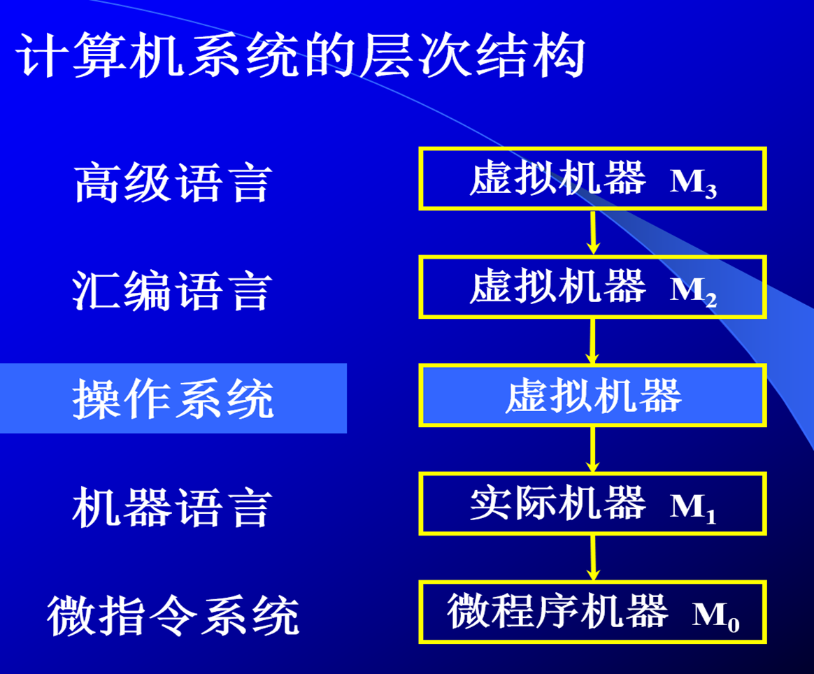

# 嵌入式系统

## 嵌入式系统概述

### 嵌入式系统

通用计算机和嵌入式系统

#### 概念

嵌入式系统是“用于控制、监视或者辅助操作机器和设备的装置”

嵌入式系统是软件和硬件的综合体，还可以涵盖机电等附属装置。

嵌入式系统的特点

* 嵌入性：嵌入到对象体系中，有对象环境要求
* 专用性：软、硬件按对象要求裁减
* 计算机：实现对象的智能化功能

1. 只执行特定功能；
2. 以微控制器、外围器件为中心，系统构成可大可小；
3. 有严格的时序性和稳定性要求；
4. 自动操作循环，等待中断控制；
5. 程序被烧写在存储芯片中。

#### 嵌入式系统的分类

按表现形式分（硬件范畴） ：

* 芯片级嵌入（含程序或算法的处理器）
* 模块级嵌入（系统中的某个核心模块）
* 系统级嵌入

按实时性（实时性:在规定时间内系统的反应能力）要求分（软件范畴） ：

* 非实时系统（PDA）
* 软实时系统（消费类产品）
* 硬实时系统（工业和军工系统）

#### 嵌入式处理器介绍

嵌入式系统的核心部件是嵌入式处理器，据不完全统计，全世界大约有1000多种嵌入式处理器，流行的体系结构有30多个系列。如MCS-51、PIC、AVR、ARM、DSP等，其中MCS-51占了多半，生产厂家20多个，350多种衍生产品，仅Philips就有近百种。处理速度从0.1MIPS到2000MIPS，寻址空间从64KB到4GB。

#### 嵌入式系统的组成

* 嵌入式处理器
* 外围设备
* 驱动程序
* 嵌入式操作系统
* 应用接口
* 嵌入式应用软件

#### 嵌入式系统开发

##### 设计要求

嵌入式系统设计开发不同于桌面系统，它不仅受制于功能而且还受制于具体的应用环境，所以嵌入式系统的设计具有一些特殊的要求：

1. 接口方便、操作容易
2. 稳定可靠、维护简便
3. 功耗管理、降低成本 
4. 功能实用、便于升级
5. 并发处理、及时响应

### 嵌入式系统的应用领域

1. 工控设备
2. 信息家电，安防
3. 消费类电子
4. 交通管理、环境监测
5. 智能仪器
6. 汽车电子
7. 军事国防武器
8. 社会发展方面

### 嵌入式操作系统简介

#### 嵌入式操作系统

操作系统是软硬件资源的控制中心，它以尽量合理有效的方法组织多个用户共享计算机的各种资源。目的是提供一台功能强大的虚拟机，给用户一个方便、有效、安全的工作环境。

##### 顺序执行系统

系统内只含有一个程序，独占CPU的运行时间，按语句顺序执行该程序，直至执行完毕，另一程序才能启动运行。如DOS操作系统。

##### 分时操作系统

系统内同时可以有多个程序运行，把CPU的时间分按顺序分成若干片，每个时间片内执行不同的程序。如UNIX等。

##### 实时操作系统

系统内有多个程序运行，每个程序有不同的优先级，只有最高优先级的任务才能占有CPU的控制权。

#### 嵌入式操作系统简介

嵌入式操作系统是嵌入式应用软件的基础和开发平台。嵌入式系统的出现,解决了嵌入式软件开发标准化的难题

1. 嵌入式系统具有操作系统的最基本的功能

   * 进程调度（没有虚拟内存的管理）
   * 内存管理、 设备管理、文件管理
   * 中断管理
   * 系统功能接口(API调用，如网络功能) 、设备驱动

2. 嵌入式操作系统具有的特点：

   * 系统可裁减、可配置
   * 系统具有实时性
   * 系统稳定、可靠

3. 嵌入式操作系统的分类

   1. 从嵌入式系统的应用来分类

      * 嵌入式操作系统分为低端设备的嵌入式操作系统和高端设备的嵌入式操作系统。
      * 前者主要用于各种工业控制系统、计算机外设、民用消费品的微波炉、洗衣机、冰箱等；比如uC/OS 等。
      * 后者主要用于信息化家电、掌上电脑、机顶盒、WAP手机、路由器等设备上；如wince, linux，Android等

   2. 从实时性来分类

      * 嵌入式操作系统分为实时操作系统和非实时操作系统。下面主要讲实时操作系统的概念。

      

   4. 几种主流的嵌入式操作系统
      * µC/OS-II：教学的免费、面向中小型嵌入式系统应用。
      * Vxworks：美国WindRiver公司于1983年开发，具有可靠、实时、可裁减特性。
      * WinCE：它是微软针对个人电脑以外的电脑产品所研发的嵌入式操作系统，而CE则为Customer Embedded的缩写。 
      * Android： Google公司开发的操作系统，一种基于Linux的自由及开放源代码的操作系统。主要使用于移动设备
      * Linux/µCLinux：免费、源码开放的操作系统，µclinux面向没有MMU的硬件平台。
      * PalmOS ：Com公司产品，在PDA市场占据很大份额，具有开放的操作系统应用程序接口(API)，可让用户灵活方便地定制操作系统。

  ##### 实时操作系统

  * 实时系统的定义：能够对外部事件做出及时响应的系统。响应时间要有保证。
  * 对外部事件的响应包括：
    * 事件发生时要识别出来
    * 在给定时间约束内必须输出结果
  * 实时操作系统必须有以下特征：
    * 多任务
    * 有线程优先级
    * 多种中断级别 

  实时操作系统又分为

  * 硬实时系统：

    对系统响应时间有严格的要求，如果系统响应时间不能满足，就会引起系统崩溃或致命的错误。

  * 软实时系统：

    对系统响应时间有要求，但是如果系统响应时间不能满足，它并不会导致系统出现致命的错误或崩溃，只是降低系统的吞吐量。

  ### 嵌入式系统的发展趋势

  随着信息技术以及互联网的飞速发展，互联网的普及以及3C（Compute、Consumer、Communication）技术的快速融合、半导体技术的改善、使用者的需求、信息服务应用生活化等方面对嵌入式系统的设计提出了越来越高的要求。 

  嵌入式系统设计趋势是：   

  1. 对处理器的要求越来越高。
  2. 软件变得复杂和重要，主要体现在以下几个方面：
     1. 操作系统：要有较好的图形界面和文件系统以及通信协议。
     2. 复杂算法：人工智能、安全和多媒体等应用方面的算法，高级编程语言得到应用空间。
     3. 设计复杂度急剧增加：硬件是目前的2-3倍，软件是目前的10倍。
  3. 32位结构体系已经开始成为嵌入式应用的最主流，ARM正在成为多个应用领域的标准CPU。

  ## ARM体系结构及编程模型 

  ### ARM微处理器的特点

  * 计算机指令：就是指挥机器工作的指示和命令，程序就是一系列按一定顺序排列的指令，执行程序的过程就是计算机的工作过程。
  * 指令集：就是CPU中用来计算和控制计算机系统的一套指令的集合，而每一种新型的CPU在设计时就规定了一系列与其他硬件电路相配合的指令系统。注：指令集是软硬件之间沟通的桥梁。
  * 联想：机器人控制可以直接发送走路的指令（复杂指令集），也可以用肌肉控制指令（精简指令集）去合成一个走路的动作。
  * RISC和CISC，两者各有优缺点
  * 底层复杂、上层简单--》通用机（开发难度低，适用性强）
  * 上层复杂、底层简单--》嵌入式（开发难度大，专用）

ARM微处理器特点:

低功耗、低成本、高性能

* 采用RISC指令集
* 使用大量的寄存器
* ARM/THUMB指令支持
* 三/五级流水线

采用RISC架构的ARM处理器一般具有如下特点

* 固定长度的指令格式，指令归整、简单、基本寻址方式有2～3种；
* 使用单周期指令，便于流水线操作执行；
* 大量使用寄存器，数据处理指令只对寄存器进行操作，只有加载/存储指令可以访问存储器，以提高指令的执行效率。

ARM 处理器共有37个寄存器，被分为若干个组，这些寄存器包括：

* 31个通用寄存器，包括程序计数器（PC 指针），均为32位的寄存器；
* 6个状态寄存器，用以标识CPU的工作状态及程序的运行状态，均为32位。

ARM微处理器支持两种指令集 ：ARM指令集和Thumb指令集 

ARM指令为32位的长度，Thumb指令为16位长度

Thumb指令集为ARM指令集的功能子集，但与等价的ARM代码相比较，可节省30％～40％以上的存储空间，同时具备32位代码的所有优点。

### ARM微处理器系列介绍

#### ARM7系列

ARM7采用冯·诺依曼（Von-Neumann)结构，数据存储器和程序存储器使用同一存储空间，用相同的指令访问 （下一条指令和下一个数据，一次只能访问一个）。此结构也被大多数计算机所采用。

ARM7为三级流水线结构（取指，译码，执行）， 平均功耗为0.6mW/MHz，时钟速度为66MHz，每条指令平均执行1.9个时钟周期。

* ARM7系列微处理器包括如下几种类型的核：ARM7TDMI、ARM7TDMI-S、 ARM720T、ARM7EJ。
* ARM7TMDI是目前使用最广泛的32位嵌入式RISC处理器，属低端ARM处理器核。TDMI的基本含义为（对其它系列也适用）： 
  * T： 支持16为压缩指令集Thumb，称为T变种
  * D： 支持片上Debug，称为D变种
  * M：内嵌硬件乘法器 Multiplier，称为M变种
  * I： 嵌入式ICE，支持片上断点和调试，称为I变种

#### ARM9系列

* ARM7采用的冯·诺依曼Von Neumann结构，取指令和取操作数都是通过一条总线分时进行，这样，在高速运算时，不但不能同时取指令和取操作数，而且还会造成传输通道上的瓶颈现象。
* ARM9采用哈佛（Harvard)结构，程序存储器与数据存储器分开，提供了较大的存储器带宽。同时，大多数DSP都采用此结构。
* ARM9为五级流水（取指，译码，执行，缓冲/数据，回写），平均功耗为0.7mW/MHz。时钟速度为120MHz-200MHz，每条指令平均执行1.5个时钟周期。
* ARM9系列微处理器包含ARM920T、ARM922T和ARM940T三种类型，主要应用在手持产品、视频电话、PDA、数字消费产品、机顶盒、家用网关等方面。

#### ARM9E系列

ARM9E系列是一种包含有微控制器、DSP、Java功能的综合处理器，强化了数字信号处理能力，适用于需要DSP和微控制器结合使用的情况，并且把Thumb技术和DSP都扩展到了ARM指令中，并且具有EmbededICE-RT逻辑，更好地适应了实时系统开发的需要。同时ARM9E使用了Jazelle增强技术，该技术支持一种新的Java操作状态，在硬件中执行Java字节码。

#### ARM10系列

ARM10系列采用了新的体系结构，其核心为使用了向量浮点单元，有强大的浮点运算能力，并且增加了Cache容量和总线宽度，并且具有低功耗的特点。 ARM10系列微处理器主要应用于下一代无线设备、视频消费品等。

#### ARMStrong/Xscale系列

StrongARM是采用ARM体系结构高度集成的32位RISC微处理器。它融合了Intel公司的设计技术，以及ARM体系结构的电源效率，其体系结构在软件上兼容ARMv4，同时又具有Intel技术优点。

#### ARM11系列

ARM11系列微处理器内核最新内核：ARM1156T2-S内核、ARM1156T2F-S内核、ARM1176JZ-S内核和ARM11JZF-S内核。

#### SecurCore系列

SecurCore系列微处理器除了具有ARM体系结构各种主要特点外，还在系统安全方面具有如下的特点：

1. 带有灵活的保护单元，确保操作系统和应用数据的安全；
2. 采用软内核技术，防止外部对其进行扫描探测；
3. 可集成用户自己的安全特性和其他协处理器。

