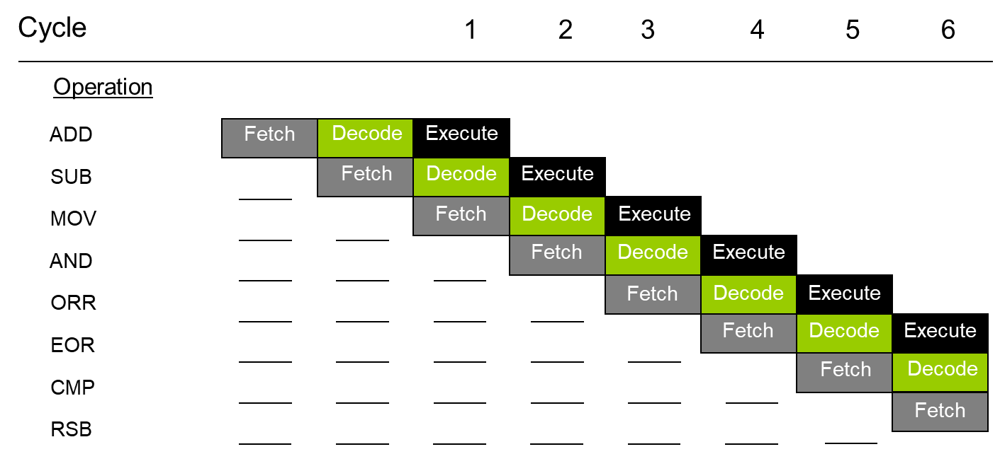
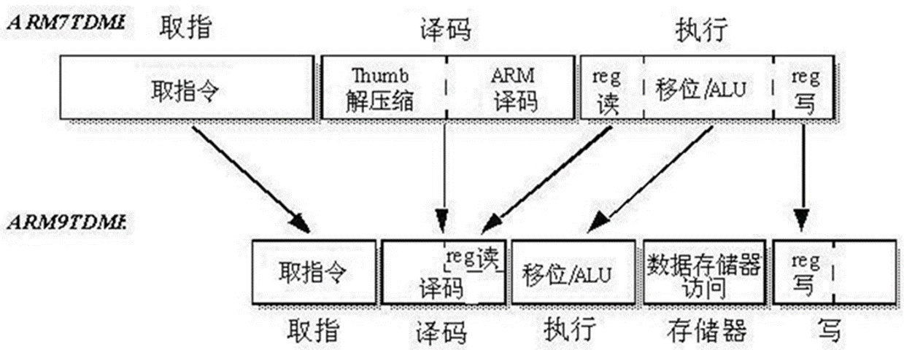

# 嵌入式系统

## 嵌入式系统概述

### 嵌入式系统

通用计算机和嵌入式系统

#### 概念

嵌入式系统是“用于控制、监视或者辅助操作机器和设备的装置”

嵌入式系统是软件和硬件的综合体，还可以涵盖机电等附属装置。


嵌入式系统的特点

* 嵌入性：嵌入到对象体系中，有对象环境要求
* 专用性：软、硬件按对象要求裁减
* 计算机：实现对象的智能化功能


1. 只执行特定功能；
2. 以微控制器、外围器件为中心，系统构成可大可小；
3. 有严格的时序性和稳定性要求；
4. 自动操作循环，等待中断控制；
5. 程序被烧写在存储芯片中。

#### 嵌入式系统的分类

按表现形式分（硬件范畴） ：

* 芯片级嵌入（含程序或算法的处理器）
* 模块级嵌入（系统中的某个核心模块）
* 系统级嵌入

按实时性（实时性:在规定时间内系统的反应能力）要求分（软件范畴） ：

* 非实时系统（PDA）
* 软实时系统（消费类产品）
* 硬实时系统（工业和军工系统）

#### 嵌入式处理器介绍

嵌入式系统的核心部件是嵌入式处理器，据不完全统计，全世界大约有1000多种嵌入式处理器，流行的体系结构有30多个系列。如MCS-51、PIC、AVR、ARM、DSP等，其中MCS-51占了多半，生产厂家20多个，350多种衍生产品，仅Philips就有近百种。处理速度从0.1MIPS到2000MIPS，寻址空间从64KB到4GB。

#### 嵌入式系统的组成

* 嵌入式处理器
* 外围设备
* 驱动程序
* 嵌入式操作系统
* 应用接口
* 嵌入式应用软件

#### 嵌入式系统开发

##### 设计要求

嵌入式系统设计开发不同于桌面系统，它不仅受制于功能而且还受制于具体的应用环境，所以嵌入式系统的设计具有一些特殊的要求：

1. 接口方便、操作容易
2. 稳定可靠、维护简便
3. 功耗管理、降低成本 
4. 功能实用、便于升级
5. 并发处理、及时响应

### 嵌入式系统的应用领域

1. 工控设备
2. 信息家电，安防
3. 消费类电子
4. 交通管理、环境监测
5. 智能仪器
6. 汽车电子
7. 军事国防武器
8. 社会发展方面

### 嵌入式操作系统简介

#### 嵌入式操作系统


操作系统是软硬件资源的控制中心，它以尽量合理有效的方法组织多个用户共享计算机的各种资源。目的是提供一台功能强大的虚拟机，给用户一个方便、有效、安全的工作环境。

##### 顺序执行系统

系统内只含有一个程序，独占CPU的运行时间，按语句顺序执行该程序，直至执行完毕，另一程序才能启动运行。如DOS操作系统。

##### 分时操作系统

系统内同时可以有多个程序运行，把CPU的时间分按顺序分成若干片，每个时间片内执行不同的程序。如UNIX等。

##### 实时操作系统

系统内有多个程序运行，每个程序有不同的优先级，只有最高优先级的任务才能占有CPU的控制权。

#### 嵌入式操作系统简介

嵌入式操作系统是嵌入式应用软件的基础和开发平台。嵌入式系统的出现,解决了嵌入式软件开发标准化的难题

1. 嵌入式系统具有操作系统的最基本的功能

   * 进程调度（没有虚拟内存的管理）
   * 内存管理、 设备管理、文件管理
   * 中断管理
   * 系统功能接口(API调用，如网络功能) 、设备驱动

2. 嵌入式操作系统具有的特点：

   * 系统可裁减、可配置
   * 系统具有实时性
   * 系统稳定、可靠

3. 嵌入式操作系统的分类

   1. 从嵌入式系统的应用来分类

      * 嵌入式操作系统分为低端设备的嵌入式操作系统和高端设备的嵌入式操作系统。
      * 前者主要用于各种工业控制系统、计算机外设、民用消费品的微波炉、洗衣机、冰箱等；比如uC/OS 等。
      * 后者主要用于信息化家电、掌上电脑、机顶盒、WAP手机、路由器等设备上；如wince, linux，Android等

   2. 从实时性来分类

      * 嵌入式操作系统分为实时操作系统和非实时操作系统。下面主要讲实时操作系统的概念。

      

   4. 几种主流的嵌入式操作系统
      * µC/OS-II：教学的免费、面向中小型嵌入式系统应用。
      * Vxworks：美国WindRiver公司于1983年开发，具有可靠、实时、可裁减特性。
      * WinCE：它是微软针对个人电脑以外的电脑产品所研发的嵌入式操作系统，而CE则为Customer Embedded的缩写。 
      * Android： Google公司开发的操作系统，一种基于Linux的自由及开放源代码的操作系统。主要使用于移动设备
      * Linux/µCLinux：免费、源码开放的操作系统，µclinux面向没有MMU的硬件平台。
      * PalmOS ：Com公司产品，在PDA市场占据很大份额，具有开放的操作系统应用程序接口(API)，可让用户灵活方便地定制操作系统。

  ##### 实时操作系统

  * 实时系统的定义：能够对外部事件做出及时响应的系统。响应时间要有保证。
  * 对外部事件的响应包括：
    * 事件发生时要识别出来
    * 在给定时间约束内必须输出结果
  * 实时操作系统必须有以下特征：
    * 多任务
    * 有线程优先级
    * 多种中断级别 

  实时操作系统又分为

  * 硬实时系统：

    对系统响应时间有严格的要求，如果系统响应时间不能满足，就会引起系统崩溃或致命的错误。

  * 软实时系统：

    对系统响应时间有要求，但是如果系统响应时间不能满足，它并不会导致系统出现致命的错误或崩溃，只是降低系统的吞吐量。

  ### 嵌入式系统的发展趋势

  随着信息技术以及互联网的飞速发展，互联网的普及以及3C（Compute、Consumer、Communication）技术的快速融合、半导体技术的改善、使用者的需求、信息服务应用生活化等方面对嵌入式系统的设计提出了越来越高的要求。 

  嵌入式系统设计趋势是：   

  1. 对处理器的要求越来越高。
  2. 软件变得复杂和重要，主要体现在以下几个方面：
     1. 操作系统：要有较好的图形界面和文件系统以及通信协议。
     2. 复杂算法：人工智能、安全和多媒体等应用方面的算法，高级编程语言得到应用空间。
     3. 设计复杂度急剧增加：硬件是目前的2-3倍，软件是目前的10倍。
  3. 32位结构体系已经开始成为嵌入式应用的最主流，ARM正在成为多个应用领域的标准CPU。

  ## ARM体系结构及编程模型 

  ### ARM微处理器的特点

  * 计算机指令：就是指挥机器工作的指示和命令，程序就是一系列按一定顺序排列的指令，执行程序的过程就是计算机的工作过程。
  * 指令集：就是CPU中用来计算和控制计算机系统的一套指令的集合，而每一种新型的CPU在设计时就规定了一系列与其他硬件电路相配合的指令系统。注：指令集是软硬件之间沟通的桥梁。
  * 联想：机器人控制可以直接发送走路的指令（复杂指令集），也可以用肌肉控制指令（精简指令集）去合成一个走路的动作。
  * RISC和CISC，两者各有优缺点
  * 底层复杂、上层简单--》通用机（开发难度低，适用性强）
  * 上层复杂、底层简单--》嵌入式（开发难度大，专用）

ARM微处理器特点:

低功耗、低成本、高性能

* 采用RISC指令集
* 使用大量的寄存器
* ARM/THUMB指令支持
* 三/五级流水线

采用RISC架构的ARM处理器一般具有如下特点

* 固定长度的指令格式，指令归整、简单、基本寻址方式有2～3种；
* 使用单周期指令，便于流水线操作执行；
* 大量使用寄存器，数据处理指令只对寄存器进行操作，只有加载/存储指令可以访问存储器，以提高指令的执行效率。

ARM 处理器共有37个寄存器，被分为若干个组，这些寄存器包括：

* 31个通用寄存器，包括程序计数器（PC 指针），均为32位的寄存器；
* 6个状态寄存器，用以标识CPU的工作状态及程序的运行状态，均为32位。

ARM微处理器支持两种指令集 ：ARM指令集和Thumb指令集 

ARM指令为32位的长度，Thumb指令为16位长度

Thumb指令集为ARM指令集的功能子集，但与等价的ARM代码相比较，可节省30％～40％以上的存储空间，同时具备32位代码的所有优点。

### ARM微处理器系列介绍

#### ARM7系列

ARM7采用冯·诺依曼（Von-Neumann)结构，数据存储器和程序存储器使用同一存储空间，用相同的指令访问 （下一条指令和下一个数据，一次只能访问一个）。此结构也被大多数计算机所采用。

ARM7为三级流水线结构（取指，译码，执行）， 平均功耗为0.6mW/MHz，时钟速度为66MHz，每条指令平均执行1.9个时钟周期。

* ARM7系列微处理器包括如下几种类型的核：ARM7TDMI、ARM7TDMI-S、 ARM720T、ARM7EJ。
* ARM7TMDI是目前使用最广泛的32位嵌入式RISC处理器，属低端ARM处理器核。TDMI的基本含义为（对其它系列也适用）： 
  * T： 支持16为压缩指令集Thumb，称为T变种
  * D： 支持片上Debug，称为D变种
  * M：内嵌硬件乘法器 Multiplier，称为M变种
  * I： 嵌入式ICE，支持片上断点和调试，称为I变种

#### ARM9系列

* ARM7采用的冯·诺依曼Von Neumann结构，取指令和取操作数都是通过一条总线分时进行，这样，在高速运算时，不但不能同时取指令和取操作数，而且还会造成传输通道上的瓶颈现象。
* ARM9采用哈佛（Harvard)结构，程序存储器与数据存储器分开，提供了较大的存储器带宽。同时，大多数DSP都采用此结构。
* ARM9为五级流水（取指，译码，执行，缓冲/数据，回写），平均功耗为0.7mW/MHz。时钟速度为120MHz-200MHz，每条指令平均执行1.5个时钟周期。
* ARM9系列微处理器包含ARM920T、ARM922T和ARM940T三种类型，主要应用在手持产品、视频电话、PDA、数字消费产品、机顶盒、家用网关等方面。

#### ARM9E系列

ARM9E系列是一种包含有微控制器、DSP、Java功能的综合处理器，强化了数字信号处理能力，适用于需要DSP和微控制器结合使用的情况，并且把Thumb技术和DSP都扩展到了ARM指令中，并且具有EmbededICE-RT逻辑，更好地适应了实时系统开发的需要。同时ARM9E使用了Jazelle增强技术，该技术支持一种新的Java操作状态，在硬件中执行Java字节码。

#### ARM10系列

ARM10系列采用了新的体系结构，其核心为使用了向量浮点单元，有强大的浮点运算能力，并且增加了Cache容量和总线宽度，并且具有低功耗的特点。 ARM10系列微处理器主要应用于下一代无线设备、视频消费品等。

#### ARMStrong/Xscale系列

StrongARM是采用ARM体系结构高度集成的32位RISC微处理器。它融合了Intel公司的设计技术，以及ARM体系结构的电源效率，其体系结构在软件上兼容ARMv4，同时又具有Intel技术优点。

#### ARM11系列

ARM11系列微处理器内核最新内核：ARM1156T2-S内核、ARM1156T2F-S内核、ARM1176JZ-S内核和ARM11JZF-S内核。

#### SecurCore系列

SecurCore系列微处理器除了具有ARM体系结构各种主要特点外，还在系统安全方面具有如下的特点：

1. 带有灵活的保护单元，确保操作系统和应用数据的安全；
2. 采用软内核技术，防止外部对其进行扫描探测；
3. 可集成用户自己的安全特性和其他协处理器。

#### ARM Cortex系列

ARM Cortex发布于2005年（ARM11后启用命名），ARM Cortex系列的三款产品全都集成了Thumb®-2 指令集，可满足各种不同的日益增长的市场需求。ARM Cortex系列的三款处理器：

1. ARM Cortex-A （Application）系列:针对复杂操作系统以及用户应用设计的应用处理器（苹果）； 
2. ARM Cortex-R（Real-Time）系列:实时系统专用嵌入式处理器（硬盘主控）；
3. ARM Cortex-M（Microcontroller）系列:针对微控制器和低成本应用专门优化的深嵌入式处理器。

#### 基于32位ARM核微处理器

基于32位ARM核微处理器的主要公司有：

1. ST（意法半导体）公司32位ARM核微处理器。主要有：STR7、STR9和STM32系列。

2) Freescale公司32位微控制器与处理器，主要是MCF52xx系列。
3) OKI公司 32位ARM7DMI核微处理器，主要是ML67xx系列。
4) ATMEL 公司微控制器，主要是AT91FR、AT91M、AT91RM、AT91SAM等系列。

### ARM体系结构

在不牺牲性能的同时，尽量简化处理器。同时从体系结构的层面上灵活支持处理器扩展。这种简化和开放的思路使得ARM处理器采用了很简单的结构来实现。

#### RISC型处理器结构

ARM采用RISC结构，在简化处理器结构，减少复杂功能指令的同时，提高了处理器的速度。

考虑到处理器与存储器打交道的指令执行时间远远大于在寄存器内操作的指令执行时间，RISC型处理器采用了Load/Store（加载/存储）结构，即只有Load/Store指令可与存储器打交道，其余指令都不允许进行存储器操作。

为了进一步提高指令和数据的存取速度，RISC型处理器增加了指令高速缓冲I-Cache和数据高速缓冲D-Cache及多处理器结构，使指令的操作尽可能在寄存器之间进行。


#### Thumb指令集

虽然ARM处理器本身是32位设计，但考虑到RISC型处理器的指令功能相对较弱，新型的ARM体系结构中定义了16位的Thumb指令集。
Thumb指令集比通常的8/16位CISC/RISC处理器有更好的代码密度，而芯片面积只增加6%，却可以使程序存储器更小。

#### 多处理器状态模式

ARM体系结构定义了7种处理器模式：用户、 快中断、中断、管理、终止、未定义和系统模式，大大提高了ARM处理器的效率。

1. 用户模式（USR）：正常程序执行模式，它没有权限去操作其它硬件资源，只能执行处理自己的数据
2. 系统模式（SYS）：运行操作系统的特权任务，与用户模式类似，但具有可以直接切换到其他模式等特权
3. 快中断模式（FIQ）：支持高速数据传输及通道处理，它是用来处理对时间要求比较紧急的中断请求，主要用于高速数据传输及通道处理中
4. 中断模式（IRQ）：用于通用中断处理，用于处理一般的中断请求，通常在硬件产生中断信号之后自动进入该模式
5. 管理模式（SVC）：操作系统保护模式，在该模式下主要用来做系统的初始化（由系统调用执行软中断SWI命令触发）
6. 中止模式（ABT）：用于支持虚拟内存和/或存储器保护，当用户程序访问非法地址，没有权限读取的内存地址时，会进入该模式
7. 未定义模式（UND）：支持硬件协处理器的软件仿真，未定义指令异常响应时进入此模式

#### 两种处理器工作状态

ARM状态       (执行32位ARM指令)
Thumb状态。(执行16位Thumb指令)

#### 嵌入式在线仿真调试

ARM体系结构的处理器芯片都嵌入了在线仿真ICE-RT逻辑，便于通过JTAG来仿真调试芯片，省去了价格昂贵的在线仿真器。

#### 灵活方便的接口

ARM体系结构具有协处理器接口，允许接16个协处理器。既可以使基本的ARM处理器内核尽可能小，方便地扩充ARM指令集，也可以通过未定义指令来支持协处理器的软件仿真。

#### 低电压功耗的设计

考虑到ARM处理器主要用于手持式嵌入式系统中，在设计中就十分注意功耗的设计。

### ARM流水线结构

#### 流水线技术概述

流水线方式

是把一个重复的过程分解为若干个子过程，每个子过程可以与其他子过程同时进行。

由于这种工作方式与工厂中的生产流水线十分相似，因此，把它称为流水线工作方式。     

处理器按照一系列步骤来执行每一条指令。

1. 从存储器读取指令（fetch）
2. 译码以鉴别它是哪一类指令（dec）
3. 从寄存器组取得所需的操作数（reg）
4. 将操作数进行组合以得到结果或存储器地址（exe）
5. 如果需要，则访问存储器存取数据（mem）
6. 将结果回写到寄存器组（res）

#### ARM7的三级流水线

1. 取指：从程序存储器中取指令，放入指令流水线。(占用存储器访问操作)
2. 译码：指令译码。(占用译码逻辑)
3. 执行：执行指令/读写REG。(占用ALU及数据路径)



实际情况下，ARM7的构架中，执行和取值都需要访问存储空间，但是一次只能有一个访问（注意下图阴影，为存储访问），这就导致了流水线间断。这是冯.诺依曼架构的局限，指令和数据总线复用，因此ARM9改为哈弗构架。


#### ARM9TDMI的五级流水线



1. 回写和访存可以同时进行
2. PC仍然是执行地址+8（下下条指令）

#### ARM7和ARM9流水线比较

5级流水线的ARM9内核是哈佛架构，拥有独立的指令和数据总线；指令和数据的读取可以在同一周期进行；

3级流水的ARM7内核是指令和数据总线复用的冯.诺依曼架构，指令和数据的读取不能在同一周期进行；

5级流水线设计把寄存器读取、逻辑运算、结果回写分散在不同的流水当中， 每一级流水的操作简洁，提升了处理器的主频。

随着流水线深度（级数）的增加，每一段的工作量被削减了，这使得处理器可以工作在更高的频率，同时改进了处理器的性能；

负面作用是增加了系统的延时，即内核在执行一条指令前，需要更多的周期来填充流水线

流水线级数的增加也意味着在某些段之间会产生数据相关。

### ARM总线结构

ARM微控制器使用的是AMBA总线体系结构
AMBA（Advanced Microcontroller Bus Architecture）是ARM公司公布的总线标准，先进的AMBA规范定义了三种总线：


#### SPI总线

* 通常需要一根地线GND（用于电位识别）
* 通常需要电源线VCC用于设备供电（非必须）
* 通常需要时钟线，用于分割信号（或主从时钟同步）
* 通常需要两根信号线，用于收发数据
* 通常需要使用使能线，用于指定通信设备（或用地址识别）


#### CAN总线

CAN总线：差分信号、同步时钟、竞争式、去中心化、速度慢、结构简单、可靠高、距离远


#### AHB总线（Advanced High-performance Bus）：

用于连接高性能系统模块。它支持突发数据传输方式及单个数据传输方式，所有时序 参考同一个时钟沿。

#### ASB**总线**（Advanced System Bus）

用于连接高性能系统模块，它支持突发数据传输模式。

#### APB总线（Advance Peripheral Bus）

是一个简单接口支持低性能的外围接口。 

### ARM微处理器的工作状态与模式

ARM处理器有两种工作状态和7种工作模式。

#### ARM处理器的两种工作状态 

从编程的角度看，ARM微处理器的工作状态一般有两种，并可在两种状态之间切换：

* ARM状态，此时处理器执行32位的字对齐的ARM指令；
* Thumb状态，此时处理器执行16位的、半字对齐的Thumb指令。 

THUMB指令是ARM指令的子集

可以相互调用，只要遵循一定的调用规则

Thumb指令与ARM指令的时间效率和空间效率关系为:

* 存储空间约为ARM代码的60％～70％
* 指令数比ARM代码多约30％～40％
* 存储器为32位时ARM代码比Thumb代码快约40％
* 存储器为16位时Thumb比ARM代码快约40～50％
* 使用Thumb代码，存储器的功耗会降低约30％

状态切换方法

ARM指令集和Thumb指令集均有切换处理器状态的指令，并可在两种工作状态之间切换，

在开始执行代码时，应该处于ARM状态

两种状态可以切换

程序执行过程中，通过执行**带状态切换的分支指令BX**，随时在两种工作状态之间进行切换。并且，处理器工作状态的转变，并不影响处理器的工作模式和相应寄存器中的内容。

进入**Thumb**状态

当操作数寄存器的状态位（位0）为1时，可以采用执行BX指令的方法，使微处理器从ARM状态切换到Thumb状态。此为主动切换。

当处理器处于Thumb状态时发生异常（如IRQ、FIQ、Undef、Abort、SWI等），则异常处理返回时，自动切换到Thumb状态。此为自动切换。

切换到**ARM**状态

有两种情况ARM处理器自动切换到arm状态。

1. 执行BX指令，当操作数寄存器的位[0]为0时，则微处理器从Thumb状态切换到ARM状态。
2. 当处理器在Thumb状态时发生异常（如IRQ、FIQ、Undef等），则处理器从Thumb状态自动切换到ARM状态进行异常处理

在处理器进行异常处理时，把PC指针放入异常模式链接寄存器中，并从异常向量地址开始执行程序，也可以使处理器切换到ARM状态。

#### ARM处理器的工作模式

##### 处理器模式

* 用户模式(usr)：ARM处理器正常的程序执行状态,大部分任务执行在这种模式。
* 快速中断模式(fiq)：当一个高优先级(fast)中断产生时将会进入这种模式,用于高速数据传输或通道处理
* 外部中断模式(irq)：当一个低优先级(normal)中断产生时将会进入这种模式。用于通用的中断处理
* 管理模式(svc)：当复位或软中断指令执行时将会进入这种模式, 供操作系统使用的一种保护模式。
* 中止模式（abt）：当存取异常时将会进入这种模式，用于虚拟存储及存储保护。
* 未定义模式（und）：当执行未定义指令时会进入这种模式 ，软件仿真硬件协处理器。
* 系统模式（sys）：供需要访问系统资源的操作系统任务使用，运行具有特权的操作系统任务

##### 模式特点

1. 用户模式

   * 应用程序不能够访问受操作系统保护的系统资源。
   * 应用程序不能进行处理器模式的切换。

2. 系统模式

   不属于异常模式，不是通过异常进入的。系统模式属于特权模式，可以访问所有的系统资源，也可以直接进行模式的切换。它主要供操作系统使用。

##### 特权模式及其特点

特权模式：除用户模式之外的工作模式又称为特权模式

特点：

* 应用程序可以访问所有的系统资源
* 可以任意地进行处理器模式的切换

##### 异常模式及其特点

异常模式：	除用户模式、系统模式之外的五种模式称为异常模式。

特点：以各自的中断或异常方式进入，并且处理各自的中断或异常。


 对管理模式 (svc)进入方式和处理内容有: 

1. 系统上电复位后进入管理模式，运行系统初始化程序，如中断允许/禁止，主时钟设置，SDRAM配置，各个功能模块初始化等。
2. 当执行软件中断指令SWI（SoftWare Interrupt）时，进入管理模式。

#### 模式切换

处理器模式可以通过软件进行切换，也可以通过外部中断或者异常处理过程进行切换。

当应用程序发生异常中断时，处理器进入相应的异常模式。在每一种异常模式下都有一组寄存器，供相应的异常处理程序使用，这样就可以保证在进入异常模式时，用户模式下的寄存器不被破坏。

处理器模式的切换方式：

* 软件控制进行切换。
* 通过外部中断和异常进行切换

处理器启动时的模式转换图


系统模式并不是通过异常进入的，它和用户模式具有完全一样的寄存器。但是系统模式属于特权模式，可以访问所有的系统资源，也可以直接进行处理器模式切换。 

系统模式它主要供操作系统任务使用  

通常操作系统的任务需要访问所有的系统资源，同时该任务仍然使用用户模式的寄存器组，而不是使用异常模式下相应的寄存器组，这样可以保证当异常中断发生时任务状态不被破坏。

### ARM体系结构的存储器格式

#### ARM处理器支持以下6种数据类型

* 8位有符号和无符号字节(Byte)。
* 16位有符号和无符号半字(Halfword) 
  * 它们必须以两字节的边界对齐(半字对齐)。
* 32位有符号和无符号字(word)
  * 它们必须以4字节的边界对齐(字对齐)。


字对齐：字单元地址的低两位 A1A0=0b00。即地址末位为0x0, 0x4, 0x8, 0xc。 
半字对齐：半字单元地址的最低位 A0=0b0 (地址末位为0x0,0x2,0x4,0x6,0x8,0xa,0xc,0xe)。

* 对于指令，ARM指令系统分为32位ARM指令集和16位的Thumb指令集，在存储时分别以32位和16位的两种不同长度存储。
* 对于数据，ARM支持对32位字数据，16位半字数据，8位字节数据操作。因此数据存储器可以存储32位，16位，8位三种不同长度数据。

在ARM内部，所有操作都面向32位的操作数，只有数据传送指令支持较短的字节和半字的数据类型。当从存储器读入一个字节或半字时，根据其数据类型将其扩展到32位。

#### ARM存储器组织

ARM存储器以8位为一个单元存储数据(一个字节)，每个存储单元分配一个存储地址。

ARM将存储器看作是从零地址开始的字节的线性组合。作为32位的微处理器，ARM体系结构所支持的最大寻址空间为4GB（$2^{32}$字节）。

从零字节到三字节放置第一个存储的字数据，从第四个字节到第七个字节放置第二个存储的字数据，依次排列.

32位的字数据要使用4个地址单元，16位半字数据要使用2个地址单元。

这样，就存在一个所存储的字或半字数据的排列顺序问题。ARM体系结构可以用两种方法存储字数据，称为大端格式和小端格式 。


大端格式(big-endian)：字数据的高字节存储在低地址中，而字数据的低字节则存放在高地址中。0123为例


小端格式(low-endian)：与大端存储格式相反。低地址中存放的是字数据的低字节，高地址存放的是字数据的高字节。缺省设置为小端格式。


优缺点

* 大端模式中地址的变化顺序（低到高）与数据的阅读顺序（高位到低位，如12345678我们会从高位开始读，即从左到右）想吻合。所以当沿着地址空间找到某个数据内存的时候，我们首先就可以根据他的内容的第一个字节来判断正负。
* 小端模式的优点：强制类型转化，如int（4字节）转化成short（2字节），直接可以取出前面的低位两字节。另一优点是CPU计算是从数据的低位到高位计算，效率高。所以当CPU从地址的低位到高位移动的时候，正好数据也是从地位到高位变化，计算高效。

#### ARM存储器层次

微处理器希望存储器容量大、速度快。但容量大者速度慢；速度快者容量小。解决方法是构建一个由多级存储器组成的复合存储器系统。

两级存储器方案

一般包括：

* 一个容量小但速度快的从存储器
* 一个容量大但速度慢的主存储器

宏观上看这个存储器系统像一个即大又快的存储器。这个容量小但速度快的元件是Cache，它自动地保存处理器经常用到的指令和数据的拷贝。

多级存储器系统


### 寄存器组织 

ARM微处理器共有37个32位寄存器，其中31个为通用寄存器，6个为状态寄存器。但是这些寄存器不能被同时访问，具体哪些寄存器是可编程访问的，取决微处理器的工作状态及具体的运行模式。但在任何时候，通用寄存器R14～R0、程序计数器PC、一个或两个状态寄存器都是可访问的。 

#### ARM状态下的寄存器组织 

##### 通用寄存器

通用寄存器包括R0～R15，可以分为三类：

* 未分组寄存器R0～R7

  q在所有的运行模式下，未分组寄存器都指向同一个物理寄存器，他们未被系统用作特殊的用途，因此，在中断或异常处理进行运行模式转换时，由于不同的处理器运行模式均使用相同的物理寄存器，可能会造成寄存器中数据的破坏，这一点在进行程序设计时应引起注意。

* 分组寄存器R8～R14

  每次所访问的物理寄存器与处理器当前的运行模式有关

  R8～R12：每个寄存器对应两个不同的物理寄存器

  * 当使用fiq模式时，访问寄存器R8_fiq～R12_fiq；

  * 当使用除fiq模式以外的其他模式时，访问寄存器R8_usr～R12_usr。

  * R13、R14：每个寄存器对应6个不同的物理寄存器

  * 其中的一个是用户模式与系统模式共用，另外5个物理寄存器对应于其他5种不同的运行模式

  * 采用以下的记号来区分不同的物理寄存器：

    * R13_\<mode\>
    * R14_\<mode\>

  * mode为以下几种之一：usr、fiq、irq、svc、abt、und。

  * 堆栈指针（SP）—R13

    R13在ARM指令中常用作堆栈指针，但这只是一种习惯用法，用户也可使用其他的寄存器作为堆栈指针

    在Thumb指令集中，某些指令强制性的要求使用R13作为堆栈指针

    由于处理器的每种运行模式均有自己独立的物理寄存器R13，在初始化部分，都要初始化每种模式下的R13，这样，当程序的运行进入异常模式时，可以将需要保护的寄存器放入R13所指向的堆栈，而当程序从异常模式返回时，则从对应的堆栈中恢复

  * 子程序连接寄存器（LR）—R14

    R14也称作子程序连接寄存器或连接寄存器LR。当执行BL子程序调用指令时，可以从R14中得到R15（程序计数器PC）的备份。其他情况下，R14用作通用寄存器。

    在每一种运行模式下，都可用R14保存子程序的返回地址，当用BL或BLX指令调用子程序时，将PC的当前值拷贝给R14，执行完子程序后，又将R14的值拷贝回PC，即可完成子程序的调用返回。

* 程序计数器PC(R15)

  * ARM状态下，位[1:0]为0，位[31:2]用于保存PC；
  * Thumb状态下，位[0]为0，位[31:1]用于保存PC
  * R15虽然也可用作通用寄存器，但一般不这么使用，因为对R15的使用有一些特殊的限制，当违反了这些限制时，程序的执行结果是未知的。
  * 由于ARM体系结构采用了多级流水线技术，对于ARM指令集而言，PC总是指向当前指令的下两条指令的地址，即PC的值为当前指令的地址值加8个字节。

##### 程序状态寄存器(CPSR/SPSR)

寄存器R16用作CPSR(当前程序状态寄存器)，CPSR可在任何运行模式下被访问，它包括条件标志位、中断禁止位、当前处理器模式标志位，以及其他一些相关的控制和状态位。

每一种运行模式下又都有一个专用的物理状态寄存器，称为SPSR（备份的程序状态寄存器），异常发生时，SPSR用于保存CPSR的值，从异常退出时则可由SPSR来恢复CPSR。

状态寄存器= CPSR\*1+SPSR\*5=6

由于用户模式和系统模式不属于异常模式，他们没有SPSR，当在这两种模式下访问SPSR，结果是未知的


#### Thumb状态下的寄存器组织 

Thumb状态下的寄存器集是ARM状态下寄存器集的一个子集

程序可以直接访问8个通用寄存器（R7～R0）、程序计数器（PC）、堆栈指针（SP）、连接寄存器（LR）和CPSR。

同样，每一种特权模式下都有一组SP、LR和SPSR。 


#### Thumb状态下的寄存器与ARM状态下的寄存器关系

* Thumb状态下和ARM状态下的R0～R7是相同的。
* Thumb状态下和ARM状态下的CPSR和所有的SPSR是相同的。
* Thumb状态下的SP对应于ARM状态下的R13。
* Thumb状态下的LR对应于ARM状态下的R14。
* Thumb状态下的程序计数器对应于ARM状态下R15。


访问THUMB状态下的高位寄存器（Hi-registers） 

在Thumb状态下，高位寄存器R8～R15并不是标准寄存器集的一部分，但可使用汇编语言程序受限制地访问这些寄存器，将其用作快速的暂存器。

使用带特殊变量的MOV指令，数据可以在低位寄存器和高位寄存器之间进行传送；高位寄存器的值可以使用CMP和ADD指令进行比较或加上低位寄存器中的值。 

程序状态寄存器作用 

ARM体系结构包含一个当前程序状态寄存器（CPSR）和五个备份的程序状态寄存器（SPSRs）

1. 当前程序状态寄存器 CPSR (Current Program Status Register

   * 用来保存当前程序状态的寄存器。
   * 所有处理器模式下都可以访问当前程序状态寄存器CPSR。仅一个CPSR。

2. 保存程序状态寄存器SPSR_mode (Saved Program Status Register)

   SPSR_mode用来进行异常处理，其功能包括

   * 保存ALU（算术逻辑单元）中的当前操作信息

     当异常发生时, 用来保存CPSR的值，从异常返回时，将SPSR_mode复制到CPSR中，恢复CPSR的值

   * 控制允许和禁止中断	修改SPSR的值

   * 设置处理器的运行模式	修改SPSR的值

程序状态寄存器的每一位的安排


程序状态寄存器的条件码标志 

N、Z、C、V均为条件码标志位。它们的内容可被算术或逻辑运算的结果所改变，并且可以决定某条指令是否被执行

* 在ARM状态下，绝大多数的指令都是有条件执行的。
* 在Thumb状态下，仅有分支指令是有条件执行的。 


程序状态寄存器的控制位 

状态寄存器的低8位（I、F、T和M[4：0]）称为控制位，发生异常时这些位可以被改变。如果处理器运行特权模式，这些位也可以由程序修改。

* 中断禁止位I、F：

  I=1   禁止IRQ中断; I＝0   允许IRQ中断
  F=1   禁止FIQ中断; F＝0  允许FIQ中断

* T标志位：该位反映处理器的运行状态

  T=1时，程序运行于Thumb状态
  T=0时，程序运行于ARM状态

* 运行模式位M[4：0]是模式位，决定处理器的运行模式 

处理器运行模式及可以访问的寄存器


### 异常

#### 中断和异常的概念 

##### 中断

当CPU正在执行程序时，系统发生了一件急需处理的事件，CPU暂时停下正在执行的程序，转去处理相应的事件，事件处理完后，CPU再返回执行原来的程序，这种情况称为中断。

中断事件：引起CPU产生中断、并且与CPU当前所执行的程序无关的、由外部硬件产生的事件，也叫中断源。中断事件也常称为外中断。

中断是计算机系统基本的功能    利用中断，外设可以与CPU并行工作，当外设需要传输数据或控制时，向CPU发出中断请求信号。CPU响应其请求进行处理。因此，使用中断既可以实现CPU与外设并行工作，又可以实时处理各种紧急事件。

#### 异常

是指CPU在执行指令时出现的错误，即不正常的情况。异常是与当前所执行的程序有关的。如存取数据或指令错误、计算结果溢出等。

异常的处理：也用中断的方式进行处理。

计算机通常是用中断来处理外中断和异常，因此下面将二者均称为异常。

当系统运行时，异常可能会随时发生，为保证在ARM处理器发生异常时不至于处于未知状态，在应用程序的设计中，首先要进行异常处理，采用的方式是在异常向量表中的特定位置放置一条跳转指令，跳转到异常处理程序。 

当ARM处理器发生异常时，程序计数器PC会被强制设置为对应的异常向量，从而跳转到异常处理程序，当异常处理完成以后，返回到主程序继续执行。

我们需要处理所有的异常，尽管我们可以简单的在某些异常处理程序处放置死循环。

#### ARM的异常

ARM有7种异常

##### 复位

处理器上一旦有复位输入，ARM处理器立刻停止执行当前指令。复位后，ARM处理器在禁止中断的管理模式下，从地址0x00000000或0xFFFF0000开始执行指令。

##### 未定义指令异常

当ARM处理器执行协处理器指令时，它必须等待任一外部协处理器应答后，才能真正执行这条指令。若协处理器没有响应，就会出现未定义指令异常。

未定义指令异常可用于在没有物理协处理器（硬件）的系统上，对协处理器进行软件仿真，或在软件仿真时进行指令扩展。

##### 软件中断异常

该异常由执行软件中断指令（Software Interrupt, SWI）产生，可使用此机制进行软件仿真。

##### 预取中止（取指令存储器中止）

若处理器预取指令的地址不存在，或该地址不允许当前指令访问，存储器会向处理器发出中止信号，但当预取的指令被执行时，才会产生指令预取中止异常。

##### 数据中止（访问数据存储器中止）

若处理器数据访问指令的地址不存在，或该地址不允许当前指令访问时，产生数据中止异常。

##### IRQ异常

当处理器的外部中断请求引脚有效，且CPSR中的I=0，产生IRQ异常。

系统的外设可通过该异常请求中断服务。

##### FIQ异常

当处理器的外部中断请求引脚有效，且CPSR中的F=0，产生FIQ异常。

FIQ支持数据传送和通道处理，并有足够的私有寄存器，从而在应用中可避免对寄存器保存的需求，减少了开销。


* 先捕获异常中断，再跳到特定处理器模式来处理

* 异常是被动产生的，处理器模式可修改CPSR主动进入

* 异常源与模式关系：

  1. 快速中断请求异常进入快速中断模式，支持高速数传输及通道处理(FIQ异常响应时进入此模式);
  2. 中断请求异常进入中断模式，用于通用中断处理
  3. 预取指中止，数据中止异常进入中止模式，用于支持虚拟内存和/或存储器保护;
  4. 未定义指令异常进入未定义模式，支持硬件协处理器的软件仿真软件中断(swi)
  5. 复位异常(reset)进入管理模式，操作系统保护代码

  除用户模式、系统模式之外的五种模式称为异常模式。

#### ARM异常中断响应过程

当发生异常时，除了复位异常立即中止当前指令外，处理器尽量完成当前指令，然后脱离当前的程序去处理异常。ARM处理器对异常中断的响应过程如下 

##### 保存返回地址

将引起异常指令的下一条指令的地址保存到新的异常模式x下的R14，即R14-\<mode\>中，使异常处理程序执行完后能正确返回原程序。

##### 保存当前状态寄存器CPSR的内容

将CPSR的内容保存到将要执行的异常中断对应的SPSR中，便于中断返回时恢复处理器当前的状态位、中断屏蔽位以及各条件标志位

##### 设置当前状态寄存器CPSR中的相应位

* 设置CPSR模式控制位CPSR［4：0］，使处理器进入相应的执行模式；
* 设置中断标志位（CPSR［7］=1），禁止IRQ中断；
* 设置中断标志位（CPSR［6］=1）禁止FIQ中断，当进入Reset或FIQ模式时。

##### 转去执行中断处理程序

取相应的中断向量给程序计数器PC，使程序开始执行中断处理程序

一般地说，矢量地址处将包含一条指向相应程序的转移指令，从而可跳转到相应的异常中断处理程序处执行异常中断处理程序 


异常响应伪代码

处理器处于Thumb状态，则当异常向量地址加载入PC时，处理器自动切换到ARM状态。ARM微处理器对异常的响应过程用伪码可以描述为：

```
R14_<Exception_Mode> = Return Link
SPSR_<Exception_Mode> = CPSR
CPSR[4:0] = Exception Mode Number
CPSR[5] = 0
If <Exception_Mode> == Reset or FIQ then
CPSR[6] = 1		
CPSR[7] = 1
PC = Exception Vector Address
```

注意使用异常模式下的特有寄存器

每个异常模式对应有两个寄存器R13\_\<mode\>、R14\_\<mode\>分别保存相应模式下的堆栈指针、返回地址；堆栈指针可用来定义一个存储区域保存其它用户寄存器，在程序初始化时应该对各种模式堆栈设置，便于随时使用。

FIQ模式还有额外的专用寄存器R8\_fiq～R12\_fiq，使用这些寄存器可以加快快速中断的处理速度。   

#### 异常返回

##### 异常返回应执行的操作

异常处理完毕之后，ARM微处理器会执行以下几步操作从异常返回：

* 将返回地址装入PC    把连接寄存器LR的值减去相应的偏移量，然后送到PC中。
* 恢复CPSR的值    将SPSR复制回CPSR中。
* 清除中断屏蔽位    若在进入异常处理时设置了中断禁止位，要在此清除。

可以认为应用程序总是从复位异常处理程序开始执行的，因此复位异常处理程序不需要返回。

##### 各种异常返回方法

* FIQ中断返回

  不管是在ARM状态还是在Thumb状态下进入FIQ模式，FIQ处理程序均可以执行以下指令从FIQ模式返回

  ```assembly
  SUBS   PC,R14-fiq ,#4
  ```

* 指令预取中止（ Abort ）异常返回

  当指令预取访问存储器失败时，存储器系统向ARM处理器发出存储器中止（Abort）信号，预取的指令被记为无效，但只有当处理器试图执行无效指令时，指令预取中止异常才会发生，如果指令未被执行。

  例如在指令流水线中发生了跳转，则预取指令中止不会发生。

  如果发生了指令预取中止异常，无论是在ARM状态还是Thumb状态，其返回指令为：

  ```assembly
  SUBS PC, R14_abt, #4	；重新执行被中止的指令
  ```

* 数据中止（ Abort ）异常返回

  如果发生了数据中止异常，无论是在ARM状态还是Thumb状态，其返回指令为：

  ```assembly
  SUBS PC, R14_abt, #8
  ```

  重新执行被中止的指令

* 软件中断指令（SWI）异常返回

  用于进入管理模式，常用于请求执行特定的管理功能。软件中断处理程序执行以下指令可以从SWI模式返回，无论是在ARM状态还是Thumb状态：

  ```assembly
  MOVS  PC , R14_svc
  ```

  以上指令恢复PC（从R14_svc）和CPSR（从SPSR_svc）的值，并返回到SWI的下一条指令。

* 未定义指令异常返回

  当ARM处理器遇到不能处理的指令时，会产生未定义指令异常。采用这种机制，可以通过软件仿真扩展ARM或Thumb指令集。

  处理器执行以下程序返回，无论是在ARM状态还是Thumb状态：

  ```assembly
  MOVS PC, R14_und
  ```

  以上指令恢复PC（从R14_und）和CPSR（从SPSR_und）的值，并返回到未定义指令后的下一条指令。


ARM中断向量


异常中断向量表说明

存储器的前8个字中除了地址0x00000014之外，全部被用作异常矢量地址

这是因为在早期的26位地址空间的ARM处理器中，曾使用地址0x00000014来捕获落在地址空间之外的load和store存储器地址。  

这些陷阱称为“地址异常”，因为32位的ARM不会产生落在它的32位地址空间之外的地址，所以地址异常在当前的体系结构中没有作用，0x00000014的矢量地址也就不再使用了。 


* 如果未更新，PC=当前指令地址+8，更新则=PC+12
* 未更新情况下，下条指令地址=当前指令地址+4=PC-4
* LR默认存储指向下条指令，即当前指令+4=PC-4

ARM中断的优先级


## ARM指令系统

### ARM指令系统版本

指令系统概念

指令：是规定计算机进行某种操作的命令。

指令系统：计算机能够执行的各种指令的集合。

#### 版本1（v1）

v1在ARM1中使用，但从未商业化。26位寻址空间，其指令主要有

1. 基本的数据处理指令（无乘法指令）
2. 字、字节和半字存储器访问指令
3. 分支指令（包括带链接的分支指令）
4. 软件中断指令

#### 版本2（v2）

v2仍是26位寻址空间，在v1的基础上增加的内容有：

1. 乘法和乘法加指令
2. 支持协处理器
3. 快速中断模式中的分组寄存器
4. 交换式加载/存储指令。

#### 版本3（v3）

V3将寻址范围扩展到32位，但兼容26位寻址。在v2的基础上增加的内容有

1. 设置了专用的当前程序状态寄存器CPSR、增加了程序状态保存寄存器SPSR
2. 增加了中止异常和未定义指令异常两种处理器模式
3. 增加了访问CPSR、SPSR的指令MRS和MSR
4. 修改了异常返回指令的功能

#### 版本4（v4）

V4是32位寻址方式，但不再兼容26位寻址，在v3的基础上增加的内容有

1. 半字加载/存储指令
2. 在T变量中转换到Thumb状态的指令
3. 增加了在使用用户模式寄存器的特权处理器模式

#### 版本5（v5）

V5对v4指令做了必要的修改和扩展，并且增加了指令，具体变化为：

1. 改进在T变量中ARM/Thumb状态之间的切换效率
2. 对于T和非T变量使用相同的代码生成技术
3. 增加了计数前导零指令
4. 增加了软件断点指令
5. 对乘法指令设置标志做了严格定义。
6. 将流水线的级数从3级（如ARM7TDMI使用的）增加到5级；
7. 并改变存储器接口来使用分开的指令与数据存储器。 

#### 版本6 （v6）

V6对v5指令做了必要的修改和扩展，并且增加了指令， 2001年发布，首先在ARM11处理器中使用(2002年春季发布)，具体变化为

1. ARM体系版本6的新架构在降低耗电量的同时，还强化了图形处理性能。
2. 增加了多媒体处理功能：通过追加有效进行多媒体处理的SIMD功能，将语音及图像的处理功能提高到了原机型的4倍。
3. V6版本还支持多微处理器内核。

#### 版本7 （v7）

* 高级SIMD：在ARM v7-A架构中，ARM进一步发展自身的SIMD指令集，并命名为NEON。这一代的指令集，有32个64bit的NEON向量寄存器，同时也支持单精度浮点；
* VFPv3/v4：浮点体系结构 (VFP) 为半精度、单精度和双精度浮点运算中的浮点操作提供硬件支持，符合 IEEE-754 标准，VFPv4相当于VPPv3主要增加了half-precision extension和乘加的指令。ARM的vfp可以实现为32个或16个double-word register，分别以VFPv3-D32和VFPv3-D16来表示。当NEON和VFP同时实现时，VFP只可以实现为VFP-D32；
* LPAE（Large Physical Address Extension）：大地址扩展，一般为40位地址扩展，可以将寻址范围从2^32 4GB扩展到2^40 1TB，也有处理器后来扩展到44bit ；
* Virtualization：在 Normal world 里面加入了一个新的CPU模式——HYP mode，需要MMU和GIC（中断控制器）分别提供IPA（Intermediate Physical Address）和虚拟中断的转发的支持。

#### 版本8 （v8）

* Secure EL2：该特性Armv8.4-A引入，在Secure word增加了虚拟化支持；
* PA（Pointer Authentication）：v8.3引入，增强安全，函数指针检查，CPU在执行函数跳转时检查函数指针是否正确(使用MAC算法),防止跳转指针被修改；
* BTI（Branch Target Identifiers）：v8.5引入，对间接跳转的目标进行限制。与PA结合使用极大程度减少控制流攻击;
* MTE（Memory Tagging Extension）：v8.5引入，内存区域进行标记，对保护区域访问必须使用具有相同标记的指针。可检测溢出、UAF类漏洞;
* Scalar Floating Point：aarch64提供32个128-bit寄存器用于SIMD vector and scalar floating-point支持；aarch32提供32个64-bit寄存器用于SIMD vector and scalar floating-point支持；
* Enhanced Crypto：v8一开始就增加了cryptography 指令，包括AES, SHA-1/SHA-256 等算法实现，又在v8.4增加了"SHA3/SHA512/SM3/SM4"的支持；
  bfloat：v8.2引入，增加FP16数据处理指令
* Vector Extensions：v8.2引入，Scalable Vector Extension（SVE）是arm AArch64架构下的下一代SIMD指令集，旨在加速高性能计算，允许vector从28到2048 bit长度可变 。
* Improved virtualization support：v8.4引入

#### 版本9 （v9）

* Improved Security：主要是引入了全新的CCA（confidential compute architecture，机密计算架构 ）架构。机密计算可以打造基于硬件的安全运行环境来执行计算，保护部分敏感数据和代码，甚至不受特权软件的影响，即使是具有最高权限的OS也无法影响。虽然OS可以决定何时运行，但应用程序位于独立的硬件保护内存区域，和系统中的一切是隔离的。这意味着就算应用感染了恶意软件，也不会传播给设备里的其他部分。
* Digital Signal Processing & Machine Learning：在ARMv8.2中引入SVE，但它的问题在于，新的可变矢量长度SIMD指令集的第一次迭代的范围相当有限，并且更多地针对HPC工作负载，缺少了许多仍由NEON涵盖的更通用的指令。SVE2，旨在通过用所需指令补充新的可扩展SIMD指令集来解决此问题，以服务于类似DSP/ML等目前仍在使用NEON的工作负载。除了增加的各种现代SIMD功能外，SVE和SVE2的优势还在于其可变的向量大小，范围覆盖了128bits到2048bits，让其无论在什么硬件运行，都允许向量的可变粒度为128b。

### ARM 微处理器指令格式

#### ARM指令特点

##### 所有指令都是32位的

1. 大多数指令都在单周期内完成。
2. 所有指令都可以条件执行。
3. ARM指令为load/store类型。
4. 基本指令仅36条，分成五类。
5. 有9种寻址方式。
6. 指令集可以通过协处理器扩展。

##### ARM指令是加载/存储(Load/Store)型

指令集仅能处理寄存器中的数据，处理结果都要放回寄存器中

对系统存储器的访问则需要通过专门的加载/存储指令来完成

##### ARM指令可以分为五大类

数据处理指令

存储器访问指令

分支指令

协处理器指令

杂项指令

##### ARM指令有9种寻址方式

寄存器寻址

立即寻址

寄存器偏移寻址

寄存器间接寻址

基址寻址

堆栈寻址 

多寄存器寻址

块拷贝寻址

相对寻址

#### ARM指令格式

1. ARM处理器是基于RISC原理设计的.
2. 具有32位ARM指令集和16位Thumb指令集
3. ARM指令集效率高，但是代码密度低
4. Thumb指令集具有更好的代码密度，却仍然保持ARM的大多数性能上的优势，它是ARM指令集的子集。
5. 所有ARM指令都是可以有条件执行的，而Thumb指令仅有一条指令具备条件执行功能。
6. ARM程序和Thumb程序可相互调用，相互之间的状态切换开销几乎为零

ARM指令字长为固定的32位。一条典型的ARM指令（数据处理指令）编码格式如下


ARM指令的语法格式如下

```
<opcode>{<cond>}{S}  <Rd>,<Rn>{,<opcode2>}
```

其中，符号“<>”内的项是必须的，符号“{}”内的项是可选的

\<opcode\>是指令操作码，是必须的，如ADDS，SUBNES等。
{\<cond\>}为指令执行条件码，是可选的，如EQ，NE等，如果不写则使用默认条件AL(无条件执行)。 
S 为是否影响CPSR寄存器的值，书写时影响CPSR，否则不影响。 
Rd 为目标寄存器编码（速记：destination）。 
Rn 为第一个操作数的寄存器编码（速记： number）。 
operand2 为第二个操作数（可为寄存器或立即数）。 


#### ARM指令条件码

当处理器工作在ARM状态时，几乎所有的指令都可根据CPSR中条件码的状态和指令的条件域有条件地执行。当指令的执行条件满足时，指令被执行，否则被忽略


每一条ARM指令包含4位的条件码，位于指令的最高4位[31：28]。条件码共有16种，每种条件码可用两个字符表示，这两个字符可以加在指令助记符后面和指令同时使用。如：跳转指令B可以加上后缀EQ变为BEQ表示“相等则跳转”，即当CPSR中的Z标志置位时发生跳转。


对于 Thumb 指令集，只有 B 指令具有条件码执行功能，此指令条件码同表 3.3.1，但如果为无条件执行时,条件码助记符“AL”不能在指令中书写。 

### ARM指令的主要寻址方式 

寻址方式：处理器根据指令中给出的（地址）信息，寻找操作数（物理地址）的方式。

将ARM指令系统的基本寻址方式有9种（也常常归类为7种）,下面介绍7种的寻址方式

#### 立即寻址

立即寻址也叫立即数寻址。

立即寻址概念：操作数本身就在指令中给出，只要取出指令也就取到了操作数。这个操作数被称为立即数，对应的寻址方式也就叫做立即寻址。

```assembly
ADD    R0，R0，＃1 		；  R0←R0＋1 
MOV	  R0	，＃0x3f		;   R0←＃0x3f
```

* 书写立即数时，要求以“＃”为前缀。
* 十六进制数，＃后加 0x或&,如 #0x3f,#&3f.
* 二进制数，	＃后加 0b, 如 #0b1011
* 十进制数，	 #后加 0d或缺省,如#0d678,#789

在指令格式中，第二个操作数有12位


因此有效立即数immediate可以表示成

```
<immediate>=immed_8 循环右移（2×rot）
```

4 bit 移位值 (0-15)乘于2，得到一个范围在0-30，步长为 2的移位值。

因此，将ARM中的立即数称为8位位图。

记住一条准则： “最后8位移动偶数位”得到立即数。

立即数不能为任意数，只能是8位数+移位（乘2的倍数）得到，否则非法。一般数可通过合法立即数多次累加得到

C语言的数都是常数，存储内存上，汇编立即数是直接含在32位指令内部。
Intel是CISC, 指令是不等长的，有区别


#### 寄存器寻址

利用寄存器中的数值作为操作数。

这种寻址方式是各类微处理器经常采用的一种方式，也是一种执行效率较高的寻址方式。

两种具体形式：寄存器寻址、寄存器移位寻址。

```assembly
ADD	R0，R1，R2		；R0←R1＋R2 
```

##### 寄存器移位寻址

当第二操作数为寄存器型时，在执行寄存器寻址操作时，也可以对第二操作数寄存器进行移位，此时第二操作数形式为：

```assembly
ADD  Rd, Rn, Rm，{<shift>}
```

其中： Rm称为第二操作数寄存器

\<shift\>用来指定移位类型和移位位数，有两种形式：

* 5位立即数			（其值小于32）
* 寄存器(用Rs表示)		（其值小于32）

在指令执行时将寄存器移位后的内容作为第二操作数参与运算。例如指令

```assembly
ADD R3，R2，R1，LSR #2 ；R3←R2+(R1右移2位)
ADD R3，R2，R1，LSR R0 ；R3←R2+(R1右移R0位)
```

##### 第二操作数移位方式

共有6种移位方式
