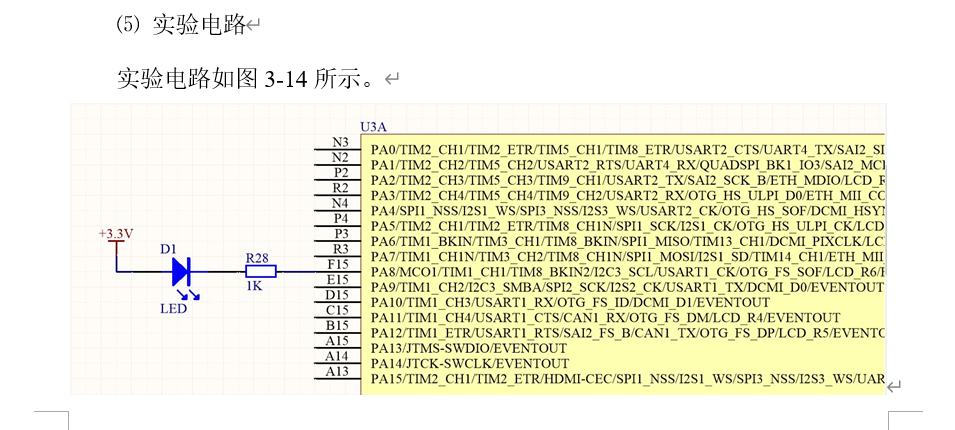
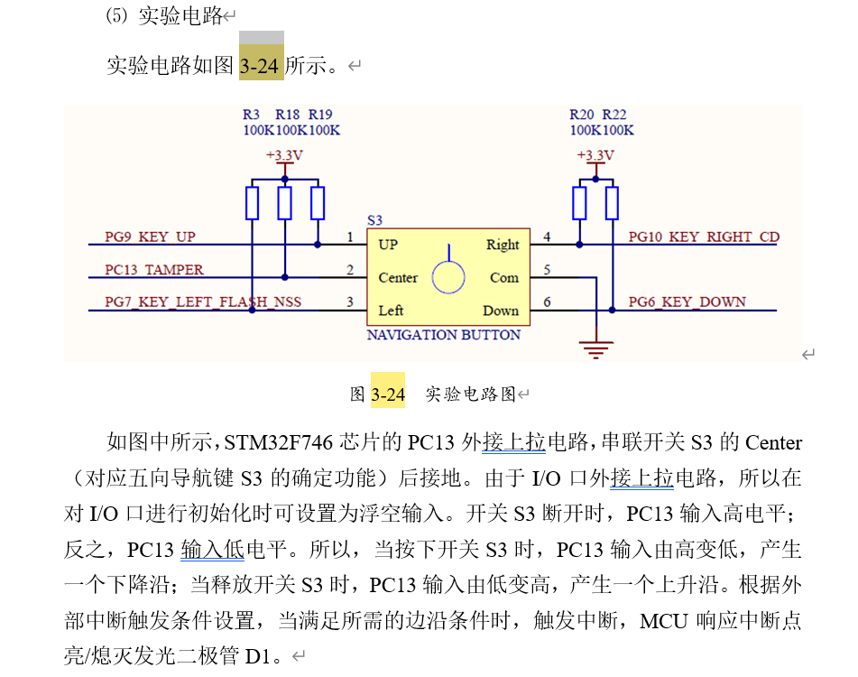

## GPIO

PA8

输出



```c++
/**
  * @brief  Reads the specified input port pin.
  * @param  GPIOx: where x can be (A..K) to select the GPIO peripheral.
  * @param  GPIO_Pin: specifies the port bit to read.
  *         This parameter can be GPIO_PIN_x where x can be (0..15).
  * @retval The input port pin value.
  */
GPIO_PinState HAL_GPIO_ReadPin(GPIO_TypeDef* GPIOx, uint16_t GPIO_Pin)
{
  GPIO_PinState bitstatus;

  /* Check the parameters */
  assert_param(IS_GPIO_PIN(GPIO_Pin));

  if((GPIOx->IDR & GPIO_Pin) != (uint32_t)GPIO_PIN_RESET)
  {
    bitstatus = GPIO_PIN_SET;
  }
  else
  {
    bitstatus = GPIO_PIN_RESET;
  }
  return bitstatus;
}

/**
  * @brief  Sets or clears the selected data port bit.
  *
  * @note   This function uses GPIOx_BSRR register to allow atomic read/modify
  *         accesses. In this way, there is no risk of an IRQ occurring between
  *         the read and the modify access.
  *
  * @param  GPIOx: where x can be (A..K) to select the GPIO peripheral.
  * @param  GPIO_Pin: specifies the port bit to be written.
  *          This parameter can be one of GPIO_PIN_x where x can be (0..15).
  * @param  PinState: specifies the value to be written to the selected bit.
  *          This parameter can be one of the GPIO_PinState enum values:
  *            @arg GPIO_PIN_RESET: to clear the port pin
  *            @arg GPIO_PIN_SET: to set the port pin
  * @retval None
  */
void HAL_GPIO_WritePin(GPIO_TypeDef* GPIOx, uint16_t GPIO_Pin, GPIO_PinState PinState)
{
  /* Check the parameters */
  assert_param(IS_GPIO_PIN(GPIO_Pin));
  assert_param(IS_GPIO_PIN_ACTION(PinState));

  if(PinState != GPIO_PIN_RESET)
  {
    GPIOx->BSRR = GPIO_Pin;
  }
  else
  {
    GPIOx->BSRR = (uint32_t)GPIO_Pin << 16;
  }
}

/**
  * @brief  Toggles the specified GPIO pins.
  * @param  GPIOx: Where x can be (A..I) to select the GPIO peripheral.
  * @param  GPIO_Pin: Specifies the pins to be toggled.
  * @retval None
  */
void HAL_GPIO_TogglePin(GPIO_TypeDef* GPIOx, uint16_t GPIO_Pin)
{
  /* Check the parameters */
  assert_param(IS_GPIO_PIN(GPIO_Pin));

  GPIOx->ODR ^= GPIO_Pin;
}
```

