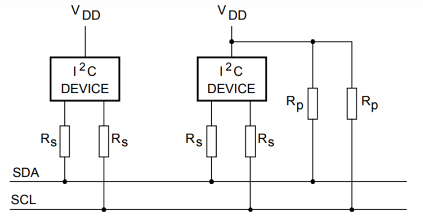
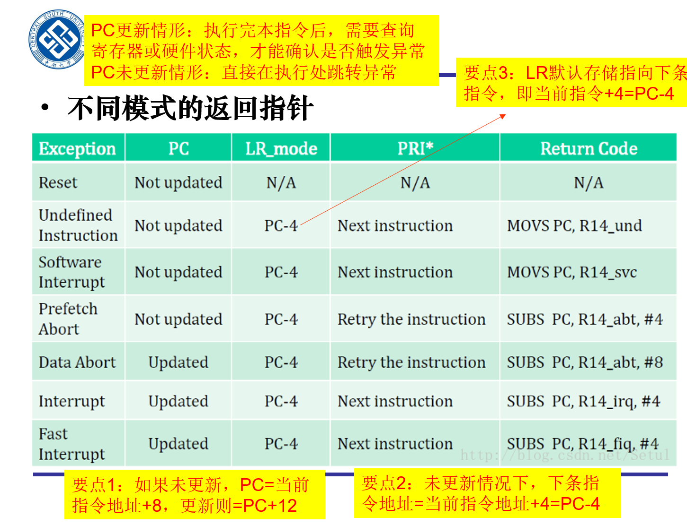
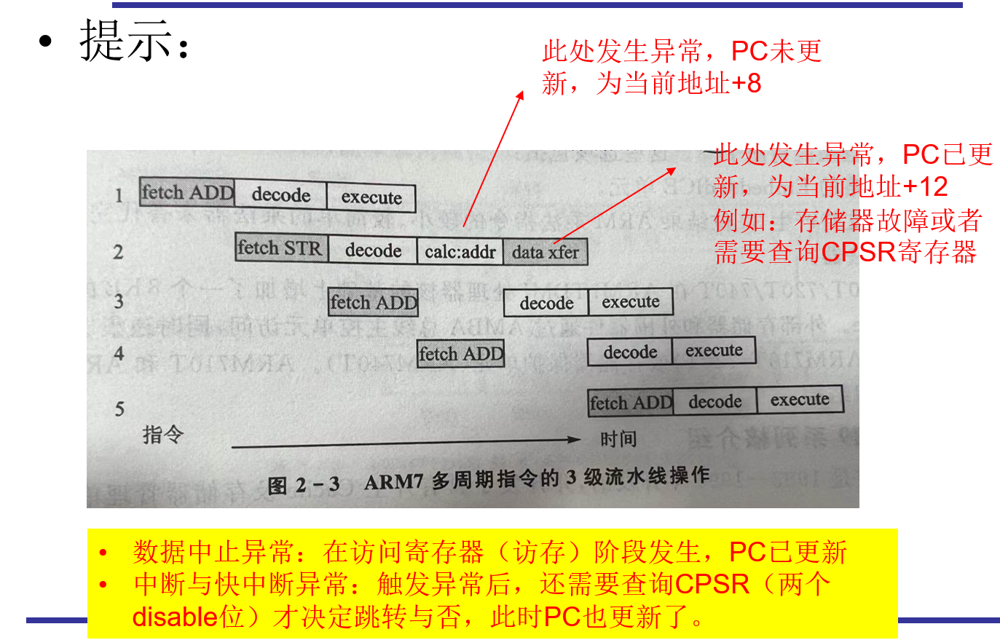
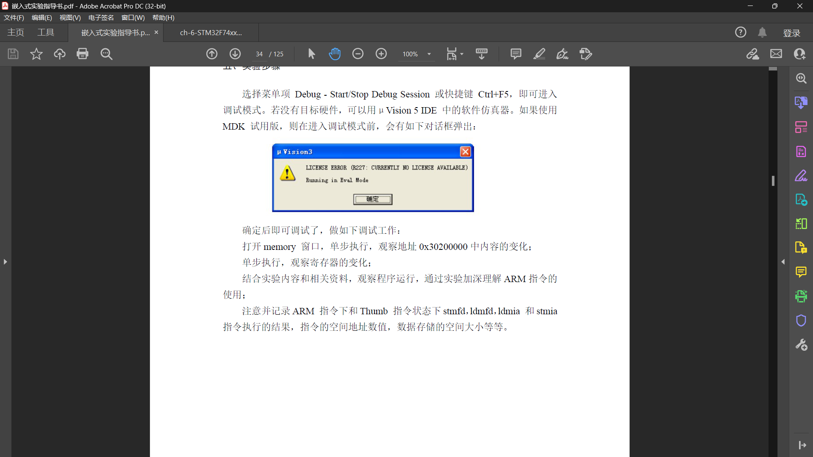
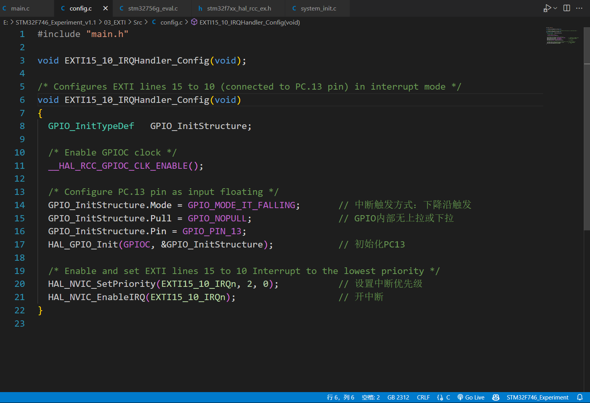

## 第一次作业

### 列举目前市面上常用的嵌入式操作系统名字（越多越好）

1. FreeRTOS：一个小型实时操作系统，特别适用于微控制器和嵌入式设备，具有低延迟和低内存占用的特点。

2. μC/OS：一种小型、可裁剪的实时操作系统，具有高度可移植性和可裁剪性，适用于各种嵌入式系统。

3. ThreadX：一款高度优化的实时操作系统，具有快速启动时间和低内存占用，广泛应用于通信、汽车、工业和消费电子等领域。

4. eCos：嵌入式配置的开源实时操作系统，具有灵活的内核设计和广泛的硬件支持，适用于多种嵌入式应用。

5. VxWorks：一款功能强大的实时操作系统，被广泛应用于工业控制、航空航天、医疗设备等领域，具有高度可靠性和实时性。

6. QNX：一种高度可靠的实时操作系统，特别适用于安全关键型嵌入式系统，如汽车、医疗设备和工业控制。

7. INTEGRITY：一款面向安全关键型应用的实时操作系统，具有严格的安全性和可靠性特性，适用于航空航天、军事和汽车等领域。

8. Linux Embedded：Linux内核的嵌入式版本，具有广泛的软件支持和社区资源，适用于各种嵌入式应用，从消费电子到工业控制等。

9. Zephyr：一个开源的实时操作系统，针对小型嵌入式设备和物联网应用，具有灵活的内核设计和可扩展性。

10. RIOT OS：一款专注于物联网设备的开源操作系统，具有低功耗、低内存占用和多种网络协议支持的特点。

11. Contiki：一种轻量级的开源操作系统，专注于低功耗和物联网应用，具有分布式网络和IPv6支持。

12. TinyOS：一款为传感器网络设计的开源操作系统，具有低功耗和高度分布式的特点，适用于传感器节点等嵌入式设备。

13. NuttX：一个可裁剪的实时操作系统，具有类Unix风格的设计和广泛的硬件支持，适用于各种嵌入式应用。

14. Mbed OS：一款面向物联网设备的开源操作系统，提供丰富的硬件支持和易用的开发工具，加速物联网产品的开发。

15. AliOS Things (AliOS-Things)：由阿里巴巴推出的物联网操作系统，提供丰富的物联网协议支持和云端服务集成。

16. RT-Thread：一款开源的实时操作系统，具有小巧灵活、易裁剪和支持多种编程语言等特点。

17. LiteOS：华为推出的轻量级物联网操作系统，具有低功耗、快速启动和高度安全的特点，适用于各种物联网设备。

18. HarmonyOS：华为推出的分布式操作系统，具有分布式架构、跨设备共享和高度安全的特点，适用于多种智能设备。

19. mLinux：一种基于Linux的嵌入式操作系统，具有丰富的软件支持和易用性，适用于各种嵌入式应用。

20. Contiki-NG：Contiki的下一代版本，继承了Contiki的特点并提供了更多新功能和改进。

### 列举基于模型的系统工程 与 传统开发流程的优势

#### 基于模型的系统工程

基于模型的系统工程（Model-Based Systems Engineering，MBSE）是一种系统工程方法论，它使用抽象的模型来描述、分析和设计复杂系统的结构、行为和性能。

优势：

1. **可视化与抽象化：** 使用模型来描述系统结构和行为，使系统设计变得可视化和更易于理解。这有助于团队成员之间的沟通和协作，以及客户对系统的理解。
2. **自动化分析与验证：** 模型可以用于自动化验证系统的性能、安全性、可靠性等方面的属性，从而提前发现和解决潜在的问题，减少后期成本和风险。
3. **迭代开发与快速原型：** 模型驱动开发允许快速创建原型和模拟，以便在早期阶段发现和验证设计概念，从而加速开发周期。
4. **需求管理和跟踪：** 基于模型的系统工程可以将需求与设计、验证和实现过程相集成，实现需求的跟踪和管理，确保系统的最终交付满足客户需求。
5. **复用性与组件化：** 模型允许设计人员将系统划分为可重用的组件，促进模块化设计和组件化开发，从而提高系统的可维护性和扩展性。

#### 传统开发流程

传统开发流程是指软件或系统开发中使用的传统方法论，通常以线性、阶段性的方式进行，包括需求分析、系统设计、实现、测试和部署等阶段。在传统开发流程中，每个阶段按照严格的顺序进行，并且通常在前一阶段完成后才能开始下一个阶段。

优势：

1. **结构清晰：** 传统开发流程采用阶段性、线性的开发模式，每个阶段有明确定义的任务和目标，使得项目的结构和进程更加清晰明了。
2. **适用性广泛：** 传统开发流程已经在许多项目中得到广泛验证和应用，适用于各种规模和类型的软件开发项目，包括大型企业级系统和小型应用软件。
3. **规范化和标准化：** 传统开发流程强调项目管理、文档管理和质量控制，有成熟的工作流程和标准化的文档模板，有助于提高开发质量和可维护性。
4. **风险管理：** 传统开发流程通过将项目分解为多个阶段，并在每个阶段引入严格的验证和审查机制，有助于及早发现和解决问题，降低项目风险。
5. **可控性和可预测性：** 传统开发流程通过严格的计划和控制，使得项目的进度和成本更加可控和可预测，有助于满足客户的需求和期望。
6. **文档化程度高：** 传统开发流程注重文档的编写和管理，包括需求文档、设计文档、测试文档等，有助于记录项目的历史和知识，提高项目的可维护性和可持续性。

### 列举RISC-V相对ARM构架的优势和缺陷，各三条

优势

1. **开放性和灵活性：** RISC-V 是一种开放的指令集架构，可以自由访问其规范和设计，而 ARM 架构则受到 ARM 公司的专利限制。这种开放性使得 RISC-V 更具灵活性，可以根据需求进行定制和优化。
2. **低成本和可定制性：** RISC-V 的开放性使得其在芯片设计和制造方面成本更低，同时也更容易定制，用户可以根据具体应用需求进行自定义设计，提高性能和功耗效率。
3. **社区支持和生态系统：** RISC-V 社区日益壮大，吸引了众多厂商和开发者的参与，推动了 RISC-V 生态系统的发展。相比之下，ARM 生态系统虽然庞大，但也受到 ARM 公司的控制，对于一些新兴市场和创新项目，RISC-V 的社区支持可能更具吸引力。

劣势

1. 由于RISC-V诞生时间太短，相关的编译器、开发工具和软件开发环境（IDE）以及其它生态要素还在发展；
2. RISC-V 定义了一个很小的、带有扩展的ISA，导致**ISA碎片化**；
3. RISC-V **尚未实现部分性能的提升**，如超标量执行等。

### 查询自己手机的处理器型号、性能和参数，并描述其ARM版本（或源自的版本），以及指令集的版本

**型号**：Exynos 1080

**性能**：三星 Exynos 1080 处理器采用最新（*2020年底*） 5nm 制程工艺，相较三星 7nm 工艺制程，三星 5nm 制程在晶体管数量密度上增加超过 80%，能够带来更强性能和更低的功耗。三星表示，此次Exynos 1080处理器采用的是全新的CPU架构核心，单核性能提升50%，多核性能提升近2倍。Exynos1080 5G采用1个大核+3个中核+4个小核的核心配置，其中大核与中核采用的是A78的架构，小核采用的是A55的架构。大核最高主频能达到2.8GHz。

**参数**：

|   项目   |                  参数                  |
| :------: | :------------------------------------: |
| 网络制式 |              2G/3G/4G/5G               |
| CPU制程  |                  5nm                   |
| CPU配置  | 1*A78@2.8GHz+3*A78@2.6GHz+4*A55@2.0GHz |
|   GPU    |             Mali™-G78 GPU              |
| 通用闪存 |                UFS 3.1                 |

**ARM版本**

Arm cortex-A78 CPU，Arm cortex-A55 CPU

Mali-G78 GPU

**指令集**

ARM v8.2

## 第二次作业

### 深入调研并介绍IIC总线的结构、通信原理、特点（速度、同步性、双工性等）等。从理解的角度分析IIC总线的优缺点（相对SPI和CAN）

I²C（Inter-Integrated Circuit）总线，也被称作IIC或I2C，是一种广泛使用的串行通信协议，主要设计用于芯片之间的短距离通信。它由Philips Semiconductor（现在的NXP Semiconductors）在1980年代早期推出

#### IIC总线的结构与通信原理

IIC总线采用两线制，包括一个串行数据线（SDA）和一个串行时钟线（SCL），通过这两根线实现多个设备之间的通信。所有的IIC设备都连接到同一对SDA和SCL上，每个设备都有一个唯一的地址。通信的两端各有一个主设备和一个或多个从设备。主设备控制总线的访问，从设备响应主设备的命令并提供数据。总线上的设备通过IIC地址进行寻址。



#### IIC总线的通信原理

IC总线采用主从结构进行通信，主设备可以是任何一台能够控制总线的设备（通常是微控制器），而从设备则是被控制的设备（如温度传感器、EEPROM存储器等）。通信分为两种模式：传输模式和接收模式。在传输模式下，主设备向从设备发送数据，从设备负责接收并响应；在接收模式下，主设备向从设备发送命令，从设备则会发送数据给主设备。

在IIC总线通信时，主设备控制SCL线的时钟信号，而SDA线上的数据则在时钟信号的控制下进行传输。传输时，主设备在SCL线上产生时钟脉冲，同时在SDA线上发送数据位。从设备在时钟脉冲的控制下读取SDA线上的数据位，并在下一个时钟脉冲的前沿将其应答给主设备。如果数据传输成功，则从设备返回应答信号。

通信时，一个主设备（master）通过SCL线控制时钟信号，启动和终止数据传输，而一个或多个从设备（slave）根据主设备的指令进行响应。

#### IIC总线的特点

- **速度**：IIC总线的速度取决于SCL线上的时钟频率。IIC总线支持多种速度模式，包括标准模式（100kbps）、快速模式（400kbps）、快速模式加（1Mbps）和高速模式（3.4Mbps）。
- **同步性**：IIC是一种同步通信协议，意味着数据传输是由时钟信号（SCL）来同步的。主设备通过控制时钟信号来确保通信的同步性，从而保证数据的准确传输。
- **双工性**：IIC总线支持双向通信，即主设备和从设备都可以发送和接收数据。主设备可以在任何时候控制总线的访问，并根据需要在总线上发送数据或接收数据。从设备只有在主设备允许时才能发送数据，并且只有在主设备发起读操作时才能发送数据。在同一时间内，IIC总线只能进行读或写操作，不能同时进行，属于半双工同步传输型总线。
- **多主机支持**：IIC总线支持多主机系统，即在同一总线上连接多个主设备。在这种情况下，每个主设备都有自己的地址，并且在使用总线之前必须获得总线的控制权。多主机系统可以提高系统的灵活性和可扩展性，可以实现更复杂的系统设计。
- **适用范围广**：IIC总线的应用范围非常广泛，可以用于连接各种类型的设备，如传感器、存储器、显示屏、电机驱动器等。它也可以用于通信距离比较短的应用场景，如板级通信、嵌入式系统等。

#### IIC总线的优点

- **简单性**：由于仅使用两根线进行通信，IIC总线的物理接口简单，有利于降低系统的复杂度和成本。相对于SPI总线和CAN总线，IIC总线只需要两条信号线进行通信，因此线路非常简单，易于实现和维护。相比之下，SPI总线需要四条信号线（一个主设备选择线、一个主设备输出线、一个从设备输出线和一个时钟线），而CAN总线需要两条信号线（一个CAN高速线和一个CAN低速线），因此IIC总线在线路复杂度方面具有优势。
- **灵活性**：可以在同一总线上连接多个从设备，且每个设备都有唯一的地址，易于扩展。
- **支持多主设备**：IIC协议支持多个主设备在同一总线上协作，在同一总线上连接多个主设备，每个主设备都有自己的地址，并且在使用总线之前必须获得总线的控制权，增加了系统的灵活性。而SPI总线只支持单主机系统，CAN总线虽然支持多主机系统，但需要使用更复杂的控制协议。

#### IIC总线的缺点

- **速度较慢**：相比于SPI和CAN，IIC在速度上通常较慢，特别是在数据量大或距离较远的情况下。相比之下，SPI总线的最高速度可以达到100Mbps，CAN总线的最高速度可以达到1Mbps或更高，因此在速度方面，IIC总线具有劣势。
- **总线冲突**：在多主模式下，可能会出现总线冲突的情况，需要通过复杂的算法来管理。
- **同步性差**：IIC总线的同步性较差，因为IIC总线的时钟由主设备控制，因此在一些高精度时序要求的应用中可能会出现问题。相比之下，SPI总线和CAN总线都具有较好的同步性，因为它们都有独立的时钟线。
- **双工性差**：IIC总线的双工性较差，在同一时间内，IIC总线只能进行读或写操作，不能同时进行；而SPI总线和CAN总线都具有良好的双工性，可以同时进行读和写操作。
- **距离限制**：由于信号的电容效应，IIC总线在距离较长时可能会出现信号质量问题。

#### 相对于SPI和CAN的比较

- **相对于SPI**：SPI通常提供更高的数据传输速率，并且可以实现全双工通信。然而，SPI需要更多的信号线（至少需要三根线，通常是四根），这在物理连接和成本上可能不如IIC经济。
- **相对于CAN**：CAN总线专为汽车及其他需要高可靠性和较长距离通信的环境设计，支持更高的抗干扰能力和错误处理机制。IIC则更适用于板级通信或短距离应用，成本更低，但抗干扰能力较弱。

### 结合下面两幅图和课堂内容，设异常触发指令的地址为0xFFFF0100，计算一下各个异常模式时，PC、LR、PRI*、Return Code的具体取值，写明分析过程。





#### Reset模式

在Reset模式下，处理器会执行一系列初始化操作，包括将寄存器清零和设置中断向量表等。

PC未更新，PC=异常触发指令地址+8，PC地址0xFFFF0108

LR、PRI*、Return Code均为N/A（不确定）。

#### Undefined Instruction模式

当处理器遇到一条无法识别的指令时，它会进入Undefined Instruction异常模式。在这个模式下，处理器会暂停执行，并且会向操作系统发出一个异常信号，以便系统处理这个异常。

PC未更新，PC=异常触发指令地址+8，PC地址0xFFFF0108

LR=PC-4，LR地址0xFFFF0104

PRI\*为下一条指令的地址，PRI\*地址0xFFFF0104

Return Code：`MOVS PC,R14_und`，当执行 MOVS PC, R14_und 指令时，将恢复PC（从R14_und），并返回到未定义指令后的下一条指令，则Return Code为0xFFFF0104

#### Software Interrupt模式

当执行软件中断指令时，处理器会进入Software Interrupt异常模式。该模式用于处理与处理器相关的软件中断请求。

PC未更新，PC=异常触发指令地址+8，PC地址0xFFFF0108

LR=PC-4，LR地址0xFFFF0104

PRI\*为下一条指令的地址，PRI\*地址0xFFFF0104

Return Code：`MOVS PC,R14_svc`，当执行指令时，将恢复PC（从R14_svc）和CPSR（从SPSR_svc）的值，并返回到SWI的下一条指令，则Return Code为0xFFFF0104

#### Prefetch Abort模式

当处理器试图执行从内存中读取的非法指令或数据时，会触发Prefetch Abort异常。

PC未更新，PC=异常触发指令地址+8，PC地址0xFFFF0108

LR=PC-4，LR地址0xFFFF0104

PRI\*重做指令，PRI\*地址0xFFFF0100

Return Code：`SUBS PC,R14_abt,#4`，当执行指令后，将重新执行被中止的指令，则Return Code为0xFFFF0100。

#### Data Abort模式

当处理器试图执行或存储非法数据时，会触发Data Abort异常。这可能是因为数据不在可寻址的内存空间中，或者由于硬件错误而导致读取或写入失败。

PC更新，PC=异常触发指令地址+12，PC地址0xFFFF010C

LR=PC-4，LR地址0xFFFF0108

PRI\*重做指令，PRI\*地址0xFFFF0100

Return Code：`SUBS PC,R14_abt,#8`，当执行指令后，将重新执行被中止的指令，则Return Code为0xFFFF0100。

#### Interrupt模式

当处理器接收到来自外部设备的中断信号时，会进入Interrupt异常模式。在该模式下，处理器会执行特定的中断服务例程，以响应外部中断请求。

PC更新，PC=异常触发指令地址+12，PC地址0xFFFF010C

LR=PC-4，LR地址0xFFFF0108

PRI\*为下一指令，PRI\*地址0xFFFF0104

Return Code：`SUBS PC,R14_irq,#4`，当执行指令后，将重新执行被中止的指令，则Return Code为0xFFFF0104。

#### Fast Interrupt模式

当Fast Interrupt信号被触发时，处理器会立即跳转到Fast Interrupt异常模式，并且禁用中断响应。在该模式下，处理器会执行特定的中断服务例程，以尽快响应高优先级的中断请求。

PC更新，PC=异常触发指令地址+12，PC地址0xFFFF010C

LR=PC-4，LR地址0xFFFF0108

PRI\*为下一指令，PRI\*地址0xFFFF0104

Return Code：`SUBS PC,R14_fiq,#4`，当执行指令后，将重新执行被中止的指令，则Return Code为0xFFFF0104。

## 第三次作业

### SUB R3，R2，R1，LSR R0 写出上面指令的32位编码，并说明每一位（或几位）的含义。

| 指令编码（从高位到低位） | 位数  |                     含义                     |
| :----------------------: | :---: | :------------------------------------------: |
|           1110           | 31-28 | 条件位，为默认值AL，表示任何时候都执行本指令 |
|           000            | 27-25 |                      -                       |
|           未知           | 24-21 |                  SUB操作码                   |
|            0             |  20   |             不影响CPSR寄存器的值             |
|           0010           | 19-16 |            第一个操作数的寄存器R2            |
|           0011           | 15-12 |                 目标寄存器R3                 |
|          00000           | 11-7  |            左移位数的存放寄存器R0            |
|            01            |  6-5  |                 LSR逻辑右移                  |
|            0             |   4   |                      -                       |
|           0001           |  3-0  |            第二个操作数的寄存器R1            |

### 读程序，给每一行增加注释，并说明执行过程中R0,R1,R2的值如何变化

```assembly
AREA StrCopy, CODE, READONLY ; 定义代码区域，不可修改，只可读
ENTRY            ; 指定程序的入口点
start            ; 程序入口

X EQU 88           ; 定义符号常量X为88
Y EQU 76           ; 定义符号常量Y为76
Z EQU 96           ; 定义符号常量Z为96

STACK_TOP EQU 0X1000     ; 定义符号常量STACK_TOP为0X1000
  MOV R0, #0XAB      ; 把0XAB的值加载到寄存器R0中，R0=0xAB
LOOP1
  MOV R0, R0, ASR #1    ; 把R0右移一位，并把结果存回R0，R0=0x55，第二次执行该语句时变为R0=0x2A
  CMP R0, #0X50      ; 比较R0与0X50的大小
  BGE LOOP1        ; 如果R0大于等于0X50则跳转到LOOP1标记处（此处会跳转）
  MOV R1, #Y        ; 把Y的值加载到寄存器R1中，R1=76=0x4C
  ADD R2, R0, R1, LSL #1  ; 把R0和R1左移一位的结果相加，存入R2中, R2=R0+R1*2=0xC2
  MOV SP, #0X1000     ; 把0X1000的值加载到栈指针寄存器SP中
  STR R2, [SP]       ; 把R2的值存入以栈指针寄存器SP的值为地址的存储单元中
  MOV R0, #Z        ; 把Z的值加载到寄存器R0中,R0=96=0x60
  AND R0, R0, #0XFF    ; 把R0与0XFF进行与运算，存入R0中, R0=0x60
  MOV R1, #Y        ; 把Y的值加载到寄存器R1中,R1=76=0x4C
  ADD R2, R0, R1, LSR #1  ; 把R0和R1右移一位的结果相加，存入R2中,R2=R0+R1/2=0x86
  LDR R0, [SP]       ; 将以栈指针寄存器SP的值为地址的存储单元中的内容加载到寄存器R0中,R0=0xC2
  MOV R1, #0X01      ; 把0X01的值加载到寄存器R1中，R1=0x01
  ORR R0, R0, R1      ; 把R0和R1进行或运算，存入R0中,R0=0xC3
  MOV R1, R2        ; 把R2的值加载到寄存器R1中,R1=0x86
  ADD R2, R0, R1, LSR #1  ; 把R0和R1右移一位的结果相加，存入R2中,R2=R0+R1/2=0x106
STOP
  B STOP          ; 无条件跳转到STOP标记处，即进入死循环
END
```

LOOP1执行两次循环，直到R0=0x2A<0x50

R1=0x4C

R2=R0+R1*2=0xC2

R0=0x60

R1=0x4C

R2=R0+R1/2=0x86

R0=0xC2

R1=0x01

R0=0xC3

R1=0x86

R2=R0+R1/2=0x106

程序最终运行结果为：R0=0xC3, R1=0x86, R2=0x106

## 第四次作业

### 安装ARM编译环境


对项目代码进行编译，显示0 Errors, 0 Warnings，说明环境配置正常，编译通过；

### 运行STM32F746_Experiment_v1.1\01_汇编\3.1_asm1\Asm1_b例程，进入debug模式

1）阅读并调试代码，观察每行代码的地址位置、代码指令编码、代码反编译结果、寄存器更新值。在提交作业中，把所有代码复制一遍，在注释中给出每行代码运行后寄存器（或存储器）的值更新情况。
2）截图uVision5程序运行完毕时，寄存器窗口R0-R15的值，以及memory窗口中0x30200000位置处的值。

启动debug界面如下


阅读代码，计算每行代码的目标寄存器的值。

```assembly
;#********************************************************************************************
;# NAME:		asm1_b.s													                                               *
;# Author: 	WUHAN R&D Center, Embest									                                       *
;# Desc:		ARM instruction examples									                                       *
;# History:	TianYunFang 2007.05.12										                                       *
;#********************************************************************************************
;/*------------------------------------------------------------------------------------------*/
;/*	 					constant define		 			 				                                               */
;/*------------------------------------------------------------------------------------------*/
x			EQU 45							      ;/* x=45 */
y			EQU	64							      ;/* y=64 */
z			EQU	87								    ;/* z=87 */
stack_top	EQU	0x30200000			  ;/* define the top address for stacks*/
			                 export	Reset_Handler

;/*-------------------------------------------------------------------------------------------*/
;/*	 					                           code						 	                                    */
;/*-------------------------------------------------------------------------------------------*/
	AREA text,CODE,READONLY

Reset_Handler										;/* code start */
		mov		r0, #x 								;/* R0=0x2D  */
		mov		r0, r0, lsl #8						;/* R0=0x2D00  */
		mov		r1, #y								;/* R1=0x40  */
		add		r2, r0, r1, lsr #1					;/* R2=0x2D20 */
		ldr		sp, =stack_top						;/* SP=0x30200000 */
		str		r2, [sp]							

		mov		r0, #z								;/* R0=0x57  */
		and		r0, r0, #0xFF						;/* R0=0x57 */
		mov		r1, #y								;/* R1=0x40  */
		add		r2, r0, r1, lsr #1					;/* R2=0x77 */
		
		ldr		r0, [sp]							;/* R1=0x40 */
		mov		r1, #0x01							;/* R1=0x01 */
		orr		r0, r0, r1							;/* R0=0x2D21
		mov		r1, R2								;/* R1=0x77  */
		add		r2, r0, r1, lsr #1					;/* R2=0x2D5C  */

stop
		b		stop								    ;/* end the code £¬cycling*/
		END

```

截图uVision5程序运行完毕


## 第五次作业

### 阅读发布的Um_s3c2410.pdf开发手册，回答如下问题

#### 对于I/O端口操作需求，假设GPB0端口连接了一个按键，我需要读按键的值。

##### 至少需要操作哪两个寄存器，对应的地址是多少

搜索“GPB0”，找到寄存器名和地址

需要以下两个寄存器

1. GPBCON寄存器，寄存器的地址为0x56000010
2. GPBDAT寄存器，寄存器的地址为0x56000014

##### 需要操作这两个寄存器的哪几个bit位，如何操作

提示：例如 传感器GP****[0:1]=00，按键值=GP***[*]

* 寄存器GPBCON[1:0]=01
* 按键值=GPBDAT[0]

#### 解释下列寄存器的含义以及地址

1. ADCCON

   含义：ADC控制寄存器。这个寄存器用于控制模拟到数字转换器（ADC）的配置和操作。它可能包含启动ADC转换、选择输入通道、设置采样率等选项。

   地址：0x58000000

2. WTCON

   含义：看门狗定时器控制寄存器。这个寄存器用于配置和控制看门狗定时器的操作。看门狗定时器是一种硬件计时器，用于监控系统的正常运行。如果系统在一定时间内没有响应，看门狗定时器会触发一个复位或其他动作。

   地址：0x53000000

3. SPPIN0

   含义：串行端口引脚输入控制寄存器。这个寄存器用于控制与串行通信相关的引脚输入。它可能包含配置串行端口的输入方向、输入缓冲区等功能。

   地址：0x59000008

4. BWSCON

   含义：总线宽度和存储空间大小控制寄存器。这个寄存器用于配置系统的总线宽度和存储空间的大小。它可能包含设置数据总线宽度、地址空间大小等选项。

   地址：0x48000000

5. BANKSIZE

   含义：存储体大小寄存器。这个寄存器用于确定存储器的组织方式和大小。它可能包含设置存储体的行数、列数等参数，以确定存储器的容量和访问方式。

   地址：0x48000028

### 结合STM32F746_Experiment_v1.1\01_汇编\common\src\2410init.s和sys_init.c\interrupts_init()。进行程序分析。

#### 分析sys_init.c\debug_swi()函数的执行效果。代码+注释的方式。

```c++
void debug_swi(void)
{
	uart_printf("!!!Enter SWI exception. %d\r\n", nCNT+=1);	//将字符串"!!!Enter SWI exception. %d\r\n"打印到串口输出。其中，%d是一个占位符，用于显示变量nCNT的值
	break_point(); //调用break_point()函数，进入中断
}
```

这个函数是进入软件中断SWI的一个函数，并呈现当前的中断状态

看一下`break_point()`函数

```c++
void break_point(void)
{
	int i;	
	char m = 200;
	uart_printf("!!!Enter break point.");	//将字符串"!!!Enter break point."打印到串口输出

	rGPFCON=0x5500;                  //PORTF7/6/5/4 OUTPUT，配置端口F7、F6、F5和F4为输出模式
	rGPFUP=0;                        //PULL-UP ENABLE ，启用上拉电阻
	while(m) {
		rGPFDAT=0; //将寄存器rGPFDAT的值设置为0
		beep(1); //调用beep(1)函数发出声音
		for(i=0;i<20000;i++); //通过一个空循环进行延时
		rGPFDAT=0xF0; //将寄存器GPFDAT的值设置为0xF0
		beep(0); //调用beep(0)函数停止声音
		for(i=0;i<20000;i++);//再次通过一个空循环进行延时
		m--;
	}//当m的值减到0时，退出循环
}
```

进入断点时通过控制GPIO端口F7、F6、F5和F4来产生声音信号

#### 分析2410init.s和2410init.s，并结合课上内容，以EINT3中断（设定为IRQ）为例，说清楚跳中断是如何传入ARM，并最终被执行的，可截取关键代码进行注释描述。


* 请求源（带有子寄存器）：这表示有中断请求的源，并且这些源有关联的子寄存器。
* SUBSRCPND：子源挂起寄存器，记录了哪些中断源发出了中断请求。
* SUBMASK：子掩码寄存器，用于决定哪些子中断源可以影响主中断挂起状态。
* SRCPND：源挂起寄存器，记录了当前哪些中断源发出了中断请求。
* MASK：掩码寄存器，用于控制是否允许对应的中断源产生中断信号。
* MODE：模式选择，可能用于选择不同的中断处理模式。
* INTPND：中断挂起，显示了当前正在等待处理的中断。
* 优先级：此处可能涉及优先级逻辑，以决定哪个中断信号将被优先处理。
* IRQ：常规中断请求，处理普通优先级的中断。
* FIQ：快速中断请求，处理高优先级的中断

中断信号的行进路线：

1. 中断源发出中断请求
2. 这个请求被记录在SUBSRCPND或SRCPND中，取决于是否带有子寄存器。
3. 通过SUBMASK和MASK控制这些请求是否会被允许影响处理器状态。
4. 如果不允许中断，中断信号被挂起
5. 如果允许，中断请求信号就会基于优先级逻辑产生一个中断，要么是常规的IRQ，要么是快速的FIQ。


在`sys_init.c\interrupts_init()`中看到

```c++
pISR_EINT3     	= (unsigned) break_point;
```

这里是初始化中断服务程序

当外部事件（如按键按下、传感器触发等）发生时，它会通过GPIO（通用输入输出）或其他外部中断线路触发EINT3。

```assembly
.equ	HandleEINT3,	_ISR_STARTADDRESS+4*11
```

设定为IRQ

查询到

```assembly
HandlerIRQ      HANDLER HandleIRQ
```

搜索宏`HANDLER`，并阅读宏定义

```assembly
.macro HANDLER HandleLabel
    sub	    sp,sp,#4				/* 减去sp的值（以存储跳转地址） */
    stmfd   sp!,{r0}				/* 将工作寄存器r0压栈（lr不压栈，因为它返回到原始地址） */
    ldr	    r0,=\HandleLabel		/* 将HandleXXX的地址加载到r0 */
    ldr	    r0,[r0]					/* 加载HandleXXX的内容（服务例程的起始地址）到r0 */
    str	    r0,[sp,#4]				/* 将HandleXXX的内容（ISR）存储到栈上 */
    ldmfd   sp!,{r0,pc}				/* 从栈中弹出工作寄存器和程序计数器pc（跳转到ISR） */
.endm
```

```assembly
MACRO
$HandlerLabel HANDLER $HandleLabel

$HandlerLabel
	sub	sp,sp,#4	;decrement sp(to store jump address)
	stmfd	sp!,{r0}	;PUSH the work register to stack(lr does not push because it return to original address)
	ldr     r0,=$HandleLabel;load the address of HandleXXX to r0
	ldr     r0,[r0]	 ;load the contents(service routine start address) of HandleXXX
	str     r0,[sp,#4]      ;store the contents(ISR) of HandleXXX to stack
	ldmfd   sp!,{r0,pc}     ;POP the work register and pc(jump to ISR)
MEND
```

在_ISR_STARTADDRESS=0x33FF_FF00里定义的第一级中断向量表是采用型如Handle\*\*\*的方式的

而在程序的ENTRY处(程序开始处)采用的是b Handler***的方式

在这里Handler\*\*\*就是通过HANDLER这个宏和Handle***建立联系的

然后跳转到位于0x18处的统一中断函数中该函数通过读取interrupt pending寄存器中对应标志位 来判断中断源 并根据优先级关系再跳到对应中断源的处理代码中

我们要处理的就是IRQ

下面这段程序是用来处理非向量中断（EINT3），具体判断I_ISPR中各位是否置1 置1表示目前此中断等待响应（每次只能有一位置1），从最高优先级中断位开始判断，检测到等待服务中断就将pc置为中断服务函数首地址

```assembly
IsrIRQ
    sub	sp,sp,#4       ; 为PC（程序计数器）保留空间
    stmfd	sp!,{r8-r9}  ; 将r8和r9寄存器压栈保存

    ldr	r9,=INTOFFSET  ; 将INTOFFSET的地址加载到r9
    ldr	r9,[r9]        ; 加载INTOFFSET的内容到r9，这可能是一个中断向量偏移量
    ldr	r8,=HandleEINT0  ; 将HandleEINT0的地址加载到r8
    add	r8,r8,r9,lsl #2  ; 将r8和r9的值相加，r9左移两位，得到具体的中断处理函数地址
    ldr	r8,[r8]        ; 加载r8指向的地址中的值，即中断处理函数的入口地址
    str	r8,[sp,#8]     ; 将中断处理函数的入口地址存储到栈上，位置是sp+8
    ldmfd	sp!,{r8-r9,pc} ; 从栈中弹出r8, r9和pc，并将pc设置为中断处理函数的入口地址，跳转到中断处理函数

    LTORG
```

这里需要将当前pc进栈，然后将pc的地址赋给EINT3的首地址，即`_ISR_STARTADDRESS+4*11`

### 以实验包中“STM32F746_Experiment_v1.1\02_GPIO”例程为例子，描述STM32系列嵌入式系统的启动过程（如何调用到main函数的，之前经过了哪些初始化工作）。

参考资料如下：

1) STM32F74xx中文参考手册(1).pdf （STM32F746_Experiment_v1.1目录下）

2) 上课讲课的PPT

3) 自行网上搜索。例如：https://blog.csdn.net/luobeihai/article/details/117595762

#### 设置栈和堆的信息

##### 栈

```assembly
Stack_Size   EQU   0x00000400
	AREA  STACK, NOINIT, READWRITE, ALIGN=3
	Stack_Mem    SPACE  Stack_Size
__initial_sp
```

开辟栈的大小为 0X00000400（1KB），栈的作用是用于局部变量、函数调用、函数形参等的开销；标号`__initial_sp`紧挨着 SPACE 语句放置，表示栈的结束地址，即栈顶地址。

##### 堆

```assembly
Heap_Size    EQU   0x00000200
	AREA  HEAP, NOINIT, READWRITE, ALIGN=3
__heap_base
Heap_Mem    SPACE  Heap_Size
__heap_limit
     PRESERVE8
     THUMB
```

开辟堆的大小为 0X00000200（512 字节），heap_base 表示堆的起始地址， heap_limit 表示堆的结束地址。堆主要用来动态内存的分配。

#### 定义中断向量表

```assembly
__Vectors    DCD   __initial_sp    ; Top of Stack
        DCD   Reset_Handler        ; Reset Handler
        DCD   NMI_Handler      	   ; NMI Handler
        DCD   HardFault_Handler    ; Hard Fault Handler
        DCD   MemManage_Handler    ; MPU Fault Handler
        DCD   BusFault_Handler     ; Bus Fault Handler
        DCD   UsageFault_Handler   ; Usage Fault Handler        
		......
```

ARM 规定向量表的起始位置存放的是栈顶指针 MSP 的地址值，紧接着存放的是复位中断入口函数的地址。当刚上电的时候，硬件会根据向量表的地址找到向量表的具体位置（对于向量表的地址是可以通过 NVIC 中的一个重定位寄存器来设置的，复位时该寄存器的值为0），然后会根据向量表中的这两个数据，设置 SP、PC 的值，这时 CPU 就会从复位中断的入口函数开始取指令运行程序。

#### 调用SystemInit函数，设置系统时钟

```assembly
Reset_Handler  PROC
       EXPORT Reset_Handler       [WEAK]
       IMPORT __main
       IMPORT SystemInit
       LDR   R0, =SystemInit
       BLX   R0        			; 调用SystemInit函数
       LDR   R0, =__main
       BX   R0
ENDP
```

硬件设置好了 SP、PC 的值后，这时CPU 会从 Reset_Handler 处开始取指令运行，首先会调用 SystemInit 函数来初始化系统时钟，该函数是官方固件库提供的一个库函数，在 system_stm32f7xx.c 文件中定义如下：

```c
void SystemInit(void)
{
 /* FPU settings */
 #if (__FPU_PRESENT == 1) && (__FPU_USED == 1)
 SCB->CPACR |= ((3UL << 10*2)|(3UL << 11*2)); /* set CP10 and CP11 Full Access */
 #endif
 
 /* Reset the RCC clock configuration to the default reset state */
 /* Set HSION bit */
 RCC->CR |= (uint32_t)0x00000001;
 
 /* Reset CFGR register */
 RCC->CFGR = 0x00000000;

 /* Reset HSEON, CSSON and PLLON bits */
 RCC->CR &= (uint32_t)0xFEF6FFFF;

 /* Reset PLLCFGR register */
 RCC->PLLCFGR = 0x24003010;

 /* Reset HSEBYP bit */
 RCC->CR &= (uint32_t)0xFFFBFFFF;

 /* Disable all interrupts */
 RCC->CIR = 0x00000000;

#if defined (DATA_IN_ExtSRAM) || defined (DATA_IN_ExtSDRAM)
	SystemInit_ExtMemCtl(); 
#endif /* DATA_IN_ExtSRAM || DATA_IN_ExtSDRAM */

/* Configure the Vector Table location add offset address */
#ifdef VECT_TAB_SRAM
	SCB->VTOR = SRAM1_BASE | VECT_TAB_OFFSET; /* Vector Table Relocation in Internal SRAM */
#else
 	SCB->VTOR = FLASH_BASE | VECT_TAB_OFFSET; /* Vector Table Relocation in Internal FLASH */
#endif
}
```

该函数完成以下功能：

- **FPU 设置部分**：如果芯片支持 FPU（浮点运算器），则设置 CP10 和 CP11 为完全访问权限。
- **RCC 时钟配置部分**：将芯片的 RCC 寄存器设置为默认值。具体步骤包括：
  - 打开 HSION（内部高速时钟）位。
  - 重置 CFGR 寄存器为 0；
  - 关闭 HSEON（外部高速时钟）、CSSON（时钟安全系统）和 PLLON（锁相环）位；
  - 将 PLLCFGR 寄存器重置为默认值；
  - 关闭 HSEBYP（外部高速时钟旁路）位；
  - 禁用所有中断。
- **外部存储器部分**：如果使用外部存储器（如外部 SRAM 或 SDRAM），则调用 SystemInit_ExtMemCtl() 函数进行配置。
- **向量表位置部分**：根据宏定义的设置，将向量表位置设置为内部 SRAM 或内部 FLASH。

#### 调用__main函数

__main 函数是系统自带的库函数

接下来就跳转到了 __scatterload 函数，从函数名可以看出这是一个分散加载函数，该函数主要实现的功能就是数据段的重定位和清除 bss 段，初始化栈空间。

#### 调用main函数

scatterload 函数最后调用了 main_after_scatterload 函数，这个函数实现的功能就是跳转到了用户的 main 函数，进入到用户程序。__main_after_scatterload 函数的代码如下：

```assembly
__main_after_scatterload
  _main_clock
  _main_cpp_init
  _main_init
    0x08000138:  4800    .H   LDR   r0,[pc,#0] ; [0x800013c] = 0x80004c1
    0x0800013a:  4700    .G   BX    r0
```

可以看出，代码最后跳转到了 r0 寄存器所指示的地址中去了，实际上这个地址就是用户的 main 函数地址。由此完成 STM32 的启动过程，接下来运行的是用户程序的代码。

## 第六次作业

### 自学工作





### 以main.c函数为代码起点，通过向内层代码跳转（CTRL + 鼠标左键），弄清楚整个代码的执行流程（截图分析执行流程）。

```c++
int main(void)
{
  System_Init();
  
  /* Initialize LED1 mounted on board */
  BSP_LED_Init(LED1);
  
  /* Configure EXTI15_10 (connected to PC.13 pin) in interrupt mode */
  EXTI15_10_IRQHandler_Config();
  
  while (1)
  {
  }
}
```

上述是`main.c`中的`main`函数，

1. 首先调用`System_Init()`函数进行系统初始化，跳转到对应界面得到的是

   

   ```c++
   void System_Init(void)
   {
     /* Enable the CPU Cache */
     CPU_CACHE_Enable(); // 启用CPU缓存以提高系统性能
   
     /* STM32F7xx HAL library initialization */
     HAL_Init(); // 初始化STM32F7系列的HAL库，配置系统级的硬件抽象层
   
     /* Configure the system clock to 216 MHz */
     SystemClock_Config(); // 配置系统时钟为216 MHz，确保系统以正确的频率运行
     
     /* Configure UART */
     UART_Config(); // 配置UART通信接口，初始化串口通信
     
     printf("\n\rSystem initialize success\n\r"); // 打印系统初始化成功的信息
   }
   
   ```

   调用了四个函数初始化嵌入式系统，这里不具体展开系统初始化的函数

2. 接下来初始化指定的LED，在这里我们初始化的是LED1

   

   ```c++
   void BSP_LED_Init(Led_TypeDef Led)
   {
     GPIO_InitTypeDef  gpio_init_structure; // 定义一个GPIO初始化结构体
     GPIO_TypeDef*     gpio_led; // 定义一个指向GPIO端口的指针
     // 实际上这里只有一个LED被初始化
     switch(Led)
     {
       case LED1:
         /* 启用LED1的GPIO时钟 */
         LED1_GPIO_CLK_ENABLE();
         gpio_led = LED1_GPIO_PORT; // 指向LED1的GPIO端口
         break;
       case LED2:
         /* 启用LED2的GPIO时钟 */
         LED2_GPIO_CLK_ENABLE();
         gpio_led = LED2_GPIO_PORT; // 指向LED2的GPIO端口
         break;
       case LED3:
         /* 启用LED3的GPIO时钟 */
         LED3_GPIO_CLK_ENABLE();
         gpio_led = LED3_GPIO_PORT; // 指向LED3的GPIO端口
         break;
       case LED4:
         /* 启用LED4的GPIO时钟 */
         LED4_GPIO_CLK_ENABLE();
         gpio_led = LED4_GPIO_PORT; // 指向LED4的GPIO端口
         break;
       default:
         break;
     }
     /* 配置GPIO_LED引脚 */
     gpio_init_structure.Pin = GPIO_PIN[Led]; // 设置GPIO引脚编号
     gpio_init_structure.Mode = GPIO_MODE_OUTPUT_PP; // 设置GPIO模式为推挽输出
     gpio_init_structure.Pull = GPIO_PULLUP; // 设置GPIO上拉
     gpio_init_structure.Speed = GPIO_SPEED_HIGH; // 设置GPIO速度为高
   
     HAL_GPIO_Init(gpio_led, &gpio_init_structure); // 初始化GPIO
   
     /* 默认情况下，关闭LED */
     HAL_GPIO_WritePin(gpio_led, GPIO_PIN[Led], GPIO_PIN_SET); // 设置GPIO引脚为高电平，关闭LED
   }
   ```

   我们这里初始化了LED1，所以在函数中只执行case LED1，引脚编号也是设置的LED1

   继续跳转

   ```c++
   #define LED1_GPIO_CLK_ENABLE()           __HAL_RCC_GPIOA_CLK_ENABLE()
   ```

   ```c++
   #define __HAL_RCC_GPIOA_CLK_ENABLE()   do { \
                                         __IO uint32_t tmpreg = 0x00; \
                                           SET_BIT(RCC->AHB1ENR, RCC_AHB1ENR_GPIOAEN);\
                                           /* Delay after an RCC peripheral clock enabling */ \
                                           tmpreg = READ_BIT(RCC->AHB1ENR, RCC_AHB1ENR_GPIOAEN);\
                                           UNUSED(tmpreg); \
                                         } while(0)
   ```

   用于在嵌入式系统中启用 GPIOA 的时钟。该宏定义了一段代码块，用于设置与验证 RCC（复位与时钟控制）外设的 AHB1 外设时钟使能寄存器 (AHB1ENR) 中的 GPIOA 使能位 (GPIOAEN)。

3. 配置连接到PC13引脚的外部中断

   

   ```c++
   /* 
    * Configures EXTI lines 15 to 10 (connected to PC.13 pin) in interrupt mode 
    */
   void EXTI15_10_IRQHandler_Config(void)
   {
     GPIO_InitTypeDef   GPIO_InitStructure;
   
     /* Enable GPIOC clock */
     __HAL_RCC_GPIOC_CLK_ENABLE();										// 使能GPIOC时钟
   	
     /* Configure PC.13 pin as input floating */
     GPIO_InitStructure.Mode = GPIO_MODE_IT_FALLING;			// 设置PC13引脚为下降沿触发中断
     GPIO_InitStructure.Pull = GPIO_NOPULL;						// 配置GPIO引脚无内部上拉或下拉
     GPIO_InitStructure.Pin = GPIO_PIN_13;							
     HAL_GPIO_Init(GPIOC, &GPIO_InitStructure);					// 初始化PC13引脚配置
   
     /* Enable and set EXTI lines 15 to 10 Interrupt to the lowest priority */
     HAL_NVIC_SetPriority(EXTI15_10_IRQn, 2, 0);					// 设置EXTI15_10中断优先级为2
     HAL_NVIC_EnableIRQ(EXTI15_10_IRQn);								// 使能EXTI15_10中断
   }
   
   ```

   * 使能GPIOC外设时钟，以便使用PC.13引脚。
   * 配置PC.13引脚为下降沿触发的中断模式，无内部上拉或下拉。
   * 设置并使能EXTI15_10中断，优先级设置为2（相对较低的优先级）

### 以源码和注释的形式，讲解代码的执行流程，重点是描述下面函数内代码的执行与配置原理（讲解关键语句即可）

#### System_Init()\UART_Config()

```c++
void UART_Config(void)
{
  /* 配置UART外设 */
  /* 将USART外设设置为异步模式（UART模式） */
  /* UART配置如下：
      - 字长 = 8位
      - 停止位 = 1个停止位
      - 奇偶校验 = 无校验
      - 波特率 = 115200波特
      - 硬件流控制禁用（RTS和CTS信号） */
  
  // 设置USART实例
  UartHandle.Instance        = USARTx;

  // 设置波特率为115200
  UartHandle.Init.BaudRate   = 115200;
  // 设置字长为8位
  UartHandle.Init.WordLength = UART_WORDLENGTH_8B;
  // 设置停止位为1个停止位
  UartHandle.Init.StopBits   = UART_STOPBITS_1;
  // 设置无奇偶校验
  UartHandle.Init.Parity     = UART_PARITY_NONE;
  // 禁用硬件流控制
  UartHandle.Init.HwFlowCtl  = UART_HWCONTROL_NONE;
  // 设置UART模式为发送和接收
  UartHandle.Init.Mode       = UART_MODE_TX_RX;

  // 初始化UART
  HAL_UART_Init(&UartHandle);
}

```

具体配置包括波特率、字长、停止位、奇偶校验、硬件流控制和模式等参数，然后将参数实例传入初始化函数进行初始化

#### System_Init()\UART_Config()\HAL_UART_Init()

```c++
HAL_StatusTypeDef HAL_UART_Init(UART_HandleTypeDef *huart)
{
  /* 检查 UART 句柄是否分配 */
  if(huart == NULL)
  {
    return HAL_ERROR;
  }
  
  if(huart->Init.HwFlowCtl != UART_HWCONTROL_NONE)
  {
    /* 检查硬件流控制参数 */
    assert_param(IS_UART_HWFLOW_INSTANCE(huart->Instance));
  }
  else
  {
    /* 检查 UART 实例参数 */
    assert_param(IS_UART_INSTANCE(huart->Instance));
  }
  
  if(huart->State == HAL_UART_STATE_RESET)
  {
    /* 分配锁资源并初始化 */
    huart->Lock = HAL_UNLOCKED;

    /* 初始化底层硬件：GPIO，时钟 */
    HAL_UART_MspInit(huart);
  }

  /* 设置 UART 状态为忙 */
  huart->State = HAL_UART_STATE_BUSY;

  /* 禁用外设 */
  __HAL_UART_DISABLE(huart);
  
  /* 设置 UART 通信参数 */
  if (UART_SetConfig(huart) == HAL_ERROR)
  {
    return HAL_ERROR;
  }

  /* 如果需要高级特性初始化，则配置 */
  if (huart->AdvancedInit.AdvFeatureInit != UART_ADVFEATURE_NO_INIT)
  {
    UART_AdvFeatureConfig(huart);
  }

  /* 在异步模式下，必须清除以下位：
     - USART_CR2 寄存器中的 LINEN 和 CLKEN 位，
     - USART_CR3 寄存器中的 SCEN、HDSEL 和 IREN 位 */
  huart->Instance->CR2 &= ~(USART_CR2_LINEN | USART_CR2_CLKEN);
  huart->Instance->CR3 &= ~(USART_CR3_SCEN | USART_CR3_HDSEL | USART_CR3_IREN);

  /* 启用外设 */
  __HAL_UART_ENABLE(huart);

  /* 在将 huart->State 设置为就绪之前检查 TEACK 和/或 REACK */
  return (UART_CheckIdleState(huart));
}
```

#### BSP_LED_Init()

```c++
void BSP_LED_Init(Led_TypeDef Led)
{
  GPIO_InitTypeDef  gpio_init_structure;
  GPIO_TypeDef*     gpio_led;
	
  // 根据传入的LED类型初始化相应的GPIO端口
	switch(Led)
	{
		case LED1:
			/* 使能LED1的GPIO时钟 */
      LED1_GPIO_CLK_ENABLE();
			gpio_led = LED1_GPIO_PORT;
			break;
		case LED2:
			/* 使能LED2的GPIO时钟 */
      LED2_GPIO_CLK_ENABLE();
			gpio_led = LED2_GPIO_PORT;
			break;
		case LED3:
			/* 使能LED3的GPIO时钟 */
      LED3_GPIO_CLK_ENABLE();
			gpio_led = LED3_GPIO_PORT;
			break;
		case LED4:
			/* 使能LED4的GPIO时钟 */
      LED4_GPIO_CLK_ENABLE();
			gpio_led = LED4_GPIO_PORT;
			break;
		default:
			break;
	}

  // 配置GPIO端口
	gpio_init_structure.Pin = GPIO_PIN[Led];           // 设置引脚号
	gpio_init_structure.Mode = GPIO_MODE_OUTPUT_PP;   // 设置引脚为推挽输出模式
	gpio_init_structure.Pull = GPIO_PULLUP;           // 设置引脚上拉
	gpio_init_structure.Speed = GPIO_SPEED_HIGH;      // 设置引脚速度为高

  // 初始化GPIO
	HAL_GPIO_Init(gpio_led, &gpio_init_structure);
	
	// 默认关闭LED
	HAL_GPIO_WritePin(gpio_led, GPIO_PIN[Led], GPIO_PIN_SET);
}

```

#### BSP_LED_Init()\HAL_GPIO_Init()

```c++
/*
 * 函数名：HAL_GPIO_Init
 * 参数：
 *   - GPIOx：GPIO端口指针，表示要初始化的GPIO端口
 *   - GPIO_Init：GPIO初始化结构体指针，包含了GPIO初始化的各项参数
 * 返回值：无
 * 功能：初始化指定GPIO端口的各项配置
 */
void HAL_GPIO_Init(GPIO_TypeDef  *GPIOx, GPIO_InitTypeDef *GPIO_Init)
{
  uint32_t position = 0x00;
  uint32_t ioposition = 0x00;
  uint32_t iocurrent = 0x00;
  uint32_t temp = 0x00;

  /* 检查参数的有效性 */
  assert_param(IS_GPIO_ALL_INSTANCE(GPIOx));
  assert_param(IS_GPIO_PIN(GPIO_Init->Pin));
  assert_param(IS_GPIO_MODE(GPIO_Init->Mode));
  assert_param(IS_GPIO_PULL(GPIO_Init->Pull));

  /* 配置端口引脚 */
  for(position = 0; position < GPIO_NUMBER; position++)
  {
    /* 获取引脚位置 */
    ioposition = ((uint32_t)0x01) << position;
    /* 获取当前引脚位置的值 */
    iocurrent = (uint32_t)(GPIO_Init->Pin) & ioposition;

    if(iocurrent == ioposition)
    {
      /*--------------------- 配置GPIO模式 ------------------------*/
      /* 如果选择了复用功能模式 */
      if((GPIO_Init->Mode == GPIO_MODE_AF_PP) || (GPIO_Init->Mode == GPIO_MODE_AF_OD))
      {
        /* 检查复用功能参数的有效性 */
        assert_param(IS_GPIO_AF(GPIO_Init->Alternate));
        
        /* 配置当前IO的复用功能 */
        temp = GPIOx->AFR[position >> 3];
        temp &= ~((uint32_t)0xF << ((uint32_t)(position & (uint32_t)0x07) * 4)) ;
        temp |= ((uint32_t)(GPIO_Init->Alternate) << (((uint32_t)position & (uint32_t)0x07) * 4));
        GPIOx->AFR[position >> 3] = temp;
      }

      /* 配置IO方向模式（输入、输出、复用或模拟） */
      temp = GPIOx->MODER;
      temp &= ~(GPIO_MODER_MODER0 << (position * 2));
      temp |= ((GPIO_Init->Mode & GPIO_MODE) << (position * 2));
      GPIOx->MODER = temp;

      /* 如果选择了输出或复用功能模式 */
      if((GPIO_Init->Mode == GPIO_MODE_OUTPUT_PP) || (GPIO_Init->Mode == GPIO_MODE_AF_PP) ||
         (GPIO_Init->Mode == GPIO_MODE_OUTPUT_OD) || (GPIO_Init->Mode == GPIO_MODE_AF_OD))
      {
        /* 检查速度参数的有效性 */
        assert_param(IS_GPIO_SPEED(GPIO_Init->Speed));
        /* 配置IO速度 */
        temp = GPIOx->OSPEEDR; 
        temp &= ~(GPIO_OSPEEDER_OSPEEDR0 << (position * 2));
        temp |= (GPIO_Init->Speed << (position * 2));
        GPIOx->OSPEEDR = temp;

        /* 配置IO输出类型 */
        temp = GPIOx->OTYPER;
        temp &= ~(GPIO_OTYPER_OT_0 << position) ;
        temp |= (((GPIO_Init->Mode & GPIO_OUTPUT_TYPE) >> 4) << position);
        GPIOx->OTYPER = temp;
      }

      /* 激活当前IO的上拉或下拉电阻 */
      temp = GPIOx->PUPDR;
      temp &= ~(GPIO_PUPDR_PUPDR0 << (position * 2));
      temp |= ((GPIO_Init->Pull) << (position * 2));
      GPIOx->PUPDR = temp;

      /*--------------------- 配置外部中断模式 ------------------------*/
      /* 配置当前IO的外部中断或事件 */
      if((GPIO_Init->Mode & EXTI_MODE) == EXTI_MODE)
      {
        /* 使能SYSCFG时钟 */
        __HAL_RCC_SYSCFG_CLK_ENABLE();

        temp = SYSCFG->EXTICR[position >> 2];
        temp &= ~(((uint32_t)0x0F) << (4 * (position & 0x03)));
        temp |= ((uint32_t)(GPIO_GET_INDEX(GPIOx)) << (4 * (position & 0x03)));
        SYSCFG->EXTICR[position >> 2] = temp;

        /* 清除外部中断线配置 */
        temp = EXTI->IMR;
        temp &= ~((uint32_t)iocurrent);
        if((GPIO_Init->Mode & GPIO_MODE_IT) == GPIO_MODE_IT)
        {
          temp |= iocurrent;
        }
        EXTI->IMR = temp;

        temp = EXTI->EMR;
        temp &= ~((uint32_t)iocurrent);
        if((GPIO_Init->Mode & GPIO_MODE_EVT) == GPIO_MODE_EVT)
        {
          temp |= iocurrent;
        }
        EXTI->EMR = temp;

        /* 清除上升沿下降沿触发配置 */
        temp = EXTI->RTSR;
        temp &= ~((uint32_t)iocurrent);
        if((GPIO_Init->Mode & RISING_EDGE) == RISING_EDGE)
        {
          temp |= iocurrent;
        }
        EXTI->RTSR = temp;

        temp = EXTI->FTSR;
        temp &= ~((uint32_t)iocurrent);
        if((GPIO_Init->Mode & FALLING_EDGE) == FALLING_EDGE)
        {
          temp |= iocurrent;
        }
        EXTI->FTSR = temp;
      }
    }
  }
}

```

#### BSP_LED_Init()\HAL_GPIO_WritePin()

```c++
void HAL_GPIO_WritePin(GPIO_TypeDef* GPIOx, uint16_t GPIO_Pin, GPIO_PinState PinState)
{
  /* 检查参数是否合法 */
  assert_param(IS_GPIO_PIN(GPIO_Pin));       // 确认GPIO_Pin是有效的GPIO引脚
  assert_param(IS_GPIO_PIN_ACTION(PinState)); // 确认PinState是有效的引脚状态（高电平或低电平）

  if(PinState != GPIO_PIN_RESET) // 如果PinState不是低电平（即设置为高电平）
  {
    GPIOx->BSRR = GPIO_Pin; // 设置对应的GPIO引脚为高电平
  }
  else // 如果PinState是低电平
  {
    GPIOx->BSRR = (uint32_t)GPIO_Pin << 16; // 设置对应的GPIO引脚为低电平
  }
}

```

#### EXTI15_10_IRQHandler_Config()

```c++
void EXTI15_10_IRQHandler_Config(void)
{
  GPIO_InitTypeDef   GPIO_InitStructure;

  /* 启用GPIOC时钟 */
  __HAL_RCC_GPIOC_CLK_ENABLE();
	
  /* 配置PC13引脚为输入浮空模式 */
  GPIO_InitStructure.Mode = GPIO_MODE_IT_FALLING;        // 中断触发方式：下降沿触发
  GPIO_InitStructure.Pull = GPIO_NOPULL;                 // GPIO内部无上拉或下拉
  GPIO_InitStructure.Pin = GPIO_PIN_13;                  
  HAL_GPIO_Init(GPIOC, &GPIO_InitStructure);             // 初始化PC13引脚

  /* 启用并设置EXTI15到10线中断，优先级最低 */
  HAL_NVIC_SetPriority(EXTI15_10_IRQn, 2, 0);            // 设置中断优先级
  HAL_NVIC_EnableIRQ(EXTI15_10_IRQn);                    // 开启中断
}

```

#### EXTI15_10_IRQHandler_Config()\HAL_GPIO_Init()

```c++
/*
 * 函数名：HAL_GPIO_Init
 * 参数：
 *   - GPIOx：GPIO端口指针，表示要初始化的GPIO端口
 *   - GPIO_Init：GPIO初始化结构体指针，包含了GPIO初始化的各项参数
 * 返回值：无
 * 功能：初始化指定GPIO端口的各项配置
 */
void HAL_GPIO_Init(GPIO_TypeDef  *GPIOx, GPIO_InitTypeDef *GPIO_Init)
{
  uint32_t position = 0x00;
  uint32_t ioposition = 0x00;
  uint32_t iocurrent = 0x00;
  uint32_t temp = 0x00;

  /* 检查参数的有效性 */
  assert_param(IS_GPIO_ALL_INSTANCE(GPIOx));
  assert_param(IS_GPIO_PIN(GPIO_Init->Pin));
  assert_param(IS_GPIO_MODE(GPIO_Init->Mode));
  assert_param(IS_GPIO_PULL(GPIO_Init->Pull));

  /* 配置端口引脚 */
  for(position = 0; position < GPIO_NUMBER; position++)
  {
    /* 获取引脚位置 */
    ioposition = ((uint32_t)0x01) << position;
    /* 获取当前引脚位置的值 */
    iocurrent = (uint32_t)(GPIO_Init->Pin) & ioposition;

    if(iocurrent == ioposition)
    {
      /*--------------------- 配置GPIO模式 ------------------------*/
      /* 如果选择了复用功能模式 */
      if((GPIO_Init->Mode == GPIO_MODE_AF_PP) || (GPIO_Init->Mode == GPIO_MODE_AF_OD))
      {
        /* 检查复用功能参数的有效性 */
        assert_param(IS_GPIO_AF(GPIO_Init->Alternate));
        
        /* 配置当前IO的复用功能 */
        temp = GPIOx->AFR[position >> 3];
        temp &= ~((uint32_t)0xF << ((uint32_t)(position & (uint32_t)0x07) * 4)) ;
        temp |= ((uint32_t)(GPIO_Init->Alternate) << (((uint32_t)position & (uint32_t)0x07) * 4));
        GPIOx->AFR[position >> 3] = temp;
      }

      /* 配置IO方向模式（输入、输出、复用或模拟） */
      temp = GPIOx->MODER;
      temp &= ~(GPIO_MODER_MODER0 << (position * 2));
      temp |= ((GPIO_Init->Mode & GPIO_MODE) << (position * 2));
      GPIOx->MODER = temp;

      /* 如果选择了输出或复用功能模式 */
      if((GPIO_Init->Mode == GPIO_MODE_OUTPUT_PP) || (GPIO_Init->Mode == GPIO_MODE_AF_PP) ||
         (GPIO_Init->Mode == GPIO_MODE_OUTPUT_OD) || (GPIO_Init->Mode == GPIO_MODE_AF_OD))
      {
        /* 检查速度参数的有效性 */
        assert_param(IS_GPIO_SPEED(GPIO_Init->Speed));
        /* 配置IO速度 */
        temp = GPIOx->OSPEEDR; 
        temp &= ~(GPIO_OSPEEDER_OSPEEDR0 << (position * 2));
        temp |= (GPIO_Init->Speed << (position * 2));
        GPIOx->OSPEEDR = temp;

        /* 配置IO输出类型 */
        temp = GPIOx->OTYPER;
        temp &= ~(GPIO_OTYPER_OT_0 << position) ;
        temp |= (((GPIO_Init->Mode & GPIO_OUTPUT_TYPE) >> 4) << position);
        GPIOx->OTYPER = temp;
      }

      /* 激活当前IO的上拉或下拉电阻 */
      temp = GPIOx->PUPDR;
      temp &= ~(GPIO_PUPDR_PUPDR0 << (position * 2));
      temp |= ((GPIO_Init->Pull) << (position * 2));
      GPIOx->PUPDR = temp;

      /*--------------------- 配置外部中断模式 ------------------------*/
      /* 配置当前IO的外部中断或事件 */
      if((GPIO_Init->Mode & EXTI_MODE) == EXTI_MODE)
      {
        /* 使能SYSCFG时钟 */
        __HAL_RCC_SYSCFG_CLK_ENABLE();

        temp = SYSCFG->EXTICR[position >> 2];
        temp &= ~(((uint32_t)0x0F) << (4 * (position & 0x03)));
        temp |= ((uint32_t)(GPIO_GET_INDEX(GPIOx)) << (4 * (position & 0x03)));
        SYSCFG->EXTICR[position >> 2] = temp;

        /* 清除外部中断线配置 */
        temp = EXTI->IMR;
        temp &= ~((uint32_t)iocurrent);
        if((GPIO_Init->Mode & GPIO_MODE_IT) == GPIO_MODE_IT)
        {
          temp |= iocurrent;
        }
        EXTI->IMR = temp;

        temp = EXTI->EMR;
        temp &= ~((uint32_t)iocurrent);
        if((GPIO_Init->Mode & GPIO_MODE_EVT) == GPIO_MODE_EVT)
        {
          temp |= iocurrent;
        }
        EXTI->EMR = temp;

        /* 清除上升沿下降沿触发配置 */
        temp = EXTI->RTSR;
        temp &= ~((uint32_t)iocurrent);
        if((GPIO_Init->Mode & RISING_EDGE) == RISING_EDGE)
        {
          temp |= iocurrent;
        }
        EXTI->RTSR = temp;

        temp = EXTI->FTSR;
        temp &= ~((uint32_t)iocurrent);
        if((GPIO_Init->Mode & FALLING_EDGE) == FALLING_EDGE)
        {
          temp |= iocurrent;
        }
        EXTI->FTSR = temp;
      }
    }
  }
}

```

#### HAL_GPIO_EXTI_Callback()

```c++
void HAL_GPIO_EXTI_Callback(uint16_t GPIO_Pin)            // 定义HAL_GPIO_EXTI_Callback回调函数，当GPIO引脚发生外部中断时被调用
{
    if (GPIO_Pin == GPIO_PIN_13)                         // 检查触发中断的GPIO引脚是否为13号引脚
    {
        /* Toggle LED1 */
        BSP_LED_Toggle(LED1);                            // 切换LED1的状态（如果是亮的则熄灭，反之亦然）

        printf("\n\rLED1 switched\n\r");                 // 向串口打印消息，表示LED1的状态已切换
    }
}

```

#### HAL_GPIO_EXTI_Callback()\BSP_LED_Toggle()

```c++
void BSP_LED_Toggle(Led_TypeDef Led)
{
	GPIO_TypeDef* gpio_led;  // 定义一个指向GPIO端口的指针变量

	// 实际上这里只有一个LED被处理
	switch(Led)
	{
		case LED1:  // 如果传入的参数是LED1
			gpio_led = LED1_GPIO_PORT;  // 将指针指向LED1的GPIO端口
			break;
		case LED2:  // 如果传入的参数是LED2
			gpio_led = LED2_GPIO_PORT;  // 将指针指向LED2的GPIO端口
			break;
		case LED3:  // 如果传入的参数是LED3
			gpio_led = LED3_GPIO_PORT;  // 将指针指向LED3的GPIO端口
			break;
		case LED4:  // 如果传入的参数是LED4
			gpio_led = LED4_GPIO_PORT;  // 将指针指向LED4的GPIO端口
			break;
		default:  // 如果传入的参数不是以上几种情况
			break;  // 什么也不做
	}
	HAL_GPIO_TogglePin(gpio_led, GPIO_PIN[Led]);  // 切换对应GPIO端口的引脚状态（高电平变低电平，低电平变高电平）
}

```

切换指定LED的状态

### 解释原理，上述代码中

#### 在哪个地方设置的GPIO口的中断和触发模式

```c++
void EXTI15_10_IRQHandler_Config(void)
{
  GPIO_InitTypeDef   GPIO_InitStructure;

  /* Enable GPIOC clock */
  __HAL_RCC_GPIOC_CLK_ENABLE();										// 使能GPIOC时钟
	
  /* Configure PC.13 pin as input floating */
  GPIO_InitStructure.Mode = GPIO_MODE_IT_FALLING;			// 设置PC13引脚为下降沿触发中断
  GPIO_InitStructure.Pull = GPIO_NOPULL;						// 配置GPIO引脚无内部上拉或下拉
  GPIO_InitStructure.Pin = GPIO_PIN_13;							
  HAL_GPIO_Init(GPIOC, &GPIO_InitStructure);					// 初始化PC13引脚配置

  /* Enable and set EXTI lines 15 to 10 Interrupt to the lowest priority */
  HAL_NVIC_SetPriority(EXTI15_10_IRQn, 2, 0);					// 设置EXTI15_10中断优先级为2
  HAL_NVIC_EnableIRQ(EXTI15_10_IRQn);								// 使能EXTI15_10中断
}
```

* 使能GPIOC外设时钟，以便使用PC.13引脚。
* 配置PC.13引脚为下降沿触发的中断模式，无内部上拉或下拉。
* 设置并使能EXTI15_10中断，优先级设置为2（相对较低的优先级）

#### 如何绑定到中断函数HAL_GPIO_EXTI_Callback

通过中断处理程序（IRQ Handler）和相应的中断处理函数（HAL_GPIO_EXTI_IRQHandler）间接绑定的

1. 配置GPIO引脚为中断模式：这包括设置GPIO引脚的模式为中断模式（上升沿、下降沿或双边沿触发），并初始化GPIO引脚。
2. 配置中断优先级和使能中断：通过设置NVIC的中断优先级并使能中断。
3. 实现中断处理程序（IRQ Handler）：在IRQ Handler中调用 HAL_GPIO_EXTI_IRQHandler 函数。
4. 实现中断回调函数 HAL_GPIO_EXTI_Callback：在回调函数中处理具体的中断事件。

