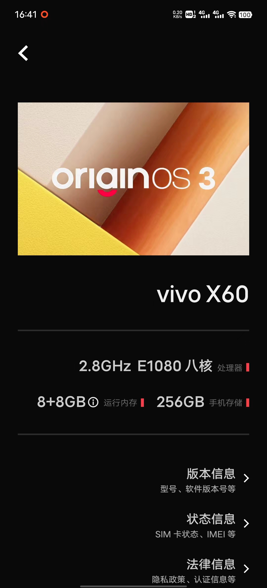

## 第一次作业

### 列举目前市面上常用的嵌入式操作系统名字（越多越好）

1. FreeRTOS：一个小型实时操作系统，特别适用于微控制器和嵌入式设备，具有低延迟和低内存占用的特点。

2. μC/OS：一种小型、可裁剪的实时操作系统，具有高度可移植性和可裁剪性，适用于各种嵌入式系统。

3. ThreadX：一款高度优化的实时操作系统，具有快速启动时间和低内存占用，广泛应用于通信、汽车、工业和消费电子等领域。

4. eCos：嵌入式配置的开源实时操作系统，具有灵活的内核设计和广泛的硬件支持，适用于多种嵌入式应用。

5. VxWorks：一款功能强大的实时操作系统，被广泛应用于工业控制、航空航天、医疗设备等领域，具有高度可靠性和实时性。

6. QNX：一种高度可靠的实时操作系统，特别适用于安全关键型嵌入式系统，如汽车、医疗设备和工业控制。

7. INTEGRITY：一款面向安全关键型应用的实时操作系统，具有严格的安全性和可靠性特性，适用于航空航天、军事和汽车等领域。

8. Linux Embedded：Linux内核的嵌入式版本，具有广泛的软件支持和社区资源，适用于各种嵌入式应用，从消费电子到工业控制等。

9. Zephyr：一个开源的实时操作系统，针对小型嵌入式设备和物联网应用，具有灵活的内核设计和可扩展性。

10. RIOT OS：一款专注于物联网设备的开源操作系统，具有低功耗、低内存占用和多种网络协议支持的特点。

11. Contiki：一种轻量级的开源操作系统，专注于低功耗和物联网应用，具有分布式网络和IPv6支持。

12. TinyOS：一款为传感器网络设计的开源操作系统，具有低功耗和高度分布式的特点，适用于传感器节点等嵌入式设备。

13. NuttX：一个可裁剪的实时操作系统，具有类Unix风格的设计和广泛的硬件支持，适用于各种嵌入式应用。

14. Mbed OS：一款面向物联网设备的开源操作系统，提供丰富的硬件支持和易用的开发工具，加速物联网产品的开发。

15. AliOS Things (AliOS-Things)：由阿里巴巴推出的物联网操作系统，提供丰富的物联网协议支持和云端服务集成。

16. RT-Thread：一款开源的实时操作系统，具有小巧灵活、易裁剪和支持多种编程语言等特点。

17. LiteOS：华为推出的轻量级物联网操作系统，具有低功耗、快速启动和高度安全的特点，适用于各种物联网设备。

18. HarmonyOS：华为推出的分布式操作系统，具有分布式架构、跨设备共享和高度安全的特点，适用于多种智能设备。

19. mLinux：一种基于Linux的嵌入式操作系统，具有丰富的软件支持和易用性，适用于各种嵌入式应用。

20. Contiki-NG：Contiki的下一代版本，继承了Contiki的特点并提供了更多新功能和改进。

### 列举基于模型的系统工程 与 传统开发流程的优势

#### 基于模型的系统工程

基于模型的系统工程（Model-Based Systems Engineering，MBSE）是一种系统工程方法论，它使用抽象的模型来描述、分析和设计复杂系统的结构、行为和性能。

优势：

1. **可视化与抽象化：** 使用模型来描述系统结构和行为，使系统设计变得可视化和更易于理解。这有助于团队成员之间的沟通和协作，以及客户对系统的理解。
2. **自动化分析与验证：** 模型可以用于自动化验证系统的性能、安全性、可靠性等方面的属性，从而提前发现和解决潜在的问题，减少后期成本和风险。
3. **迭代开发与快速原型：** 模型驱动开发允许快速创建原型和模拟，以便在早期阶段发现和验证设计概念，从而加速开发周期。
4. **需求管理和跟踪：** 基于模型的系统工程可以将需求与设计、验证和实现过程相集成，实现需求的跟踪和管理，确保系统的最终交付满足客户需求。
5. **复用性与组件化：** 模型允许设计人员将系统划分为可重用的组件，促进模块化设计和组件化开发，从而提高系统的可维护性和扩展性。

#### 传统开发流程

传统开发流程是指软件或系统开发中使用的传统方法论，通常以线性、阶段性的方式进行，包括需求分析、系统设计、实现、测试和部署等阶段。在传统开发流程中，每个阶段按照严格的顺序进行，并且通常在前一阶段完成后才能开始下一个阶段。

优势：

1. **结构清晰：** 传统开发流程采用阶段性、线性的开发模式，每个阶段有明确定义的任务和目标，使得项目的结构和进程更加清晰明了。
2. **适用性广泛：** 传统开发流程已经在许多项目中得到广泛验证和应用，适用于各种规模和类型的软件开发项目，包括大型企业级系统和小型应用软件。
3. **规范化和标准化：** 传统开发流程强调项目管理、文档管理和质量控制，有成熟的工作流程和标准化的文档模板，有助于提高开发质量和可维护性。
4. **风险管理：** 传统开发流程通过将项目分解为多个阶段，并在每个阶段引入严格的验证和审查机制，有助于及早发现和解决问题，降低项目风险。
5. **可控性和可预测性：** 传统开发流程通过严格的计划和控制，使得项目的进度和成本更加可控和可预测，有助于满足客户的需求和期望。
6. **文档化程度高：** 传统开发流程注重文档的编写和管理，包括需求文档、设计文档、测试文档等，有助于记录项目的历史和知识，提高项目的可维护性和可持续性。

### 列举RISC-V相对ARM构架的优势和缺陷，各三条

优势

1. **开放性和灵活性：** RISC-V 是一种开放的指令集架构，可以自由访问其规范和设计，而 ARM 架构则受到 ARM 公司的专利限制。这种开放性使得 RISC-V 更具灵活性，可以根据需求进行定制和优化。
2. **低成本和可定制性：** RISC-V 的开放性使得其在芯片设计和制造方面成本更低，同时也更容易定制，用户可以根据具体应用需求进行自定义设计，提高性能和功耗效率。
3. **社区支持和生态系统：** RISC-V 社区日益壮大，吸引了众多厂商和开发者的参与，推动了 RISC-V 生态系统的发展。相比之下，ARM 生态系统虽然庞大，但也受到 ARM 公司的控制，对于一些新兴市场和创新项目，RISC-V 的社区支持可能更具吸引力。

劣势

1. 由于RISC-V诞生时间太短，相关的编译器、开发工具和软件开发环境（IDE）以及其它生态要素还在发展；
2. RISC-V 定义了一个很小的、带有扩展的ISA，导致**ISA碎片化**；
3. RISC-V **尚未实现部分性能的提升**，如超标量执行等。

### 查询自己手机的处理器型号、性能和参数，并描述其ARM版本（或源自的版本），以及指令集的版本

**型号**：Exynos 1080

**性能**：三星 Exynos 1080 处理器采用最新（*2020年底*） 5nm 制程工艺，相较三星 7nm 工艺制程，三星 5nm 制程在晶体管数量密度上增加超过 80%，能够带来更强性能和更低的功耗。三星表示，此次Exynos 1080处理器采用的是全新的CPU架构核心，单核性能提升50%，多核性能提升近2倍。Exynos1080 5G采用1个大核+3个中核+4个小核的核心配置，其中大核与中核采用的是A78的架构，小核采用的是A55的架构。大核最高主频能达到2.8GHz。

**参数**：

|   项目   |                  参数                  |
| :------: | :------------------------------------: |
| 网络制式 |              2G/3G/4G/5G               |
| CPU制程  |                  5nm                   |
| CPU配置  | 1*A78@2.8GHz+3*A78@2.6GHz+4*A55@2.0GHz |
|   GPU    |             Mali™-G78 GPU              |
| 通用闪存 |                UFS 3.1                 |

**ARM版本**

Arm cortex-A78 CPU，Arm cortex-A55 CPU

Mali-G78 GPU

**指令集**

ARM v8.2

