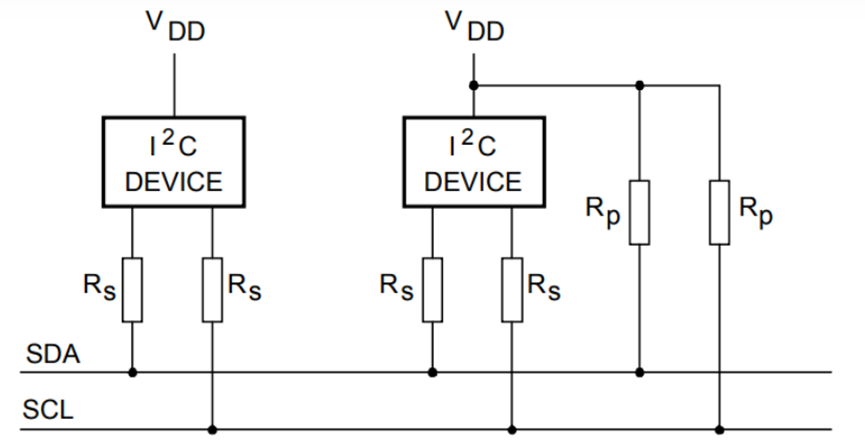
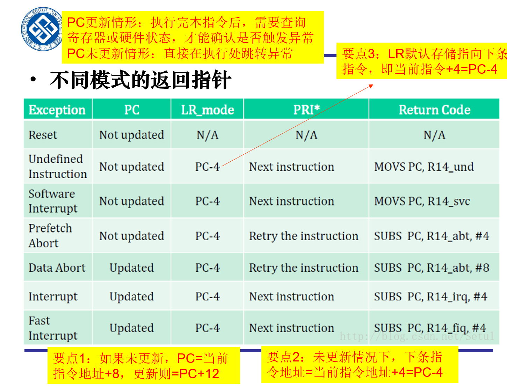
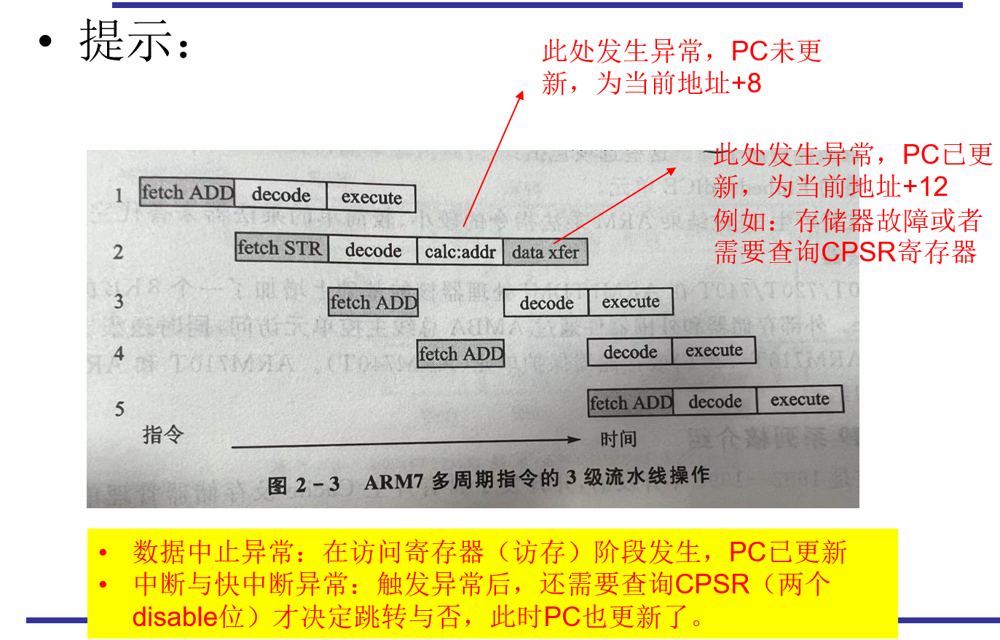

## 第二次作业

### 深入调研并介绍IIC总线的结构、通信原理、特点（速度、同步性、双工性等）等。从理解的角度分析IIC总线的优缺点（相对SPI和CAN）

I²C（Inter-Integrated Circuit）总线，也被称作IIC或I2C，是一种广泛使用的串行通信协议，主要设计用于芯片之间的短距离通信。它由Philips Semiconductor（现在的NXP Semiconductors）在1980年代早期推出

#### IIC总线的结构与通信原理

IIC总线采用两线制，包括一个串行数据线（SDA）和一个串行时钟线（SCL），通过这两根线实现多个设备之间的通信。所有的IIC设备都连接到同一对SDA和SCL上，每个设备都有一个唯一的地址。通信的两端各有一个主设备和一个或多个从设备。主设备控制总线的访问，从设备响应主设备的命令并提供数据。总线上的设备通过IIC地址进行寻址。

#### IIC总线的通信原理

IC总线采用主从结构进行通信，主设备可以是任何一台能够控制总线的设备（通常是微控制器），而从设备则是被控制的设备（如温度传感器、EEPROM存储器等）。通信分为两种模式：传输模式和接收模式。在传输模式下，主设备向从设备发送数据，从设备负责接收并响应；在接收模式下，主设备向从设备发送命令，从设备则会发送数据给主设备。

在IIC总线通信时，主设备控制SCL线的时钟信号，而SDA线上的数据则在时钟信号的控制下进行传输。传输时，主设备在SCL线上产生时钟脉冲，同时在SDA线上发送数据位。从设备在时钟脉冲的控制下读取SDA线上的数据位，并在下一个时钟脉冲的前沿将其应答给主设备。如果数据传输成功，则从设备返回应答信号。

通信时，一个主设备（master）通过SCL线控制时钟信号，启动和终止数据传输，而一个或多个从设备（slave）根据主设备的指令进行响应。

#### IIC总线的特点

- **速度**：IIC总线的速度取决于SCL线上的时钟频率。IIC总线支持多种速度模式，包括标准模式（100kbps）、快速模式（400kbps）、快速模式加（1Mbps）和高速模式（3.4Mbps）。
- **同步性**：IIC是一种同步通信协议，意味着数据传输是由时钟信号（SCL）来同步的。主设备通过控制时钟信号来确保通信的同步性，从而保证数据的准确传输。
- **双工性**：IIC总线支持双向通信，即主设备和从设备都可以发送和接收数据。主设备可以在任何时候控制总线的访问，并根据需要在总线上发送数据或接收数据。从设备只有在主设备允许时才能发送数据，并且只有在主设备发起读操作时才能发送数据。在同一时间内，IIC总线只能进行读或写操作，不能同时进行，属于半双工同步传输型总线。
- **多主机支持**：IIC总线支持多主机系统，即在同一总线上连接多个主设备。在这种情况下，每个主设备都有自己的地址，并且在使用总线之前必须获得总线的控制权。多主机系统可以提高系统的灵活性和可扩展性，可以实现更复杂的系统设计。
- **适用范围广**：IIC总线的应用范围非常广泛，可以用于连接各种类型的设备，如传感器、存储器、显示屏、电机驱动器等。它也可以用于通信距离比较短的应用场景，如板级通信、嵌入式系统等。

#### IIC总线的优点

- **简单性**：由于仅使用两根线进行通信，IIC总线的物理接口简单，有利于降低系统的复杂度和成本。相对于SPI总线和CAN总线，IIC总线只需要两条信号线进行通信，因此线路非常简单，易于实现和维护。相比之下，SPI总线需要四条信号线（一个主设备选择线、一个主设备输出线、一个从设备输出线和一个时钟线），而CAN总线需要两条信号线（一个CAN高速线和一个CAN低速线），因此IIC总线在线路复杂度方面具有优势。
- **灵活性**：可以在同一总线上连接多个从设备，且每个设备都有唯一的地址，易于扩展。
- **支持多主设备**：IIC协议支持多个主设备在同一总线上协作，在同一总线上连接多个主设备，每个主设备都有自己的地址，并且在使用总线之前必须获得总线的控制权，增加了系统的灵活性。而SPI总线只支持单主机系统，CAN总线虽然支持多主机系统，但需要使用更复杂的控制协议。

#### IIC总线的缺点

- **速度较慢**：相比于SPI和CAN，IIC在速度上通常较慢，特别是在数据量大或距离较远的情况下。相比之下，SPI总线的最高速度可以达到100Mbps，CAN总线的最高速度可以达到1Mbps或更高，因此在速度方面，IIC总线具有劣势。
- **总线冲突**：在多主模式下，可能会出现总线冲突的情况，需要通过复杂的算法来管理。
- **同步性差**：IIC总线的同步性较差，因为IIC总线的时钟由主设备控制，因此在一些高精度时序要求的应用中可能会出现问题。相比之下，SPI总线和CAN总线都具有较好的同步性，因为它们都有独立的时钟线。
- **双工性差**：IIC总线的双工性较差，在同一时间内，IIC总线只能进行读或写操作，不能同时进行；而SPI总线和CAN总线都具有良好的双工性，可以同时进行读和写操作。
- **距离限制**：由于信号的电容效应，IIC总线在距离较长时可能会出现信号质量问题。

#### 相对于SPI和CAN的比较

- **相对于SPI**：SPI通常提供更高的数据传输速率，并且可以实现全双工通信。然而，SPI需要更多的信号线（至少需要三根线，通常是四根），这在物理连接和成本上可能不如IIC经济。
- **相对于CAN**：CAN总线专为汽车及其他需要高可靠性和较长距离通信的环境设计，支持更高的抗干扰能力和错误处理机制。IIC则更适用于板级通信或短距离应用，成本更低，但抗干扰能力较弱。

### 结合下面两幅图和课堂内容，设异常触发指令的地址为0xFFFF0100，计算一下各个异常模式时，PC、LR、PRI*、Return Code的具体取值，写明分析过程。

#### Reset模式

在Reset模式下，处理器会执行一系列初始化操作，包括将寄存器清零和设置中断向量表等。

PC未更新，PC=异常触发指令地址+8，PC地址0xFFFF0108

LR、PRI*、Return Code均为N/A（不确定）。

#### Undefined Instruction模式

当处理器遇到一条无法识别的指令时，它会进入Undefined Instruction异常模式。在这个模式下，处理器会暂停执行，并且会向操作系统发出一个异常信号，以便系统处理这个异常。

PC未更新，PC=异常触发指令地址+8，PC地址0xFFFF0108

LR=PC-4，LR地址0xFFFF0104

PRI\*为下一条指令的地址，PRI\*地址0xFFFF0104

Return Code：`MOVS PC,R14_und`，当执行 MOVS PC, R14_und 指令时，将恢复PC（从R14_und），并返回到未定义指令后的下一条指令，则Return Code为0xFFFF0104

#### Software Interrupt模式

当执行软件中断指令时，处理器会进入Software Interrupt异常模式。该模式用于处理与处理器相关的软件中断请求。

PC未更新，PC=异常触发指令地址+8，PC地址0xFFFF0108

LR=PC-4，LR地址0xFFFF0104

PRI\*为下一条指令的地址，PRI\*地址0xFFFF0104

Return Code：`MOVS PC,R14_svc`，当执行指令时，将恢复PC（从R14_svc）和CPSR（从SPSR_svc）的值，并返回到SWI的下一条指令，则Return Code为0xFFFF0104

#### Prefetch Abort模式

当处理器试图执行从内存中读取的非法指令或数据时，会触发Prefetch Abort异常。

PC未更新，PC=异常触发指令地址+8，PC地址0xFFFF0108

LR=PC-4，LR地址0xFFFF0104

PRI\*重做指令，PRI\*地址0xFFFF0100

Return Code：`SUBS PC,R14_abt,#4`，当执行指令后，将重新执行被中止的指令，则Return Code为0xFFFF0100。

#### Data Abort模式

当处理器试图执行或存储非法数据时，会触发Data Abort异常。这可能是因为数据不在可寻址的内存空间中，或者由于硬件错误而导致读取或写入失败。

PC更新，PC=异常触发指令地址+12，PC地址0xFFFF010C

LR=PC-4，LR地址0xFFFF0108

PRI\*重做指令，PRI\*地址0xFFFF0100

Return Code：`SUBS PC,R14_abt,#8`，当执行指令后，将重新执行被中止的指令，则Return Code为0xFFFF0100。

#### Interrupt模式

当处理器接收到来自外部设备的中断信号时，会进入Interrupt异常模式。在该模式下，处理器会执行特定的中断服务例程，以响应外部中断请求。

PC更新，PC=异常触发指令地址+12，PC地址0xFFFF010C

LR=PC-4，LR地址0xFFFF0108

PRI\*为下一指令，PRI\*地址0xFFFF0104

Return Code：`SUBS PC,R14_irq,#4`，当执行指令后，将重新执行被中止的指令，则Return Code为0xFFFF0104。

#### Fast Interrupt模式

当Fast Interrupt信号被触发时，处理器会立即跳转到Fast Interrupt异常模式，并且禁用中断响应。在该模式下，处理器会执行特定的中断服务例程，以尽快响应高优先级的中断请求。

PC更新，PC=异常触发指令地址+12，PC地址0xFFFF010C

LR=PC-4，LR地址0xFFFF0108

PRI\*为下一指令，PRI\*地址0xFFFF0104

Return Code：`SUBS PC,R14_fiq,#4`，当执行指令后，将重新执行被中止的指令，则Return Code为0xFFFF0104。

