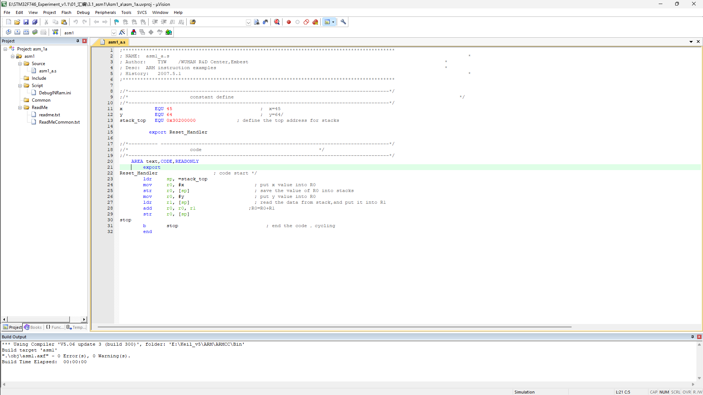

## 第四次作业

### 安装ARM编译环境



对项目代码进行编译，显示0 Errors, 0 Warnings，说明环境配置正常，编译通过；

### 运行STM32F746_Experiment_v1.1\01_汇编\3.1_asm1\Asm1_b例程，进入debug模式

1）阅读并调试代码，观察每行代码的地址位置、代码指令编码、代码反编译结果、寄存器更新值。在提交作业中，把所有代码复制一遍，在注释中给出每行代码运行后寄存器（或存储器）的值更新情况。
2）截图uVision5程序运行完毕时，寄存器窗口R0-R15的值，以及memory窗口中0x30200000位置处的值。

启动debug界面如下


阅读代码，计算每行代码的目标寄存器的值。

```assembly
;#********************************************************************************************
;# NAME:		asm1_b.s													                                               *
;# Author: 	WUHAN R&D Center, Embest									                                       *
;# Desc:		ARM instruction examples									                                       *
;# History:	TianYunFang 2007.05.12										                                       *
;#********************************************************************************************
;/*------------------------------------------------------------------------------------------*/
;/*	 					constant define		 			 				                                               */
;/*------------------------------------------------------------------------------------------*/
x			EQU 45							      ;/* x=45 */
y			EQU	64							      ;/* y=64 */
z			EQU	87								    ;/* z=87 */
stack_top	EQU	0x30200000			  ;/* define the top address for stacks*/
			                 export	Reset_Handler

;/*-------------------------------------------------------------------------------------------*/
;/*	 					                           code						 	                                    */
;/*-------------------------------------------------------------------------------------------*/
	AREA text,CODE,READONLY

Reset_Handler										;/* code start */
		mov		r0, #x 								;/* R0=0x2D  */
		mov		r0, r0, lsl #8						;/* R0=0x2D00  */
		mov		r1, #y								;/* R1=0x40  */
		add		r2, r0, r1, lsr #1					;/* R2=0x2D20 */
		ldr		sp, =stack_top						;/* SP=0x30200000 */
		str		r2, [sp]							

		mov		r0, #z								;/* R0=0x57  */
		and		r0, r0, #0xFF						;/* R0=0x57 */
		mov		r1, #y								;/* R1=0x40  */
		add		r2, r0, r1, lsr #1					;/* R2=0x77 */
		
		ldr		r0, [sp]							;/* R1=0x40 */
		mov		r1, #0x01							;/* R1=0x01 */
		orr		r0, r0, r1							;/* R0=0x2D21
		mov		r1, R2								;/* R1=0x77  */
		add		r2, r0, r1, lsr #1					;/* R2=0x2D5C  */

stop
		b		stop								    ;/* end the code £¬cycling*/
		END

```

截图uVision5程序运行完毕


