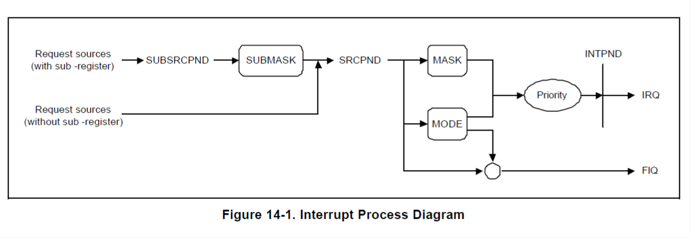

## 第五次作业

### 阅读发布的Um_s3c2410.pdf开发手册，回答如下问题

#### 对于I/O端口操作需求，假设GPB0端口连接了一个按键，我需要读按键的值。

##### 至少需要操作哪两个寄存器，对应的地址是多少

搜索“GPB0”，找到寄存器名和地址

需要以下两个寄存器

1. GPBCON寄存器，寄存器的地址为0x56000010
2. GPBDAT寄存器，寄存器的地址为0x56000014

##### 需要操作这两个寄存器的哪几个bit位，如何操作

提示：例如 传感器GP****[0:1]=00，按键值=GP***[*]

* 寄存器GPBCON[1:0]=01
* 按键值=GPBDAT[0]

#### 解释下列寄存器的含义以及地址

1. ADCCON

   含义：ADC控制寄存器。这个寄存器用于控制模拟到数字转换器（ADC）的配置和操作。它可能包含启动ADC转换、选择输入通道、设置采样率等选项。

   地址：0x58000000

2. WTCON

   含义：看门狗定时器控制寄存器。这个寄存器用于配置和控制看门狗定时器的操作。看门狗定时器是一种硬件计时器，用于监控系统的正常运行。如果系统在一定时间内没有响应，看门狗定时器会触发一个复位或其他动作。

   地址：0x53000000

3. SPPIN0

   含义：串行端口引脚输入控制寄存器。这个寄存器用于控制与串行通信相关的引脚输入。它可能包含配置串行端口的输入方向、输入缓冲区等功能。

   地址：0x59000008

4. BWSCON

   含义：总线宽度和存储空间大小控制寄存器。这个寄存器用于配置系统的总线宽度和存储空间的大小。它可能包含设置数据总线宽度、地址空间大小等选项。

   地址：0x48000000

5. BANKSIZE

   含义：存储体大小寄存器。这个寄存器用于确定存储器的组织方式和大小。它可能包含设置存储体的行数、列数等参数，以确定存储器的容量和访问方式。

   地址：0x48000028

### 结合STM32F746_Experiment_v1.1\01_汇编\common\src\2410init.s和sys_init.c\interrupts_init()。进行程序分析。

#### 分析sys_init.c\debug_swi()函数的执行效果。代码+注释的方式。

```c++
void debug_swi(void)
{
	uart_printf("!!!Enter SWI exception. %d\r\n", nCNT+=1);	//将字符串"!!!Enter SWI exception. %d\r\n"打印到串口输出。其中，%d是一个占位符，用于显示变量nCNT的值
	break_point(); //调用break_point()函数，进入中断
}
```

这个函数是进入软件中断SWI的一个函数，并呈现当前的中断状态

看一下`break_point()`函数

```c++
void break_point(void)
{
	int i;	
	char m = 200;
	uart_printf("!!!Enter break point.");	//将字符串"!!!Enter break point."打印到串口输出

	rGPFCON=0x5500;                  //PORTF7/6/5/4 OUTPUT，配置端口F7、F6、F5和F4为输出模式
	rGPFUP=0;                        //PULL-UP ENABLE ，启用上拉电阻
	while(m) {
		rGPFDAT=0; //将寄存器rGPFDAT的值设置为0
		beep(1); //调用beep(1)函数发出声音
		for(i=0;i<20000;i++); //通过一个空循环进行延时
		rGPFDAT=0xF0; //将寄存器GPFDAT的值设置为0xF0
		beep(0); //调用beep(0)函数停止声音
		for(i=0;i<20000;i++);//再次通过一个空循环进行延时
		m--;
	}//当m的值减到0时，退出循环
}
```

进入断点时通过控制GPIO端口F7、F6、F5和F4来产生声音信号

#### 分析2410init.s和2410init.s，并结合课上内容，以EINT3中断（设定为IRQ）为例，说清楚跳中断是如何传入ARM，并最终被执行的，可截取关键代码进行注释描述。



* 请求源（带有子寄存器）：这表示有中断请求的源，并且这些源有关联的子寄存器。
* SUBSRCPND：子源挂起寄存器，记录了哪些中断源发出了中断请求。
* SUBMASK：子掩码寄存器，用于决定哪些子中断源可以影响主中断挂起状态。
* SRCPND：源挂起寄存器，记录了当前哪些中断源发出了中断请求。
* MASK：掩码寄存器，用于控制是否允许对应的中断源产生中断信号。
* MODE：模式选择，可能用于选择不同的中断处理模式。
* INTPND：中断挂起，显示了当前正在等待处理的中断。
* 优先级：此处可能涉及优先级逻辑，以决定哪个中断信号将被优先处理。
* IRQ：常规中断请求，处理普通优先级的中断。
* FIQ：快速中断请求，处理高优先级的中断

中断信号的行进路线：

1. 中断源发出中断请求
2. 这个请求被记录在SUBSRCPND或SRCPND中，取决于是否带有子寄存器。
3. 通过SUBMASK和MASK控制这些请求是否会被允许影响处理器状态。
4. 如果不允许中断，中断信号被挂起
5. 如果允许，中断请求信号就会基于优先级逻辑产生一个中断，要么是常规的IRQ，要么是快速的FIQ。


在`sys_init.c\interrupts_init()`中看到

```c++
pISR_EINT3     	= (unsigned) break_point;
```

这里是初始化中断服务程序

当外部事件（如按键按下、传感器触发等）发生时，它会通过GPIO（通用输入输出）或其他外部中断线路触发EINT3。

```assembly
.equ	HandleEINT3,	_ISR_STARTADDRESS+4*11
```

设定为IRQ

查询到

```assembly
HandlerIRQ      HANDLER HandleIRQ
```

搜索宏`HANDLER`，并阅读宏定义

```assembly
.macro HANDLER HandleLabel
    sub	    sp,sp,#4				/* 减去sp的值（以存储跳转地址） */
    stmfd   sp!,{r0}				/* 将工作寄存器r0压栈（lr不压栈，因为它返回到原始地址） */
    ldr	    r0,=\HandleLabel		/* 将HandleXXX的地址加载到r0 */
    ldr	    r0,[r0]					/* 加载HandleXXX的内容（服务例程的起始地址）到r0 */
    str	    r0,[sp,#4]				/* 将HandleXXX的内容（ISR）存储到栈上 */
    ldmfd   sp!,{r0,pc}				/* 从栈中弹出工作寄存器和程序计数器pc（跳转到ISR） */
.endm
```

```assembly
MACRO
$HandlerLabel HANDLER $HandleLabel

$HandlerLabel
	sub	sp,sp,#4	;decrement sp(to store jump address)
	stmfd	sp!,{r0}	;PUSH the work register to stack(lr does not push because it return to original address)
	ldr     r0,=$HandleLabel;load the address of HandleXXX to r0
	ldr     r0,[r0]	 ;load the contents(service routine start address) of HandleXXX
	str     r0,[sp,#4]      ;store the contents(ISR) of HandleXXX to stack
	ldmfd   sp!,{r0,pc}     ;POP the work register and pc(jump to ISR)
MEND
```

在_ISR_STARTADDRESS=0x33FF_FF00里定义的第一级中断向量表是采用型如Handle\*\*\*的方式的

而在程序的ENTRY处(程序开始处)采用的是b Handler***的方式

在这里Handler\*\*\*就是通过HANDLER这个宏和Handle***建立联系的

然后跳转到位于0x18处的统一中断函数中该函数通过读取interrupt pending寄存器中对应标志位 来判断中断源 并根据优先级关系再跳到对应中断源的处理代码中

我们要处理的就是IRQ

下面这段程序是用来处理非向量中断（EINT3），具体判断I_ISPR中各位是否置1 置1表示目前此中断等待响应（每次只能有一位置1），从最高优先级中断位开始判断，检测到等待服务中断就将pc置为中断服务函数首地址

```assembly
IsrIRQ
    sub	sp,sp,#4       ; 为PC（程序计数器）保留空间
    stmfd	sp!,{r8-r9}  ; 将r8和r9寄存器压栈保存

    ldr	r9,=INTOFFSET  ; 将INTOFFSET的地址加载到r9
    ldr	r9,[r9]        ; 加载INTOFFSET的内容到r9，这可能是一个中断向量偏移量
    ldr	r8,=HandleEINT0  ; 将HandleEINT0的地址加载到r8
    add	r8,r8,r9,lsl #2  ; 将r8和r9的值相加，r9左移两位，得到具体的中断处理函数地址
    ldr	r8,[r8]        ; 加载r8指向的地址中的值，即中断处理函数的入口地址
    str	r8,[sp,#8]     ; 将中断处理函数的入口地址存储到栈上，位置是sp+8
    ldmfd	sp!,{r8-r9,pc} ; 从栈中弹出r8, r9和pc，并将pc设置为中断处理函数的入口地址，跳转到中断处理函数

    LTORG
```

这里需要将当前pc进栈，然后将pc的地址赋给EINT3的首地址，即`_ISR_STARTADDRESS+4*11`

### 以实验包中“STM32F746_Experiment_v1.1\02_GPIO”例程为例子，描述STM32系列嵌入式系统的启动过程（如何调用到main函数的，之前经过了哪些初始化工作）。

参考资料如下：

1) STM32F74xx中文参考手册(1).pdf （STM32F746_Experiment_v1.1目录下）

2) 上课讲课的PPT

3) 自行网上搜索。例如：https://blog.csdn.net/luobeihai/article/details/117595762

#### 设置栈和堆的信息

##### 栈

```assembly
Stack_Size   EQU   0x00000400
	AREA  STACK, NOINIT, READWRITE, ALIGN=3
	Stack_Mem    SPACE  Stack_Size
__initial_sp
```

开辟栈的大小为 0X00000400（1KB），栈的作用是用于局部变量、函数调用、函数形参等的开销；标号`__initial_sp`紧挨着 SPACE 语句放置，表示栈的结束地址，即栈顶地址。

##### 堆

```assembly
Heap_Size    EQU   0x00000200
	AREA  HEAP, NOINIT, READWRITE, ALIGN=3
__heap_base
Heap_Mem    SPACE  Heap_Size
__heap_limit
     PRESERVE8
     THUMB
```

开辟堆的大小为 0X00000200（512 字节），heap_base 表示堆的起始地址， heap_limit 表示堆的结束地址。堆主要用来动态内存的分配。

#### 定义中断向量表

```assembly
__Vectors    DCD   __initial_sp    ; Top of Stack
        DCD   Reset_Handler        ; Reset Handler
        DCD   NMI_Handler      	   ; NMI Handler
        DCD   HardFault_Handler    ; Hard Fault Handler
        DCD   MemManage_Handler    ; MPU Fault Handler
        DCD   BusFault_Handler     ; Bus Fault Handler
        DCD   UsageFault_Handler   ; Usage Fault Handler        
		......
```

ARM 规定向量表的起始位置存放的是栈顶指针 MSP 的地址值，紧接着存放的是复位中断入口函数的地址。当刚上电的时候，硬件会根据向量表的地址找到向量表的具体位置（对于向量表的地址是可以通过 NVIC 中的一个重定位寄存器来设置的，复位时该寄存器的值为0），然后会根据向量表中的这两个数据，设置 SP、PC 的值，这时 CPU 就会从复位中断的入口函数开始取指令运行程序。

#### 调用SystemInit函数，设置系统时钟

```assembly
Reset_Handler  PROC
       EXPORT Reset_Handler       [WEAK]
       IMPORT __main
       IMPORT SystemInit
       LDR   R0, =SystemInit
       BLX   R0        			; 调用SystemInit函数
       LDR   R0, =__main
       BX   R0
ENDP
```

硬件设置好了 SP、PC 的值后，这时CPU 会从 Reset_Handler 处开始取指令运行，首先会调用 SystemInit 函数来初始化系统时钟，该函数是官方固件库提供的一个库函数，在 system_stm32f7xx.c 文件中定义如下：

```c
void SystemInit(void)
{
 /* FPU settings */
 #if (__FPU_PRESENT == 1) && (__FPU_USED == 1)
 SCB->CPACR |= ((3UL << 10*2)|(3UL << 11*2)); /* set CP10 and CP11 Full Access */
 #endif
 
 /* Reset the RCC clock configuration to the default reset state */
 /* Set HSION bit */
 RCC->CR |= (uint32_t)0x00000001;
 
 /* Reset CFGR register */
 RCC->CFGR = 0x00000000;

 /* Reset HSEON, CSSON and PLLON bits */
 RCC->CR &= (uint32_t)0xFEF6FFFF;

 /* Reset PLLCFGR register */
 RCC->PLLCFGR = 0x24003010;

 /* Reset HSEBYP bit */
 RCC->CR &= (uint32_t)0xFFFBFFFF;

 /* Disable all interrupts */
 RCC->CIR = 0x00000000;

#if defined (DATA_IN_ExtSRAM) || defined (DATA_IN_ExtSDRAM)
	SystemInit_ExtMemCtl(); 
#endif /* DATA_IN_ExtSRAM || DATA_IN_ExtSDRAM */

/* Configure the Vector Table location add offset address */
#ifdef VECT_TAB_SRAM
	SCB->VTOR = SRAM1_BASE | VECT_TAB_OFFSET; /* Vector Table Relocation in Internal SRAM */
#else
 	SCB->VTOR = FLASH_BASE | VECT_TAB_OFFSET; /* Vector Table Relocation in Internal FLASH */
#endif
}
```

该函数完成以下功能：

- **FPU 设置部分**：如果芯片支持 FPU（浮点运算器），则设置 CP10 和 CP11 为完全访问权限。
- **RCC 时钟配置部分**：将芯片的 RCC 寄存器设置为默认值。具体步骤包括：
  - 打开 HSION（内部高速时钟）位。
  - 重置 CFGR 寄存器为 0；
  - 关闭 HSEON（外部高速时钟）、CSSON（时钟安全系统）和 PLLON（锁相环）位；
  - 将 PLLCFGR 寄存器重置为默认值；
  - 关闭 HSEBYP（外部高速时钟旁路）位；
  - 禁用所有中断。
- **外部存储器部分**：如果使用外部存储器（如外部 SRAM 或 SDRAM），则调用 SystemInit_ExtMemCtl() 函数进行配置。
- **向量表位置部分**：根据宏定义的设置，将向量表位置设置为内部 SRAM 或内部 FLASH。

#### 调用__main函数

__main 函数是系统自带的库函数

接下来就跳转到了 __scatterload 函数，从函数名可以看出这是一个分散加载函数，该函数主要实现的功能就是数据段的重定位和清除 bss 段，初始化栈空间。

#### 调用main函数

scatterload 函数最后调用了 main_after_scatterload 函数，这个函数实现的功能就是跳转到了用户的 main 函数，进入到用户程序。__main_after_scatterload 函数的代码如下：

```assembly
__main_after_scatterload
  _main_clock
  _main_cpp_init
  _main_init
    0x08000138:  4800    .H   LDR   r0,[pc,#0] ; [0x800013c] = 0x80004c1
    0x0800013a:  4700    .G   BX    r0
```

可以看出，代码最后跳转到了 r0 寄存器所指示的地址中去了，实际上这个地址就是用户的 main 函数地址。由此完成 STM32 的启动过程，接下来运行的是用户程序的代码。
