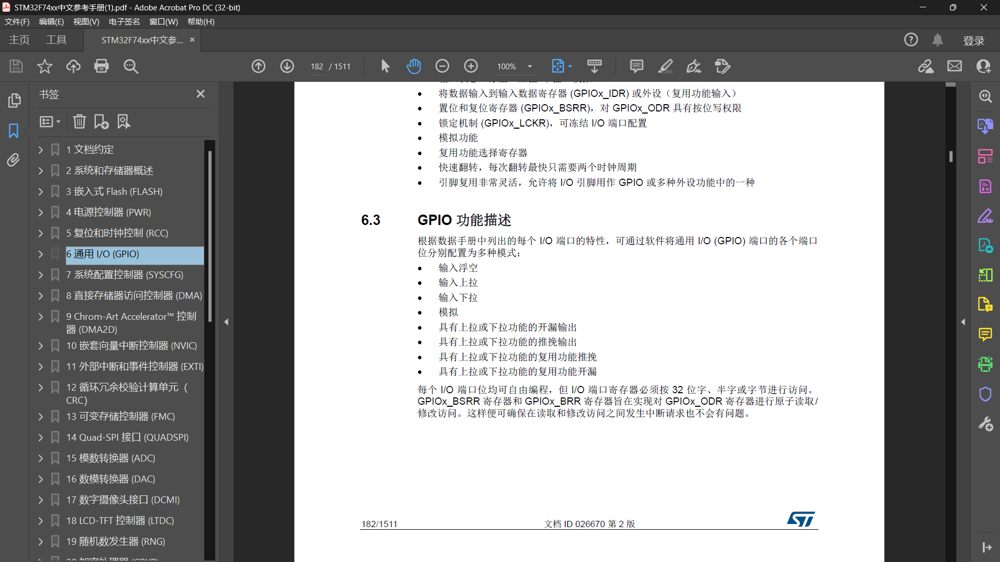
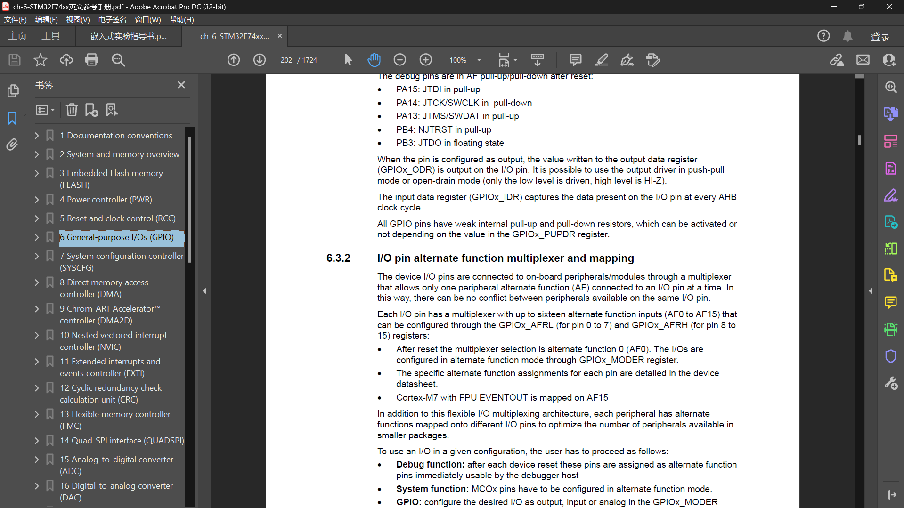
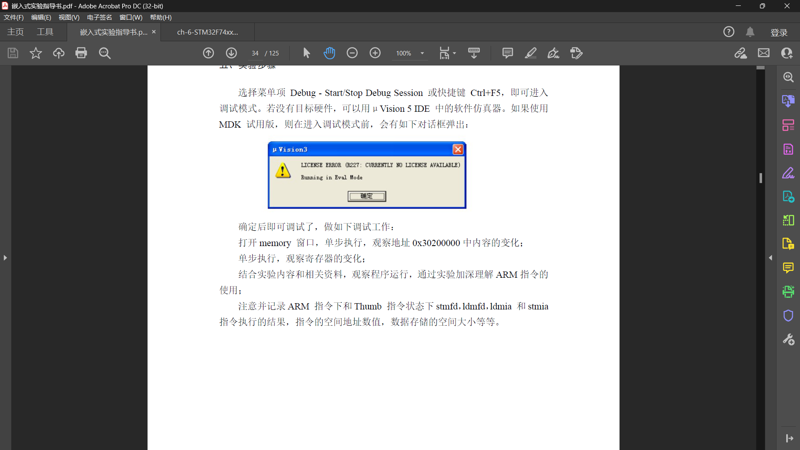
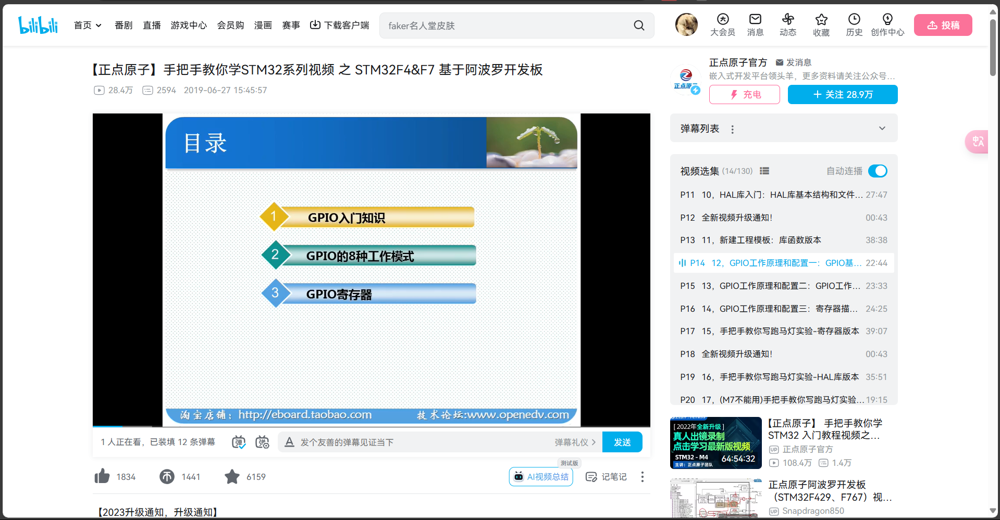
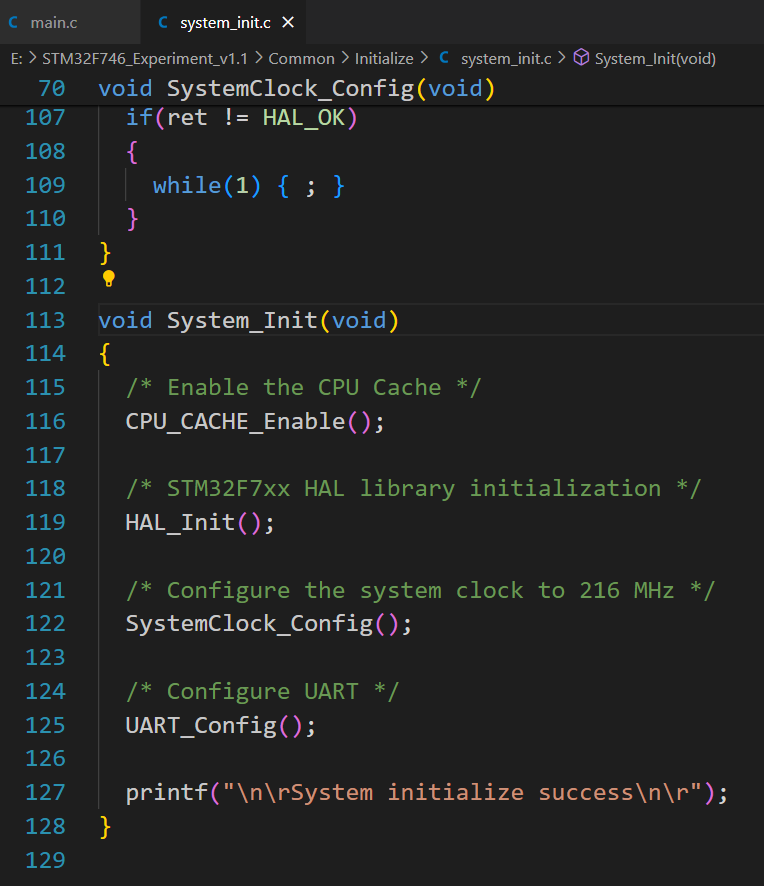
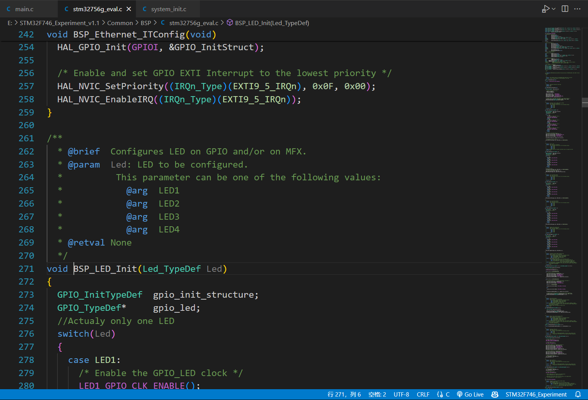
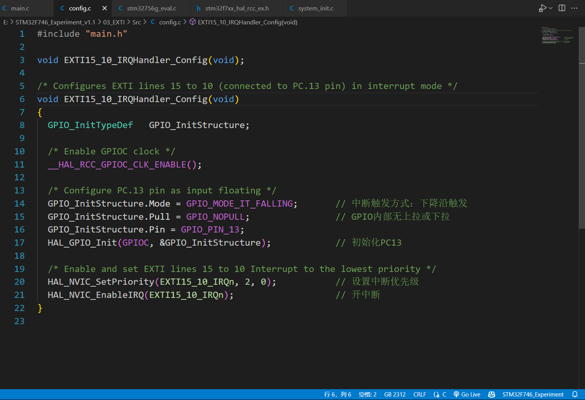

## 第六次作业

### 自学工作









### 以main.c函数为代码起点，通过向内层代码跳转（CTRL + 鼠标左键），弄清楚整个代码的执行流程（截图分析执行流程）。

```c++
int main(void)
{
  System_Init();
  
  /* Initialize LED1 mounted on board */
  BSP_LED_Init(LED1);
  
  /* Configure EXTI15_10 (connected to PC.13 pin) in interrupt mode */
  EXTI15_10_IRQHandler_Config();
  
  while (1)
  {
  }
}
```

上述是`main.c`中的`main`函数，

1. 首先调用`System_Init()`函数进行系统初始化，跳转到对应界面得到的是

   

   ```c++
   void System_Init(void)
   {
     /* Enable the CPU Cache */
     CPU_CACHE_Enable(); // 启用CPU缓存以提高系统性能
   
     /* STM32F7xx HAL library initialization */
     HAL_Init(); // 初始化STM32F7系列的HAL库，配置系统级的硬件抽象层
   
     /* Configure the system clock to 216 MHz */
     SystemClock_Config(); // 配置系统时钟为216 MHz，确保系统以正确的频率运行
     
     /* Configure UART */
     UART_Config(); // 配置UART通信接口，初始化串口通信
     
     printf("\n\rSystem initialize success\n\r"); // 打印系统初始化成功的信息
   }
   
   ```

   调用了四个函数初始化嵌入式系统，这里不具体展开系统初始化的函数

2. 接下来初始化指定的LED，在这里我们初始化的是LED1

   

   ```c++
   void BSP_LED_Init(Led_TypeDef Led)
   {
     GPIO_InitTypeDef  gpio_init_structure; // 定义一个GPIO初始化结构体
     GPIO_TypeDef*     gpio_led; // 定义一个指向GPIO端口的指针
     // 实际上这里只有一个LED被初始化
     switch(Led)
     {
       case LED1:
         /* 启用LED1的GPIO时钟 */
         LED1_GPIO_CLK_ENABLE();
         gpio_led = LED1_GPIO_PORT; // 指向LED1的GPIO端口
         break;
       case LED2:
         /* 启用LED2的GPIO时钟 */
         LED2_GPIO_CLK_ENABLE();
         gpio_led = LED2_GPIO_PORT; // 指向LED2的GPIO端口
         break;
       case LED3:
         /* 启用LED3的GPIO时钟 */
         LED3_GPIO_CLK_ENABLE();
         gpio_led = LED3_GPIO_PORT; // 指向LED3的GPIO端口
         break;
       case LED4:
         /* 启用LED4的GPIO时钟 */
         LED4_GPIO_CLK_ENABLE();
         gpio_led = LED4_GPIO_PORT; // 指向LED4的GPIO端口
         break;
       default:
         break;
     }
     /* 配置GPIO_LED引脚 */
     gpio_init_structure.Pin = GPIO_PIN[Led]; // 设置GPIO引脚编号
     gpio_init_structure.Mode = GPIO_MODE_OUTPUT_PP; // 设置GPIO模式为推挽输出
     gpio_init_structure.Pull = GPIO_PULLUP; // 设置GPIO上拉
     gpio_init_structure.Speed = GPIO_SPEED_HIGH; // 设置GPIO速度为高
   
     HAL_GPIO_Init(gpio_led, &gpio_init_structure); // 初始化GPIO
   
     /* 默认情况下，关闭LED */
     HAL_GPIO_WritePin(gpio_led, GPIO_PIN[Led], GPIO_PIN_SET); // 设置GPIO引脚为高电平，关闭LED
   }
   ```

   我们这里初始化了LED1，所以在函数中只执行case LED1，引脚编号也是设置的LED1

   继续跳转

   ```c++
   #define LED1_GPIO_CLK_ENABLE()           __HAL_RCC_GPIOA_CLK_ENABLE()
   ```

   ```c++
   #define __HAL_RCC_GPIOA_CLK_ENABLE()   do { \
                                         __IO uint32_t tmpreg = 0x00; \
                                           SET_BIT(RCC->AHB1ENR, RCC_AHB1ENR_GPIOAEN);\
                                           /* Delay after an RCC peripheral clock enabling */ \
                                           tmpreg = READ_BIT(RCC->AHB1ENR, RCC_AHB1ENR_GPIOAEN);\
                                           UNUSED(tmpreg); \
                                         } while(0)
   ```

   用于在嵌入式系统中启用 GPIOA 的时钟。该宏定义了一段代码块，用于设置与验证 RCC（复位与时钟控制）外设的 AHB1 外设时钟使能寄存器 (AHB1ENR) 中的 GPIOA 使能位 (GPIOAEN)。

3. 配置连接到PC13引脚的外部中断

   

   ```c++
   /* 
    * Configures EXTI lines 15 to 10 (connected to PC.13 pin) in interrupt mode 
    */
   void EXTI15_10_IRQHandler_Config(void)
   {
     GPIO_InitTypeDef   GPIO_InitStructure;
   
     /* Enable GPIOC clock */
     __HAL_RCC_GPIOC_CLK_ENABLE();										// 使能GPIOC时钟
   	
     /* Configure PC.13 pin as input floating */
     GPIO_InitStructure.Mode = GPIO_MODE_IT_FALLING;			// 设置PC13引脚为下降沿触发中断
     GPIO_InitStructure.Pull = GPIO_NOPULL;						// 配置GPIO引脚无内部上拉或下拉
     GPIO_InitStructure.Pin = GPIO_PIN_13;							
     HAL_GPIO_Init(GPIOC, &GPIO_InitStructure);					// 初始化PC13引脚配置
   
     /* Enable and set EXTI lines 15 to 10 Interrupt to the lowest priority */
     HAL_NVIC_SetPriority(EXTI15_10_IRQn, 2, 0);					// 设置EXTI15_10中断优先级为2
     HAL_NVIC_EnableIRQ(EXTI15_10_IRQn);								// 使能EXTI15_10中断
   }
   
   ```

   * 使能GPIOC外设时钟，以便使用PC.13引脚。
   * 配置PC.13引脚为下降沿触发的中断模式，无内部上拉或下拉。
   * 设置并使能EXTI15_10中断，优先级设置为2（相对较低的优先级）

### 以源码和注释的形式，讲解代码的执行流程，重点是描述下面函数内代码的执行与配置原理（讲解关键语句即可）

#### System_Init()\UART_Config()

```c++
void UART_Config(void)
{
  /* 配置UART外设 */
  /* 将USART外设设置为异步模式（UART模式） */
  /* UART配置如下：
      - 字长 = 8位
      - 停止位 = 1个停止位
      - 奇偶校验 = 无校验
      - 波特率 = 115200波特
      - 硬件流控制禁用（RTS和CTS信号） */
  
  // 设置USART实例
  UartHandle.Instance        = USARTx;

  // 设置波特率为115200
  UartHandle.Init.BaudRate   = 115200;
  // 设置字长为8位
  UartHandle.Init.WordLength = UART_WORDLENGTH_8B;
  // 设置停止位为1个停止位
  UartHandle.Init.StopBits   = UART_STOPBITS_1;
  // 设置无奇偶校验
  UartHandle.Init.Parity     = UART_PARITY_NONE;
  // 禁用硬件流控制
  UartHandle.Init.HwFlowCtl  = UART_HWCONTROL_NONE;
  // 设置UART模式为发送和接收
  UartHandle.Init.Mode       = UART_MODE_TX_RX;

  // 初始化UART
  HAL_UART_Init(&UartHandle);
}

```

具体配置包括波特率、字长、停止位、奇偶校验、硬件流控制和模式等参数，然后将参数实例传入初始化函数进行初始化

#### System_Init()\UART_Config()\HAL_UART_Init()

```c++
HAL_StatusTypeDef HAL_UART_Init(UART_HandleTypeDef *huart)
{
  /* 检查 UART 句柄是否分配 */
  if(huart == NULL)
  {
    return HAL_ERROR;
  }
  
  if(huart->Init.HwFlowCtl != UART_HWCONTROL_NONE)
  {
    /* 检查硬件流控制参数 */
    assert_param(IS_UART_HWFLOW_INSTANCE(huart->Instance));
  }
  else
  {
    /* 检查 UART 实例参数 */
    assert_param(IS_UART_INSTANCE(huart->Instance));
  }
  
  if(huart->State == HAL_UART_STATE_RESET)
  {
    /* 分配锁资源并初始化 */
    huart->Lock = HAL_UNLOCKED;

    /* 初始化底层硬件：GPIO，时钟 */
    HAL_UART_MspInit(huart);
  }

  /* 设置 UART 状态为忙 */
  huart->State = HAL_UART_STATE_BUSY;

  /* 禁用外设 */
  __HAL_UART_DISABLE(huart);
  
  /* 设置 UART 通信参数 */
  if (UART_SetConfig(huart) == HAL_ERROR)
  {
    return HAL_ERROR;
  }

  /* 如果需要高级特性初始化，则配置 */
  if (huart->AdvancedInit.AdvFeatureInit != UART_ADVFEATURE_NO_INIT)
  {
    UART_AdvFeatureConfig(huart);
  }

  /* 在异步模式下，必须清除以下位：
     - USART_CR2 寄存器中的 LINEN 和 CLKEN 位，
     - USART_CR3 寄存器中的 SCEN、HDSEL 和 IREN 位 */
  huart->Instance->CR2 &= ~(USART_CR2_LINEN | USART_CR2_CLKEN);
  huart->Instance->CR3 &= ~(USART_CR3_SCEN | USART_CR3_HDSEL | USART_CR3_IREN);

  /* 启用外设 */
  __HAL_UART_ENABLE(huart);

  /* 在将 huart->State 设置为就绪之前检查 TEACK 和/或 REACK */
  return (UART_CheckIdleState(huart));
}
```

#### BSP_LED_Init()

```c++
void BSP_LED_Init(Led_TypeDef Led)
{
  GPIO_InitTypeDef  gpio_init_structure;
  GPIO_TypeDef*     gpio_led;
	
  // 根据传入的LED类型初始化相应的GPIO端口
	switch(Led)
	{
		case LED1:
			/* 使能LED1的GPIO时钟 */
      LED1_GPIO_CLK_ENABLE();
			gpio_led = LED1_GPIO_PORT;
			break;
		case LED2:
			/* 使能LED2的GPIO时钟 */
      LED2_GPIO_CLK_ENABLE();
			gpio_led = LED2_GPIO_PORT;
			break;
		case LED3:
			/* 使能LED3的GPIO时钟 */
      LED3_GPIO_CLK_ENABLE();
			gpio_led = LED3_GPIO_PORT;
			break;
		case LED4:
			/* 使能LED4的GPIO时钟 */
      LED4_GPIO_CLK_ENABLE();
			gpio_led = LED4_GPIO_PORT;
			break;
		default:
			break;
	}

  // 配置GPIO端口
	gpio_init_structure.Pin = GPIO_PIN[Led];           // 设置引脚号
	gpio_init_structure.Mode = GPIO_MODE_OUTPUT_PP;   // 设置引脚为推挽输出模式
	gpio_init_structure.Pull = GPIO_PULLUP;           // 设置引脚上拉
	gpio_init_structure.Speed = GPIO_SPEED_HIGH;      // 设置引脚速度为高

  // 初始化GPIO
	HAL_GPIO_Init(gpio_led, &gpio_init_structure);
	
	// 默认关闭LED
	HAL_GPIO_WritePin(gpio_led, GPIO_PIN[Led], GPIO_PIN_SET);
}

```

#### BSP_LED_Init()\HAL_GPIO_Init()

```c++
/*
 * 函数名：HAL_GPIO_Init
 * 参数：
 *   - GPIOx：GPIO端口指针，表示要初始化的GPIO端口
 *   - GPIO_Init：GPIO初始化结构体指针，包含了GPIO初始化的各项参数
 * 返回值：无
 * 功能：初始化指定GPIO端口的各项配置
 */
void HAL_GPIO_Init(GPIO_TypeDef  *GPIOx, GPIO_InitTypeDef *GPIO_Init)
{
  uint32_t position = 0x00;
  uint32_t ioposition = 0x00;
  uint32_t iocurrent = 0x00;
  uint32_t temp = 0x00;

  /* 检查参数的有效性 */
  assert_param(IS_GPIO_ALL_INSTANCE(GPIOx));
  assert_param(IS_GPIO_PIN(GPIO_Init->Pin));
  assert_param(IS_GPIO_MODE(GPIO_Init->Mode));
  assert_param(IS_GPIO_PULL(GPIO_Init->Pull));

  /* 配置端口引脚 */
  for(position = 0; position < GPIO_NUMBER; position++)
  {
    /* 获取引脚位置 */
    ioposition = ((uint32_t)0x01) << position;
    /* 获取当前引脚位置的值 */
    iocurrent = (uint32_t)(GPIO_Init->Pin) & ioposition;

    if(iocurrent == ioposition)
    {
      /*--------------------- 配置GPIO模式 ------------------------*/
      /* 如果选择了复用功能模式 */
      if((GPIO_Init->Mode == GPIO_MODE_AF_PP) || (GPIO_Init->Mode == GPIO_MODE_AF_OD))
      {
        /* 检查复用功能参数的有效性 */
        assert_param(IS_GPIO_AF(GPIO_Init->Alternate));
        
        /* 配置当前IO的复用功能 */
        temp = GPIOx->AFR[position >> 3];
        temp &= ~((uint32_t)0xF << ((uint32_t)(position & (uint32_t)0x07) * 4)) ;
        temp |= ((uint32_t)(GPIO_Init->Alternate) << (((uint32_t)position & (uint32_t)0x07) * 4));
        GPIOx->AFR[position >> 3] = temp;
      }

      /* 配置IO方向模式（输入、输出、复用或模拟） */
      temp = GPIOx->MODER;
      temp &= ~(GPIO_MODER_MODER0 << (position * 2));
      temp |= ((GPIO_Init->Mode & GPIO_MODE) << (position * 2));
      GPIOx->MODER = temp;

      /* 如果选择了输出或复用功能模式 */
      if((GPIO_Init->Mode == GPIO_MODE_OUTPUT_PP) || (GPIO_Init->Mode == GPIO_MODE_AF_PP) ||
         (GPIO_Init->Mode == GPIO_MODE_OUTPUT_OD) || (GPIO_Init->Mode == GPIO_MODE_AF_OD))
      {
        /* 检查速度参数的有效性 */
        assert_param(IS_GPIO_SPEED(GPIO_Init->Speed));
        /* 配置IO速度 */
        temp = GPIOx->OSPEEDR; 
        temp &= ~(GPIO_OSPEEDER_OSPEEDR0 << (position * 2));
        temp |= (GPIO_Init->Speed << (position * 2));
        GPIOx->OSPEEDR = temp;

        /* 配置IO输出类型 */
        temp = GPIOx->OTYPER;
        temp &= ~(GPIO_OTYPER_OT_0 << position) ;
        temp |= (((GPIO_Init->Mode & GPIO_OUTPUT_TYPE) >> 4) << position);
        GPIOx->OTYPER = temp;
      }

      /* 激活当前IO的上拉或下拉电阻 */
      temp = GPIOx->PUPDR;
      temp &= ~(GPIO_PUPDR_PUPDR0 << (position * 2));
      temp |= ((GPIO_Init->Pull) << (position * 2));
      GPIOx->PUPDR = temp;

      /*--------------------- 配置外部中断模式 ------------------------*/
      /* 配置当前IO的外部中断或事件 */
      if((GPIO_Init->Mode & EXTI_MODE) == EXTI_MODE)
      {
        /* 使能SYSCFG时钟 */
        __HAL_RCC_SYSCFG_CLK_ENABLE();

        temp = SYSCFG->EXTICR[position >> 2];
        temp &= ~(((uint32_t)0x0F) << (4 * (position & 0x03)));
        temp |= ((uint32_t)(GPIO_GET_INDEX(GPIOx)) << (4 * (position & 0x03)));
        SYSCFG->EXTICR[position >> 2] = temp;

        /* 清除外部中断线配置 */
        temp = EXTI->IMR;
        temp &= ~((uint32_t)iocurrent);
        if((GPIO_Init->Mode & GPIO_MODE_IT) == GPIO_MODE_IT)
        {
          temp |= iocurrent;
        }
        EXTI->IMR = temp;

        temp = EXTI->EMR;
        temp &= ~((uint32_t)iocurrent);
        if((GPIO_Init->Mode & GPIO_MODE_EVT) == GPIO_MODE_EVT)
        {
          temp |= iocurrent;
        }
        EXTI->EMR = temp;

        /* 清除上升沿下降沿触发配置 */
        temp = EXTI->RTSR;
        temp &= ~((uint32_t)iocurrent);
        if((GPIO_Init->Mode & RISING_EDGE) == RISING_EDGE)
        {
          temp |= iocurrent;
        }
        EXTI->RTSR = temp;

        temp = EXTI->FTSR;
        temp &= ~((uint32_t)iocurrent);
        if((GPIO_Init->Mode & FALLING_EDGE) == FALLING_EDGE)
        {
          temp |= iocurrent;
        }
        EXTI->FTSR = temp;
      }
    }
  }
}

```

#### BSP_LED_Init()\HAL_GPIO_WritePin()

```c++
void HAL_GPIO_WritePin(GPIO_TypeDef* GPIOx, uint16_t GPIO_Pin, GPIO_PinState PinState)
{
  /* 检查参数是否合法 */
  assert_param(IS_GPIO_PIN(GPIO_Pin));       // 确认GPIO_Pin是有效的GPIO引脚
  assert_param(IS_GPIO_PIN_ACTION(PinState)); // 确认PinState是有效的引脚状态（高电平或低电平）

  if(PinState != GPIO_PIN_RESET) // 如果PinState不是低电平（即设置为高电平）
  {
    GPIOx->BSRR = GPIO_Pin; // 设置对应的GPIO引脚为高电平
  }
  else // 如果PinState是低电平
  {
    GPIOx->BSRR = (uint32_t)GPIO_Pin << 16; // 设置对应的GPIO引脚为低电平
  }
}

```

#### EXTI15_10_IRQHandler_Config()

```c++
void EXTI15_10_IRQHandler_Config(void)
{
  GPIO_InitTypeDef   GPIO_InitStructure;

  /* 启用GPIOC时钟 */
  __HAL_RCC_GPIOC_CLK_ENABLE();
	
  /* 配置PC13引脚为输入浮空模式 */
  GPIO_InitStructure.Mode = GPIO_MODE_IT_FALLING;        // 中断触发方式：下降沿触发
  GPIO_InitStructure.Pull = GPIO_NOPULL;                 // GPIO内部无上拉或下拉
  GPIO_InitStructure.Pin = GPIO_PIN_13;                  
  HAL_GPIO_Init(GPIOC, &GPIO_InitStructure);             // 初始化PC13引脚

  /* 启用并设置EXTI15到10线中断，优先级最低 */
  HAL_NVIC_SetPriority(EXTI15_10_IRQn, 2, 0);            // 设置中断优先级
  HAL_NVIC_EnableIRQ(EXTI15_10_IRQn);                    // 开启中断
}

```

#### EXTI15_10_IRQHandler_Config()\HAL_GPIO_Init()

```c++
/*
 * 函数名：HAL_GPIO_Init
 * 参数：
 *   - GPIOx：GPIO端口指针，表示要初始化的GPIO端口
 *   - GPIO_Init：GPIO初始化结构体指针，包含了GPIO初始化的各项参数
 * 返回值：无
 * 功能：初始化指定GPIO端口的各项配置
 */
void HAL_GPIO_Init(GPIO_TypeDef  *GPIOx, GPIO_InitTypeDef *GPIO_Init)
{
  uint32_t position = 0x00;
  uint32_t ioposition = 0x00;
  uint32_t iocurrent = 0x00;
  uint32_t temp = 0x00;

  /* 检查参数的有效性 */
  assert_param(IS_GPIO_ALL_INSTANCE(GPIOx));
  assert_param(IS_GPIO_PIN(GPIO_Init->Pin));
  assert_param(IS_GPIO_MODE(GPIO_Init->Mode));
  assert_param(IS_GPIO_PULL(GPIO_Init->Pull));

  /* 配置端口引脚 */
  for(position = 0; position < GPIO_NUMBER; position++)
  {
    /* 获取引脚位置 */
    ioposition = ((uint32_t)0x01) << position;
    /* 获取当前引脚位置的值 */
    iocurrent = (uint32_t)(GPIO_Init->Pin) & ioposition;

    if(iocurrent == ioposition)
    {
      /*--------------------- 配置GPIO模式 ------------------------*/
      /* 如果选择了复用功能模式 */
      if((GPIO_Init->Mode == GPIO_MODE_AF_PP) || (GPIO_Init->Mode == GPIO_MODE_AF_OD))
      {
        /* 检查复用功能参数的有效性 */
        assert_param(IS_GPIO_AF(GPIO_Init->Alternate));
        
        /* 配置当前IO的复用功能 */
        temp = GPIOx->AFR[position >> 3];
        temp &= ~((uint32_t)0xF << ((uint32_t)(position & (uint32_t)0x07) * 4)) ;
        temp |= ((uint32_t)(GPIO_Init->Alternate) << (((uint32_t)position & (uint32_t)0x07) * 4));
        GPIOx->AFR[position >> 3] = temp;
      }

      /* 配置IO方向模式（输入、输出、复用或模拟） */
      temp = GPIOx->MODER;
      temp &= ~(GPIO_MODER_MODER0 << (position * 2));
      temp |= ((GPIO_Init->Mode & GPIO_MODE) << (position * 2));
      GPIOx->MODER = temp;

      /* 如果选择了输出或复用功能模式 */
      if((GPIO_Init->Mode == GPIO_MODE_OUTPUT_PP) || (GPIO_Init->Mode == GPIO_MODE_AF_PP) ||
         (GPIO_Init->Mode == GPIO_MODE_OUTPUT_OD) || (GPIO_Init->Mode == GPIO_MODE_AF_OD))
      {
        /* 检查速度参数的有效性 */
        assert_param(IS_GPIO_SPEED(GPIO_Init->Speed));
        /* 配置IO速度 */
        temp = GPIOx->OSPEEDR; 
        temp &= ~(GPIO_OSPEEDER_OSPEEDR0 << (position * 2));
        temp |= (GPIO_Init->Speed << (position * 2));
        GPIOx->OSPEEDR = temp;

        /* 配置IO输出类型 */
        temp = GPIOx->OTYPER;
        temp &= ~(GPIO_OTYPER_OT_0 << position) ;
        temp |= (((GPIO_Init->Mode & GPIO_OUTPUT_TYPE) >> 4) << position);
        GPIOx->OTYPER = temp;
      }

      /* 激活当前IO的上拉或下拉电阻 */
      temp = GPIOx->PUPDR;
      temp &= ~(GPIO_PUPDR_PUPDR0 << (position * 2));
      temp |= ((GPIO_Init->Pull) << (position * 2));
      GPIOx->PUPDR = temp;

      /*--------------------- 配置外部中断模式 ------------------------*/
      /* 配置当前IO的外部中断或事件 */
      if((GPIO_Init->Mode & EXTI_MODE) == EXTI_MODE)
      {
        /* 使能SYSCFG时钟 */
        __HAL_RCC_SYSCFG_CLK_ENABLE();

        temp = SYSCFG->EXTICR[position >> 2];
        temp &= ~(((uint32_t)0x0F) << (4 * (position & 0x03)));
        temp |= ((uint32_t)(GPIO_GET_INDEX(GPIOx)) << (4 * (position & 0x03)));
        SYSCFG->EXTICR[position >> 2] = temp;

        /* 清除外部中断线配置 */
        temp = EXTI->IMR;
        temp &= ~((uint32_t)iocurrent);
        if((GPIO_Init->Mode & GPIO_MODE_IT) == GPIO_MODE_IT)
        {
          temp |= iocurrent;
        }
        EXTI->IMR = temp;

        temp = EXTI->EMR;
        temp &= ~((uint32_t)iocurrent);
        if((GPIO_Init->Mode & GPIO_MODE_EVT) == GPIO_MODE_EVT)
        {
          temp |= iocurrent;
        }
        EXTI->EMR = temp;

        /* 清除上升沿下降沿触发配置 */
        temp = EXTI->RTSR;
        temp &= ~((uint32_t)iocurrent);
        if((GPIO_Init->Mode & RISING_EDGE) == RISING_EDGE)
        {
          temp |= iocurrent;
        }
        EXTI->RTSR = temp;

        temp = EXTI->FTSR;
        temp &= ~((uint32_t)iocurrent);
        if((GPIO_Init->Mode & FALLING_EDGE) == FALLING_EDGE)
        {
          temp |= iocurrent;
        }
        EXTI->FTSR = temp;
      }
    }
  }
}

```

#### HAL_GPIO_EXTI_Callback()

```c++
void HAL_GPIO_EXTI_Callback(uint16_t GPIO_Pin)            // 定义HAL_GPIO_EXTI_Callback回调函数，当GPIO引脚发生外部中断时被调用
{
    if (GPIO_Pin == GPIO_PIN_13)                         // 检查触发中断的GPIO引脚是否为13号引脚
    {
        /* Toggle LED1 */
        BSP_LED_Toggle(LED1);                            // 切换LED1的状态（如果是亮的则熄灭，反之亦然）

        printf("\n\rLED1 switched\n\r");                 // 向串口打印消息，表示LED1的状态已切换
    }
}

```

#### HAL_GPIO_EXTI_Callback()\BSP_LED_Toggle()

```c++
void BSP_LED_Toggle(Led_TypeDef Led)
{
	GPIO_TypeDef* gpio_led;  // 定义一个指向GPIO端口的指针变量

	// 实际上这里只有一个LED被处理
	switch(Led)
	{
		case LED1:  // 如果传入的参数是LED1
			gpio_led = LED1_GPIO_PORT;  // 将指针指向LED1的GPIO端口
			break;
		case LED2:  // 如果传入的参数是LED2
			gpio_led = LED2_GPIO_PORT;  // 将指针指向LED2的GPIO端口
			break;
		case LED3:  // 如果传入的参数是LED3
			gpio_led = LED3_GPIO_PORT;  // 将指针指向LED3的GPIO端口
			break;
		case LED4:  // 如果传入的参数是LED4
			gpio_led = LED4_GPIO_PORT;  // 将指针指向LED4的GPIO端口
			break;
		default:  // 如果传入的参数不是以上几种情况
			break;  // 什么也不做
	}
	HAL_GPIO_TogglePin(gpio_led, GPIO_PIN[Led]);  // 切换对应GPIO端口的引脚状态（高电平变低电平，低电平变高电平）
}

```

切换指定LED的状态

### 解释原理，上述代码中

#### 在哪个地方设置的GPIO口的中断和触发模式

```c++
void EXTI15_10_IRQHandler_Config(void)
{
  GPIO_InitTypeDef   GPIO_InitStructure;

  /* Enable GPIOC clock */
  __HAL_RCC_GPIOC_CLK_ENABLE();										// 使能GPIOC时钟
	
  /* Configure PC.13 pin as input floating */
  GPIO_InitStructure.Mode = GPIO_MODE_IT_FALLING;			// 设置PC13引脚为下降沿触发中断
  GPIO_InitStructure.Pull = GPIO_NOPULL;						// 配置GPIO引脚无内部上拉或下拉
  GPIO_InitStructure.Pin = GPIO_PIN_13;							
  HAL_GPIO_Init(GPIOC, &GPIO_InitStructure);					// 初始化PC13引脚配置

  /* Enable and set EXTI lines 15 to 10 Interrupt to the lowest priority */
  HAL_NVIC_SetPriority(EXTI15_10_IRQn, 2, 0);					// 设置EXTI15_10中断优先级为2
  HAL_NVIC_EnableIRQ(EXTI15_10_IRQn);								// 使能EXTI15_10中断
}
```

* 使能GPIOC外设时钟，以便使用PC.13引脚。
* 配置PC.13引脚为下降沿触发的中断模式，无内部上拉或下拉。
* 设置并使能EXTI15_10中断，优先级设置为2（相对较低的优先级）

#### 如何绑定到中断函数HAL_GPIO_EXTI_Callback

通过中断处理程序（IRQ Handler）和相应的中断处理函数（HAL_GPIO_EXTI_IRQHandler）间接绑定的

1. 配置GPIO引脚为中断模式：这包括设置GPIO引脚的模式为中断模式（上升沿、下降沿或双边沿触发），并初始化GPIO引脚。
2. 配置中断优先级和使能中断：通过设置NVIC的中断优先级并使能中断。
3. 实现中断处理程序（IRQ Handler）：在IRQ Handler中调用 HAL_GPIO_EXTI_IRQHandler 函数。
4. 实现中断回调函数 HAL_GPIO_EXTI_Callback：在回调函数中处理具体的中断事件。