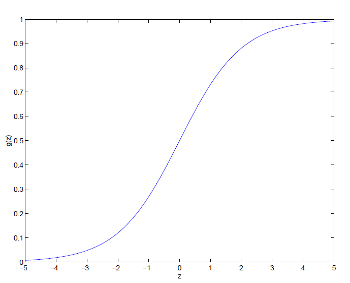

# ML

## 绪论

### ML框架

### types of learning problems

* 监督学习
* 无监督学习
  * 自监督学习
* 半监督学习
* 迁移学习
* 主动学习
* 强化学习
* 元学习

## Regression

### 单变量线性回归

* **输入特征**

  $x^{(i)} \in R^{n+1},i=1,2,···,m$

* **输出**

  $y^{(i)} \in R$

* **参数**

  $\theta = R^{n+1}$

* 假设$h_{\theta}(x):R^{n+1} \to R$

* **损失函数**

  $\ell :R \times R \to R_+$

  满足

  * 非负：不存在负损失
  * 如果预测结果$h_{\theta}(x)$与给定的y差别小，则损失小，反之则损失大

  平方损失：

  $\ell(h_{\theta}(x),y)=(h_{\theta}(x)-y)^2$

#### **三要素**

  * 假设：$h_{\theta}(x)= \theta_0+\theta_1x$，其中参数为$\theta_0,\theta_1$

  * 目标函数：

    $J\left(\theta_0, \theta_1\right)=\frac{1}{2 m} \sum_{i=1}^m \ell\left(h_\theta\left(x^{(i)}\right), y^{(i)}\right)=\frac{1}{2 m} \sum_{i=1}^m\left(h_\theta\left(x^{(i)}\right)-y^{(i)}\right)^2$

  * 优化算法：给定训练集，如何找到最优的参数$\theta$使得
    $$
    \min _{\theta_0, \theta_1} J\left(\theta_0, \theta_1\right)
    $$

* **参数优化**

  找到最优的参数$\theta^*=arg~ \min_{\theta} J(\theta)$

  * 穷举所有$\theta$
  * 随机搜索
  * 梯度下降
  

#### **梯度下降**

  repeat until convergence{

  $\theta_j:=\theta_j-\alpha \frac{\partial}{\partial \theta_j} J\left(\theta_0, \theta_1\right) \quad($ for $j=0$ and $j=1)$

  }

* **梯度**：
  $$
  \nabla_\theta f(\theta) \in \mathbb{R}^n=\left[\begin{array}{c}
  \frac{\partial f(\theta)}{\partial \theta_1} \\
  \frac{\partial f(\theta)}{\partial \theta_2} \\
  \vdots \\
  \frac{\partial f(\theta)}{\partial \theta_n}
  \end{array}\right]
  $$
  梯度下降算法的另一种表述：
  $$
  Repeat:~\theta=\theta-\alpha \nabla_{\theta}f(\theta)
  $$

* 单变量线性回归模型的梯度下降
  $$
  repeat~until~convergence:\\
  \theta_0=\theta_0-\alpha \frac{1}{m} \sum_{i=1}^{m}(h_\theta(x^{(i)})-y^{(i)})\\
  \theta_1=\theta_1-\alpha \frac{1}{m} \sum_{i=1}^{m}(h_\theta(x^{(i)})-y^{(i)}) \cdot x^{(i)}
  $$

### 多特征（变量）

#### 三要素

* 假设：$h_\theta(x)=\theta_0 x_0+\theta_1 x_1+\theta_2 x_2+\cdots+\theta_n x_n, x_0=1$
* 参数：$\theta_0,\theta_1,\dots,\theta_n$
* 目标函数：$J\left(\theta_0, \theta_1, \cdots, \theta_n\right)=\frac{1}{2 m} \sum_{i=1}^m \ell\left(h_\theta\left(x^{(i)}\right), y^{(i)}\right)=\frac{1}{2 m} \sum_{i=1}^m\left(h_\theta\left(x^{(i)}\right)-y^{(i)}\right)^2$

#### 梯度下降

$$
repeat~until~convergence:\\
\theta_j:=\theta_j-\alpha \frac{\partial}{\partial \theta_j} J\left(\theta_0, \theta_1,\dots,\theta_n\right)~~j=0,1,\dots,n
$$

#### 特征尺度归一化

* 范围归一化：使得每个特征尽量接近某个范围，如$0 \le x_i \le 1$

* 零均值归一化：用$x_i-\mu_i$替代$x_i$，即$x_i- \mu_i \to x_i$，其中$\mu_i=\frac{1}{m} \sum_{i=1}^{m} x_i$为均值

* 零均值+范围归一化

* 零均值单位方差归一化：
  $$
  \frac{x_i- \mu_i}{\sigma_i} \to x_i
  $$

#### 学习率

梯度下降$\theta_j:=\theta_j-\alpha \frac{\partial}{\partial \theta_j} J\left(\theta \right)$

收敛条件$\Delta J(\theta) \le 10^{-3}$

自动收敛测试

* 对于足够小的$\alpha,J(\theta)$应该在每一次迭代中减小
* 如果$\alpha$太小，梯度下降算法收敛速度慢
* 反之，梯度下降算法不会收敛、发散或者震荡

#### 正规方程

* 对于求函数极小值问题，除了迭代方法之外，可以**令函数的微分为零，然后求解方程**

$$
\theta \in \mathbb{R}^{n+1},\\
J\left(\theta_0, \theta_1, \cdots, \theta_n\right)=\frac{1}{2 m} \sum_{i=1}^m\left(h_\theta\left(x^{(i)}\right)-y^{(i)}\right)^2\\
\nabla_\theta J(\theta)=0
$$

解出$\theta_0,\theta_1,\dots,\theta_n$

考虑到求和需要进行循环，使用矩阵运算会有更小的时间复杂度

得到$J(\theta)=\frac{1}{2m}(X\theta-y)^T(X\theta-y)$

则$\nabla_\theta J(\theta)=\frac{1}{m}(X^TX\theta-X^Ty)=0$

解出$\theta=(X^TX)^{-1}X^Ty$

#### 梯度下降和正规方程的比较

m训练样本，n个特征

* 梯度下降
  * 需要选择合适的$\alpha$
  * 需要多次迭代
  * 即使n很大效果也很好
* 正规方程
  * 不需要选择$\alpha$
  * 不需要迭代
  * 需要计算$(X^TX)^{-1}$
  * n很大会导致求解很慢
  * 矩阵不可逆时需要删减一些特征，或者进行正则化

## classification

### Logistic Regression

目标：$0 \le h_\theta(x) \le 1$
$$
h_\theta(x)=g(\theta^Tx)=\frac{1}{1+e^{-\theta^Tx}}
$$

#### Sigmoid函数

#### 概率解释

$$
h_\theta(x)=g(\theta^Tx)=\frac{1}{1+e^{-\theta^Tx}}
$$

$h_\theta(x)$对于输入x，输出y=1的可能性

给出x，估计y=1的可能性，$\theta$为参数
$$
P(y=0|x;\theta)+P(y=1|x;\theta)=1
$$
