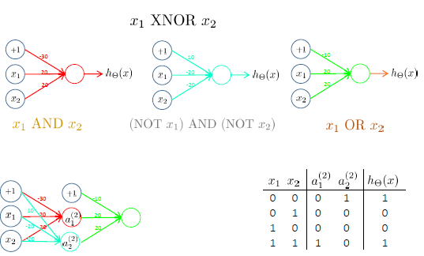
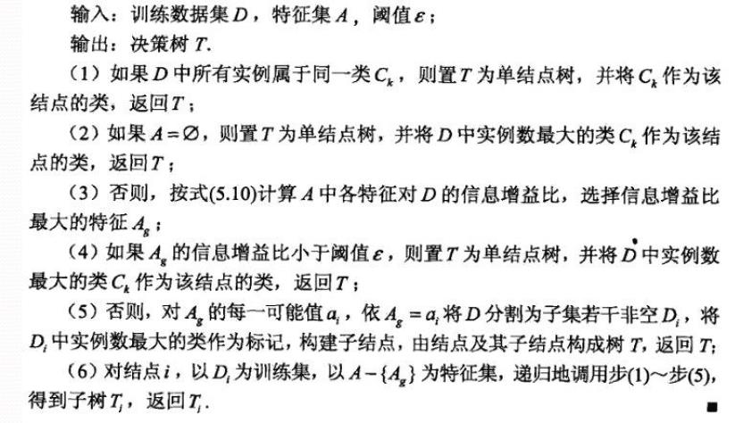
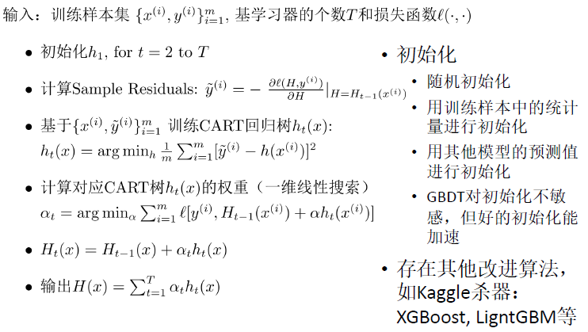

# ML

## 绪论

### ML框架


### types of learning problems

* 监督学习
* 无监督学习
  * 自监督学习
* 半监督学习
* 迁移学习
* 主动学习
* 强化学习
* 元学习

## Regression

### 单变量线性回归

* **输入特征**

  $x^{(i)} \in R^{n+1},i=1,2,···,m$

* **输出**

  $y^{(i)} \in R$

* **参数**

  $\theta = R^{n+1}$

* 假设$h_{\theta}(x):R^{n+1} \to R$

* **损失函数**

  $\ell :R \times R \to R_+$

  满足

  * 非负：不存在负损失
  * 如果预测结果$h_{\theta}(x)$与给定的y差别小，则损失小，反之则损失大

  平方损失：

  $\ell(h_{\theta}(x),y)=(h_{\theta}(x)-y)^2$

#### **三要素**

  * 假设：$h_{\theta}(x)= \theta_0+\theta_1x$，其中参数为$\theta_0,\theta_1$

  * 目标函数：

    $J\left(\theta_0, \theta_1\right)=\frac{1}{2 m} \sum_{i=1}^m \ell\left(h_\theta\left(x^{(i)}\right), y^{(i)}\right)=\frac{1}{2 m} \sum_{i=1}^m\left(h_\theta\left(x^{(i)}\right)-y^{(i)}\right)^2$

  * 优化算法：给定训练集，如何找到最优的参数$\theta$使得
    $$
    \min _{\theta_0, \theta_1} J\left(\theta_0, \theta_1\right)
    $$

* **参数优化**

  找到最优的参数$\theta^*=arg~ \min_{\theta} J(\theta)$

  * 穷举所有$\theta$
  * 随机搜索
  * 梯度下降
  

#### **梯度下降**

  repeat until convergence{

  $\theta_j:=\theta_j-\alpha \frac{\partial}{\partial \theta_j} J\left(\theta_0, \theta_1\right) \quad($ for $j=0$ and $j=1)$

  }

* **梯度**：
  $$
  \nabla_\theta f(\theta) \in \mathbb{R}^n=\left[\begin{array}{c}
  \frac{\partial f(\theta)}{\partial \theta_1} \\
  \frac{\partial f(\theta)}{\partial \theta_2} \\
  \vdots \\
  \frac{\partial f(\theta)}{\partial \theta_n}
  \end{array}\right]
  $$
  梯度下降算法的另一种表述：
  $$
  Repeat:~\theta=\theta-\alpha \nabla_{\theta}f(\theta)
  $$

* 单变量线性回归模型的梯度下降
  $$
  repeat~until~convergence:\\
  \theta_0=\theta_0-\alpha \frac{1}{m} \sum_{i=1}^{m}(h_\theta(x^{(i)})-y^{(i)})\\
  \theta_1=\theta_1-\alpha \frac{1}{m} \sum_{i=1}^{m}(h_\theta(x^{(i)})-y^{(i)}) \cdot x^{(i)}
  $$

### 多特征（变量）

#### 三要素

* 假设：$h_\theta(x)=\theta_0 x_0+\theta_1 x_1+\theta_2 x_2+\cdots+\theta_n x_n, x_0=1$
* 参数：$\theta_0,\theta_1,\dots,\theta_n$
* 目标函数：$J\left(\theta_0, \theta_1, \cdots, \theta_n\right)=\frac{1}{2 m} \sum_{i=1}^m \ell\left(h_\theta\left(x^{(i)}\right), y^{(i)}\right)=\frac{1}{2 m} \sum_{i=1}^m\left(h_\theta\left(x^{(i)}\right)-y^{(i)}\right)^2$

#### 梯度下降

$$
repeat~until~convergence:\\
\theta_j:=\theta_j-\alpha \frac{\partial}{\partial \theta_j} J\left(\theta_0, \theta_1,\dots,\theta_n\right)~~j=0,1,\dots,n
$$

#### 特征尺度归一化

* 范围归一化：使得每个特征尽量接近某个范围，如$0 \le x_i \le 1$

* 零均值归一化：用$x_i-\mu_i$替代$x_i$，即$x_i- \mu_i \to x_i$，其中$\mu_i=\frac{1}{m} \sum_{i=1}^{m} x_i$为均值

* 零均值+范围归一化

* 零均值单位方差归一化：
  $$
  \frac{x_i- \mu_i}{\sigma_i} \to x_i
  $$

#### 学习率

梯度下降$\theta_j:=\theta_j-\alpha \frac{\partial}{\partial \theta_j} J\left(\theta \right)$

收敛条件$\Delta J(\theta) \le 10^{-3}$

自动收敛测试

* 对于足够小的$\alpha,J(\theta)$应该在每一次迭代中减小
* 如果$\alpha$太小，梯度下降算法收敛速度慢
* 反之，梯度下降算法不会收敛、发散或者震荡

#### 正规方程

* 对于求函数极小值问题，除了迭代方法之外，可以**令函数的微分为零，然后求解方程**

$$
\theta \in \mathbb{R}^{n+1},\\
J\left(\theta_0, \theta_1, \cdots, \theta_n\right)=\frac{1}{2 m} \sum_{i=1}^m\left(h_\theta\left(x^{(i)}\right)-y^{(i)}\right)^2\\
\nabla_\theta J(\theta)=0
$$

解出$\theta_0,\theta_1,\dots,\theta_n$

考虑到求和需要进行循环，使用矩阵运算会有更小的时间复杂度

得到$J(\theta)=\frac{1}{2m}(X\theta-y)^T(X\theta-y)$

则$\nabla_\theta J(\theta)=\frac{1}{m}(X^TX\theta-X^Ty)=0$

解出$\theta=(X^TX)^{-1}X^Ty$

#### 梯度下降和正规方程的比较

m训练样本，n个特征

* 梯度下降
  * 需要选择合适的$\alpha$
  * 需要多次迭代
  * 即使n很大效果也很好
* 正规方程
  * 不需要选择$\alpha$
  * 不需要迭代
  * 需要计算$(X^TX)^{-1}$
  * n很大会导致求解很慢
  * 矩阵不可逆时需要删减一些特征，或者进行正则化

## classification

### Logistic Regression

目标：$0 \le h_\theta(x) \le 1$
$$
h_\theta(x)=g(\theta^Tx)=\frac{1}{1+e^{-\theta^Tx}}
$$

#### Sigmoid函数


#### 概率解释

$$
h_\theta(x)=g(\theta^Tx)=\frac{1}{1+e^{-\theta^Tx}}
$$

$h_\theta(x)$对于输入x，输出y=1的可能性

给出x，估计y=1的可能性，$\theta$为参数
$$
P(y=0|x;\theta)+P(y=1|x;\theta)=1
$$

#### 分类边界

数形结合可知，$h_{\theta}(x)$形成的一个闭合曲线/曲面作为一个分类边界
$$
h_{\theta}(x) \ge c \to y=1
$$

$$
h_{\theta}(x) \lt c \to y=0
$$

#### 损失函数

$$
P(y=0|x;\theta)=h_{\theta}(x)
$$

$$
P(y=1|x;\theta)=1-h_{\theta}(x)
$$

$$
p(y|x;\theta)=(h_\theta(x))^y(1-h_\theta(x))^{1-y}
$$

$$
L(\theta)=p(y|\mathbf{X};\theta)=\prod_{i=1}^m p(y^{(i)}|x^{(i)};\theta)=\prod_{i=1}^m (h_\theta(x^{(i)}))^{y^{(i)}}(1-h_\theta(x^{(i)}))^{1-y^{(i)}}
$$

**Logistic损失函数**
$$
\ell(\theta)=-\log L(\theta)=-\left[\sum_{i=1}^m y^{(i)} \log h_\theta(x^{(i)})+(1-y^{(i)}) \log (1-h_\theta(x^{(i)})) \right]
$$
**cross entropy 交叉熵**
$$
H(p,q)=-\sum_x p(x) \log q(x)
$$
通俗来说，$p(x)$是真实样本的分布，$q(x)$是预测样本的分布，cross entropy代表的是两个分布之间的距离，越小说明分布越接近，迭代过程中需要将ce降下来

**分类问题中常用**
$$
\operatorname{Cost}\left(h_\theta(x), y\right)=\left\{\begin{aligned}
-\log \left(h_\theta(x)\right) & \text { if } y=1 \\
-\log \left(1-h_\theta(x)\right) & \text { if } y=0
\end{aligned}\right.
$$

#### 梯度下降

$$
J(\theta)=-\left[\sum_{i=1}^m y^{(i)} \log h_\theta(x^{(i)})+(1-y^{(i)}) \log (1-h_\theta(x^{(i)})) \right]
$$

找到合适的参数$\theta$使得$\min_\theta J(\theta)$

repeat{
$$
\theta_j=\theta_j-\alpha \frac{\partial}{\partial \theta_j}J(\theta)
$$
}

$\frac{\partial}{\partial \theta_j}J(\theta)=(h_\theta(x)-y)x_j$

不可以直接使用线性回归中的平方损失函数


黑色的是cross entropy，红色的是square error

#### Multi-class Classification

$$
h_{\theta_i}=P(y=i|x;\theta_i),i=1,2,3,...
$$

一对多

* 为每类训练一个逻辑回归分类器$h_{\theta_i}(x)$用来预测$y=i$的可能性

* 对于新输入$x$，做一个预测，选择一个类别$i^*$使得：
  $$
  i^*=arg \max_i h_{\theta_i}(x)
  $$

#### softmax Regression

$$
p(y=i|x;\theta)=h_{\theta_i}(x)=\frac{e^{z_i}}{\sum_{j=1}^K e^{z_j}},z_j=(\theta_i)^Tx
$$

对数似然为
$$
L(\theta)=\sum_{i=1}^{m} \log p(y^{(i)}|x^{(i)};\theta)=\sum_{i=1}^{m} \log (\frac{e^zy^{(i)}}{\sum_{j=1}^K e^{z_j}})
$$
总损失为
$$
\ell(\theta)=-L(\theta)=-\sum_{i=1}^{m} \log (\frac{e^zy^{(i)}}{\sum_{j=1}^K e^{z_j}})=\sum_{i=1}^m \left[\log(\sum_{j=1}^K e^{z_j})-z_{y^(i)}  \right]
$$

$$
\hat{y_i}=h_{\theta_i}(x)
$$

## 模型选择与正则化

### 偏差与方差

偏差bias，方差variance
$$
bias(h(x))=E[h(x)-y(x)]
$$

$$
var(h(x))=E \lbrace h(x)-E[h(x)] \rbrace
$$

### 过拟合

如果多项式阶数较大，训练得到的模型对于训练集能正确拟合$J(\theta)=\frac{1}{2m}[h_\theta(x^{(i)}-y^{(i)})^2] \approx  0$，但是对于新的样本预测效果却不好

实际应用中容易出现过拟合

绘制这个模型的学习曲线

通过学习曲线的形态来判断

所谓学习曲线就是训练集得分和验证集得分随着训练样本数的增大而变化的曲线

**欠拟合情况**：随着训练样本数增大，训练集得分和验证集得分收敛，并且两者的收敛值很接近

**过拟合情况**：随着训练样本数增大，训练集得分和验证集得分相差还是很大

### 模型选择

将训练集随机分成两部分：用于训练参数的训练集和用于模型选择的验证集


### 诊断误差和方差

训练误差：$L_{train}(\theta)=\frac{1}{2m} \sum_{i=1}^m (h_\theta(x^{(i)})-y^{(i)})^2$

验证误差：$L_{val}(\theta)=\frac{1}{2m_{val}} \sum_{i=1}^{m_{val}} (h_\theta(x_{val}^{(i)})-y_{val}^{(i)})^2$

#### 偏差大（underfit欠拟合）

训练误差：大

训练误差与验证误差差别较小

#### 方差大（overfit过拟合）

训练误差：小

验证误差远大于训练误差


从图像上可以知道，靠左侧是欠拟合，靠右侧是过拟合

### 解决欠拟合和过拟合问题

#### 欠拟合

核心：增加模型的复杂度

* 收集新的特征
* 增加多项式组合特征
* ...

#### 过拟合

* 增加数据
* 降低模型的复杂度
  * 减少特征（人为筛选）
  * 正则化，可降低方差提高偏差

### 正则化线性回归

#### Regularized Linear Regression

$$
\min_\theta J(\theta)
$$

$$
J(\theta)=\frac{1}{2m} \left[ \sum_{i=1}^m (h_\theta(x^{(i)})-y^{(i)})^2 + \lambda \sum_{j=1}^n \theta_j^2 \right]
$$

$$
L(\theta)=\frac{1}{2m} \sum_{i=1}^m (h_\theta(x^{(i)})-y^{(i)})^2
$$

$$
J(\theta)=L(\theta)+\lambda R(\theta)
$$

gradient descent

repeat{
$$
\theta_j=\theta_j(1-\alpha \frac{\lambda}{m})-\alpha \frac{1}{m} \sum_{i=1}^m (h_\theta(x^{(i)})-y^{(i)})x_j^{(i)}
$$
}

**正则化参数$\lambda$的选择**
$$
J(\theta)=\frac{1}{2m} \left[ \sum_{i=1}^m (h_\theta(x^{(i)})-y^{(i)})^2 + \lambda \sum_{j=1}^n \theta_j^2 \right]
$$

$$
L(\theta)=\frac{1}{2m} \sum_{i=1}^m (h_\theta(x^{(i)})-y^{(i)})^2
$$

#### RegularizedNormal equation

$$
\theta=\left(X^T X+\lambda\left[\begin{array}{lllll}
0 & & & & \\
& 1 & & & \\
& & 1 & & \\
& & & \ddots & \\
& & & & 1
\end{array}\right]\right) X^{-1} X^T y
$$

### Regularized Logistic Regression

$$
J(\theta)=\left[-\frac{1}{m} \sum_{i=1}^m y^{(i)} \log \left(h_\theta\left(x^{(i)}\right)+\left(1-y^{(i)}\right) \log (1-h_\theta\left(x^{(i)}\right))\right]+\frac{\lambda}{2 m} \sum_{j=1}^n \theta_j^2\right.
$$

梯度下降同上

$$
J(\theta)=L(\theta)+\lambda R(\theta)
$$

$$
L(\theta)=\left[-\frac{1}{m} \sum_{i=1}^m y^{(i)} \log (h_\theta(x^{(i)})+(1-y^{(i)}) \log (1-h_\theta(x^{(i)}))\right]
$$

### 学习曲线


如果一个模型测试结果是high bias，使用更多的训练数据并不能改进模型


如果一个模型测试结果是high variance，使用更多的训练数据会有效改进模型

### 模型性能评估

* 用训练集训练参数

$$
\theta^*=a\arg \min_\theta \frac{1}{m} \sum_{i=1}^m \ell(h_\theta(x^{(i)}),y^{(i)})
$$

* 用验证集选择模型，用于调参（正则化参数、多项式阶数、特征选择）
* 测试集仅用于性能评估

#### 验证集和测试集

* 验证集和测试集应具有同分布
* 验证集和测试集的大小
  * 验证集：1000-10000；应当足够大
  * 测试集：中小30%；大数据足够大

#### 交叉验证 k-fold cross validation

* 数据集规模较小情况下采用
* 把数据随机划分为k等份，每次用其中的(k - 1)份做训练，剩下的做验证
* 计算平均误差（和方差）

## 神经网络与深度学习

### 非线性分类

### The "one learning algorithm" hypothesis

### 神经元模型：Logistic unit


### 全连接前馈网络 Fully Connect Feedforward Network


如果在第j层有$s_j$个units，第j+1层有$s_{j+1}$个units，则$\theta^{(j)}$的维数是$s_j \times s_{j+1}$

FCFN的执行过程

激活函数$g(z)=\frac{1}{1+e^{-z}}$


### 前向传播：矩阵表示


$$
h_\theta(x)=g(\theta^{(2)}g(\theta^{(1)}x))
$$

### 特征学习


### 多层神经网络


#### 用神经网络求解XOR/XNOR问题




#### 处理多分类问题


#### 手写数字识别


### 网络结构

$$
h_\theta(x)=g_L(\theta^{L-1}g_{L-1}(\dots g_2(\theta^{(2)}g_1(\theta^{(1)}x))))
$$

### DeepLearning:Many hidden layers

### 激活函数

$$
z=\sum \theta_ix_i +\theta_0
$$

$$
\frac{dz}{d\theta_i}=x_i
$$

$$
\frac{dJ}{d\theta_i}=\frac{dJ}{dz} \frac{dz}{d \theta_i}=\frac{dJ}{dz}x_i
$$

#### sigmoid


$$
sigmoid:g(x)=\frac{1}{1+e^{-x}}
$$

1. Saturated neurons “kill” the gradients
2. Sigmoid outputs are not zerocentered
3. exp() is a bit compute expensive

#### tanh


$$
tanh:g(x)=\frac{e^x-e^{-x}}{e^x+e^{-x}}
$$

1. Zero centered (nice)

2. “kill”the gradients
3. exp() is a bit compute expensive

#### ReLU


$$
ReLU:g(x)=\max(0,x)
$$

1. Does not saturate (in +region)

2. Very computationally efficient
3. Converges much faster than sigmoid/tanh in practice (e.g. 6x)
4. Actually more biologically plausible than sigmoid
5. Not zero-centered output
6. x<0: dead ReLU will never activate => never update

#### Leaky ReLU


$$
Leaky ReLU:g(x)=\max(0.1x,x)
$$

1. Does not saturate (in +region)

2. Very computationally efficient
3. Converges much faster than sigmoid/tanh in practice (e.g. 6x)
4. Actually more biologically plausible than sigmoid
5. Not zero-centered output
6. Will not “die”

$$
Parametric\ Rectifier\ Linear\ Unit(PReLU):g(x)=\max(\alpha x,x)
$$

### 损失函数

$$
l(y,\hat{y})=-\sum_{i=1}^n y_i \log(\hat{y_i})
$$

### 目标函数

$$
J(\theta)=L(\theta)+\lambda R(\theta)
$$

$$
h_\theta(x) \in \mathbb{R}^K,(h_\theta(x))_k=k^{th}\ output
$$

$$
\begin{aligned}
J(\Theta) & =-\frac{1}{m}\left[\sum_{i=1}^m \log p\left(y^{(i)} \mid x^{(i)} ; \Theta\right)\right]+\frac{\lambda}{2 m} \sum_{l=1}^{L-1} \sum_{i=1}^{s_l} \sum_{j=1}^{s_{l+1}}\left(\Theta_{j i}^{(l)}\right)^2 \\
& =-\frac{1}{m} \sum_{i=1}^m \sum_{k=1}^K y_k^{(i)} \log \left(h_{\Theta}\left(x^{(i)}\right)\right)_k+\frac{\lambda}{2 m} \sum_{l=1}^{L-1} \sum_{i=1}^{s_l} \sum_{j=1}^{s_{l+1}}\left(\Theta_{j i}^{(l)}\right)^2
\end{aligned}
$$

### 梯度下降法

$$
\min_\theta J(\theta)
$$

### 梯度计算：反向传播

BackPropagation，BP

#### 链式法则


#### 梯度矢量化表示


#### Batch gradient descent vs. Stochastic gradient descent


**Mini-batch gradient descent**


* Batch gradient descent

  ```python
  for i in range(nb_epochs):
  	params_grad=evaluate_gradient(loss_function,data,params)
  	params=params-learning_rate*params_grad
  ```

* Stochastic gradient descent

  ```python
  for i in range(nb_epochs):
  	np.random.shuffle(data)
  	for example in data:
  		params_grad=evaluate_gradient(loss_function,example,params)
  		params=params-learning_rate*params_grad
  ```

* Mini-batch gradient descent

  ```python
  for i in range(nb_epochs):
  	np.random.shuffle(data)
  	for batch in get_batches(data,batch_size=50):
  		params_grad=evaluate_gradient(loss_function,batch,params)
  		params=params-learning_rate*params_grad
  ```

### Stepsize vs. Gradient


### Adaptive 学习率


#### AdaGrad

$$
\alpha^t=\frac{\alpha}{\sqrt{t+1}},g_t=\frac{\partial J(\theta^t)}{\partial \theta}
$$

$$
\theta^{t+1}=\theta^t-\frac{\alpha^t}{\sigma^t}g_t,\sigma^t=\sqrt{\frac{1}{t+1}\sum_{i=0}^{t}g_i^2}
$$

$$
\theta^{t+1}=\theta^t-\frac{\alpha^t}{\sqrt{\sum_{i=0}^tg_i^2}}g_t
$$

#### RMSProp

$$
u^0=0
$$

$$
u^t=\rho u^{t-1}+(1-\rho)g_t^2
$$

$$
\theta^{t+1}=\theta^t-\frac{\alpha}{\sqrt{u^t}}g_t
$$

#### AdaDelta


#### Momentum

**GD+Momentum**
$$
v^0=0
$$

$$
v^t=\rho v^{t-1}+\alpha g_t
$$

$$
\theta^{t+1}=\theta^t-v^t
$$

引入速度（前面梯度的加权均值）


**Nesterov Momentum**


$$
v^t=\rho v^{t-1}+\alpha \frac{\partial J(\theta^t+\rho v^{t-1})}{\partial \theta}
$$

$$
\theta^{t+1}=\theta^t-v^t
$$

#### Adam

$$
m^0=0,v^0=0
$$

$$
m^t=\beta_1 m^{t-1}+(1-\beta_1)g_t
$$

$$
v^t=\beta_2 v^{t-1}+(1-\beta_2)g_t^2
$$

$$
\theta^{t+1}=\theta^t-\frac{\alpha}{\sqrt{v^t+\epsilon}}m%t
$$


#### AdaBelief


$$
s^t=\beta_2 s^{t-1}+(1-\beta_2)(g_t-m_t)^2
$$

$$
\theta^{t+1}=\theta^t-\frac{\alpha}{\sqrt{s^t+\epsilon}}m%t
$$

Adam or AdaBelief might be the best overall choice

SGD

* usually achieves to find a minimum, but it might take significantly longer
* is much more reliant on a robust initialization and annealing schedule
* may get stuck in saddle points rather than local minima

### Additional strategies for optimizing SGD

* Shuffling and Curriculum Learning 打乱数据集和课程学习
* Early stopping: Early stopping (is) beautiful free lunch (Geoff Hinton) 早停
* Gradient noise: add noise to each gradient update 梯度噪声

### 二阶方法：牛顿法

迭代规则
$$
\theta:=\theta-\frac{f(\theta)}{f'(\theta)}
$$

$$
\theta:=\theta-\frac{f(\theta)}{f'(\theta)},\min_\theta J(\theta) \to J'(\theta)=0,f(\theta)=J'(\theta)
$$

$$
\theta=\theta-\frac{J'(\theta)}{J''(\theta)}
$$

$\theta$是矢量，则$\theta:=\theta-H^{-1} \nabla_\theta J(\theta) ,H_{ij}=\frac{\partial^2 \ell(\theta)}{\partial \theta_i \partial \theta_j}$

由于二阶方法需要计算Hessian矩阵，在参数数目较多的情况下计算复杂，目前主要仍采用一阶方法

### Gradient checking

$$
\frac{\partial J(\theta)}{\partial \theta} \approx \frac{J(\theta+\epsilon)-J(\theta-\epsilon)}{2\epsilon}
$$


### 初始化

不能zero initialization，否则训练出全部相同的神经元

Random initialization (Gaussian with zero mean and 1e-2 standard deviation)，Works ~okay for small networks, but problems with deeper networks

### 数据预处理


### 网格结构选择与设计

前一层的输出与后一层的输入需要一致

### 训练网络

* Initialize weights
* Implement forward propagation
* Implement code to compute cost function
* Implement backpropagation code to compute gradient
* Implement numerical gradient check (disable your gradient checking code before training)
* Double check that the loss is reasonable
* Make sure that you can overfit very small portion of the training data
* Start with small regularization and find learning rate that makes the loss go down

## Support Vector Machines

$$
\hat{\gamma}^{(i)}=y^{(i)}(w^Tx^{(i)}+b)
$$

$$
y=\operatorname{sign}\left(w^T x+b\right)= \begin{cases}+1, & w^T x+b>0 \\ -1, & w^T x+b<0\end{cases}
$$

要求：
$$
y^{(i)}(w^Tx^{(i)}+b)>0
$$

### 最大间隔分类器(Max Margin Classifier)

$$
w^Tx^++b=+1,w^Tx^-+b=-1,x^+=x^-+\lambda w
$$

$$
margin=\parallel x^+-x^- \parallel
$$

$$
w^T(x^+-x^-)=2
$$

$$
\lambda=\frac{2}{w^Tw}
$$

$$
margin=\parallel x^+-x^-\parallel =\parallel \lambda w \parallel=\frac{2}{\parallel w \parallel}
$$

$$
margin:\max_w \frac{2}{\parallel w \parallel} \to \min_w \frac{1}{2}\parallel w \parallel^2
$$

### The Primal Hard SVM

假设数据线性可分，即$y^{(i)}(w^Tx^{(i)}+b) \ge 1$

*关于函数间隔为什么可设置为1，参考[机器学习SVM中关于函数间隔为什么可以设置为1？](https://www.zhihu.com/question/64568136)，这里面写的比较详细*
$$
\begin{aligned}
\min _{w, b} & \frac{1}{2}\|w\|^2 \\
\text { s.t. } & y^{(i)}\left(w^T x^{(i)}+b\right) \geq 1, \quad i=1, \ldots, m
\end{aligned}
$$
典型的二次规划问题

#### Equality constraint

$$
\max_x f(x)
$$

$$
\text { s.t. }  g(x)=0
$$

$$
\nabla f(x^*,y^*)+\lambda \nabla g(x^*,y^*)=0,\beta \neq 0
$$

定义Lagrange函数$\mathcal L(x,y,\lambda)=f(x,y)+\lambda g(x,y)$

令$\nabla_{x,y} \mathcal L=0$得到上式

令$\nabla_{\lambda} \mathcal L=0$得到约束条件$g(x,y)=0$


#### Inequality constraint

$$
\max_x f(\mathbf x)
$$

$$
\text{s.t.} g(\mathbf x) \ge 0
$$

$$
\mathcal{L}(\mathbf x,\lambda)=f(\mathbf x)+\lambda g(\mathbf x)
$$

无效：

最优解本身满足约束$g(\mathbf x) >0$，约束条件不起作用，即
$$
\lambda=0
$$
有效：

最优解再约束条件边界上，$g(\mathbf x) =0$，此时$\nabla g(\mathbf x)$方向必定与$\nabla f(\mathbf x)$相反，即
$$
\nabla f(\mathbf x)+\lambda \nabla g(\mathbf x)=0,\lambda >0
$$
两种情况都有$\lambda g(\mathbf x)=0$

#### Lagrange Multiplier

##### equality

$$
\min_w f(w)
$$

$$
\text{s.t.} h_i(w)=0,i=1,\dots,l
$$

$$
\mathcal{L} (w,\beta)=f(w)+\sum_{i=1}^l \beta_ih_i(w),\beta_i:\mathbf{Lagrange\ multipliers}
$$

$$
\frac{\partial \mathcal L}{\partial w}=0;\frac{\partial \mathcal L}{\partial \beta_i}=0
$$

##### inequality&equality

$$
\min_w f(w)
$$

$$
\text{s.t.}\ g_i(w) \le 0,i=1,\dots,k
$$

$$
\ \ \ \ \ h_i(w)=0,i=1,\dots,l
$$

$$
\mathcal L(w,\alpha,\beta)=f(w)+\sum_{i=1}^k \alpha_i g_i(w)+\sum_{i=1}^l \beta_i g_i(w)
$$


$$
\text{s.t.}\ \alpha_i g_i(w)=0,i=1,\dots,k
$$

$$
\ \ \ \alpha_i \ge 0,i=1,\dots,k
$$

$$
\theta_{\mathcal{P}}(w)=\max _{\alpha, \beta: \alpha_i \geq 0} \mathcal{L}(w, \alpha, \beta)
$$

给出$w$，如果$w$违反了最初的约束(e.g. $g_i(w)<0\ or \ h_i(w) \neq 0 \ for \ some \ i$)，应当能给出
$$
\theta_{\mathcal{P}}(w)=\max _{\alpha, \beta: \alpha_i \geq 0} \mathcal{L}(w, \alpha, \beta)=\max _{\alpha, \beta: \alpha_i \geq 0}  f(w)+\sum_{i=1}^k \alpha_i g_i(w)+\sum_{i=1}^l \beta_i g_i(w)=\infin
$$

#### Primal vs. Dual

##### Primal

$$
\theta_{\mathcal{P}}(w)=\max _{\alpha, \beta: \alpha_i \geq 0} \mathcal{L}(w, \alpha, \beta),\mathcal L(w,\alpha,\beta)=f(w)+\sum_{i=1}^k \alpha_i g_i(w)+\sum_{i=1}^l \beta_i g_i(w)
$$

$$
\theta_{\mathcal{P}}(w)= \begin{cases}f(w) & \text { if } w \text { satisfies primal constraints } \\ \infty & \text { otherwise. }\end{cases}
$$

$$
\min_w \theta_{\mathcal{P}}(w)=\min_w \max _{\alpha, \beta: \alpha_i \geq 0} \mathcal{L}(w, \alpha, \beta)
$$

##### Dual

$$
\theta_{\mathcal D}(\alpha,\beta)=\min_w \mathcal{L}(w, \alpha, \beta)
$$

$$
\max _{\alpha, \beta: \alpha_i \geq 0} \min_w \mathcal{L}(w, \alpha, \beta)
$$

##### 弱对偶性

$$
d^*=\max _{\alpha, \beta: \alpha_i \geq 0} \min_w \mathcal{L}(w, \alpha, \beta) \le \min_w \max _{\alpha, \beta: \alpha_i \geq 0} \mathcal{L}(w, \alpha, \beta)=p^*
$$

##### 强对偶性

$$
d^*=\max _{\alpha, \beta: \alpha_i \geq 0} \min_w \mathcal{L}(w, \alpha, \beta) = \min_w \max _{\alpha, \beta: \alpha_i \geq 0} \mathcal{L}(w, \alpha, \beta)=p^*
$$

under certain conditions:

* f is convex(its Hessian is positive semi-definite)
* $g_i$'s are convex set
* $h_i$'s are affine, $h_i(w)=a_i^Tw+b_i$

#### KKT Conditions

$$
\min_w f(w)
$$

$$
\text{s.t.}\ g_i(w) \le 0,i=1,\dots,k
$$

$$
\ \ \ \ \ h_i(w)=0,i=1,\dots,l
$$

$$
\mathcal L(w,\alpha,\beta)=f(w)+\sum_{i=1}^k \alpha_i g_i(w)+\sum_{i=1}^l \beta_i g_i(w)
$$

$$
\begin{aligned}
\frac{\partial}{\partial w_i} \mathcal{L}\left(w^*, \alpha^*, \beta^*\right) & =0, \quad i=1, \ldots, n \\
\frac{\partial}{\partial \beta_i} \mathcal{L}\left(w^*, \alpha^*, \beta^*\right) & =0, \quad i=1, \ldots, l \\
\alpha_i^* g_i\left(w^*\right) & =0, \quad i=1, \ldots, k \\
g_i\left(w^*\right) & \leq 0, \quad i=1, \ldots, k \\
\alpha^* & \geq 0, \quad i=1, \ldots,
\end{aligned}
$$

#### SVM:from Primal to Dual

$$
\begin{aligned}
\min _{w, b} & \frac{1}{2}\|w\|^2 \\
\text { s.t. } & y^{(i)}\left(w^T x^{(i)}+b\right) \geq 1, \quad i=1, \ldots, m
\end{aligned}
$$

**Lagrange function**
$$
\mathcal L(w,b,a)=\frac{1}{2}\|w\|^2-\sum_{i-1}^{m}\alpha_i[y^{(i)}\left(w^T x^{(i)}+b\right)-1]
$$

$$
\nabla_w \mathcal L(w,b,a)=w-\sum_{i-1}^{m}\alpha_i y^{(i)}x^{(i)}=0 \Rightarrow w^*=\sum_{i=1}^{m}\alpha_i y^{(i)}x^{(i)}
$$

$$
\frac{\partial}{\partial b}\mathcal L(w,b,a)=\sum_{i=1}^m \alpha_i^*y^{(i)}=0
$$

将上述条件带入$\mathcal L$中，得到
$$
\mathcal{L}(w, b, \alpha)=\sum_{i=1}^m \alpha_i-\frac{1}{2} \sum_{i, j=1}^m y^{(i)} y^{(j)} \alpha_i \alpha_j\left(x^{(i)}\right)^T x^{(j)}
$$
**solving the Dual:The SMO Algorithm**
$$
\max_\alpha W(\alpha)=\sum_{i=1}^m \alpha_i-\frac{1}{2} \sum_{i, j=1}^m y^{(i)} y^{(j)} \alpha_i \alpha_j\left(x^{(i)}\right)^T x^{(j)}
$$

$$
\text{s.t.}\ \alpha_i \ge0,i=1,\dots,m
$$

$$
\sum_{i=1}^m \alpha_i y^{(i)}=0
$$


### The Dual Hard SVM

$$
\max_\alpha W(\alpha)=\sum_{i=1}^m \alpha_i-\frac{1}{2} \sum_{i, j=1}^m y^{(i)} y^{(j)} \alpha_i \alpha_j\left(x^{(i)}\right)^T x^{(j)}
$$

$$
\text{s.t.}\ \alpha_i \ge0,i=1,\dots,m
$$

$$
\sum_{i=1}^m \alpha_i y^{(i)}=0
$$

得到$\alpha^*$后代入$w^*=\sum_{i=1}^{m}\alpha_i y^{(i)}x^{(i)}$得到最优解$w^*$


* 一般情况下只有少数训练样本对应的Lagrange Multiplier大于零(支持向量)，分类面则是由这些支持向量决定
* 决策时只需计算新样本与所有支持向量的内积

### From Hard SVM to Soft SVM

$$
(w^*_{hard},b^*_{hard})=\arg\min_{w,b}\frac{1}{2}\|w\|^2
$$

$$
\text { s.t. }  y^{(i)}\left(w^T x^{(i)}+b\right) \geq 1, \quad i=1, \ldots, m
$$

$$
(w^*_{hard},b^*_{hard})=\arg\min_{w,b} \sum_{i=1}^m \ell_{0-\infin}(y^{(i)}\left(w^T x^{(i)}+b\right) \geq 1)+\frac{1}{2}\|w\|^2
$$

$$
J(\theta)=L(\theta)+\lambda R(\theta)
$$

### From Logistic Loss to Hinge Loss

$$
z=\theta^Tx=w^Tx+b
$$

$$
\text { Logistic Loss: } \ell=\left\{\begin{array}{ll}
-\log \left(\frac{1}{1+e^{-z}}\right)=\log \left(1+e^{-z}\right), & y=+1 \\
-\log \left(1-\frac{1}{1+e^{-z}}\right)=\log \left(1+e^z\right), & y=-1
\end{array} \quad \Rightarrow \ell=\log \left(1+e^{-y z}\right)\right.
$$

$$
\text{Hinge\ Loss}:\ell=\max(1-yz,0)
$$

### The Primal Soft SVM problem

Logistic loss
$$
(w^*_{hard},b^*_{hard})=\arg\min_{w,b} \sum_{i=1}^m \ell_{0-\infin}(y^{(i)}\left(w^T x^{(i)}+b\right) \geq 1)+\frac{1}{2}\|w\|^2
$$
hinge loss
$$
(w^*_{soft},b^*_{soft})=\arg\min_{w,b} C\sum_{i=1}^m \max(1-y^{(i)}\left(w^T x^{(i)}+b\right),0 )+\frac{1}{2}\|w\|^2
$$
**松弛因子**
$$
\xi_i=\max(1-y^{(i)}\left(w^T x^{(i)}+b\right),0 )
$$
**惩罚因子**$C$
$$
(w^*_{soft},b^*_{soft})=\arg\min_{w,b,\xi} C\sum_{i=1}^m \frac{1}{2}\|w\|^2+C\sum_{i=1}^m \xi_i
$$

$$
\text { s.t. }  y^{(i)}\left(w^T x^{(i)}+b\right) \geq 1-\xi_i, \quad i=1, \ldots, m
$$

$$
\xi_i \ge 0,i=1,\dots,m
$$

### The Dual Soft SVM

$$
(w^*_{soft},b^*_{soft})=\arg\min_{w,b,\xi} C\sum_{i=1}^m \frac{1}{2}\|w\|^2+C\sum_{i=1}^m \xi_i
$$

$$
\mathcal L(w,b,\xi,\alpha,r)=\frac{1}{2} w^Tw+C\sum_{i=1}^m \xi_i-\sum_{i=1}^m \alpha_i[y^{(i)}(x^Tw+b)-1+\xi_i]-\sum_{i=1}^m r_i\xi_i
$$

求偏导=0后
$$
w^*=\sum_{i=1}^m \alpha_iy^{(i)}x^{(i)}
$$

$$
\sum_{i=1}^m \alpha_i^* y^{(i)}=0
$$

$$
C=\alpha_i+r_i
$$

**primal**
$$
(w^*_{soft},b^*_{soft})=\arg\min_{w,b,\xi} C\sum_{i=1}^m \frac{1}{2}\|w\|^2+C\sum_{i=1}^m \xi_i
$$

$$
\text { s.t. }  y^{(i)}\left(w^T x^{(i)}+b\right) \geq 1-\xi_i, \quad i=1, \ldots, m
$$

$$
\xi_i \ge 0,i=1,\dots,m
$$

**dual**
$$
\max_\alpha W(\alpha)=\sum_{i=1}^m \alpha_i-\frac{1}{2} \sum_{i, j=1}^m y^{(i)} y^{(j)} \alpha_i \alpha_j\left(x^{(i)}\right)^T x^{(j)}
$$

$$
\text{s.t.}\ 0 \le \alpha_i \le C,i=1,\dots,m
$$

$$
\sum_{i=1}^m \alpha_i y^{(i)}=0
$$

对比hard，求解多一个惩罚因子C

#### KTT conditions


#### Support vectors in Soft SVM

$$
(w^*_{soft},b^*_{soft})=\arg\min_{w,b,\xi} C\sum_{i=1}^m \frac{1}{2}\|w\|^2+C\sum_{i=1}^m \xi_i
$$

$$
\text { s.t. }  y^{(i)}\left(w^T x^{(i)}+b\right) \geq 1-\xi_i, \quad i=1, \ldots, m
$$

$$
\xi_i \ge 0,i=1,\dots,m
$$


The dual soft SVM 是一个二次规划问题，通过常用的QP算法求解，规模正比于训练样本数

使用SMO算法


#### SMO implementation


### Kernel

#### 概念

通过引入松弛因子，Soft SVM能处理部分“特异点”outlier导致的线性不可分问题

如果数据本身是线性不可分的,显式将数据变换到新的空间(如采用极坐标、多项式升维)，使其线性可分，

$x \to \phi(x)$

对应SVM分类标准：$y=sign(\sum_{i=1}^m \alpha_i y^{(i)}<\phi(x^{(i)}),\phi(x)>+b)$

* 只有少数的$\alpha >0$
* 只需要知道测试样本x与支持所有支持向量的内积，无需明确知道对应的映射

直接定义核函数计算内积
$$
k(x,z)=<\phi(x),\phi(z)>=\phi(x)^T\phi(z)
$$

#### 线性核

$$
k(x,z)=(x^Tz)^2\ x,z \in \mathbb R^n
$$

$$
k(x,z)=\sum_{i,j=1}^n (x_ix_j)(z_iz_j)
$$

$$
k(x,z)=(x^Tz+c)^2=\sum_{i,j=1}^n (x_ix_j)(z_iz_j)+\sum_{i=1}^n (\sqrt{2c}x_i)(\sqrt{2c}z_i)+c^2
$$

#### 多项式核

$$
k(x,z)=(x^T+c)^d
$$

#### 高斯核RBF

$$
k(x,z)=\exp(-\frac{\|x-z\|^2}{2\sigma^2}), \phi(x) \in \mathbb R^\infin
$$

证明维度无穷


#### Kernel Matrix and Mercer Kernel


假定存在某个核函数$K(\cdot,\cdot)$对应某个隐式映射$\phi(\cdot)$，给定训练集$\{ x^{(1)},\dots,x^{(m)} \}$，对应的核矩阵$K \in \mathbb R^{m \times m}$为对称矩阵，其元素$K_{ij}=K(x^{(i)},x^{(j)})$


### Multi-Class SVM

* 将而分类器拓展处理多分类问题的基本思路
  * 训练：采用one vs. rest策略训练K个分类器$h_{\theta^{(k)}}(x)$
  * 测试：选择分类器输出最大的值


采用joint optimization，保证各类的参数矢量$(w^{(k)},b^{(k)})$有同样的规模

### SVM vs. Logistic Regression


### 支持向量回归

* soft SVM classifier
  $$
  \min_{w,b}C\sum_{i=1}^m \max (1-y^{(i)}(w^Tx^{(i)}+b),0)+\frac{1}{2}\| w \|^2
  $$

* 一般形式
  $$
  \min_{w,b}C\sum_{i=1}^m \ell (y^{(i)},h_{w,b}(x^{i}))+\frac{1}{2}\| w \|^2
  $$


不敏感损失函数


#### 线性回归

引入松弛因子$\xi_i,\xi_i^*$


$$
h_{w,b}(x)=w^Tx+b=<w,x>+b
$$


#### 非线性回归

引入核函数
$$
h_{w,b}(x)=\sum_{i=1}^m (\alpha_i^*-\alpha)<\phi(x^{(i)}),\phi(x)>+b=\sum_{i=1}^m (\alpha_i^*-\alpha)k(x^{(i)},x)+b
$$

## 决策树

* 分类问题一般包括两个步骤
  * 模型构建（归纳）：通过对训练集合的归纳，建立分类模型
  * 预测应用（推论）：根据建立的分类模型，对测试集合进行测试
* 决策树是一种典型的分类方法
  * 首先对数据进行处理，利用归纳算法生成可读的规则和决策树
  * 然后使用决策对新数据进行分析
  * 本质上是通过一系列规则对数据进行分类的过程
  * 相关算法：CLS，ID3，C4.5，CART

### 概念

决策树（decision tree）具有树结构

* 树的最顶层是根节点，包含所有样本
* 每个内部节点表示在一个特征（或属性）上的测试，将当前节点的样本划分到不同的子节点中；
* 每个叶节点代表类或类分布，对应决策结果
* 使用决策树进行决策的过程就是从根节点开始，测试待分类项中相应的特征属性，并按照其值选择输出分支，直到到达叶子节点，将叶子节点存放的类别作为决策结果

### CLS算法

#### 基本思想

从一棵空决策树开始，选择某一属性（分类属性）作为测试属性。该测试属性对应决策树中的决策结点。根据该属性的值的不同，可将训练样本分成相应的子集

* 如果该子集为空，或该子集中的样本属于同一个类，则该子集为叶结点
* 否则该子集对应于决策树的内部结点，即测试结点，需要选择一个新的分类属性对该子集进行划分，直到所有的子集都为空或者属于同一类

#### 步骤

1. 生成一颗空决策树和一张训练样本属性集;
2. 若训练样本集D中所有的样本都属于同一类,则生成结点T , 并终止学习算法;否则
3. 根据某种策略从训练样本属性表中选择属性a作为测试属性, 生成测试结点若a的取值为v1,v2,…,vm, 则根据a 的取值的不同,将D划分成m个子集D1,D2,…,Dm;
4. 从训练样本属性表中删除属性a;
5. 转步骤2, 对每个子集递归调用CLS;

关键：在步骤3中，如何根据某种策略从训练样本属性表中选择属性a作为测试属性

#### 信息增益

* Shannon提出信息论理论

* 熵entropy：信息量大小的度量，即标识随机变量不确定性的度量

* 事件$a_i$的信息量$I(a_i)$如下度量：$I(a_{i})=-\log p(a_{i})$,这里$p(a_i)$为事件$a_i$发生的概率

* 假设有n个互不相容的事件$a_1,a_2,\dots,a_n$中有且仅有一个发生，则其平均的信息量如下度量
  $$
  I(a_1,\cdots,a_n)=\sum_iI(a_i)=-\sum_ip(a_i)\log p(a_i)
  $$

* 假设当前样本集D中第k类样本的比例为$p_k$，对应的信息熵为
  $$
  Ent(D)=-\sum_kp_k\log p_k
  $$

* $Ent(D)$越小，表示数据越有序，纯度越高，分类效果越好

* 假设某离散属性$a$有V个可能值，若采用该属性对样本集来划分，则会产生V个分支，每个分支节点包含的数据记为$D^v$

* 用属性$a$对样本集$D$进行划分，获得的信息增益为：

  $$
  Gain(D,a)=Ent(D)-\sum_v\frac{|D^v|}{|D|}Ent(D^v)
  $$

* 选择具有最大信息增益的属性来划分： $a^*=\arg\max_aGain(D,a)$ (ID3)

### ID3决策树生成算法

1. 决定分类属性；

2. 对目前的数据表，建立一个节点N
3. 如果数据库中的数据都属于同一个类，N就是树叶，在树叶上标出所属的类
4. 如果数据表中没有其他属性可以考虑，则N也是树叶，按照少数服从多数的原则在树叶上标出所属类别
5. 否则，根据平均信息期望值GAIN值选出一个最佳属性作为节点N的测试属性
6. 节点属性选定后，对于该属性中的每个值
* 从N生成一个分支，并将数据表中与该分支有关的数据收集形成分支节点的数据表，在表中删除节点属性那一栏如果分支数据表非空，则运用以上算法从该节点建立子树

ID3算法的基本思想是以信息增益选择属性，实际应用中会对可能取值数目较多的属性有所偏好

* 对每个训练样本进行编号，并将该编号作为属性，其信息增益最大，但显然该属性不能作为分类依据

### 信息增益比

$$
\operatorname{Gain\_ratio}(D,a)=\frac{\operatorname{Gain}(D,a)}{IV(a)},
$$

其中
$$
IV(a)=-\sum_{v=1}^{V}\frac{|D^v|}{|D|}\log\frac{|D^v|}{|D|}
$$

为属性$a$的intrinsic value, $a$可能的取值越多，$IV(a)$通常也越大。

### 决策树C4.5的生成算法



### 决策树的剪枝

决策树剪枝减少决策树的规模是处理过拟合问题的主要手段

通过极小化决策树整体的Cost Complexity函数实现：
$$
CC(T)=Err(T)+\lambda R(T)
$$
这里$Err(T)$为树$T$的错误，$R(T)$为正则项，描述树的复杂度(如树节点的个数), $\lambda\geq0$为正则化参数

如： 设树$T$的叶结点个数为$|T|$,$t$是树$T$的叶结点，该叶结点有$N_t$个样本点，其中$k$类的样本点有$N_{tk}$个，$k=1,2,\cdots,K$。叶结点$t$上的经验熵：
$$
H_{t}(T)=-\sum_{k=1}^{K}\frac{N_{tk}}{N_{t}}\log\frac{N_{tk}}{N_{t}}
$$
目标函数为：
$$
CC(T)=\sum_{i=1}^{|T|}N_{t}H_{t}(T)+\lambda|T|=-\sum_{i=1}^{|T|}\sum_{k=1}^{K}N_{tk}\log\frac{N_{tk}}{N_{t}}+\lambda|T|
$$
**算法**

* 输入：生成算法产生的整个决策树T，正则参数$\lambda$
* 输出：
  1. 计算每个节点的代价
  2. 递归地从树的叶节点向上回溯
* 设一组叶节点回缩到其父节点之前与之后的代价分别为： $CC(T_B)$和$CC(T_A)$,若$CC(T_A)\leq CC(T_B)$,则剪枝，返回Step 2,直到不能继续为止。
* 根据验证集上的代价决定是否剪枝

### CART树

* 分类回归树(Classification and Regression Tree, CART)
  * 分类树：Gini Index
  * 回归树：平方误差最小化
* CART算法由两部分组成
  * 决策树生成
  * 决策树剪枝
* CART vs. ID3
  * 二元划分：二叉树不易产生数据碎片，精确度往往也会高于多叉树
  * 属性选择：
    * Gini Index - 分类树
    * 最小平方残差- 回归树

#### 基尼系数与CART决策树

CART决策树采用基尼系数来选择属性进行划分

基尼值：
$$
\mathrm{Gini}(D)=\sum_{k=1}^K\sum_{k^{\prime}\neq k}p_kp_{k^{\prime}}=1-\sum_{k=1}^Kp_k^2
$$
直观上，基尼值反映了从数据集中任选两个样本，其类别不一致的概率，其值越小，纯度越高

基尼系数：
$$
\operatorname{Gini\_index}(D,a)=\sum_{v=1}^{V}\frac{|D^v|}{|D|}\mathrm{Gini}(D^v)
$$

#### 多属性值的处理

* 组合的方式转化成多个二取值问题：如（青年、中老年）、（中年、青老年）、（中青年、老年）等
* 然后分别计算Gini Index，选择Gini Index最小的二分情况

#### 连续属性的处理

* C4.5决策树和CART决策树均采用将连续属性离散化，最简单的是二分法
* 虽然本质上属性的取值是连续的，但对于有限的采样数据它是离散的
* 给定样本集$D$和某连续属性$a$,假定$a$在$D$上出现了$n$个不同的取值，由大到小排序后记为$\{a^1,a^2,\cdots,a^n\}.$

* 基于阈值$t$可把$D$划分为$D_t^-$和$D_t^+$两个子集，其中$D_t^-$包含哪些属性$a$取值小于$t$的那部分样本，$D_t^+$包含哪些属性$a$取值大于$t$的那部分样本
* 显然，对于任意的$t\in(a^i,a^{i+1})$,效果相同，因此可遍历如下阈值集合$\{\frac{1}{2}(a^{i}+a^{i+1})|1\leq i\leq n-1\}$,根据Gini Index或Gain Ratio来选择最优的阈值$t$进行离散化

#### 生成算法


#### CART回归树的生成


#### CART的剪枝算法


## 集成学习

构建多个学习器一起结合来完成具体的学习任务


通过将多个学习器进行结合，常可获得比单一学习器显著优越的泛化性能，对“弱学习器” 尤为明显

集成学习分类

* 个体学习器间存在强依赖关系，必须串行生成的序列化方法。代表：Boosting (AdaBoost,Gradient Boosting Machine)
* 个体学习器间不存在强依赖关系，可同时生成的并行化方法。代表：Bagging和随机森林（Random Forest）

### Boosting

#### AdaBoost


* 基分类器：$h_t$
* 强分类器：$H$
* 每次在学习$h_t$的时候，更关注分类器$h_{t-1}$错分的样本
* 从偏差-方差分解的角度看，AdaBoost主要关注降低错误率（即降低偏差），因此AdaBoost能基于分类性能相当弱的学习器构建出分类性能很强的分类器。

加性模型：
$$
H(x)=\sum_{t=1}^{T}\alpha_{t}h_{t}(x)
$$


**AdaBoost算法的推导**

假设函数：$H(x)=\sum_{t=1}^T\alpha_th_t(x)$

目标函数：
$$
\begin{aligned}
(\alpha_{t},h_{t})& =\arg\min_{\alpha,h}\frac{1}{m}\sum_{i=1}^{m}\exp\left[-y^{(i)}\left(H_{t-1}(x^{(i)})+\alpha h(x^{(i)})\right)\right]  \\
&=\arg\min\limits_{\alpha,h}\frac{1}{m}\sum\limits_{i=1}^{m}\exp\left[-y^{(i)}\left(\sum\limits_{\tau=1}^{t-1}\alpha_{\tau}h_{\tau}(x^{(i)})+\alpha h(x^{(i)})\right)\right]
\end{aligned}
$$
损失函数：$\ell(H(x),y)=\exp(-yH(x))$

第一个分类器$h_1$直接基于初始数据分布用基学习算法可得。此后迭代生产$h_t$和对应的权重$\alpha_th_t$最小化指数损失
$$
\begin{aligned}\ell_t(\alpha_t)&=E_{x\sim\mathcal{D}_t}\exp[-y\alpha_th_t(x)]\\&=e^{-\alpha_t}P_{x\sim\mathcal{D}_t}[h_t(x)=y]+e^{\alpha_t}P_{x\sim\mathcal{D}_t}[h_t(x)\neq y]=(1-\epsilon_t)e^{-\alpha_t}+\epsilon_te^{\alpha_t}\end{aligned}
$$
令$\frac{\partial\ell_{t}}{\partial\alpha_{t}}=-e^{-\alpha_{t}}(1-\epsilon_{t})+e^{\alpha_{t}}\epsilon_{t}=0$，有$\alpha_t=\frac{1}{2}\log\left(\frac{1-\epsilon_t}{\epsilon_t}\right)$

得到分类器$H_{t-1}$后，分类器$h_t$应能纠正$H_{t-1}$的错误，即应最小化

$y \in \{ -1,+1 \},h_t(x) \in \{ -1,+1 \}$
$$
\ell_{t}(H_{t-1}+h_{t}|\mathcal{D})=E_{x\sim\mathcal{D}}\exp[-y(H_{t-1}(x)+h_{t}(x))]=E_{x\sim\mathcal{D}}e^{-yH_{t-1}(x)}e^{-yh_{t}(x)}
$$
根据泰勒公式有
$$
e^{-yh_t(x)}\approx1-yh_t(x)+\frac{1}{2}y^2h_t^2(x)=\frac{3}{2}-yh_t(x)
$$

$$
\begin{aligned}
h_{t}(x)& =\arg\operatorname*{min}_{h}E_{x\sim\mathcal{D}}e^{-yH_{t-1}(x)}e^{-yh_{t}(x)}  \\
&\approx\arg\operatorname*{max}_{h}E_{x\sim\mathcal{D}}e^{-yH_{t-1}(x)}yh_{t}(x)=\arg\operatorname*{max}_{h}E_{x\sim\mathcal{D}}\left[\frac{e^{-yH_{t-1}(x)}}{E_{x\sim\mathcal{D}}e^{-yH_{t-1}(x)}}yh_{t}(x)\right]
\end{aligned}
$$

令$\mathcal D_t$表示分布
$$
\mathcal{D}_{t}(x)=\frac{\mathcal{D}(x)e^{-yH_{t-1}(x)}}{E_{x\sim\mathcal{D}}e^{-yH_{t-1}(x)}}
$$
根据期望定义
$$
\begin{aligned}
h_{t}(x)& =\arg\max_{h}E_{x\sim\mathcal{D}_{t}}[yh_{t}(x)]  \\
&=\arg\min_{h}E_{x\sim\mathcal{D}_{t}}\mathbb{I}[y\neq h_{t}(x)]
\end{aligned}
$$
$\mathcal D_t$和$\mathcal D_{t+1}$有
$$
\begin{aligned}
\mathcal{D}_{t+1}(x)& =\frac{\mathcal{D}(x)e^{-yH_{t}(x)}}{E_{x\sim\mathcal{D}}e^{-yH_{t}(x)}}  \\
&=\frac{\mathcal{D}(x)e^{-yH_{t-1}(x)}e^{-y\alpha_{t}h_{t}(x)}}{E_{x\sim\mathcal{D}}e^{-yH_{t}(x)}} \\
&=\mathcal{D}_{t}(x)e^{-y\alpha_{t}h_{t}(x)}\frac{E_{x\sim\mathcal{D}}e^{-yH_{t-1}(x)}}{E_{x\sim\mathcal{D}}e^{-yH_{t}(x)}}
\end{aligned}
$$
选择基学习器$h_t$

* decision stump $h_{s,i,\theta}=s\operatorname{sign}(x_i-\theta)$
* 三个参数：feature i，threshold $\theta$，direction s
* 2D平面上水平或垂直线

#### Gradient Boosting Machine

采用加性模型，但是可以采用其他任意损失$\ell$

目标函数：
$$
(\alpha_{t},h_{t})=\arg\min_{h,\alpha}\frac{1}{m}\sum_{i=1}^{m}\ell\left(\sum_{\tau=1}^{t-1}\alpha_{\tau}h_{\tau}(x^{(i)})+\alpha h(x^{(i)}),y^{(i)}\right)
$$

##### Gradient Boosting Decision Tree

采用决策树（回归树）作为基学习器

针对不同问题使用不同的损失函数：

* 用指数损失函数的分类问题
* 用平方误差损失函数的回归问题

$$
H(x)=\sum_{t=1}^{T}\alpha_{t}h_{t}(x)
$$

GBM的思想是$h_t$应能沿着损失函数负梯度降低损失函数的值

分类器$h_t$常采用CART树，每次学习一颗CART树，去拟合样本余量
$$
\tilde{y}^{(i)}=-\left[\frac{\partial\ell(H,y^{(i)})}{\partial H}\right]_{H=H_{t-1}(x^{(i)})}
$$



为了消除过拟合，加入正则项
$$
\begin{gathered}
(\alpha_{t},h_{t}) =\arg\min_{\alpha,h}\frac{1}{m}\sum_{i=1}^{m}\ell\left(\sum_{\tau=1}^{t-1}\alpha_{\tau}h_{\tau}(x^{(i)})+\alpha h(x^{(i)}),y^{(i)}\right)+\lambda R\left(h\right) \\
=\arg\min\limits_{\alpha,h}\frac{1}{m}\sum\limits_{i=1}^{m}\ell\left(H_{t-1}(x^{(i)})+\alpha h(x^{(i)}),y^{(i)}\right)+\lambda R\left(h\right) 
\end{gathered}
$$

##### AdaBoost vs GBM

adaboost


GBM


### Bagging


自助采样(Bootstrap Sampling):指任何一种有放回的均匀抽样，也就是说，每当选中一个样本，它等可能地被再次选中并被再次添加到训练集中

Bagging: 利用自助采样得到T组训练样本集，分别利用这些训练样本集训练T个分类器(CART or SVM or others)，最后进行投票集成

从Bias-Variance分解的角度看，Bagging主要关注降低方差


### Random Forest


### 决策融合策略


## 聚类

**非监督学习**

* 同一簇中的样本尽可能的相似，而不同簇中的样本尽可能不同
* 高类内相似性(high intraclass similarity)
* 低类间相似性(low interclass similarity)
* 属于最典型的非监督学习方法

### 前置知识

#### 距离

$x \in \mathbb{R}^n,y \in \mathbb R^n,z \in \mathbb R^n,D(x,z)$为一个距离度量需要满足如下条件

* 对称性：$D(x,z)=D(z,x)$
* 正定性：$D(x,z)=0 \ if \ only \ x=z$
* 自距离为0：$D(x,x)=0$
* 非负性：$D(x,z) \ge 0$
* 三角不等式：$D(x,z) \le D(x,y)+ D(y,z)$

##### 闵可夫斯基距离

$$
{\mathcal D}_{mk}(x,z)=(\sum_{i=1}^{n}|x_{i}-z_{i}|^{p})^{\frac{1}{p}}
$$

p=2为欧氏距离
$$
D_{ed}(x,z)=\|x-z\|=\sqrt{\sum_{i=1}^n|x_i-z_i|^2}
$$
p=1为曼哈顿距离（城市距离）
$$
D_{man}(x,z)=\|x-z\|_1=\sum_{i=1}^n|x_i-z_i|
$$
$p=+\infin$为sup距离
$$
D_{sup}(x,z)=\left\|x-z\right\|_\infty=\max_{i=1}^n\left|x_i-z_i\right|
$$

##### Hamming距离

当特征为二值特征时， Minkowski距离称为Hamming距离

#### 相似性度量

##### 皮尔逊相关系数

$$
S_p(x,z)=\frac{\sum_{i=1}^n(x_i-\bar{x})(z_i-\bar{z})}{\sqrt{\sum_{i=1}^n(x_i-\bar{x})^2\times\sum_{i=1}^n(z_i-\bar{z})^2}}
$$

##### 余弦距离

$$
S_c(x,z)=\frac{x^Tz}{\|x\|\|z\|}
$$

#### 高斯分布


一维高斯分布
$$
x\in\mathbb{R},x\sim\mathcal{N}(\mu,\sigma^{2})
$$

$$
\begin{aligned}p(x;\mu,\sigma)&=\frac{1}{\sqrt{2\pi\sigma^2}}\exp\left(-\frac{(x-\mu)^2}{2\sigma^2}\right)\\E(x)=\mu\\\text{var}(x)=\sigma^2\end{aligned}
$$

多维高斯分布
$$
x\in\mathbb{R}^{n},x\sim\mathcal{N}(\mu,\Sigma)
$$

$$
p(x;\mu,\Sigma)=\frac{1}{(2\pi)^{n/2}\sqrt{|\Sigma|}}\exp\left(-\frac{1}{2}(x-\mu)^T\Sigma^{-1}(x-\mu)\right)
$$


### K-means

#### 输入

K 聚类簇的个数

训练集$\{ x^{(1)},x^{(2)},\dots,x^{(m)} \}$

#### 训练过程

1. 随机指定K个类的中心(seed)$\mu_1,\mu_2,\dots,\mu_K \in \mathbb R^n$

2. for i=1 to m:

   最近邻分类器进行分类：计算到$x^{(i)}$距离最近的聚类簇的中心，将其作为$x^{(i)}$的类别$y^{(i)} \in \{ 1,2,\dots,K \}$，即$y^{(i)}=\arg\min_k \|x^{(i)}-\mu_k\|^2$

3. for k=1 to K

   更新聚类簇的中心：用所有属于第k个簇的样本的均值去更新$\mu_k$，即$\mu_k=avg(x^{(i)}|y^{(i)}=k)$

#### 算法的目标函数

$$
J(y^{(1)},\cdots,y^{(m)},\mu_{1},\cdots,\mu_{K})=\frac{1}{m}\sum_{i=1}^{m}\|x^{(i)}-\mu_{y^{(i)}}\|^{2}
$$


$$
\min_{\begin{array}{c}y^{(1)},\cdots,y^{(m)}\\\mu_1,\cdots,\mu_K\end{array}}\frac{1}{m}\sum_{i=1}^{m}\|x^{(i)}-\mu_{y^{(i)}}\|^2
$$
采用坐标下降法

已知$\mu_k$易求$y^{(i)}$，反之亦然

EM算法的特例，保证收敛到局部极小

#### 时间复杂度

* 计算两点距离$O(n)$
* 最近邻m个样本到K个中心的距离计算$O(Kmn)$
* 更新聚类簇中心$O(mn)$
* 需要$l$次迭代，总时间复杂度是$O(lKmn)$

#### 初始化聚类簇中心

* 最终的聚类结果依赖于初始化，不同的初始化可能得到不同的聚类结果
* 随机初始化

#### 如何选择聚类个数K


很多情况下K-means只是一个复杂任务的前处理步骤（如经典的Bag of Words分类方法），因此可能需要结合最终任务的性能来调整对应的K


K-means算法依赖于距离度量的选择

* 常采用欧氏距离
* Distance Metric Learning
* Kernel K-means：通过隐式映射$\phi$将数据变换到某个空间后，再用欧氏距离度量

#### Kernel K-means

$$
\mu_{k}=\frac{1}{\gamma_{k}}\sum_{y^{(i)}=k}\phi(x^{(i)}),
$$

$$
\begin{aligned}
\|\phi(x)-\mu_{k}\|^{2}& =\|\phi(x)-\frac{1}{\gamma_{k}}\sum_{y^{(i)}=k}\phi(x^{(i)})\|^{2}  \\
&=\left(\phi(x)-\frac1{\gamma_{k}}\sum_{y^{(i)}-k}\phi(x^{(i)})\right)^{T}\left(\phi(x)-\frac1{\gamma_{k}}\sum_{y^{(i)}-k}\phi(x^{(i)})\right) \\
&=\phi(x)^{T}\phi(x)-2\frac{1}{\gamma_{k}}\sum_{y^{(i)}=k}\phi(x)^{T}\phi(x^{(i)})+\frac{1}{\gamma_{k}^{2}}\sum_{y^{(i)}=k}\sum_{y^{(j)}=k}\phi(x^{(i)})^{T}\phi(x^{(j)}) \\
&=k(x,x)-\frac{2}{\gamma_{k}}\sum_{y^{(i)}=k}k(x,x^{(i)})+\frac{1}{\gamma_{k}^{2}}\sum_{y^{(i)}=k}\sum_{y^{(j)}=k}k(x^{(i)},x^{(j)})
\end{aligned}
$$

### Gaussian Mixture Model

#### 


