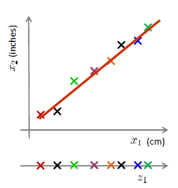

## 维数约简

* Discover hidden correlations/topics
  * Words that occur commonly together
* Remove redundant and noisy features
  * Not all words are useful
* Easier storage and processing of the data
* interpretation and visualization

**数据压缩**
$$
\begin{aligned}x^{(1)}&\in\mathbb{R}^2\to z^{(1)}\in\mathbb{R}^1\\x^{(2)}&\in\mathbb{R}^2\to z^{(2)}\in\mathbb{R}^1\\&\vdots\\x^{(m)}&\in\mathbb{R}^2\to z^{(m)}\in\mathbb{R}^1\end{aligned}
$$

**投影与投影误差**

一维情况$\hat x =\frac{u}{||u||^2}(u^Tx)$去近似x，平方投影误差$||x-\hat x||^2=(x-\hat x)^T(x-\hat x)$

u为单位向量
$$
\min_{u:\|u\|=1}\sum_{i=1}^m\|x^{(i)}-uu^Tx^{(i)}\|^2
$$

### 主成分分析-PCA

从n维降到k维：找到k个方向$\{u^{(1)},\dots,u^{(k)}\}$进行数据投影，使得投影误差最小

