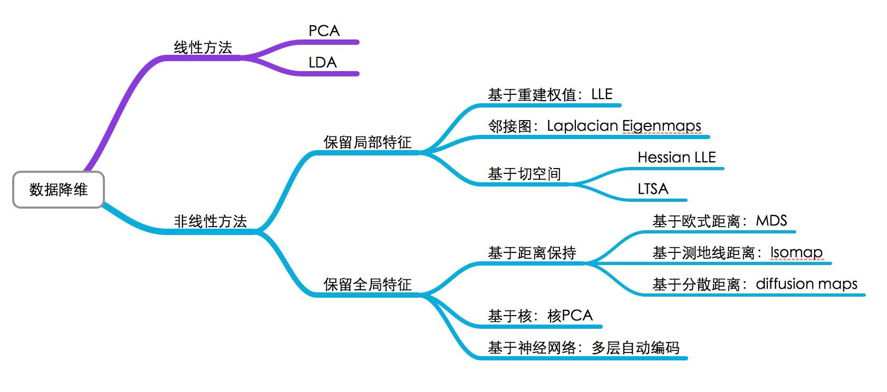
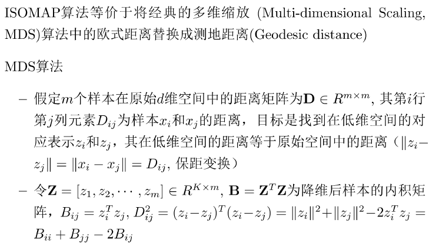

# 机器学习2

## 维数约简

* Discover hidden correlations/topics
  * Words that occur commonly together
* Remove redundant and noisy features
  * Not all words are useful
* Easier storage and processing of the data
* interpretation and visualization

**数据压缩**
$$
\begin{aligned}x^{(1)}&\in\mathbb{R}^2\to z^{(1)}\in\mathbb{R}^1\\x^{(2)}&\in\mathbb{R}^2\to z^{(2)}\in\mathbb{R}^1\\&\vdots\\x^{(m)}&\in\mathbb{R}^2\to z^{(m)}\in\mathbb{R}^1\end{aligned}
$$

**投影与投影误差**

一维情况$\hat x =\frac{u}{||u||^2}(u^Tx)$去近似x，平方投影误差$||x-\hat x||^2=(x-\hat x)^T(x-\hat x)$

u为单位向量
$$
\min_{u:\|u\|=1}\sum_{i=1}^m\|x^{(i)}-uu^Tx^{(i)}\|^2
$$

### 主成分分析-PCA

从n维降到k维：找到k个方向$\{u^{(1)},\dots,u^{(k)}\}$进行数据投影，使得投影误差最小
$$
\begin{aligned}
\|x-uu^{T}x\|^{2}& =(x-uu^{T}x)^{T}(x-uu^{T}x)  \\
&=x^{T}x-x^{T}uu^{T}x-x^{T}uu^{T}x+x^{T}uu^{T}uu^{T}x \\
&=x^{T}x-x^{T}uu^{T}x
\end{aligned}
$$
找具有最小投影误差的方向等价于如下优化问题（最大化方差）
$$
\begin{aligned}\max_u&u^T\left(\sum_{i=1}^mx^{(i)}x^{(i)^T}\right)u\\s.t.&\|u\|=1\end{aligned}
$$

$$
L=u^T\left(\sum_{i=1}^mx^{(i)}x^{(i)^T}\right)u-\lambda(u^Tu-1)=u^TXX^Tu-\lambda(u^Tu-1)
$$

$\frac{\partial L}{\partial u}=0$
$$
XX^Tu=\Sigma u=\lambda u,\Sigma=XX^T
$$

$$
u^TXX^Tu=u^T\lambda u=\lambda.
$$

如何找到K个投影方向

选择$\Sigma$最大的前面K个特征值所对应的特征向量，因此$\Sigma$是对称阵，这些特征向量必定两两正交，构成K维子空间的一组标准正交基。$x^{(i)}$对应的投影为
$$
\left.z^{(i)}=\left[\begin{array}{cc}u^{(1)}{}^Tx^{(i)}\\u^{(2)}{}^Tx^{(i)}\\\vdots\\u^{(K)}{}^Tx^{(i)}\end{array}\right.\right]=U_K^Tx^{(i)}\in\mathbb{R}^K.
$$

$$
U_{K}=[u^{(1)},u^{(2)},\cdots,u^{(K)}]\in\mathbb{R}^{n\times K}
$$

#### 主成分分析

输入：样本集$\{ x^{(1)},\dots,x^{(m)} \}$，低维空间的维度K

过程：

1. 对所有样本进行中心化处理$x^{(i)}\leftarrow x^{(i)}-\frac{1}{m}\sum_{j}x^{(j)}$
2. 计算样本的协方差矩阵$\Sigma=XX^{T}$
3. 对协方差矩阵$\Sigma$进行特征值分解
4. 选取最大的K个特征值对应的特征向量$\{ u^{(1)},\dots,u^{(K)} \}$

#### 奇异值分解SVD

[奇异值分解（SVD） - 知乎 (zhihu.com)](https://zhuanlan.zhihu.com/p/29846048)

奇异值分解定理
$$
X=USV^{T}
$$
左奇异向量
$$
U\in\mathbb{R}^{m\times r},U^TU=I
$$
奇异值
$$
S=\mathrm{diag}(\sigma_{1},\sigma_{2},\cdots,\sigma_{r})\in\mathbb{R}^{r\times n}
$$

$$
\sigma_1\geq\sigma_2\geq\cdots\geq\sigma_r>0
$$

右奇异向量
$$
V\in\mathbb{R}^{n\times r},V^TV=I
$$

$$
X=USV^T=\sum_i\sigma_iu_iv_i^T
$$

$X=[x^{(1)},x^{(2)},\cdots,x^{(m)}]\in\mathbb{R}^{n\times m},\:XX^T\in\mathbb{R}^{n\times n},\quad X^TX\in\mathbb{R}^{m\times m},\quad$若特征的维数$n$大于样本个数$m$, 即$n\geq m$, 可以把求解$XX^T$的特征分解问题转化为求$X^TX$的特征分解问题。

$$
X=USV^{T}\quad XX^{T}=USV^{T}VSU^{T}=US^{2}U^{T}
$$

$XX^TU=US^2\Rightarrow$ Left Singular Vectors $U$的列是$\Sigma=XX^T$的特征向量，而Σ的特征值和X的奇异值的关系为：$\lambda_i=\sigma_i^2$
同理，有$X^TXV=VS^2\Rightarrow$ Right Singular Vectors $V$的列是$X^TX$ 的特征向量，对应特征值和$X$的奇异值的关系为$:\lambda_i=\sigma_i^2$
$$
\begin{aligned}XX^TU&=US^2\text{即:}\quad XX^Tu_i=\sigma_i^2u_i\\X^TXV&=VS^2\text{即:}\quad X^TXv_i=\sigma_i^2v_i\end{aligned}
$$

$$
\begin{aligned}\text{将}X=USV^T=\sum_j\sigma_ju_jv_j^T\text{代入,}Xv_i=\sum_j\sigma_ju_jv_j^Tv_i=\sigma_iu_i\\\boxed{u_i=\frac{1}{\sigma_i}Xv_i=\frac{1}{\sqrt{\lambda_i}}Xv_i}\end{aligned}
$$

$$
\frac{\sum_{i=1}^m\|x^{(i)}-\hat{x}^{(i)}\|^2}{\sum_{i=1}^m\|x^{(i)}\|^2}=1-\frac{\sum_{j=1}^K\lambda_j}{\sum_{j=1}^n\lambda_j}\leq\epsilon
$$

#### PCA的不好使用-防止过拟合

[为什么PCA不被推荐用来避免过拟合？ - 知乎 (zhihu.com)](https://www.zhihu.com/question/47121788?sort=created)

由于PCA整个方案都没用到y，所以过拟合问题并不能用PCA来降维攻击

PCA是unsupervised learning 输出结果不可靠

PCA降维损失信息

老实用正则化

#### kernel PCA

$$
XX^{T}u=\lambda u\Rightarrow\Phi\Phi^{T}u=\lambda u
$$

$$
\Phi=[\phi(x^{(1)}),\phi(x^{(2)}),\cdots,\phi(x^{(m)})]
$$

由于$\phi(x)$的维度未知，无法直接对$\Phi\Phi^T$进行特征值分解，转而求$\Phi^T\Phi$的特征分解，然后根据Left Singular Vectors和Right Singular Vectors关系间接求解出$\Phi\Phi^T$的特征向量.
$$
u_{i}=\frac{1}{\sqrt{\lambda_{i}}}\Phi v
$$

$$
\begin{aligned}
\Phi^{T}\Phi & =\left[\phi(x^{(1)}),\phi(x^{(2)}),\cdots,\phi(x^{(m)})\right]^T\left[\phi(x^{(1)}),\phi(x^{(2)}),\cdots,\phi(x^{(m)})\right]  \\
&\left.=\left[\begin{array}{ccc}\phi(x^{(1)})^T\phi(x^{(1)})&\cdots&\phi(x^{(1)})^T\phi(x^{(m)})\\\phi(x^{(2)})^T\phi(x^{(1)})&\cdots&\phi(x^{(2)})^T\phi(x^{(m)})\\\vdots&\cdots&\vdots\\\phi(x^{(m)})^T\phi(x^{(1)})&\cdots&\phi(x^{(m)})^T\phi(x^{(m)})\end{array}\right.\right] \\
&\left.=\left[\begin{array}{ccc}k(x^{(1)},x^{(1)})&\cdots&k(x^{(1)},x^{(m)})\\\vdots&\cdots&\vdots\\k(x^{(m)},x^{(1)})&\cdots&k(x^{(m)},x^{(m)})\end{array}\right.\right]=\mathbf{K}
\end{aligned}
$$

### 线性鉴别分析LDA

* PCA是根据样本投影后数据的方差来选择投影方向的（最优重构）
* 但对于分类问题而言，这样的投影反而有可能使得数据更加无法划分
* 例: 识别字母“O”和“Q”

$$
J_{F}(w)=\frac{w^{T}S_{b}w}{w^{T}S_{w}w}
$$

$S_b,S_w$分别为类间散布矩阵、类间散布矩阵
$$
\begin{aligned}
&S_{b} =(\mu_{1}-\mu_{2})(\mu_{1}-\mu_{2})^{T}  \\
&S_{w} =\sum_{y^{(i)}=-1}(x^{(i)}-\mu_{1})(x^{(i)}-\mu_{1})^{T}+\sum_{y^{(i)}=+1}(x^{(i)}-\mu_{2})(x^{(i)}-\mu_{2})^{T} 
\end{aligned}
$$
$J_{F}(w)$为广义瑞丽商

投影方向w满足以下广义特征值问题
$$
S_{b}w=\lambda S_{w}w
$$

### 流形学习

Manifold Learning (or non-linear dimensionality reduction) embeds data that originally lies in a high dimensional space in a lower dimensional space, while preserving characteristic properties.

a manifold is a topological space that locally resembles Euclidean space near each point

#### Locally Linear Embedding

#### Laplacian Eigenmaps

#### ISOMAP

#### T-distributed Stochastic Neighbor Embedding (t-SNE)

## lyx的总结

复习重点

作业

SVM支持向量边界KTT条件，~~回归算了（）~~

回归

分类

正则化

非线性

神经网络

网络前向传播反向传播

决策树 剪枝（）

集成学习 分类器错误率第二个比第一个高

维数约简 PCA

~~流形学习~~，不会计算题

应用评价

