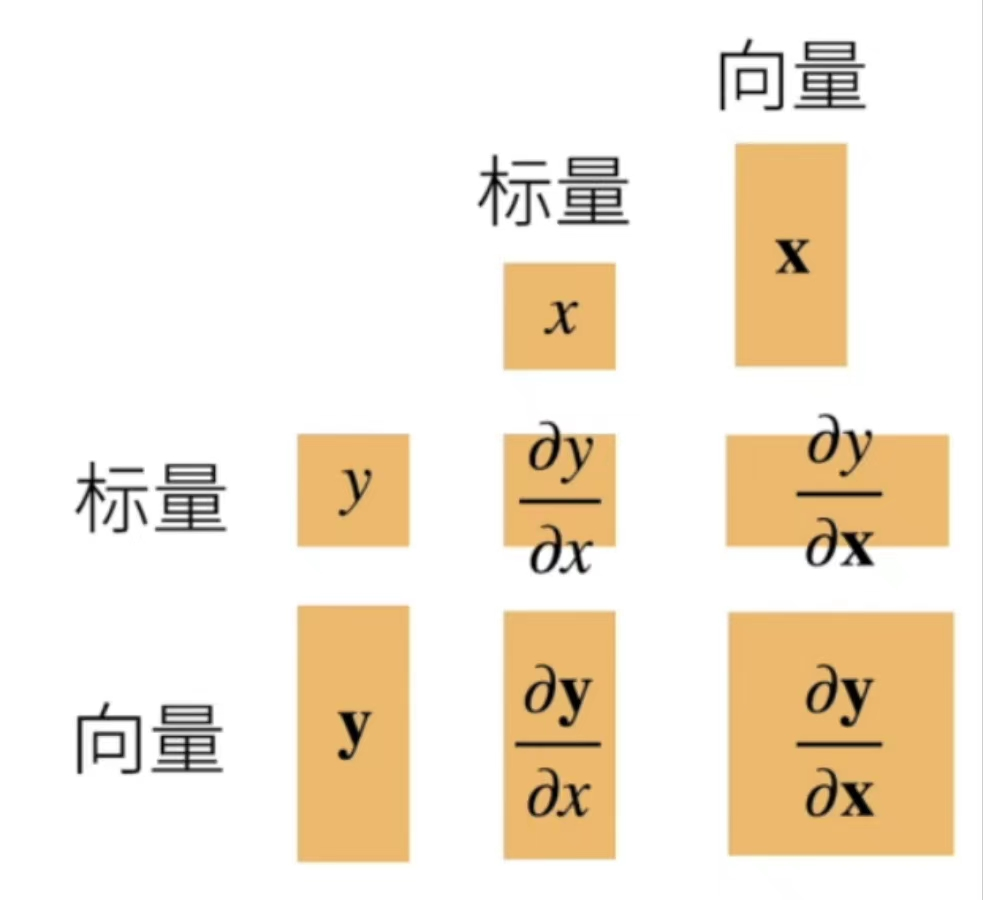

矩阵的求导等运算无论在高等数学还是线性代数的学习中都没有进行详细讲述，所以在学习DL还有ML之前都先进行相关运算的学习。

首先用一张直观的图像展示向量导数的形状：

下面进行详细的解释

## 标量对向量求导

$$
\mathbf{x}=\left[\begin{array}{c}
x_1\\
x_2\\
\vdots\\
x_n
\end{array}
\right]
,
\frac{\partial y}{\partial \mathbf{x}}=\left[\frac{\partial y}{\partial x_1},\frac{\partial y}{\partial x_2},\ldots,\frac{\partial y}{\partial x_n}\right]
$$

## 向量对标量求导

$$
\mathbf{y}=\left[\begin{array}{c}
y_1\\
y_2\\
\vdots\\
y_m
\end{array}
\right]
,
\frac{\partial \mathbf{y}}{\partial x}=\left[\begin{array}{c}
\frac{\partial y_1}{\partial x}\\
\frac{\partial y_2}{\partial x}\\
\vdots\\
\frac{\partial y_m}{\partial x}
\end{array}
\right]
$$

## 向量对向量求导

$$
\mathbf{x}=\left[\begin{array}{c}
x_1\\
x_2\\
\vdots\\
x_n
\end{array}
\right]
$$

$$
\mathbf{y}=\left[\begin{array}{c}
y_1\\
y_2\\
\vdots\\
y_m
\end{array}
\right]
$$

$$
\Rightarrow
\frac{\partial \mathbf{y}}{\partial \mathbf{x}}=
\left[\begin{array}{c}
\frac{\partial y_1}{\partial \mathbf{x}}\\
\frac{\partial y_2}{\partial \mathbf{x}}\\
\vdots\\
\frac{\partial y_m}{\partial \mathbf{x}}
\end{array}
\right]
=
\left[
\begin{array}{c}
\frac{\partial y_1}{\partial x_1},\frac{\partial y_1}{\partial x_2},\ldots,\frac{\partial y_1}{\partial x_n}\\
\frac{\partial y_2}{\partial x_1},\frac{\partial y_2}{\partial x_2},\ldots,\frac{\partial y_2}{\partial x_n}\\
\vdots\\
\frac{\partial y_m}{\partial x_1},\frac{\partial y_m}{\partial x_2},\ldots,\frac{\partial y_m}{\partial x_n}
\end{array}
\right]
$$

## 向量链式法则

$$
\frac{\partial y}{\partial \mathbf{x}}=\frac{\partial y}{\partial u}\frac{\partial u}{\partial \mathbf{x}}\\
\frac{\partial y}{\partial \mathbf{x}}=\frac{\partial y}{\partial \mathbf{u}}\frac{\partial \mathbf{u}}{\partial \mathbf{x}}\\
\frac{\partial \mathbf{y}}{\partial \mathbf{x}}=\frac{\partial \mathbf{y}}{\partial \mathbf{u}}\frac{\partial \mathbf{u}}{\partial \mathbf{x}}\\
$$

