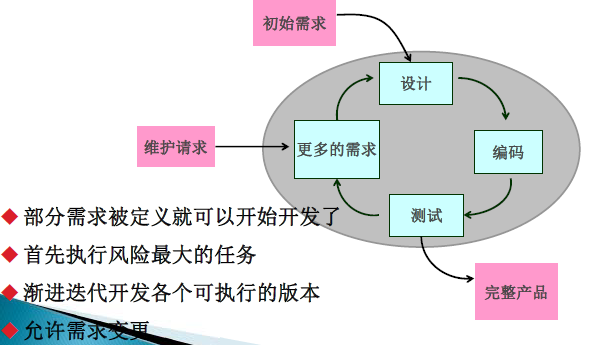
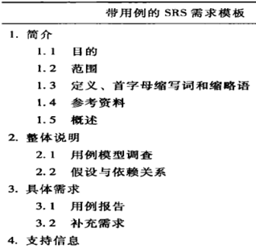
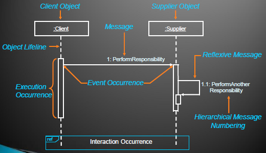
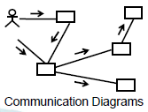
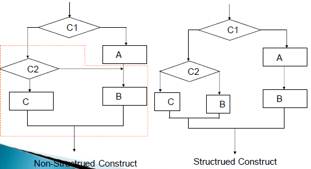
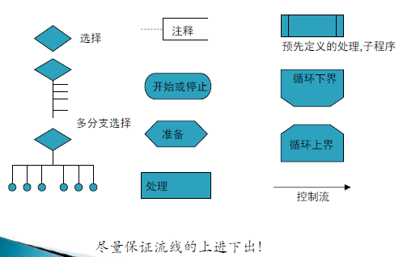
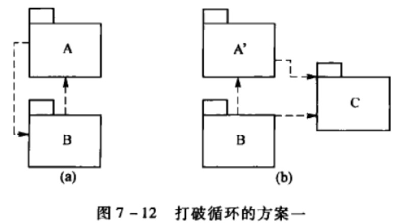
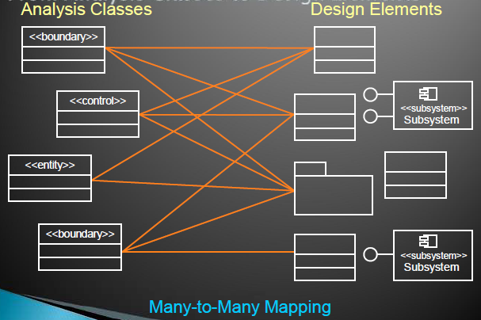

# 软件工程

《软件工程原理》沈备军

项目实践：软件逆向工程

## 软件危机与软件工程

### 软件危机

问题

* 如何开发软件以满足不断增长
* 如何维护数量不断膨胀的软件产品

表现

* 成本超预算，上线拖延
* 偏离用户需求
* 质量不够
* 可维护度低
* 没有适当文档
* 成本提高
* 供不应求

原因

* 软件本身特点
* 软件开发错误认识做法
* 开发维护的不正确

## 软件过程

软件生存周期过程

### 软件过程七大元素

* 活动

  开发、维护、管理

* 任务

  活动细分，确定、安排任务

* 工件

  软件过程的工作产品，分输入与输出工作

* 角色

  定义软件过程中的个人或小组的行为与职责

* 资源

  最佳实践、工具、技术、机器、场地等

* 目标

  每个过程有明确目标

* 度量指标

  目标的具体度量与分析：进度、成本、质量、返工率

### 软件生存周期模型

* 线性顺序模型

  瀑布模型

  特点：

  * 强调阶段的划分顺序与依赖；
  * 强调各阶段工作文档的完备性，即文档驱动静态描述；
  * 每个阶段从技术和管理进行严格的审查，即质量保证的
    观点；
  * 是一种线性的、顺序的、逐步细化的开发模式；
  * 推迟实现的观点；

  适用时机：

  * 所有功能、性能等要求能一次理解和描述时
  * 所有的系统功能一次交付时
  * 必须同时淘汰全部老系统时

  实际的瀑布模型具有**反馈环**

  风险缺点：

  * 获得完善的需求规约是非常困难的；
  * 难以适应快速变化需求；
  * 系统太大时,难以一次做完；
  * 反馈信息慢；
  * 极可能引起开发后期的大量返工，如返工到需求、设计等早
    期活动；

  建议不适用的情况：

  

* 增量式模型

  软件被分解成许多增量构件，逐个提交

  构造中间版本

  

  适用实际：

  * 需要早期获得功能；
  * 中间产品可以提供使用；
  * 系统被自然地分割成增量；
  * 工作人员/资金可以逐步增加。

  考虑风险：

  * 需求未被很好地理解
  * 一次要求所有功能
  * 需求迅速发生变化
  * 事先打算采用的技术迅速发生变化
  * 长时期内仅有有限的资源（人员/资金）

* 演化模型

  只要核心需求能够被很好地理解，就可以进行渐进式开发，其余需求可以在后续的迭代中进一步定义和实现。这种过程模型称为演化模型，它能很好地适应随时间演化的产品的开发。

  特点：

  * 迭代的开发方法，渐进地开发各个可执行版本，逐步完善软件产品。每个版本在开发时，开发过程中的活动和任务顺序地或部分重叠平行地被采用。
  
  * 与增量模型的区别是：需求在开发早期不能被完全了解和确定，在一部分被定义后开发就开始了，然后在每个相继的版本中逐步完善。
  
    
  
  * 现代软件工程采用演化模型
  
    * 统一软件过程RUP
    * 敏捷过程
    * 净室软件过程
  
  * 演化模型的子类
  
    * 原型
    * 螺旋模型
    * 并发开发模型
  

### 演化模型

#### 迭代化开发

特点： 尽可能降低风险，适用处理不确定的复杂系统。
原则:

1. 每次迭代产生一个可执行的版本；
2. 要求有计划地迭代。

##### 快速原型模型

特点：定义出总体目标或初步需求就开发原型，通过原型与用户交互识别进一步的需求.

1. 抛弃式原型
2. 演化式原型

##### 螺旋模型

#### RUP统一软件过程

1. 迭代式开发
2. 管理需求
3. 使用基于构件的体系结构
4. 可视化建模
5. 贯穿于开发过程的软件质量验证
6. 控制软件变更

Best Practices
Process Made Practical
Develop Iteratively
Manage Requirements
Use Component Architectures
Model Visually (UML)
Continuously Verify Quality
Manage Change

##### RUP软件开发生命周期

RUP是一个风险驱动的、基于UML和构件式架构的迭代、递增型开发过程

##### 阶段和迭代

##### 6个核心规范和3个支持规范

RUP把软件开发生命周期分成6个核心规范和3个支持规范

###### 6个核心规范

* 业务建模(系统目标达成共识)
* 需求(系统范围达成共识)
* 设计
* 实现
* 测试
* 部署

###### 3个支持规范

* 配置与变更管理
* 项目管理(风险,计划,进度等)
* 环境

#### 敏捷过程与极限编程

##### 敏捷过程

具有高效、快速响应变化的开发过程

动机：快速的市场进入时间、快速变化的需求、快速发展的技术

**敏捷宣言**

1. 个体和交互胜过过程和工具；
2. 可以工作的软件胜过面面俱到的文档；
3. 客户合作胜过合同谈判；
4. 响应变化胜过遵循计划。

敏捷过程的原则

* 优先目标是尽早持续交付高价值的软件来满足客户需求；
* 通过驾驭变化帮助客户赢得竞争；
* 经常交付可用软件；
* 业务员和开发人员必须每天一起工作；
* 以积极主动地人为核心建立项目团队；
* 可用软件是最主要的项目进展目标；
* 团队内外最有效的交流是面对面交流；
* 提倡可持续开发，保持稳定的工作步调；
* 用精益求精和优良设计增强敏捷性；
* 简约—工作最小化；
* 最优的架构、需求和设计来自自组织的团队；
* 团队不断开展工作反思，校正自身行为。

实践做法

* 敏捷过程很容易适应变化并迅速做出自我调整，在保证质量的前提下，实现企业效益的最大化
* 敏捷过程在保证软件开发有成功产出的前提下，尽量减少开发过程中的活动和制品，Just enough

适用范围

* 需求不确定、易挥发
* 有责任感和积极向上的开发人员
* 用户容易沟通并能参与
* 小于10个人的项目团队

##### 极限编程XP-敏捷软件工程实践

价值观

沟通、反馈、简化、勇气

特点

测试成为开发的核心;

纪律性与灵活性巧妙结合.

XP项目的整体开发过程

XP迭代开发过程

XP关键做法

* 现场客户（On-site Customer）
* 计划博弈（Planning Game）
* 系统隐喻（System Metaphor）
* 简化设计（Simple Design）
* 集体拥有代码（Collective Code Ownership）
* 结对编程（Pair Programming）
* 测试驱动（Test-driven）
* 小型发布（Small Releases）
* 重构（Refactoring）
* 持续集成（Continuousintegration）
* 每周40小时工作制（40-hour Weeks）
* 代码规范（Coding Standards）

##### RUP与XP共性

* 基础都是面向对象方法（取代传统的结构化方法）
* 都重视代码、文档的最小化和设计的简化
* 采用动态适应变化的演进式迭代周期（取代传统的瀑布型生命周期）
* 需求和测试驱动
* 鼓励用户积极参与

##### RUP与XP的区别

* XP以代码为中心，编码和设计活动融为一体，弱化了架构的概念。
* RUP过程通常以架构为中心，细化阶段的主要目的就是构造出一个可运行的架构原型，作为将来添加需求功能的稳固基础。
* XP不包含业务建模、部署、过程管理等概念。
* RUP适合各种规模的项目，XP只适用于小团队。

#### 微软过程

##### 微软过程准则

* 项目计划应该兼顾未来的不确定因素;
* 用有效的风险管理来减少不确定因素的影响;
* 经常生成并快速的地测试软件的过渡版本，提高稳定性和可预测性;
* 采用快速循环，递进的开发过程;
* 用创造性的工作来平衡产品特性和产品成本;
* 项目进度表应该具有较高稳定性和权威性;
* 使用小型项目组并发的完成开发工作;
* 在项目早期把软件配置项基线化，项目后期则冻结产品;
* 使用原型验证概念，对项目进行早期论证;
* 把零缺陷作为追求的目标;
* 里程碑评审会的目的是改进工作，切忌相互指责.

##### 微软软件生命周期

##### 微软过程模型

#### Scrum过程

* 强调经验性过程而不是确定性过程
* 演化型的迭代开发过程

### 软件过程的选择与裁切

#### 软件过程的选择

1. 产品/项目自身的特点
2. 团队的实际情况和企业文化
3. 客户的影响

#### 软件过程进行裁剪

1. 流程归并与裁剪
2. 角色的筛选与定制
3. 工件的裁剪和定制

### 软件过程的评估与改进

#### 参考模型

1. CMM/CMMI

   过程能力成熟度模型

   CMMI是一个标准簇

   * CMMI4Development
   * CMMI4Svervice
   * CMMI4Acquisition

   CMMI模型不同的改进方法：

   * 组织成熟度方法（阶梯式模型）
   * 过程能力方法（连续式模型）

   

   

2. ISO/IEC 15504

   信息技术-软件过程评价标准，又称为SPICE

   

3. ISO/IEC 20000

   用于评估和认证IT运维服务管理过程的能力

#### 软件过程的改进

## 软件建模

## 需求工程

* 软件需求面临的挑战

1. 用户说不清需求；
2. 需求表达的二义性问题；
3. 需求经常变化, 项目没有时限；
4. 因误解或二义性的需求直到开发后期才发现；
5. 测试者没有明白产品要做什么；
6. 产品性能低、使用不方便等用户不满意；
7. 许多增强性需求未在需求获取阶段提出。

### 需求工程的概念

#### 软件需求 FURPS and FURPS+

功能性需求（F）与非功能性需求（URPS）

|      需求      |                             能力                             |                           具体要求                           |
| :------------: | :----------------------------------------------------------: | :----------------------------------------------------------: |
| Functionality  |                   Feature Set,Capabilities                   |                     Generality,Security                      |
|   Usability    |                   Human Factors,Aesthetics                   |                  Consistency,Documentation                   |
|  Reliability   |         Frequency/Severity,of Failure,Recoverability         |                 Predictability,Accuracy,MTBF                 |
|  Performance   |               Speed,Efficiency,>Resource Usage               |                   Throughput,Response Time                   |
| Supportability | Testability,Extensibility,Adaptability,Maintainability,Compatibility | Configurability,Serviceability,Installability,Localizability,Robustness |

#### Functionality需求

功能、特性和安全性

* 概要功能需求
* 详细功能需求

#### Usablity需求

可用性

The ease with which software can be learned and
operated by the intended users

#### Reliability需求

软件在给定时间间隔内成功运行的概率

* 可靠性需求
  * 故障的频率
  * 可恢复性
  * 可预见性
  * 准确性
  * 平均失效间隔时间/平均无故障时间，MTBF

#### Performance需求

* 性能需求
  * 速度
  * 效率
  * 吞吐量
  * 响应时间
  * 容量
  * 资源利用情况

#### Supportability需求

支持性需求

* 可测试性
* 可扩展性
* 可适应性
* 可维护性
* 兼容性
* 可配置性
* 可服务性
* 可安装性
* 可本地化/国际化

#### FURPS+

* 设计约束（design constraints）：规定或约束了系统的设计的需求；
* 实现需求（implementation requirements） ：规定或约束了系统的编码或构建，如所需标准、编程语言、数据库完整性策略、资源限制和操作环境；
* 接口需求（interface requirements）：规定了系统必须与之交互操作的外部软件或硬件，以及对这种交互操作所使用的格式、时间或其他因素的约束；
* 物理需求（physical requirements.）：规定了系统必须具备的物理特征，可用来代表硬件要求，如物理网络配置需求。

#### 软件需求的三个层次

* 系统需求：业务/产品需求
* 项目干系人需求：原始需求
* 项目前景文档：概要需求
* 软件需求规约：详细需求

### 需求获取

业务分析-〉确定系统边界-〉项目干系人交流-〉竞争产品观察-〉定义系统高层输入-〉形成前景文档

#### 前景文档--产品范围文档

1. 简介
2. 定位
   * 商机
   * 问题说明
   * 产品定位
3. 项目干系人和用户描述
4. 产品概述
5. 产品特性
6. 约束
7. 质量范围
8. 优先级
9. 其他产品需求
10. 文档需求

##### 分析问题及根源

##### 识别项目干系人

##### 识别项目的约束

##### 获取常用术语

##### 识别需求的来源

##### 收集需求

##### 产品定位

##### 撰写产品特性

##### 定义质量范围

##### 定义文档需求

##### 建立项目范围

##### 划分特性优先级

### 需求分析建模

#### 分析模型

需求分析的结果

与平台无关模型PIM

* 描述客户需求
* 建立软件设计基础
* 定义软件完成后可以被确认

##### 结构化分析模型

* 数据流图（DFD）
* 控制流图（CFD）
* 数据字典（DD）
* 实体—关系图（ERD）
* 状态转换图（STD）
* 加工说明（PSPEC）

##### 面向对象分析模型

* 用例图
* 活动图
* 类图
* 时序图、通信图
* 状态机图

#### 分析建模准则

* 必须描述并理解问题的信息域
  * 输入输出数据、永久性数据对象
* 必须确定软件所需要的功能
* 必须描述软件的行为
  * 受外部事件驱动的结果
* 模型必须能提以一种能提示层次化方式的分解
* 分析任务应该从本质信息向实现细节转移

### 需求定义和验证

定义需求、撰写需求文档（前景文档和详细的软件需求规约）

#### 软件前景文档

软件需求规约

作用：

作用：

* 项目管理的依据；
* 设计与实现的输入；
* 测试与质量保证的输入；

组成：

* 功能需求；
* 非功能性需求；
* 约束；

软件需求规约SRS定义了系统的外在行为和属性

统一软件过程UP提供的两个SRS需求模板

#### 细化需求

* 细化功能需求
  * 引入分析模型
* 细化非功能需求
* 细化约束条件

#### 用户界面原型

* 也称“行为模型”，用来描述软件产品的行为，达到明确与细化需求的目的。
* 如果和用户交互，则需简要设计用户界面
  * 图纸（在纸上）
  * 位图（采用绘图工具），或可执行代码（交互式的电子界面原型）

#### 需求验证

##### 验证方面

1. 一致性

   所有需求必须是一致的，任何一条需求不能和其他需求互相矛盾

2. 完整性

   需求必须是完整的，规格说明书应该包括用户需要的每一个功能或性能

3. 现实性

   指定的需求应该是用现有的硬件技术和软件技术基本上可以实现的

4. 有效性

   必须证明需求是正确有效的，确实能解决用户面对的问题

##### 需求验证方法

* 原型确认

  * 抛弃型
  * 演进型

* 需求评审

  * 评审需求文档（Vision和SRS等），及时发现缺陷，寻找改进的契机，同时从评审反馈中获得知识，补充了正规的交流和培训机制，帮助团队建立对产品的共同理解

  * 评审过程

    准备计划-〉实施评审-〉返工-〉定稿签字

需求评审方法

* 审查
* 小组评审
* 走查
* 结对编程
* 同级桌查
* 轮查
* 临时评审

需求评审的输入输出

* 输入
  * 待评审的需求文档
  * Check list
* 输出
  * 评审结论
    * 通过
    * 有条件通过
    * 不通过
  * 缺陷清单

#### 需求管理

* 定义需求基线
* 需求跟踪
* 需求变更控制（建立新的需求基线）

##### 建立需求基线

通过对软件产品的特性和需求划分优先级来定义需求基线

##### 需求变更控制和版本控制

* 需求/范围变化的原因
  * 初期的认识不足导致错误或不完整的需求/范围
  * 需求/范围本身存在不一致
  * 业务变化导致的刚性需求/范围变更
  * 外部经济、市场环境的变化
  * 客户和项目组对已确认的需求/范围理解不一致
  * 技术制约或多目标权衡带来的需求/范围变更
* 需求变更策略
  * 以基线为核心统一变更控制过程
  * 建立项目变更管理小组
  * 未获批准不得擅自实施变更
  * 干系人和项目组成员应即时了解变更
  * 开发计划、设计测试代码的文档应及时更新
  * 采用需求变更控制工具

##### 需求跟踪

## 结构化分析

### 结构化方法概述

一种面向数据流的传统软件开发方法

以数据流为中心构建软件的分析模型、设计模型和实现模型

* 结构化分析(Structured Analysis，简称SA)
* 结构化设计(Structured Design，简称SD)
* 结构化编程(Structured Programming，简称SP)

#### 结构化分析方法中的抽象与分解

随着分解层次的增加，抽象的级别越来越低，也越接近问题的解(算法和数据结构)

#### 结构化分析模型

* 数据字典是模型的核心，它包含了软件使用和产生所有数据的描述
* 数据流图：用于功能建模，描述系统的输入数据流如何经过一系列的加工变换逐步变换成系统的输出数据流
* 实体—关系图：用于数据建模，描述数据字典中数据之间的关系
* 状态转换图：用于行为建模，描述系统接收哪些外部事件，以及在外部事件的作用下的状态迁移情况

### 面向数据流的软件建模

#### 系统流程图

描绘物理系统的工具，其基本思想是用图形符号以黑盒子形式描绘系统里面的每个部件（程序、文件、数据库、表格、人工过程等）,表达的是信息在系统各部件之间流动的情况。

**常用符号**

#### 数据流图

系统逻辑模型描述分为三个方面：

* 数据流图 DFD
* 数据字典 DD
* 加工/处理说明 IPO

**数据流图的定义**

描述输入数据流到输出数据流的变换(即加工)过程，用于对系统的功能建模，基本元素包括：

e.g. 图书订购系统DFD

**数据流图的扩充符号**

描述一个加工的多个数据流之间的关系

**绘制方法**

* 基本方法：自顶向下逐层分解。
* 分解原则：上层是下层的抽象，下层是上层的分解。
* 直到所有的处理都足够简单，不必再分解为止。通常把这种不能再分解的加工称为“基本处理”

**分层数据流图**

* 在多层数据流图中，顶层流图仅包含一个处理，它代表被开发系统。它的输入流是该系统的输入数据，输出流是系统所输出数据
* 底层流图是指其处理不需再做分解的数据流图，它处在最底层
* 中间层流图则表示对其上层父图的细化，它的每一处理可能继续细化，形成子
  图。

**DFD细化**

* 确定加工
* 确定数据流
* 确定文件

**画分层数据流图的步骤**

1. 画系统的输入和输出
2. 画系统内部
3. 画加工内部
4. 重复第3步，直至每个尚未分解的加工都足够简单(即不必再分解)

**分层数据流图的审查**

* 检查图中是否存在错误或不合理(不理想)的部分
  * 一致性
  * 完整性
* 父图和子图平衡
* 数据守恒

#### 数据字典

数据字典由字典条目组成，每个条目描述DFD中的一个元素

数据字典条目包括：数据流、文件、加工、源或宿

##### 数据字典描述符号

##### 数据流条目的描述内容

* 名称：数据流名(可以是中文名或英文名)
* 别名：名称的另一个名字
* 简述：对数据流的简单说明
* 数据流组成：描述数据流由哪些数据项组成
* 数据流来源：描述数据流从哪个加工或源流出
* 数据流去向：描述数据流流入哪个加工或宿
* 数据量：系统中该数据流的总量
  * 如考务处理系统中“报名单”的总量是100000张
  * 或者单位时间处理的数据流数量，如80000张/天
* 峰值：某时段处理的最大数量
  * 如每天上午9：00至11：00处理60000张表单
* 注解：对该数据流的其它补充说明

**数据流组成**

是数据流条目的核心

##### 文件条目的描述内容

* 名称：文件名
* 别名：同数据流条目
* 简述：对文件的简单说明
* 文件组成：描述文件的记录由哪些数据项组成(与数据流条目中的文件组成描述方法相同)
* 写文件的加工：描述哪些加工写文件
* 读文件的加工：描述哪些加工读文件
* 文件组织：描述文件的存储方式(顺序、索引)，排序的关键字
* 使用权限：描述各类用户对文件读、写、修改的使用权限
* 数据量：文件的最大记录个数
* 存取频率：描述对该文件的读写频率
* 注解：对该文件的其它补充说明

##### 加工条目的描述内容

* 名称：加工名
* 别名：同数据流条目
* 加工号: 加工在DFD中的编号
* 简述：对加工的功能的简要说明
* 输入数据流：描述加工的输入数据流，包括读哪些文件名
* 输出数据流：描述加工的输出数据流，包括写哪些文件名
* 加工逻辑：简要描述加工逻辑，或者对加工规约的索引
  * 基本加工的加工逻辑用小说明描述，在加工条目中可填写对加工规约的索引
  * 非基本加工分解而成的DFD子图已反映了它的加工逻辑，不必书写小说明
* 异常处理：描述加工处理过程中可能出现的异常情况，及其处理方式
* 加工激发条件：描述执行加工的条件，如“身份认证正确”，“收到报名单”
* 执行频率：描述加工的执行频率，如，每月执行一次，每天0点执行
* 注解：对加工的其它补充说明

##### 源或宿条目的描述内容

* 名称：源或宿的名(外部实体名)
* 别名：同数据流条目
* 简要描述：对源或宿的简要描述(包括指明该外部实体在DFD中是用作“源”，还是“宿”，还是“既是源又是宿”)
* 输入数据流：描述源向系统提供哪些输入数据流
* 输出数据流：描述系统向宿提供哪些输出数据流
* 注解：对源或宿的其它补充说明

#### 加工逻辑的描述方法

* 结构化语言：介于自然语言和形式语言之间的一种半形式语言

* 判定表：适用于加工逻辑包含多个条件，而不同的条件组合需做不同的动作

  * 条件桩(Condition Stub)：列出各种条件的对象，如发货单金额，赊欠天数等，每行写一个条件对象
  * 条件条目(Condition entry)：列出各条件对象的取值，条件条目的每一列表示了一个可能的条件组合
  * 动作桩(action stub)：列出所有可能采取的动作，如发出发货单等，每行写一个动作
  * 动作条目(action entry)：列出各种条件组合下应采取的动作

  e.g.

* 判定树：判定表的变种，它本质上与判定表是相同的，只是表示形式不同

  e.g.

#### 实体-关系图

描述数据字典中数据之间的关系

### 面向数据流的需求分析过程

面向数据流自顶向下逐步求精进行需求分析

1. 确定系统的综合需求

   功能需求、性能需求、可靠性和可用性需求、出错处理需求、接口需求、约束、逆向需求、将来可能的需求

2. 分析系统的数据要求

   ER模型

3. 导出系统的逻辑模型

4. 修正系统开发计划

5. 开发原型系统

6. 写需求规格说明书

## 面向对象分析

### 面向对象方法概述

* 抽象

  最核心的抽象内容的对象

  对象是一个具有明确边界和唯一标识，且封装了行为和状态的实体。

  主要抽取事务的结构特征和行为特征，并组成一个有机整体

* 封装

  将对象特征的实现方式隐藏在一个公共接口后面的黑盒子中

* 模块化

  Breaks up something complex into manageable pieces.

* 层次

  高度抽象

  ​     ^

  ​      |

  ​      |

  ​      |

  低度抽象

#### 出发点和基本原则

尽可能模拟人类习惯的思维方式，使描述问题的问题空间(也称为问题域)与实现解法的解空间(也称为求解域)在结构上尽可能一致。

* 客观世界的问题都是由实体及关系构成的
* 把客观世界中的实体抽象为问题域中的对象(object)

#### 面向对象方法

1. 认为客观世界是由各种对象组成的
2. 把所有对象都划分成各种对象类(简称为类，class)，每个对象类都定义了一组数据和一组方法
3. 按照子类(或称为派生类subclass)与父类(或称为基类superclass)的关系，把若干个对象类组成一个层次结构的系统(也称为类等级)
4. 对象彼此之间仅能通过传递消息互相联系

$$
OO=objects+classes+inheritance+communication\ with\ messages
$$

#### 面向对象方法的优点

1. 与人类习惯的思维方法一致
2. 稳定性好
3. 可重用性好
4. 较易开发大型软件产品
5. 可维护性好

### 面向对象的概念

#### 对象

对象是具有相同状态（属性）的一组操作的集合
$$
对象=<ID,MS,DS,MI>
$$

* 以数据为中心
* 对象是主动的
* 实现了数据封装
* 本质上具有并行性
* 模块独立性好

#### 类

类是对具有相同属性和行为的一个或多个对象的描述。类是支持继承的抽象数据类型，而对象就是类的实例

#### 实例

实例就是由某个特定的类所描述的一个具体的对象

#### 消息

消息就是要求某个对象执行它的某个操作的规格说明

#### 方法

方法就是对象所能执行的操作，也就是类中所定义的服务。方法描述了对象执行操作的算法，响应消息的方法。在C++语言中把方法称为成员函数。

#### 属性

属性就是类中所定义的数据，类的每个实例都有自己特有的属性值

#### 封装

所谓封装就是把某个事物包起来，使外界不知道该事物的具体内容

#### 继承

继承是指能够直接获得已有的性质和特征，而不必重复定义它们。继承是子类自动地共享基类中定义的数据和方法的机制。
当类等级为树形结构时，类的继承是单继承；当允许一个类有多个父类时，类的继承是多重继承。但是，使用多重继承时要注意避免二义性

#### 多态性

多态性是指子类对象可以像父类对象那样使用，同样的消息既可以发送给父类对象也可以发送给子类对象。根据该对象所属于的类动态选用在该类中定义的实现算法

#### 重载

* 函数重载是指在同一作用域内的若干个参数特征不同的函数可以使用相同的函数名字
* 运算符重载是指同一个运算符可以施加于不同类型的操作数上面

### 各种分析图

UML建模

从功能和行为对问题进行抽象，主要建模包括:用例图，活动图，类图，时序图，通信图和包图

#### 用例图

要素：执行者、用例、关系（包含、扩展、泛化）系统框常被省略

也就是说，系统外部的执行者需要系统处理什么事务，系统处理的事务就是用例，执行者与用例存在关联关系

#### 活动图

* 动作：行为的基本单元
* 控制流：动作之间的过程
* 控制节点：起协调动作的作用
  初始、分叉、判断、汇合、终止
* 对象节点：是动作处理的数据

带泳道的活动图，已明确责任

#### 类图

使用UML表示类

包括三个部分：

* 类名
* 数据结构（属性）
* 行为（操作）

* 继承/泛化：is-a关系，用空心箭头实线表示

* 实现：类实现接口，用带空心箭头虚线表示

  

* 依赖：一个类对另一个类局域变量、方法的形参，或者对静态方法的调用，虚线箭头表示，临时的非结构性关系

  

* 关联：一个类的实例与另外一个类的特定实例存在固定关系，被关联类B以类属性的形式出现在关联类A中，也可能是关联类A引用了一个类型为被关联类B的全局变量，实线箭头表示

* 聚合：聚合是特殊的关联关系，强调整体与部分之间的关系，用带一个空心菱形（整体的一端）的实线箭头表示

* 组合：强调了整体与部分的生命周期是一致的，用带实心菱形(整体的一端)的实线箭头表示

基数

聚合和组合的区别在于整体和部分的生命周期是否独立

* 聚合的整体和部分之间在生命周期上没有什么必然的联系
* 组合关系中，整体与部分是不可分的，整体的生命周期结束也就意味着部分的生命周期结束

> 参考[关联、聚合、组合的区别 - 知乎 (zhihu.com)](https://zhuanlan.zhihu.com/p/359672087)

#### 时序图

* 交互使用：ref
* 循环：loop
* 条件：alt
* 并发：par

#### 通信图

强调发送和接收消息的对象之间的组织结构

两对象对应类之间存在关联关系时，对象之间存在一条通信路径，称为link

#### 包图

UML提供一种称为包的组织元素

### 面向对象分析建模

#### 概念

use case技术

use-case模型，识别actor和use case

#### 建模步骤

##### 用例建模

###### use-case模型的组成

###### actor

与系统交互的系统外的某些人或某些东西

* 最终用户
* 外界软件系统
* 外界硬件设备

如何识别actor

* 谁需要在系统的帮助下完成自己的任务？
* 需要谁去执行系统的核心功能？
* 需要谁去完成系统的管理和维护？
* 系统是否需要和外界的硬件或软件系统进行交互？

###### use case 

Actor想使用系统去做的事

如何识别use case

每个actor的目标和需求是什么?

* actor希望系统提供什么功能？
* actor 将创建、存取、修改和删除数据吗？
* actor是否要告诉系统外界的事件？
* actor 需要被告知系统中的发生事件吗?

一个用例定义了和actor之间的一次完整对话

###### 用例图

通信-关联

* Actor和use case 间的通信渠道
* 用一条线表示
* 箭头表示谁启动通信

用例规约

* Name
* Brief description
* Flow of Events
* Relationships
* Activity diagrams
* Use-Case diagrams
* Special requirements
* Pre-conditions
  前置条件
* Post-conditions
  后置条件
* Other diagrams

###### 事件流

执行者与用例之间对话期间发生的基本活动

* 一个基本流
  * 执行用例时“通常”会发生的事件
  * 从开始到结束的成功的事件流程
* 多个备选流
  * 基本事件流的“绕行道”
  * 相关的可选或异常特征的行为
  * 正常行为的各种变形

每个用例的事件流动作都对应一个活动

###### 用例模型的优化

用例间关系

* include包含

  多个用例存在共同行为，可以分提炼一个新的用例。

  执行include：到达插入点时执行包含用例

  

* extend扩展

  若用例的部分行为是可选的，可分离形成扩展用例

  执行extend：当到达扩展点并且扩展条件为真时执行

  

* generalization泛化

  若多个用例在行为和结构上具有共同点，可以分离出形成父用例

  * 在父用例中描述通用的共享的行为
  * 在子用例中描述特殊的行为
  * 共享共同的目标

  

##### 建立概念模型

###### 识别conceptual class

概念类业务和需求建模会揭示系统必须处理的核心概念，它是设计模型的核心要素

* Use a conceptual class category list（分类法）

  

* Finding conceptual classes with Noun Phrase（名词提出和过滤法）

  * Use use-case flow of events as input
  * Underline noun clauses in the use-case flow of events
  * Remove redundant candidates
  * Remove vague candidates
  * Remove actors (out of scope)
  * Remove implementation constructs（与实现有关的）
  * Remove attributes (save for later)
  * Remove operations

* Use analysis patterns, which are existing conceptual models created by experts（已有的分析模式）

  * using published resources such as **Analysis Patterns**[Fowler96] and **Data Model Patterns** [Hay96].

一个错误：把原本是类的实体当作属性来处理.

解决方法：

**If X is not a number or text in the real world, X is probably a conceptual class, not an attribute.**

###### 建立conceptual class之间的关系

**关系种类**

* Association（关联）
  * Aggregation（聚合）
  * Composition（组合）
* Inheritance/Generalization（继承/泛化）
* Dependency（依赖）

###### 增加conceptual class的属性（画类图）

识别出概念类的主要属性，可以有遗漏，在后续的分析与设计中，这些属性会逐渐补全

同时可以识别出概念类的部分操作。在概念模型中，类的属性比操作更为重要

##### 用例分析

###### 识别出用例实现

用例实现充当了从以需求为中心到以设计为中心转移的桥梁， 用例与用例实现的关系是依赖关系的衍型《realize 》

###### 针对每个用例实现

**识别出分析类**

MVC设计模式

* view————边界类boundary

  boundary class：The interaction between the external environment and the internal operation of the system

* model———实体类entity

  entity class 是系统的关键抽象

  Store and manage information in the system.

  * 用户接口类
  * 系统接口类
  * 设备接口类

  One boundary class per actor/use-case pair

  执行者和用例之间的一条通信关联对应一个边界类Use-

* control———控制类control

  控制类用于描述一个或几个用例所特有的事件流控制行为，如事务管理器、资源协调器和错误处理器

  使用或规定若干实体类的内容，协调这些实体类的行为

  identify one control class per use case

##### 完成用例分析

###### 建立时序图，生成通信图

以用例作为研究对象，分析类的实例作为行为载体，通过消息传递的方式对用例场景进行分析，构建出时序图、通信图和类图。

* Sequence Diagram

  * Time oriented view of object interaction
  * The diagram shows:
    * The objects participating in the interaction.
    * The sequence of messages exchanged.

  

  

* Communication Diagram

  * Structural view of messaging objects
  * The communication diagram shows:
    * The objects participating in the interaction.
    * Links between the objects.
    * Messages passed between the objects.

  

  

###### 对照通信图建立类图，完善每个分析类的属性和操作

Relationship for every link

#### 补充一：构建对象模型-原文分析法

面向对象分析，就是抽取和整理用户需求并建立问题域精确模型的过程。

发现和改正原始陈述中的二义性和不一致性，补充遗漏的内容，从而使需求陈述更完整、更准确。

抽象出目标系统的本质属性，并用模型准确地表示出来。通过建立分析模型能够纠正在开发早期对问题域的误解。

复杂问题的对象模型的五个层次

对象模型通常由下述5个层次组成： 主题层(Subject)、类与对象层(class-object)、结构层(structure)、属性层(attribute)和服务层(service)

上述5个层次对应着在面向对象分析过程中建立对象模型的5项主要活动：

* 找出类与对象(Finding Class-object)
* 识别结构(Recognising Structure)
* 识别主题(Recognising Subject)
* 定义属性(Defining attribute)
* 定义服务(Defining service)

这5项活动没有必要顺序完成，也无须彻底完成一项工作以后再开始另外一项工作。

## 设计工程

### 软件设计工程概述

#### 软件设计的两个阶段

* 架构设计

  * 软件质量属性的设计策略

    1. 可用性设计
    2. 可维护性设计
    3. 性能设计
    4. 安全性设计
    5. 可测性设计
    6. 易用性设计

  * 确定合适的软件架构风格

    * 数据流风格(Dataflow)：批处理序列、管道－过滤器风格(Pipe-and-Filter)
    * 调用/返回风格：主程序/子程序、面向对象风格(ADT)、层次系统(Layered Systems)
    * 独立构件风格：进程通信、事件系统
    * 虚拟机风格：解释器、基于规则的系统
    * 仓库风格：数据库系统、超文本系统、黑板系统

  * 定义软件的主要结构元素——模块

    

  * 接口设计

    * 软件模块间的内部接口
    * 模块和协作系统(如外部软件系统、外部设备、网络等)之间的外部接口
    * 使用人员和软件的接口(用户界面)

* 详细设计

  * 为所有数据对象定义详细的数据结构
  * 为所有在模块内发生的处理定义算法细节、控制流和数据流

### 软件设计的原则

#### 抽象

* 数据抽象
  * 把一个数据对象的定义抽象为一个数据类型名，用此类型名可定义多个具有相同性质的数据对象
* 过程抽象
  * 把完成一个特定功能的动作序列抽象为一个过程名和参数表，以后通过指定过程名和实际参数调用此过程
* 对象抽象
  * 通过操作和属性，组合了这两种抽象，即在抽象数据类型的定义中加入一组操作的定义，以确定在此类数据对象上可以进行的操作。

#### 分解和模块化

* 分解（decomposition）：控制复杂性的另一种有效方法，软件设计用分解来实现模块化设计。

  $C(P_1+P_2) \gt C(P_1)+C(P_2)$

  $E(P_1+P_2) \gt E(P_1)+E(P_2)$

  C为问题的复杂度，E为解题需要的工作量

* 模块化（modularity）：将一个复杂的软件系统自顶向下地分解成若干模块（module），每个模块完成一个软件的特性，所有的模块组装起来，成为一个整体，完成整个系统所要求的特性。
  模块是能够单独命名并独立地完成一定功能的程序语句的集合，例如，过程、函数、子程序、宏、类等

  模块的两个特征

  * 外部特征是指模块跟外部环境联系的接口和模块的功能；
  * 内部特征是指模块的内部环境具有的特点，即该模块的局部数据和处理逻辑

  模块化的成本

  * 如果模块是相互独立的，当模块变得越小，每个模块花费的工作量越低；
  * 但当模块数增加时，模块间的联系也随之增加，把这些模块联接起来的工作量也随之增加。

  

#### 信息隐藏

每个模块的实现细节对于其它模块来说应该是隐蔽的

#### 模块的独立性

模块的独立性是模块化追求的目标

模块独立的衡量指标

* 内聚（cohesion），是一个模块内部各个元素彼此结
  合的紧密程度的度量
* 耦合（coupling），是模块之间的相对独立性（互相
  连接的紧密程度）的度量

##### 内聚

1. 偶然内聚coincidental cohesion

2. 逻辑内聚logical cohesion
3. 时间内聚temporal cohesion
4. 过程内聚procedural cohesion
5. 通信内聚communicational cohesion
6. 顺序内聚sequential cohesion
7. 功能内聚functional cohesion

##### 耦合

1. 非直接耦合no direct coupling
2. 数据耦合data coupling
3. 标记（特征）耦合stamp coupling
4. 控制耦合control coupling
5. 外部耦合external coupling
6. 公共耦合common coupling
7. 内容耦合content coupling

### 软件设计的质量

#### 软件设计的质量要求

* 设计应当模块化，高内聚、低耦合。
  * 支持多人合作开发
  * 易于测试和修改
  * 能够以演化过程实现
* 设计应当包含数据、体系结构、接口和构件的清楚的表示。
* 设计应根据软件需求采用可重复使用的方法进行。
* 应使用能够有效传达其意义的表示法来表达设计模型。

#### 7种软件设计的坏味道

* 僵化性（Rigidity）
  * 很难对软件进行改动，因为每个改动都会迫使对系统其他部分的许多改动
* 脆弱性（Fragility）
  * 对系统的改动会导致系统中和改动的地方在概念上无关的许多地方出现问题
* 牢固性（Immobility）
  * 很难解开系统中某部分与其它部分之间的纠结，从而难以使其中的任何部分可以被分离出来被其它系统复用
* 粘滞性（Viscosity）
  * 做正确的事情要比做错误的事情困难。表现为两种形式：
    * 软件粘滞性
      * 需要对软件进行修改时，可能存在多种方法。有的方法可以保持原有的设计质量，另一些方法则会破坏原有的设计质量。如果，破坏软件质量的修改比保持原有设计质量的修改更容易实施时，我们就称该软件具有“软件粘滞性”。
    * 环境粘滞性
      * 当开发环境迟钝、低效时，就会产生环境粘滞性。
      * 例如：如果编译时间很长，那么开发人员可能会放弃那些能保持设计质量，但是却需要导致大规模重新编译的改动。
* 不必要的复杂性（Needless Complexity）
  * 设计中包含不具有任何好处的基础结构。
* 不必要的重复（Needless Repetition）
  * 设计中包含一些重复的结构，这些结构本来可以通过单一的抽象进行统一
    * 使用Cut/Copy/Paste实施源代码级的软件复用容易导致这一问题
    * 这种代码级别的冗余，将带来修改上的问题
* 晦涩性（Opacity）
  * 很难阅读和理解，不要相信你永远都会如此清楚的了解你的每一行代码，“时间会冲淡一切”。要站在阅读者的角度进行设计

### 软件设计的复用.

模式可重用

>每一个模式描述了一个在我们周围不断重复发生的问题，以及该问题的解决方案的核心。这样，你就能一次又一次地使用该方案而不必做重复劳动

在一个上下文中对一种问题的解决方案

#### 设计重用 Design reuse

* pattern

  * architectural style

    An architectural pattern (architectural style) expresses a fundamental structural organization schema for software systems. It provides a set of predefined subsystems, specifies their responsibilities, and includes rules and guidelines（指南）for organizing the relationships between them.

  * design pattern

    A design pattern provides a scheme for refining the subsystems or components of a software system, or the relationships between them. It describes a commonlyrecurring（常见） structure of communicating components（组件） that solves a general design problem within a particular context（上下文）.

  * idiom

    An idiom is a low-level pattern specific to a programming
    language. An idiom describes how to implement particular
    aspects of components or the relationships between them
    using the features of the given language

* framework

  * 通用结构: Organize components
    * Layers: Organize components into layers where layer's services are only used by layer i+1.
    * Pipes and Filters: Divide the task into several sequential processing steps -- the output of task i is the input of task i+1.
    * Blackboard: Several independent programs work cooperatively on a common data structure.
  * 分布式系统: Handle distributed computation.
    * Broker（代理）: Introduce a broker component to
      achieve better decoupling（降低耦合） of clients and
      servers -- brokers accept requests from clients and
      forward the requests to servers, then return the
      results back to the clients.
    * Client/Server
    * 3 Tiers（三层架构）
  * 交互式系统: Keep a program's functional core
    independent of the user interface
    * Model - View - Controller: Divides the application into processing, output, and input. View and controller parts are usually observers of the model via the observer pattern
    * Presentation - Abstract - Control: Divides the application up to heirarchies or MVC-like components. Each component is dependent upon and provides functionality for the a higher-level component. There is only one toplevel component
  * 自适应系统: Design for change
    * Microkernel （微内核）Encapsulate（封装） the fundamental services of the application
    * Reflection（反射） Divide the application into a meta-level and a base level to make the application “self-aware”（自意识）. The meta level encapsulates knowledge of the system; the base level encapsulates knowledge about the problem domain
  * Others：批处理、解释器、进程控制、基于规则

#### 软件体系结构

##### MVC

* 模型Model：管理系统中存储的数据和业务规则，并执行相应的计算功能。
* 视图View：根据模型生成提供给用户的交互界面，不同的视图可以对相同的数据产生不同的界面。
* 控制器Control：接收用户输入，通过调用模型获得响应，并通知视图进行用户界面的更新。

##### Pipes and Filter

each component has a set of inputs and a set of outputs

A component reads streams of data on its inputs and produces streams of data on its output.

Linux的Shell程序可以看做是典型的管道与过滤器架构的例子

##### 层次架构风格

##### Three Tiers三层架构

* 表示层：负责向用户呈现界面，并接收用户请求发送给业务逻辑层；
* 业务逻辑层：负责执行业务逻辑以处理用户请求，并调用数据访问层提供的持久性操作；
* 数据访问层：负责执行数据库持久性操作。

##### 黑板风格

黑板架构为参与问题解决的知识源提供了共享的数据表示，这些数据表示是与应用相关的

在黑板架构中，控制流是由黑板数据的状态决定的，而并非按照某个固定的顺序执行。黑板架构的结构包括如下部分：

* 知识源：是指彼此分离独立的与应用相关的知识包，知识源之间的交互都是通过黑板来完成的，它们彼此并不直接交互。
* 黑板数据结构：按照应用相关的层次结构组织而成的问题解决过程中的状态数据。知识源会更新黑板数据，从而增量式地解决问题。
* 控制流：完全有黑板状态驱动，知识源会在黑板数据更新时根据其状态做出相应的响应。

通用结构

黑板架构专门针对没有确定的解决方法的问题，例如信号处理和模式识别，它通过多个知识源的协作来解决问题，而这种协作完全是状态驱动的，因此各个知识源具有公平的机会获取并更新黑板中的状态数据

##### 微内核风格

微内核概念来源与操作系统领域。微内核是提供了操作系统核心功能的内核，它只需占用很小的内存空间即可启动，并向用户提供了标准接口，以使用户能够按照模块化的方式扩展其功能。现在大多数操作系统都采用了微内核架构。

##### 解释器架构

解释器架构用于仿真当前不具备的计算环境，通常包含四个组成部分：用来解释伪码程序的解释引擎、包含待解释程序的内存、解释引擎的控制状态，以及被仿真程序的当前状态：

##### 基于规则的架构

基于规则的架构是一种解释器架构风格，它将人类专家的问题解决知识编码成规则，这些规则在系统执行计算满足指定的条件时被执行或激活，通过规则不断地被执行和激活，最终使得问题被解决。由于这些规则不能被计算机系统直接执行，因此需要通过解释器来解释它们。

#### 设计模式

架构风格是宏观的设计模式，描述高层组织结构

设计模式描述的低成层局部细节，是实现设计复用的有效手段

按作用分类：

创造型（对象创造过程）、结构型、行为型

按作用域分类：

类模式（静态关系）、对象模式（动态关系）

##### Bridge模式

将抽象部分与其实现部分分离，在运行时连接起来（不是编译时绑定），使它们可以独立变化。

#### 框架

框架是一个代码骨架，可以使用为解决问题而设计的特定类或功能来填充这个代码骨架，使之丰满。

## 人机界面设计

### 界面设计的原则

* 易学性（Learnability）
  * 系统应容易学习和掌握，不应对用户有额外的知识和技能要求。
  * 用户可以通过两种途径来学习系统，即：系统的联机手册；系统功能的操作演示及例子。
* 用户熟悉性（User familiarity）
  * 界面应以用户导向的名称和观念为主，而不是以计算机的概念为主。这能让用户更快地熟悉系统，使用系统。
* 一致性（Consistency）
  * 系统的各个界面之间，甚至不同系统之间，应具有相似的界面外观、布局，相似的人机交互方式以及相似的信息显示格式等。
* 减少意外（Minimal surprise）
  * 系统功能和行为对用户应是明确、清楚的。
  * 例如：系统有标准的界面；系统不会产生异常的结果，在相同情况下总会有相同的行为；系统有预定的响应时间等。
* 易恢复性（Recoverability）
  * 系统设计应该能够对可能出现的错误进行检测和处理，提供机制允许用户从错误中恢复过来。
* 提供用户指南（User guidance）
  * 系统应提供及时的用户反馈和帮助功能。
* 用户多样性（User diversity）
  * 系统应适应各类用户（从偶然型用户、生疏型用户到熟练型用户，直至专家型用户）的使用需要，提供满足其要求的界面形式。

黄金规则

* 让用户驾驭软件，不是软件驾驭用户
* 减少用户的记忆
* 保持界面的一致性

### 人机交互方式

* 问答式对话
  * 优点：容易使用、学习，软件编程实现容易，用户回答范围小，因此不易出错。
  * 缺点：效率不高，速度慢，灵活性差，修改扩充不方便
* 直接操纵
  * 示例：可视化编辑器、飞行控制系统和电视游戏等。
  * 优点：直接操纵对新手很有吸引力，对知识断层的用户来说是容易记住的，可以快速地执行任务。
* 菜单选择
  * 优点：如果术语和菜单项的意义是可理解且明确的，则用户可以用少量的学习或记忆和很少的击键次数来完成任务。界面设计的过程
* 填表
  * 在填表时，用户必须理解字段的标题，知道值的允许范围和数据输入方法，能够对出错信息做出反应。
  * 对有知识断层的用户或经常性用户来说是最合适的。
* 命令语言
  * 对熟练型用户来说，命令语言提供了一个控制和创造性的氛围。用户学习句法并能够迅速地表达复杂的任务，而不必阅读容易分散注意力的提示信息。
  * 但这类界面出错率通常比较高，培训是必须的，保持性也比较差，很难提供出错信息和联机求助。
* 自然语言
  * 优点：具有用户无需学习训练就能以自然交流方式使用计算机的优点
  * 缺点：具有输入冗长文字，自然语言语义有二义性，需要具有应用领域的知识基础以及编程实现困难等缺点。到目前为止，成功案例还比较少。
  * 自然语言界面是最理想、最友好的人机界面类型，但是要变为现实，仍有很多工作要做。

### 界面设计的过程

* 用户分析
* 界面设计
* 界面原型开发

* 界面评估

用户分类：

* 外行型：不熟悉计算机操作，对系统很少或毫无认识
* 初学型：对计算机有一些经验，对新系统不熟悉，需要相当多的支持
* 熟练型：对系统有丰富的使用经验，能熟练操作，但不了解系统的内部结构，不能纠正意外错误，不能扩充系统的能力
* 专家型：了解系统内部的结构，有系统工作机制的专门知识，具有维护和修改系统的能力，希望为他们提供具备修改和扩充系统能力的复杂界面

### 界面设计的问题

#### 系统响应时间

* 系统响应时间指从用户执行某个控制动作（如按回车键或点鼠标）到软件作出响应（期望的输出或动作）的时间。
* 时间长度：系统响应时间长会使用户感到不安和沮丧。人的一般容忍度为15秒。
* 可变性：稳定的响应时间（如1秒）比不定的响应时间（如0.1秒到2.5秒）要好。用户往往比较敏感，总是关心界面背后是否发生了异常。

#### 帮助设施

* 在系统交互时，是否总能得到各种系统功能的帮助？是提供部分功能的帮助还是提供全部功能的帮助。
* 用户怎样请求帮助？使用帮助菜单、特殊功能键还是HELP命令。
* 怎样表示帮助？在另一个窗口中、指出参考某个文档（不是理想的方法）还是在屏幕特定位置的简单提示。
* 用户怎样回到正常的交互方式？可做的选择有：屏幕上显示返回键、功能键或控制序列。
* 怎样构造帮助信息？是平面式（所有信息均通过关键字来访问）、分层式（用户可以进一步查询得到更详细的信息）还是超文本式。

#### 出错处理

交互系统给出的出错消息和警告应具备以下特征：

* 消息以用户可以理解的术语描述问题。
* 消息应提供如何从错误中恢复的建议性意见。
* 消息应指出错误可能导致哪些不良后果（比如破坏数），以便用户检查是否出现了这些情况或帮助用户进行改正。
* 消息应伴随着视觉或听觉上的提示，也就是说，显示消息时应该伴随警告声或者消息用闪耀方式，或明显表示错误的颜色显示。
* 消息应是“非批评性的”（nonjudgmental），即不能指责用户。

**防错处理**

在设计界面时必须考虑防错处理，目的是让用户不必为避免犯错误而提心吊胆、小心翼翼地操作。

常见的防错处理措施有：

* 对输入数据进行校验。如果用户输入错误的数据，软件应当识别错误并且提示用户改正数据。
* 对于在某些情况下不应该使用的菜单项和命令按钮，应当将其“失效”（变成灰色，可见但不可操作）或者“隐藏”。
* 执行破坏性的操作之前，应当获得用户的确认。
* 尽量提供Undo功能，用户可以撤销刚才的操作。

#### 菜单和命令交互

#### 可访问性

确保系统界面能让那些身体上面临挑战的用户也易于访问，即，为视觉、听觉、活动性、语音和学习等方面有障碍的用户提供系统的访问机制。

#### 国际化

#### 合理的布局和合理的色彩

## 结构化设计

### 结构化设计概述

#### 面向数据流的软件设计过程

### 结构设计-概要设计

#### 结构设计工具-结构图

#### 模块

一个模块具有其外部特征和内部特征

* 外部特征包括：模块的接口(模块名、输入/输出参数、返回值等)和模块的功能
* 内部特征包括：模块的内部数据和完成其功能的程序代码

#### 调用和数据

* 调用(call)：用从一个模块指向另一个模块的箭头来表示，其含义是前者调用了后者
  * 为了方便，有时常用直线替代箭头，此时，表示位于上方的模块调用位于下方的模块
* 数据(data)：模块调用时需传递的参数可通过在调用箭头旁附加一个小箭头和数据名来表示

#### 结构图中的辅助符号

#### 数据流图到结构图的映射

结构化设计是将结构化分析的结果(数据流图)映射成软件的体系结构(结构图)

将数据流图分为**变换型数据流图**和**事务型数据流图**，对应的映射分别称为**变换分析**和**事务分析**

##### 变换流

特征：数据流图可明显地分成三部分

* 输入：信息沿着输入路径进入系统，并将输入信息的外部形式经过编辑、格式转换、合法性检查、预处理等辅助性加工后变成内部形式
* 变换：内部形式的信息由变换中心进行处理
* 输出：然后沿着输出路径经过格式转换、组成物理块、缓冲处理等辅助性加工后变成输出信息送到系统外

##### 变换分析

变换分析的任务是将变换型的DFD映射成初始的结构图，步骤如下：

1. 划定输入流和输出流的边界，确定变换中心

   

2. 进行第一级分解：将DFD映射成变换型的程序结构

   * 将DFD映射成变换型的程序结构
   * 大型的软件系统第一级分解时可多分解几个模块，
     以减少最终结构图的层次数
     * 例如，每条输入或输出路径画一个模块，每个主要变换功
       能各画一个模块

   e.g.

3. 进行第二级分解：将DFD中的加工映射成结构图中的一个适当的模块

   

4. 标注输入输出信息：根据DFD，在初始结构图上标注模块之间传递的输入信息和输出信息

##### 事务流

特征：数据流沿着输入路径到达一个事务中心，事务中心根据输入数据的类型在若干条动作路径中选择一条来执行

事务中心的任务是：接收输入数据(即事务)；分析每个事务的类型；根据事务类型选择执行一条动作路径

##### 事务分析

将事务型DFD映射成初始的结构图

事务型的结构图包括：

* 主控模块：完成整个系统的功能
* 接收模块：接收输入数据(事务)
* 发送模块：根据输入事务的类型，选择一个动作路径控制模块
* 动作路径控制模块：完成相应的动作路径所执行的子功能

**分析步骤**

1. 在DFD图上确定边界

   * 事务中心
   * 接受部分（包括接受路径）
   * 发送部分（包括全部动作路径）

   

2. 画出SC图框架

   * DFD图的三个部分分别映射为事务控制模块，接受模块和动作发送模块

   

3. 分解和细化接受分支和发送分支

#### 优化结构图

启发式设计策略

1. 降低耦合度，提高内聚度

2) 避免高扇出，并随着深度的增加，力求高扇入
2) 模块的影响范围应限制在该模块的控制范围内

改进技巧

* 减少模块间的耦合度
* 消除重复功能
* 消除“管道”模块
* 模块的大小适中
* 避免高扇出
* 应尽可能研究整张结构图，而不是只考虑其中的一部分

### 过程设计-详细设计

确定应该怎样具体地实现所要求的系统

* 流程图
* N-S图
* PAD图
* PDL语言

#### 将非结构化程序转换成结构化程序

##### 重复编码技术

##### 设标志量技术

##### 状态变量法

#### 程序流程图

**常用符号**

#### 盒图（N-S图）

#### PAD图

#### PDL

* PDL是一种用于描述功能模块的算法设计和加工细节的语言。称为设计程序用语言。它是一种伪码。
* 伪码的语法规则分为“外语法”和“内语法”。
* PDL具有严格的关键字外语法，用于定义控制结构和数据结构，同时它的表示实际操作和条件的内语法可使用自然语言的词汇。

## 面向对象设计

**设计模型和分析模型**

设计模型的元素很多都是在分析模型中使用的UML图。差别在于这些图被精化和细化为设计的一部分，并且提供了更多的与实现相关的特殊细节，突出了架构的结构和风格、架构内存在的构件以及构件和外界之间的接口。

### 面向对象设计模型

#### UML相关模型图

##### 构件图

构件是比类的封装粒度更大的软件重用结构，并通过接口向构件的用户提供服务。

* 内部类以紧耦合方式完成相对独立的功能；
* 有明确的供给接口和需求接口；
* 构件是可配置的；
* 构件是可组装的；

##### 部署图

软件的部署方案定义了系统的执行架构，即将软件制品分配到不同的节点上运行

##### 状态机

描述类的行为特性。

核心元素：**状态、转移、事件**

#### 架构设计

[架构设计的4+1视图：场景视图、逻辑视图、物理视图、流程视图和开发视图 - 知乎 (zhihu.com)](https://zhuanlan.zhihu.com/p/590865345)

[架构设计4+1视图的作用与关系 - 知乎 (zhihu.com)](https://zhuanlan.zhihu.com/p/112531852)

##### 4+1架构视图

##### 逻辑视图设计

Logical view

软件的逻辑结构，用于支持功能性需求。

##### 进程视图设计

process view

软件的进程架构，针对非功能性需求

构成进程的任务是彼此相互分隔的控制线程，这个软件被划分成这样一组彼此独立的任务。（部署图）

process和thread

process

* Provides heavyweight flow of control
* Is stand-alone
* Can be divided into individual threads

thread

* Provides lightweight flow of control
* Runs in the context of an enclosing process

##### 开发视图设计

implementation view/实现视图

软件的开发架构，即如何分解成实现单元，是需求分配的基础也是开发组织结构的基础。

如图水平分割方案，6个包分配给6个开发组且处于架构的不同层次，开发组可按技术层次分配人员。

下图垂直分割方案，按业务逻辑在多个开发组分配任
务，每个开发组必须具备综合开发能力。

##### 物理视图设计

deployment view/部署视图

软件的物理架构，针对非功能性需求的可用性、可靠性、可扩展性等。（部署图）

##### 场景视图设计

use-case view

场景是用例的实例，将4个视图有机第联系起来。它是发现架构元素的动力，担负起验证和说明的角色

需要多少视图？

* 简化模型
* 不是所有系统都需要上面的所有视图
  * 单处理器：无需物理视图/部署视图
  * 单进程：无需进程视图
  * 小项目：无需实现视图
* 添加视图
  * 数据视图
  * 安全视图

#### 包和子系统设计

##### 类与包

* 类

  A description of a set of objects that share the same responsibilities, relationships, operations, attributes, and semantics

* 包

  A general purpose mechanism for organizing elements into groups

  A model element which can contain other model elements

##### 包设计原则

* 重用-发布等价：重用粒度等于发布粒度；
* 共同重用：包中所有类一起被重用；
* 共同封闭：包中的所有类对同类型的变更封闭；
* 无环依赖：包之间无环依赖结构；
* 稳定依赖：包应该依赖比他更稳定的包；
* 稳定抽象：最稳定的包即最抽象，不稳定包是具体包。

##### 子系统与接口

接口

Realizes one or more interfaces that define its behavior

子系统

* 完全封装行为
* 使用清晰的接口实现独立的功能
* 对多个实现变体进行建模

##### 包与子系统

* 子系统
  * 提供行为
  * 完全封装内容
  * 能够轻易被替换
* 包
  * 不提供行为
  * 不完全封装内容
  * 可能不能被轻易替换

##### 子系统的使用

* 子系统能够被用于将系统拆分成多个独立的部分
  * ordered, configured, or delivered
  * 可开发的，只要接口保持不变
  * 在一串分布式计算节点上部署
  * 更改不破坏系统的其他部分
* 也能被用于：
  * 将系统拆分为可以对关键资源提供限制安全的单元
  * 在设计中表现现有产品或外部系统

#### 类设计

##### 单一职责

##### 里氏替换

[面向对象基础设计原则：3.里氏替换原则 - 知乎 (zhihu.com)](https://zhuanlan.zhihu.com/p/158386715#:~:text=里氏替换原则（The Liskov Substitution,Principle，LSP）是由Barbara Liskov女士于1988年提出的，其定义为：“如果对于类型S的每个对象O1存在类型T的对象O2，那么对于所有定义了T的程序P来说，当用O1替换 O2并且S是T的子类型时，P的行为不会改变”。)

[细说 里氏替换原则 - 知乎 (zhihu.com)](https://zhuanlan.zhihu.com/p/268574641)

如果对于类型S的每个对象O1存在类型T的对象O2，那么对于所有定义了T的程序P来说，当用O1替换 O2并且S是T的子类型时，P的行为不会改变

##### 依赖倒置

##### 接口隔离

##### 开发-关闭原则

#### 持久化设计

1. 实体对象建模；
2. 数据库设计；
3. 持久化框架。

### 面向对象设计过程

从分析类到设计元素

#### 识别设计元素

* 如果满足以下要求，一个分析类直接映射到一个设计类
  * 一个简单类
  * 表示单一的逻辑抽象
* 更复杂的分析类
  * 拆分成多个类
  * 成为一个包
  * 成为一个子系统
  * 参与组合

##### 候选子系统

* 分析类可能演变成子系统
  * 类提供复杂服务或者工具
  * 边界类（用户接口和外部系统接口）
* 设计中现有的产品和外部系统
  * 通讯软件
  * 数据库连接支持
  * 类型和数据结构
  * 共有的工具
  * 特定应用产品

##### 子系统设计过程

1. 对子系统职责进行定义，即接口的定义；
2. 通过职责分配确定子系统中的元素，由构件等元素来实现职责；
3. 对子系统中各元素进行设计，即类设计（静态结构和动态结构）；
4. 确定子系统间的依赖关系。

#### 确定架构风格，设计整体结构

##### 识别架构风格

* layers
* model-view-controller（MVC）
* pipes and filters
* blackboard

##### 对架构层级建模

Architectural layers can be modeled using stereotyped packages.

##### 对设计元素进行分层和分包

* Partitioning Considerations
  * Coupling and cohesion
  * User organization
  * Competency and/or skill areas
  * System distribution
  * Secrecy
  * Variability

##### 持久化设计模式

* Describe Persistence-Related Behavior
  * Modeling Transactions
  * Writing Persistent Objects
  * Reading Persistent Objects
  * Deleting Persistent Objects

#### 构件级设计

##### 更新use-case Realization

encapsulating subsystem interactions

##### 子系统的设计

类似于系统的设计，对每个接口的每个操作设计交互图和VOPC类图

##### 类的设计

1. 创建设计类：将分析类映射成设计类；
2. 定义操作：实现单一的职责；
3. 定义方法：对操作的内部实现进行描述；
4. 定义状态：描述对象的状态对行为的影响，将对象的属性和操作关联起来；
5. 定义属性：包括方法中的参数、对象的状态等；
6. 定义依赖：类与类之间的存在关系，非结构关系；
7. 定义关联：对关联关系的细化，包括聚合与组合、导向性、多重性、关联类；
8. 形成设计类的规格说明书。

###### 优化UI类

UI边界类

###### 优化Control类

* 是否该被拆分

###### 优化entity类

